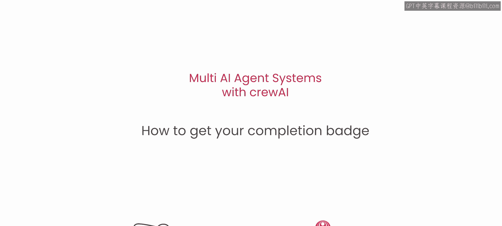
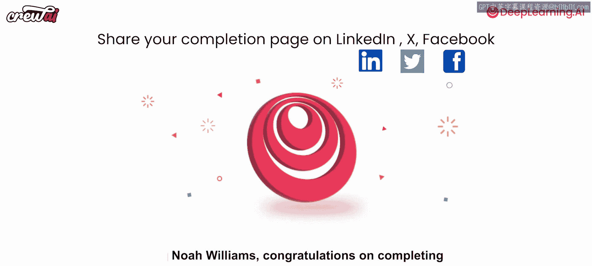
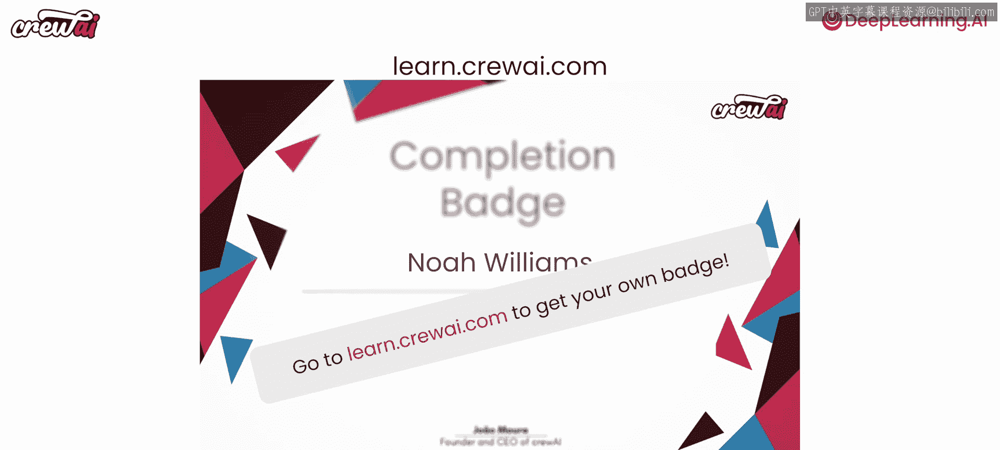

# 019：课程完成与认证获取指南 🎓



在本节课中，我们将学习如何完成课程并获取官方认证徽章，以展示您在多人工智能代理系统领域的学习成果。

## 课程完成与分享

恭喜您完成了我们的多人工智能代理系统课程。到目前为止，您已经深入学习了多人工智能代理系统的工作原理以及如何自行构建它们。

为了庆祝您的成就，我们建议您进行以下操作：

以下是分享课程完成证明的步骤：
1.  对您的课程完成页面进行截图。
2.  将截图分享到社交媒体平台。
3.  在分享时，请务必标记 `@query AI` 和 `@deep learning AI`。

我们将确保转发您的分享内容。此外，如果您希望获得本课程的徽章，可以继续下一节的操作。

## 如何获取认证徽章

上一节我们介绍了如何分享学习成果，本节中我们来看看如何获取官方认证徽章，以增强您的专业履历。

如果您希望获得本课程的认证徽章，请访问以下链接：
```
https://learn.query.ai/co
```

在该页面，您可以申请获取徽章。此徽章可以添加到您的领英或其他社交媒体个人资料中，用以证明您已掌握构建多人工智能代理系统的能力。

以下是获取徽章的核心步骤：
1.  访问 `learn.query.ai/co`。
2.  按照页面指引申请徽章。
3.  将获得的徽章添加到您的专业社交资料中。

请记住，您需要做的就是访问 `learn.query.ai/co`。不要忘记将您的成就分享到网络。我们下次再见！



---



本节课中我们一起学习了如何完成课程、分享学习成果以及申请官方认证徽章。恭喜您顺利完成全部学习内容！