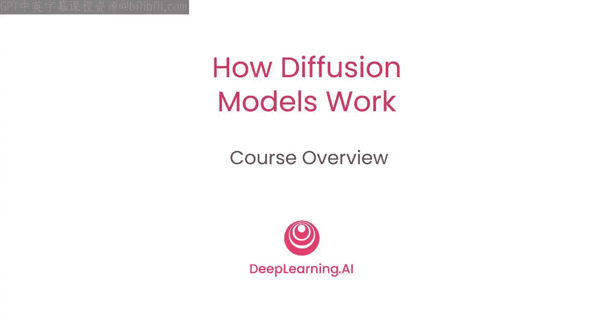
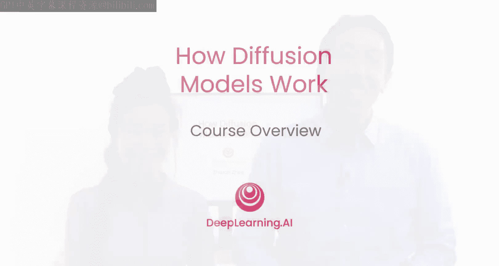
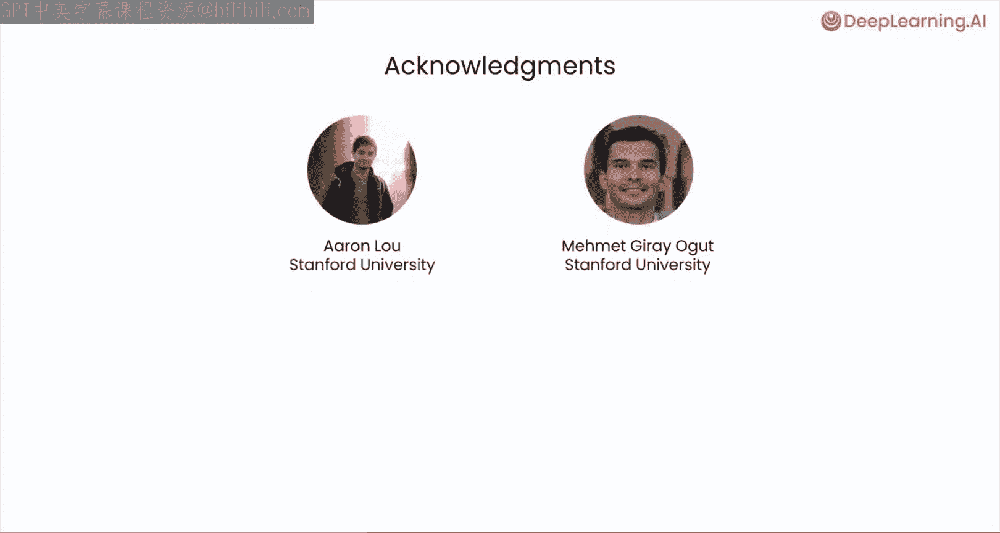
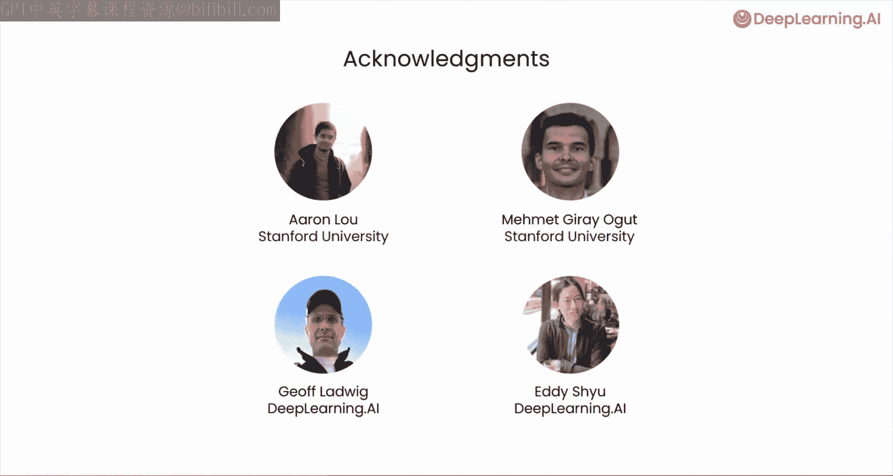

# 001：课程介绍 🎬

在本节课中，我们将要学习扩散模型的基本概念、课程目标以及你将通过本课程掌握的核心技能。扩散模型是当前生成式人工智能领域的重要基石，理解其工作原理对于掌握前沿技术至关重要。

---

我很高兴向大家介绍这个由Sharon Jo主讲的关于扩散模型的短期课程。

Midjourney、Stable Diffusion、DALL-E等模型能够仅根据一段文字提示就生成图像，有时甚至是精美的图像。这些算法是如何工作的？你可能听说过一个模糊的描述：这些算法通过学习“减去”噪声来生成图像。但在这个短期课程中，Sharon将引导你完成一个使用扩散模型生成图像的具体实现，以便你准确理解其技术细节。

谢谢，Andrew。在本课程中，你将了解当前扩散模型的发展现状和能力。

你将首先理解**采样过程**：从纯噪声开始，逐步细化以得到最终美观的图像。

你将建立必要的编程技能，以有效地训练一个扩散模型。

你将学习如何构建一个能够预测图像中噪声的神经网络。

你将学习为模型添加上下文，以便控制你想要生成的内容。

最后，通过实现高级算法，你将学习如何将采样过程加速**10倍**。

这是一个中级到高级的课程。我们假设你熟悉Python和基本的神经网络训练。例如，我们假设你知道什么是反向传播。我们将全程使用PyTorch，但如果你熟悉其他机器学习框架（如TensorFlow），你也应该能够顺利跟上。

本短期课程将使用的运行示例是生成**16x16像素**的精灵图，就像电子游戏中的那些小角色。我们选择这个示例是为了让你不仅能够浏览代码，还能自己运行它们，在Jupyter笔记本中亲自生成可爱的精灵图。

扩散模型正在成为生命科学和其他领域前沿研究的基础。例如，用于药物发现的分子生成。因此，当你理解了扩散模型的技术细节后，你也将能更好地理解并可能亲自应用这些模型。

许多人共同构建了这个短期课程。我要感谢Eric Lu和Meme Gura Ogod的重要贡献，以及DeepLearning.AI团队的Jeff Ludwig和Eddie Shu。

那么，现在让我把时间交给Sharon，希望你享受这门课程。好的，我们开始吧。

---

本节课中，我们一起学习了本课程的目标、结构以及你将通过实践掌握的核心技术。我们了解到，扩散模型通过一个从噪声到清晰图像的逐步去噪过程来工作，并且本课程将通过一个具体的编程示例带你深入理解这一过程。