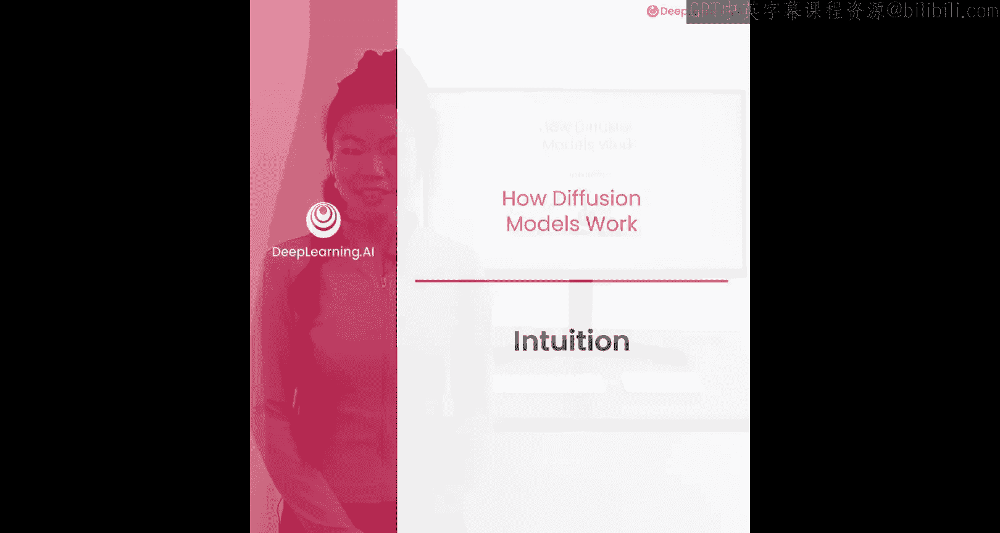
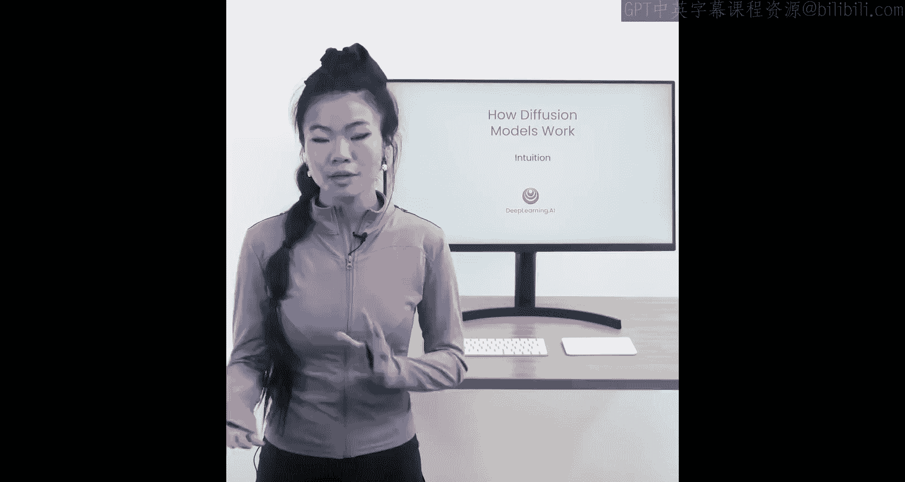
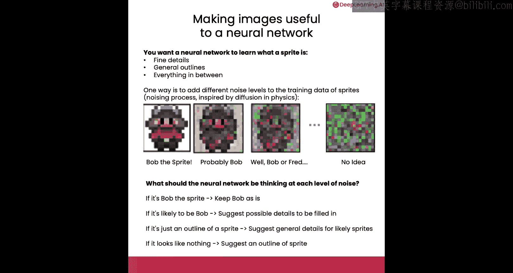
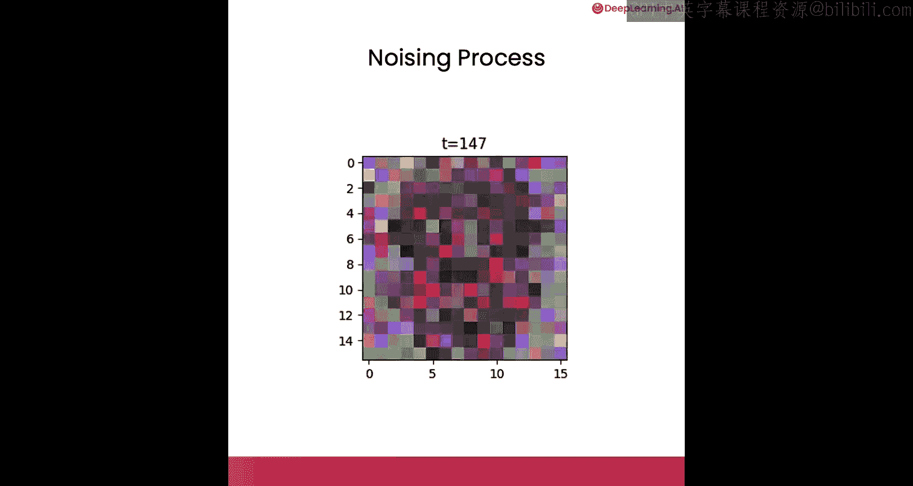
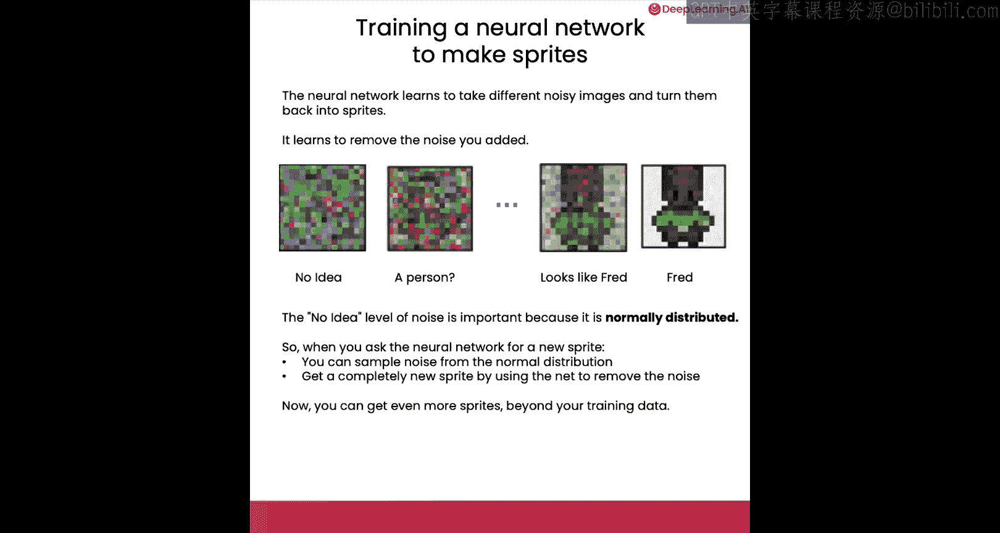

# 002：扩散模型基础直觉

在本节课中，我们将学习扩散模型的基本目标和工作原理。我们将首先明确扩散模型的目标，然后探讨如何通过添加噪声使训练数据对模型有用，最后介绍如何基于这些数据训练模型本身。

## 扩散模型的目标 🎯

你拥有大量训练数据，例如下方这些视频游戏角色的精灵图像。这是你的训练数据集。你的目标是获得更多训练数据中未出现的新精灵图像。你可以使用一个遵循扩散模型流程的神经网络，为你生成更多此类精灵。

## 如何使图像对神经网络有用？ 🧠

你希望神经网络学习“精灵”这一概念的普遍特征。这包括精细细节，例如精灵的发色、是否佩戴扣子或腰带；也包括整体轮廓，例如其头部、身体以及介于两者之间的所有特征。

一种处理数据并强调精细细节或整体轮廓的方法是添加不同程度的噪声。这个过程被称为“加噪过程”，其灵感来源于物理学。你可以想象一滴墨水滴入一杯水中：起初你确切知道墨水滴落的位置，但随着时间的推移，你会看到它扩散到水中直至消失。这里的原理相同：你从精灵Bob开始，随着添加噪声，它会逐渐消失，直到你完全无法辨认它原本是哪个精灵。

## 神经网络在不同噪声水平下的任务 🤔

那么，当你逐步向图像添加更多噪声时，神经网络在各个噪声水平下应该思考什么？

*   当图像是精灵Bob时，你希望神经网络确认：“是的，那是精灵Bob”，并保持Bob的原样。
*   当图像很可能是Bob时，你希望神经网络说：“图像上有一些噪声”，并建议可能的细节使其看起来更像精灵Bob。
*   当图像只是一个精灵的轮廓时，你只能感觉到这可能是一个精灵人物，但它可能是Bob、Fred，甚至可能是Nancy。此时，你希望为可能出现的精灵建议更通用的细节，例如基于此轮廓为Bob或Fred建议一些细节。
*   最后，即使图像看起来完全不像任何东西，你仍然希望它看起来更像一个精灵。你希望神经网络说：“我将把这个完全充满噪声的图像，通过提出一个精灵可能具有的轮廓，转变为稍微更像精灵的东西。”

## 加噪过程可视化 🌊

现在，让我们看看这个加噪过程，即随时间逐步添加噪声的过程。最终，就像一滴墨水完全扩散在一杯水中。

## 训练神经网络 🏋️

上一节我们介绍了加噪过程，本节中我们来看看如何训练神经网络。你的目标是训练神经网络学会将不同的噪声图像变回精灵。其实现方式是：神经网络学习移除你添加的噪声。这个过程从“完全无概念”的纯噪声水平开始，逐渐呈现出“可能有人物在里面”的迹象，然后看起来像Fred，最后变成一个看起来像Fred的精灵。

需要特别指出的是，“完全无概念”的噪声水平非常重要，因为它是**正态分布**的。这意味着每个像素值都是从正态分布（也称为高斯分布或钟形曲线）中采样得到的。

因此，当你希望神经网络生成一个新精灵（例如这里的Fred）时，你可以从那个正态分布中采样噪声，然后使用神经网络逐步移除该噪声，从而得到一个全新的精灵。

至此，你已达成目标：你可以获得比所有训练数据更多的精灵图像。

在下一视频中，我们将介绍采样过程。

## 总结 📝

本节课中我们一起学习了扩散模型的基本直觉。我们明确了模型的目标是生成新的数据样本。通过向训练图像逐步添加噪声（加噪过程），我们使神经网络能够在不同噪声水平下学习精灵的特征，从精细细节到整体轮廓。训练的核心是让神经网络学会逆向移除噪声，从纯噪声开始逐步重建出清晰的精灵图像。最终，通过从正态分布采样噪声并让网络去噪，我们就能生成全新的、不在训练集中的精灵。