# 003：采样过程详解 🧪

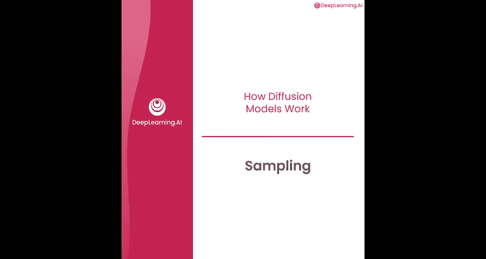

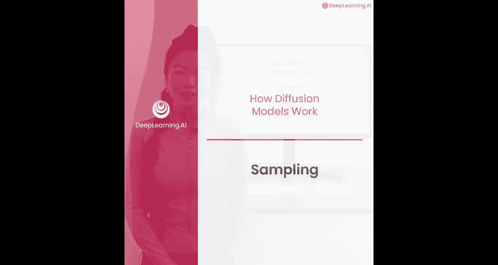

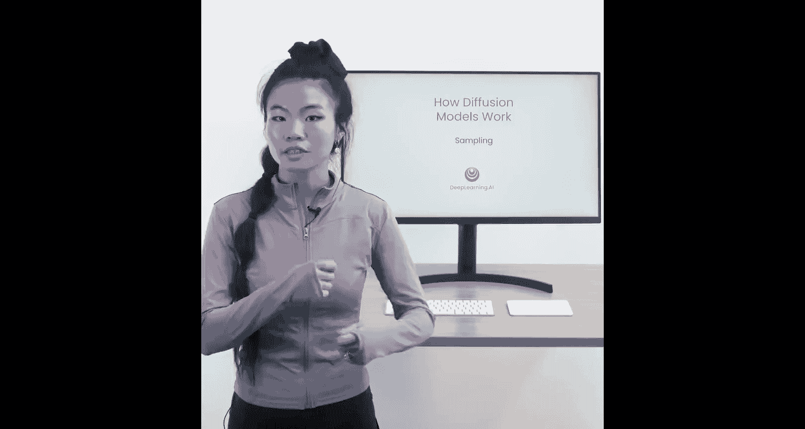

在本节课中，我们将要学习扩散模型在训练完成后，如何通过一个称为“采样”的过程，从纯噪声生成高质量的图像。我们将详细拆解采样算法的每一步，并通过代码示例直观地展示其工作原理。

---

上一节我们介绍了扩散模型的基本概念，本节中我们来看看模型训练后如何生成图像，即采样过程。


采样过程的核心是**反向去噪**。想象一下，我们有一张被墨滴完全扩散污染的图像（纯噪声）。我们的目标是逆向这个过程，一步步地将噪声移除，最终还原出清晰的图像。训练好的神经网络在这一过程中扮演着关键角色：它负责预测当前图像中的噪声。

以下是采样过程的核心步骤：

1.  **初始化**：首先，我们从一个完全随机的噪声样本开始。这对应于扩散过程的最终状态。
2.  **反向迭代**：我们从最大的时间步（例如 T=500）开始，逐步向时间步 1 倒退。每一步，我们都执行以下操作：
    *   将当前噪声图像输入训练好的神经网络。
    *   神经网络预测出图像中的噪声成分。
    *   根据 DDPM 采样算法，从当前图像中减去预测的噪声。
    *   **关键步骤**：在进入下一步之前，我们会添加少量经过特定缩放的额外噪声。这有助于稳定采样过程，防止结果退化。

经过多次这样的“预测噪声 -> 减去噪声 -> 添加微量新噪声”的迭代后，初始的随机噪声就会逐渐转变为我们期望的目标图像（例如一个精灵图案）。

---

现在，让我们通过代码来具体实现这个过程。我们将使用 PyTorch 框架。

首先，我们需要导入必要的库并设置一些辅助函数。

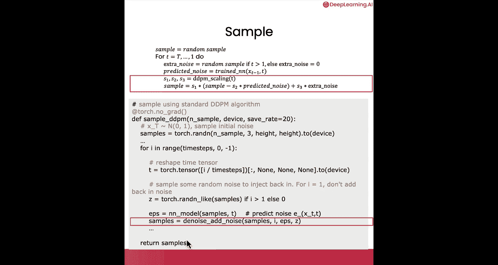

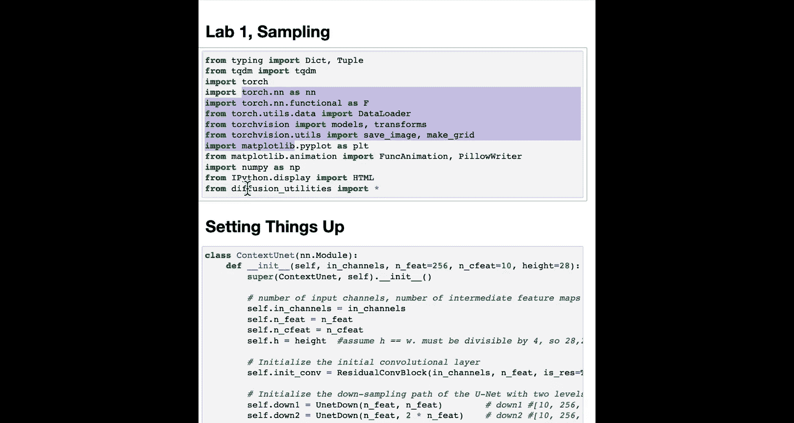

```python
import torch
import torch.nn as nn
import torch.nn.functional as F
# 导入其他必要的工具和自定义辅助函数
```

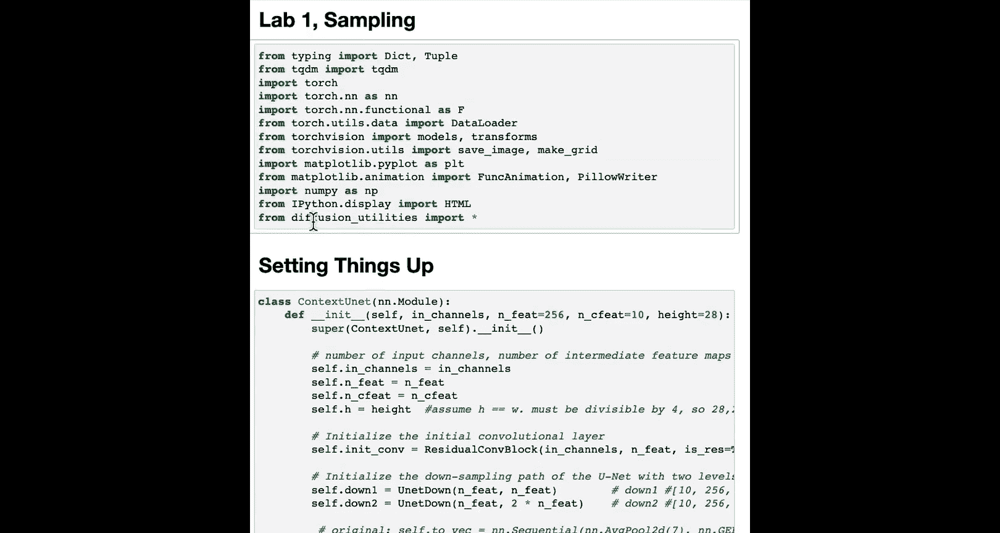

接下来，我们定义神经网络模型的结构。这里我们暂时不深入其内部细节，只需知道它将用于预测噪声。

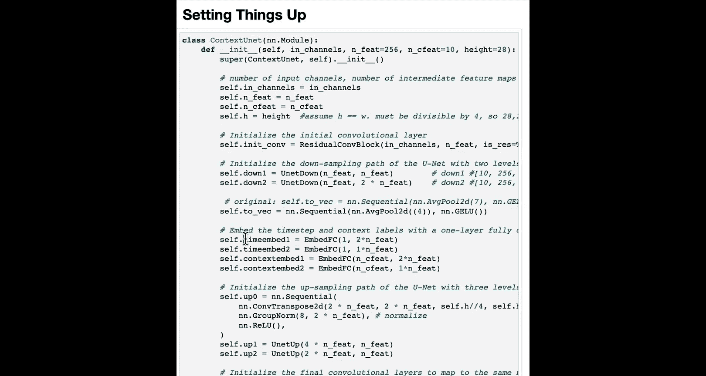

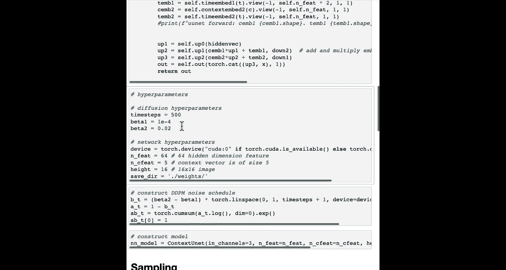

```python
# 实例化噪声预测模型
model = SimpleUnet()
print("模型加载完毕。")
```

然后，我们设置采样过程所需的超参数。这包括总时间步数、图像尺寸以及 DDPM 算法中用于控制噪声添加和移除的缩放系数（由噪声调度表定义）。

```python
# 定义超参数
T = 500  # 总时间步数
img_size = 16  # 图像尺寸为16x16
beta1, beta2 = 1e-4, 0.02  # DDPM 算法的超参数

# 定义噪声调度表 (Noise Schedule)
# 该表根据时间步t计算噪声添加的强度系数
def get_noise_schedule(T, beta1, beta2):
    betas = torch.linspace(beta1, beta2, T)
    alphas = 1. - betas
    alphas_cumprod = torch.cumprod(alphas, dim=0)
    sqrt_alphas_cumprod = torch.sqrt(alphas_cumprod)
    sqrt_one_minus_alphas_cumprod = torch.sqrt(1. - alphas_cumprod)
    return sqrt_alphas_cumprod, sqrt_one_minus_alphas_cumprod

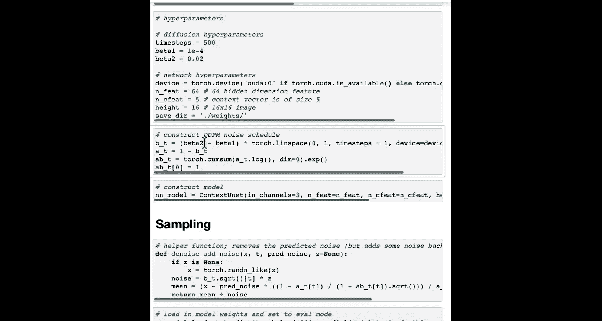

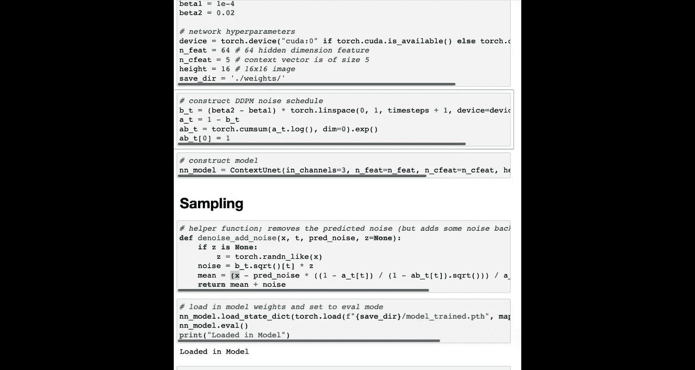

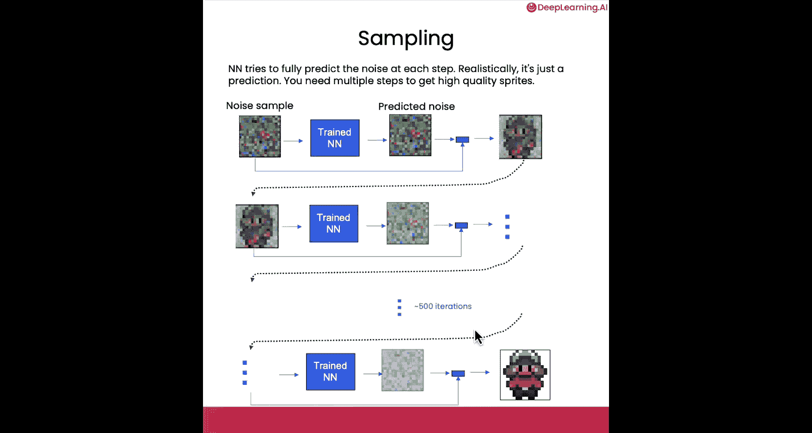

sqrt_alphas_cumprod, sqrt_one_minus_alphas_cumprod = get_noise_schedule(T, beta1, beta2)
```

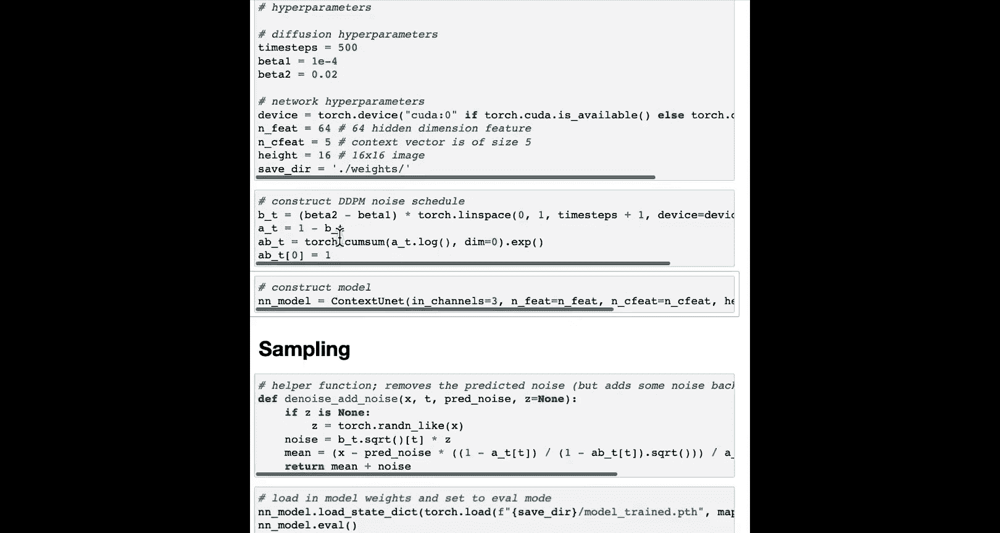

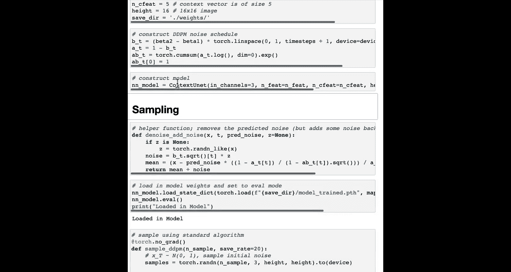

以下是采样算法的核心函数 `denoise_add_noise`。它完成了单步的去噪和噪声添加操作。

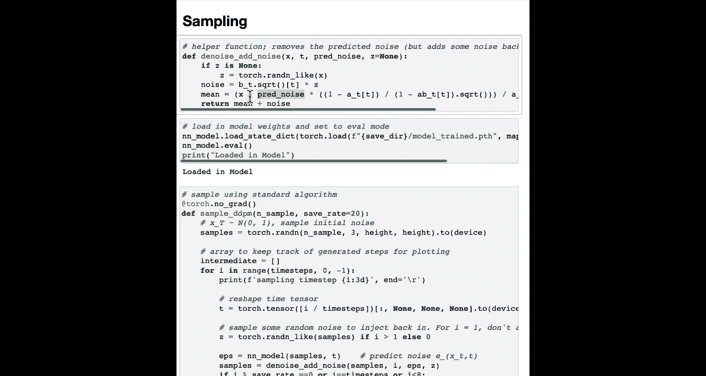

```python
def denoise_add_noise(x, t, pred_noise, z=None):
    """
    单步采样函数。
    x: 当前噪声图像
    t: 当前时间步
    pred_noise: 模型预测的噪声
    z: 额外添加的随机噪声（若为None则随机生成）
    """
    # 根据DDPM公式计算去噪后的图像均值
    sqrt_alpha_cumprod_t = sqrt_alphas_cumprod[t]
    sqrt_one_minus_alpha_cumprod_t = sqrt_one_minus_alphas_cumprod[t]

    # 减去预测的噪声
    x_denoised = (x - pred_noise * sqrt_one_minus_alpha_cumprod_t) / sqrt_alpha_cumprod_t

    # 添加额外噪声z，并应用缩放
    if z is None:
        z = torch.randn_like(x)
    # 根据时间步计算添加噪声的方差
    sigma_t = torch.sqrt((1 - alphas_cumprod[t-1]) / (1 - alphas_cumprod[t]) * betas[t]) if t > 0 else 0
    x_next = x_denoised + sigma_t * z

    return x_next
```

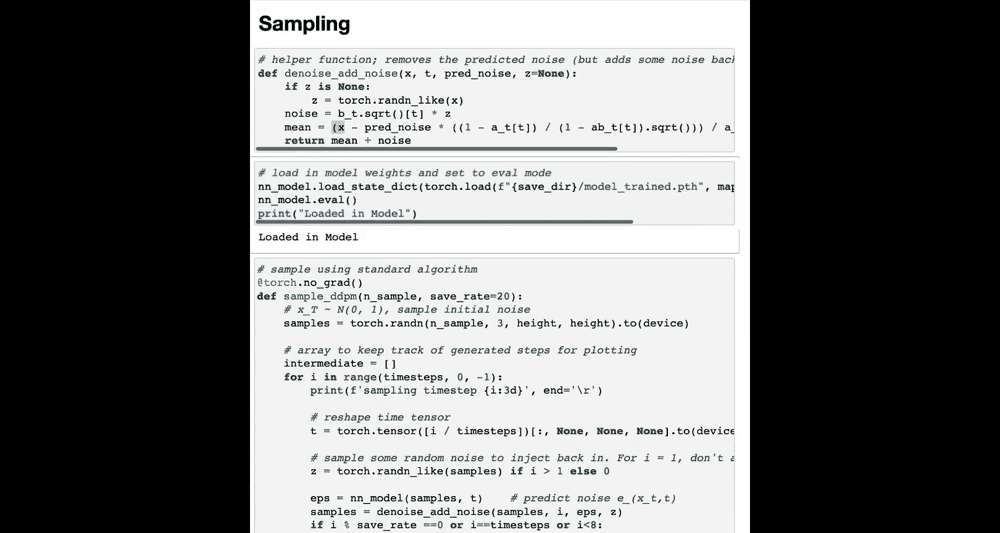

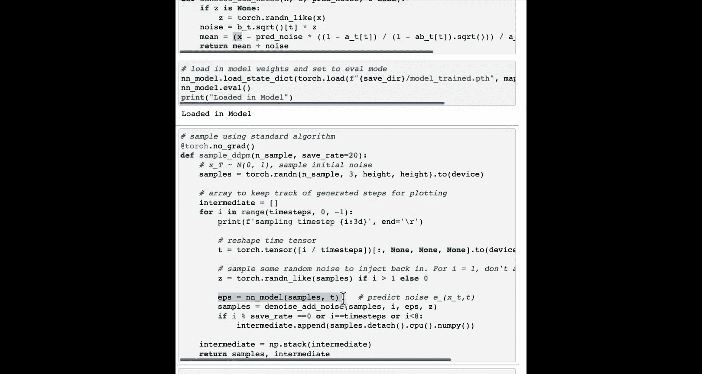

现在，我们执行完整的采样循环。我们从随机噪声开始，循环 T 次，逐步生成图像。

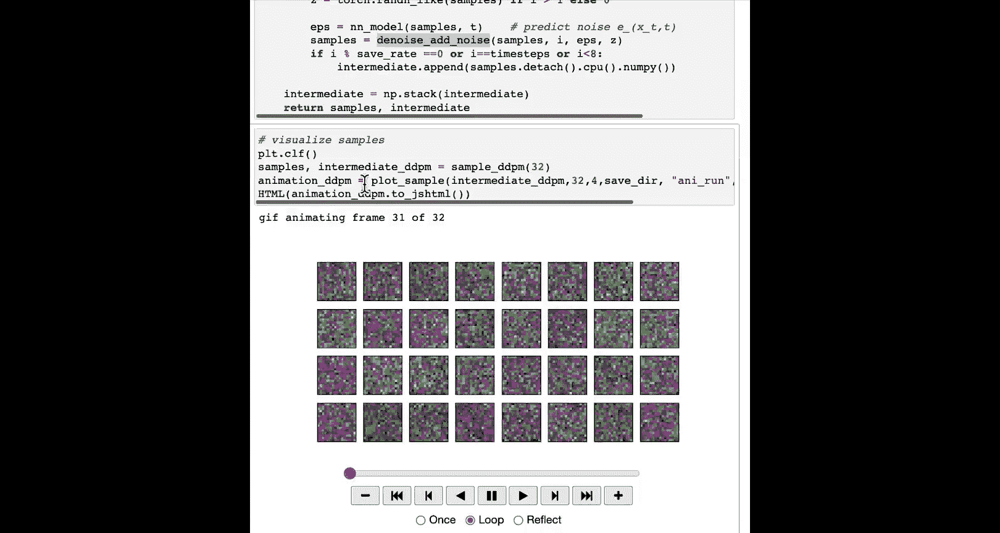

```python
# 加载预训练好的模型权重
model.load_state_dict(torch.load('pretrained_model.pth'))
model.eval()

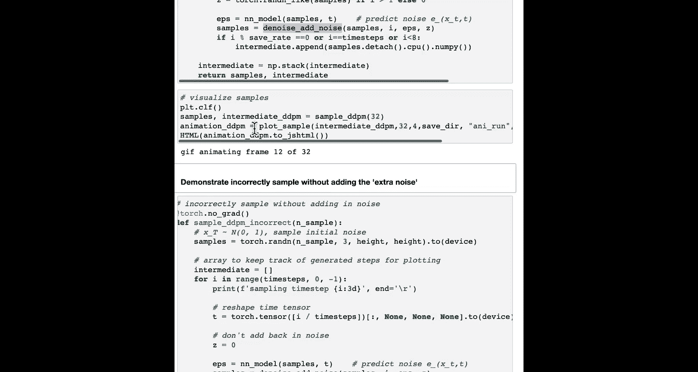

# 开始采样
sample = torch.randn(1, 3, img_size, img_size)  # 生成初始随机噪声
for t in reversed(range(T)):  # 从T到1反向循环
    t_tensor = torch.tensor([t])
    with torch.no_grad():
        pred_noise = model(sample, t_tensor)  # 模型预测噪声
    sample = denoise_add_noise(sample, t_tensor, pred_noise)  # 去噪并添加新噪声

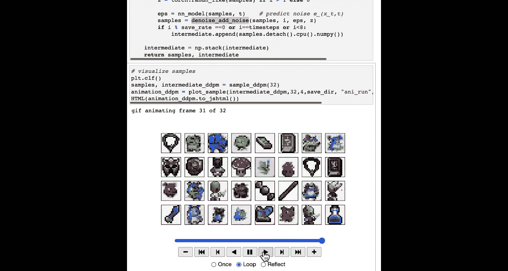

# 最终得到的sample即为生成的图像
final_image = sample
```

运行上述代码，我们将观察到噪声图像如何随着迭代一步步变得清晰，最终形成一个精灵图案。这个过程可能需要几分钟，具体取决于硬件性能。

---

**关于“添加额外噪声”的深入探讨**

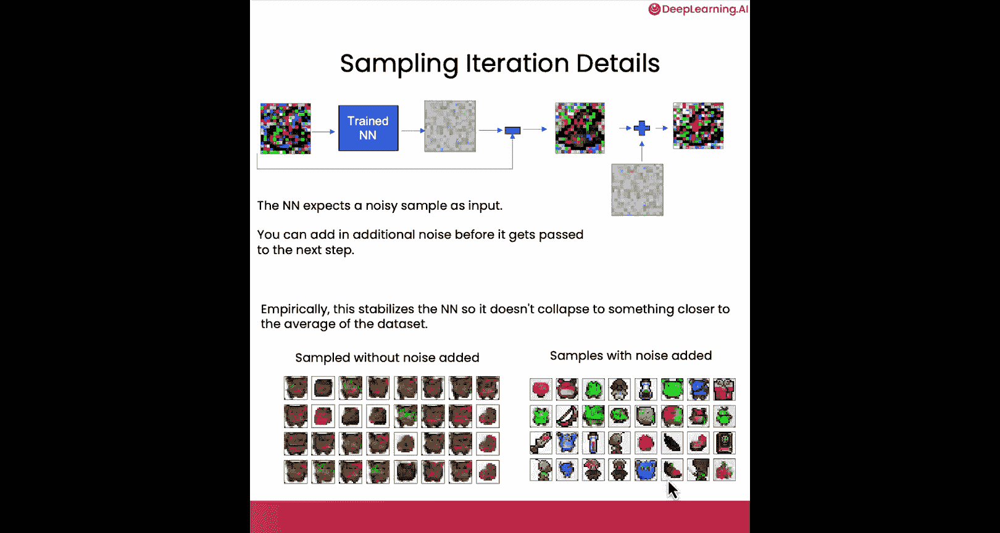

你可能会问，为什么在减去预测噪声后，还要添加新的噪声？这是因为，经过一步去噪后，图像的分布已经偏离了神经网络训练时所见的“标准噪声分布”。直接将其输入下一步可能会导致模型表现不稳定，使生成结果模糊或趋于数据平均值（即产生毫无特征的“平均精灵”）。

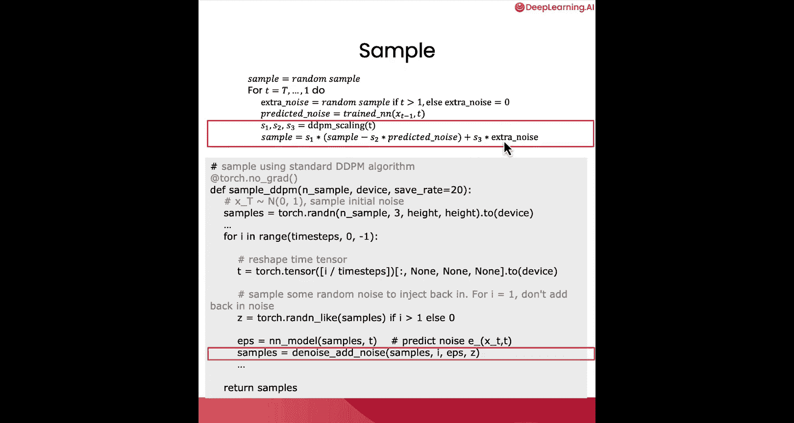

通过添加一个经过精心缩放（由噪声调度表和当前时间步决定）的微量随机噪声 `z`，我们可以将图像“推回”到模型期望的分布附近。这极大地提高了采样的稳定性和生成图像的质量与多样性。

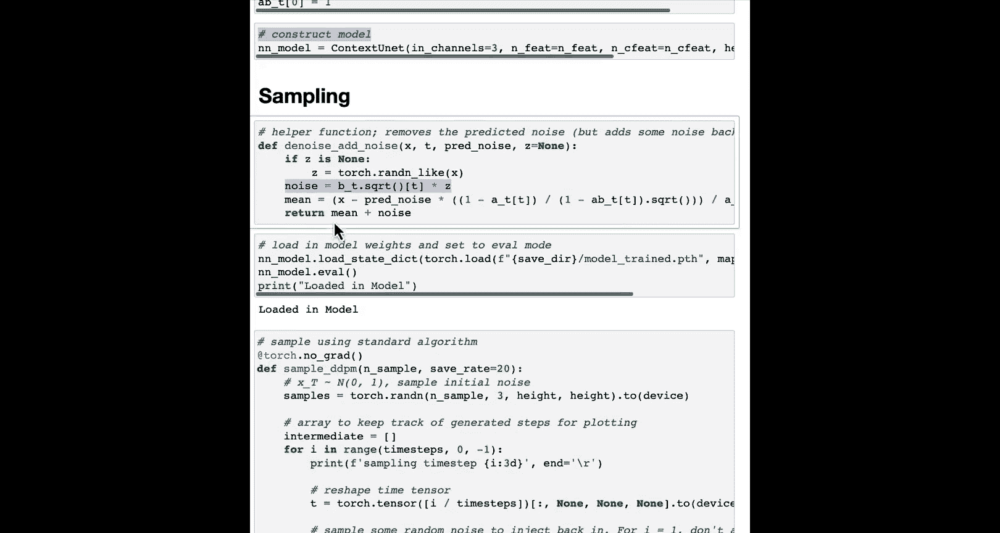

以下是对比实验：如果我们不添加额外噪声（即在 `denoise_add_noise` 函数中设置 `z=0`），结果会怎样？

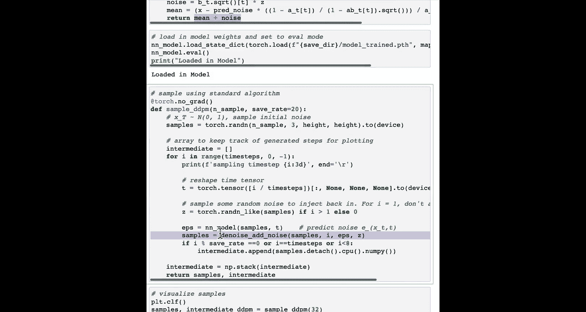

```python
# 不添加额外噪声的错误采样方式
sample_bad = torch.randn(1, 3, img_size, img_size)
for t in reversed(range(T)):
    t_tensor = torch.tensor([t])
    with torch.no_grad():
        pred_noise = model(sample_bad, t_tensor)
    # 将z强制设为0
    sample_bad = denoise_add_noise(sample_bad, t_tensor, pred_noise, z=torch.zeros_like(sample_bad))
```

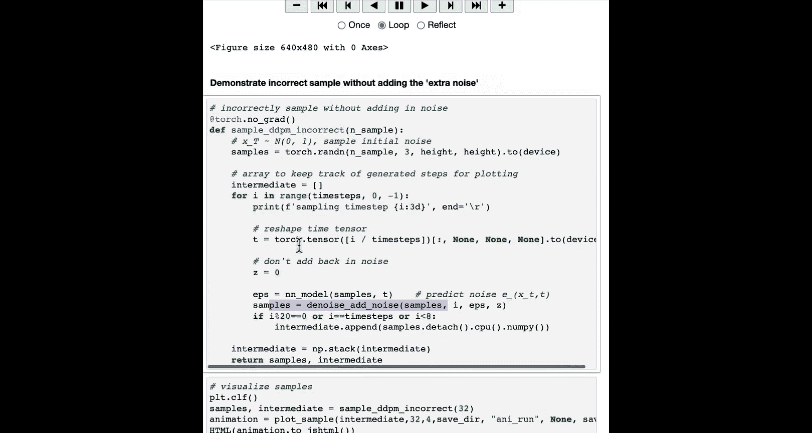

运行这段代码，生成的图像很可能是一团模糊、缺乏细节的色块，而不是清晰的精灵。这证明了添加步骤噪声对于生成高质量样本至关重要。

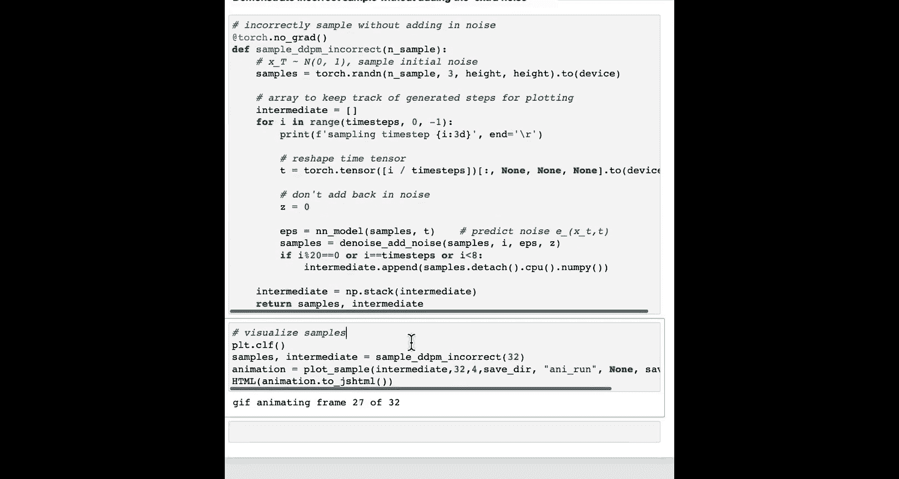

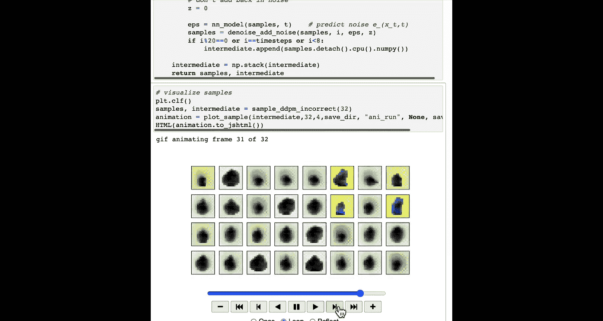

---

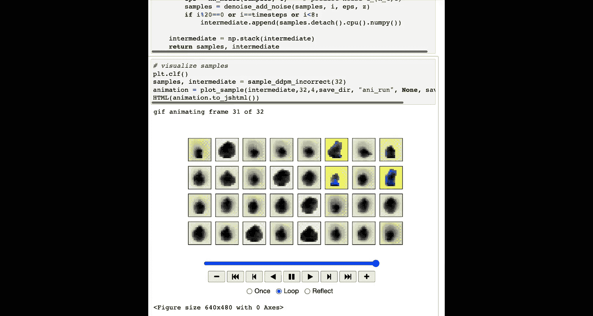

本节课中我们一起学习了扩散模型的采样过程。我们了解到，采样是一个从噪声开始、通过神经网络**迭代预测并减去噪声**的反向过程。其中，**在每一步减去预测噪声后，添加适量缩放的新噪声**是保证生成效果清晰、多样的关键技巧。下一节，我们将深入探讨用于预测噪声的神经网络本身是如何构建的。