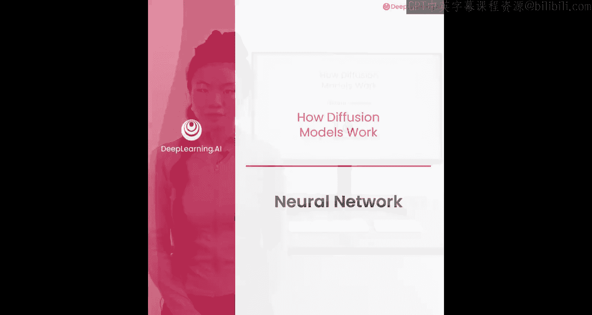
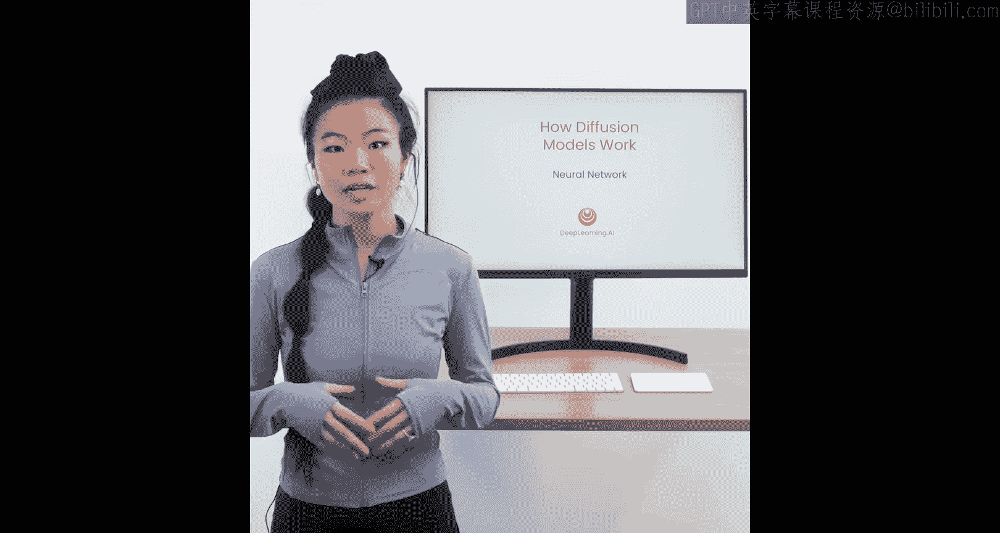
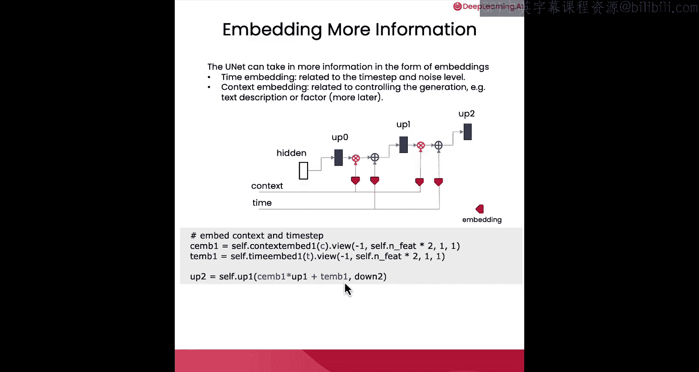
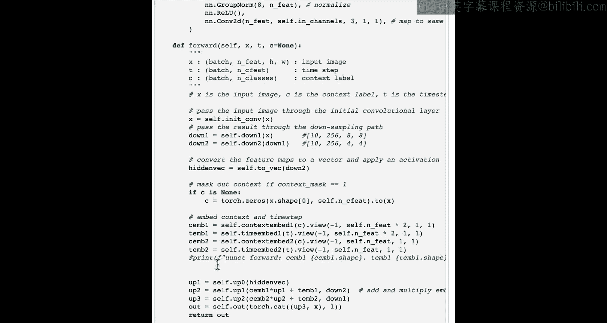
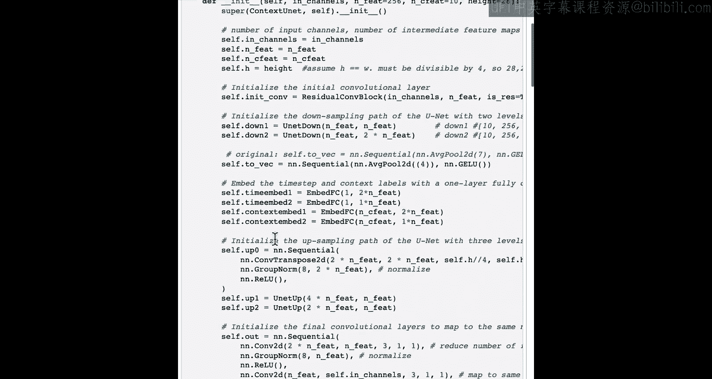
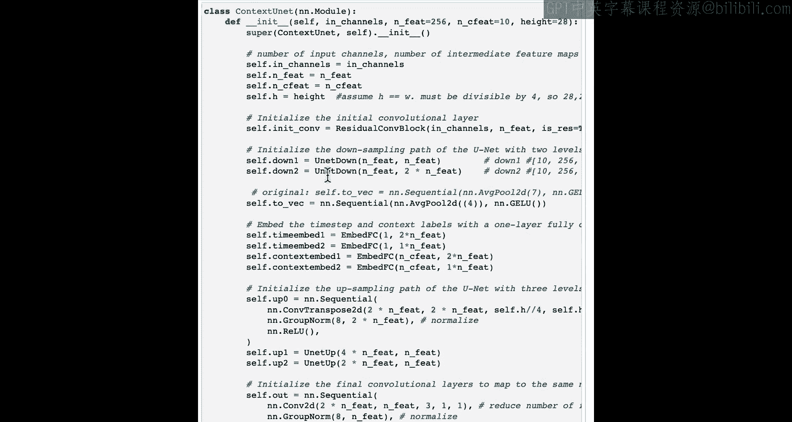
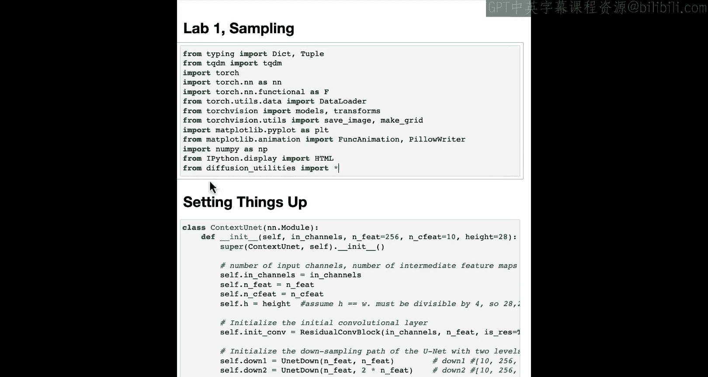
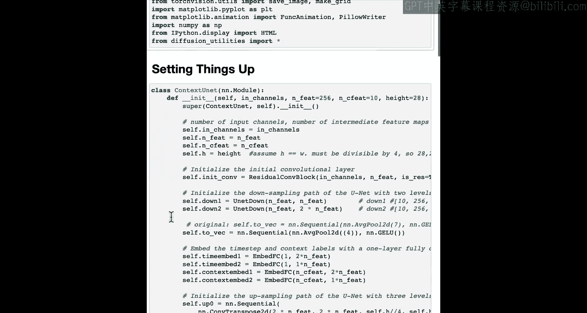

# 004：神经网络架构 🧠





在本节课中，我们将学习扩散模型所使用的神经网络架构，并了解如何将额外信息整合到网络中。

上一节我们介绍了扩散模型的基本概念，本节中我们来看看其核心组件——U-Net神经网络。

## 神经网络架构概述

扩散模型使用的神经网络架构是U-Net。关于U-Net，最重要的一点是：它以图像作为输入，并输出一个与输入图像尺寸相同的预测结果。在本例中，其任务是预测添加到图像中的噪声。

U-Net自2015年就已存在，最初用于图像分割任务，例如在自动驾驶研究中将图像分割为行人或汽车区域。U-Net的特殊之处在于其输入和输出尺寸相同。它的工作原理是：首先通过一系列卷积层对输入信息进行下采样，将其压缩到一个低维嵌入空间中；然后，再通过相同数量的上采样块，将信息恢复并输出，以完成其特定任务。

以下是U-Net处理流程的简化表示：
```python
# 伪代码表示U-Net的前向传播过程
def forward(x):
    # 下采样路径：压缩信息
    down1 = down_block_1(x)
    down2 = down_block_2(down1)
    # ... 更多下采样层
    bottleneck = bottleneck_block(downN)
    
    # 上采样路径：恢复信息并预测噪声
    up1 = up_block_1(bottleneck, downN)
    up2 = up_block_2(up1, downN-1)
    # ... 更多上采样层
    predicted_noise = output_layer(upN)
    
    return predicted_noise
```

## 整合额外信息

U-Net的一个优点是能够接收额外信息。除了压缩图像以理解其内容外，它还可以整合其他关键信息。

以下是两种重要的嵌入信息：

### 时间嵌入

时间嵌入对于扩散模型至关重要。它告知模型当前处于哪个时间步，从而判断所需的噪声水平。实现时，只需将时间步编码为一个向量，并将其添加到上采样块中。

### 上下文嵌入

上下文嵌入有助于控制模型的生成内容。例如，它可以是一个文本描述（如“生成一张鲍勃的照片”），或某种控制因子（如“图像需为特定颜色”）。我们将在后续课程中详细讨论这一点。对于上下文嵌入，通常将其与上采样块进行乘法运算来整合。

在代码中，整合过程如下所示：
```python
# 在U-Net的上采样块中整合嵌入信息
def up_block_with_embeddings(x, context_emb, time_emb):
    # 将上下文嵌入通过乘法整合
    x = x * context_emb
    # 将时间嵌入通过加法整合
    x = x + time_emb
    # ... 后续卷积等操作
    return x
```

## 代码结构解析



在笔记本代码的前向传播函数中，可以清晰地看到这些下采样块和上采样块。每个上采样块都接收上下文嵌入和时间嵌入。下采样块和上采样块的定义可以在模型的初始化部分找到。





下采样块本质上是一系列卷积层，用于逐步压缩图像尺寸并提取特征。其结构可以概括为：
```
下采样块 = 卷积层 + 激活函数 + 可能的下采样操作（如池化）
```



## 总结





本节课中，我们一起学习了扩散模型的核心神经网络——U-Net。我们了解到U-Net是一种输入输出同尺寸的网络，通过下采样压缩信息再上采样恢复信息来预测噪声。更重要的是，我们探讨了如何将**时间嵌入**和**上下文嵌入**这两种关键信息整合到U-Net中，以指导模型的生成过程。在下一节视频中，我们将学习如何训练这个神经网络。