# 005：训练扩散模型 🧠

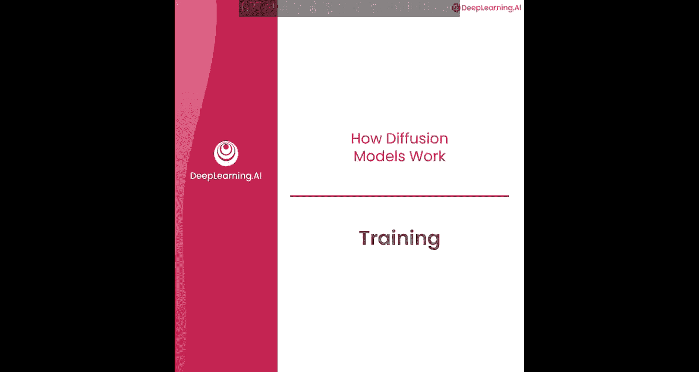

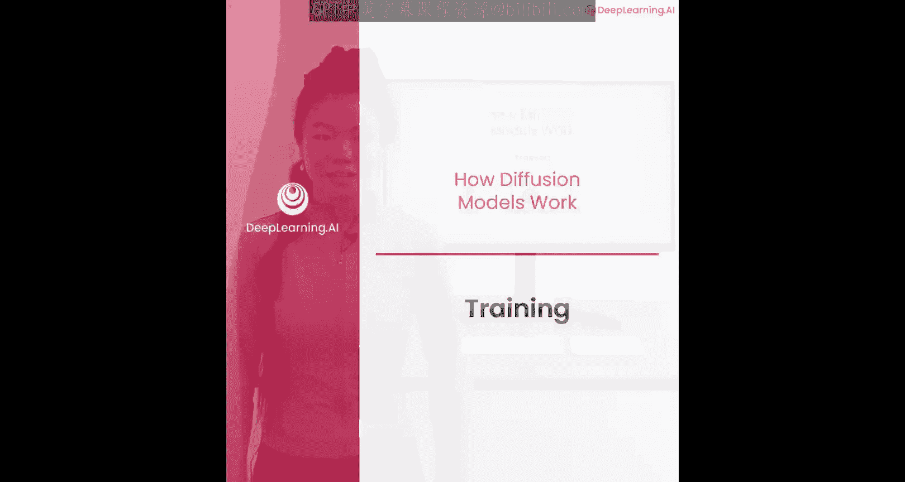

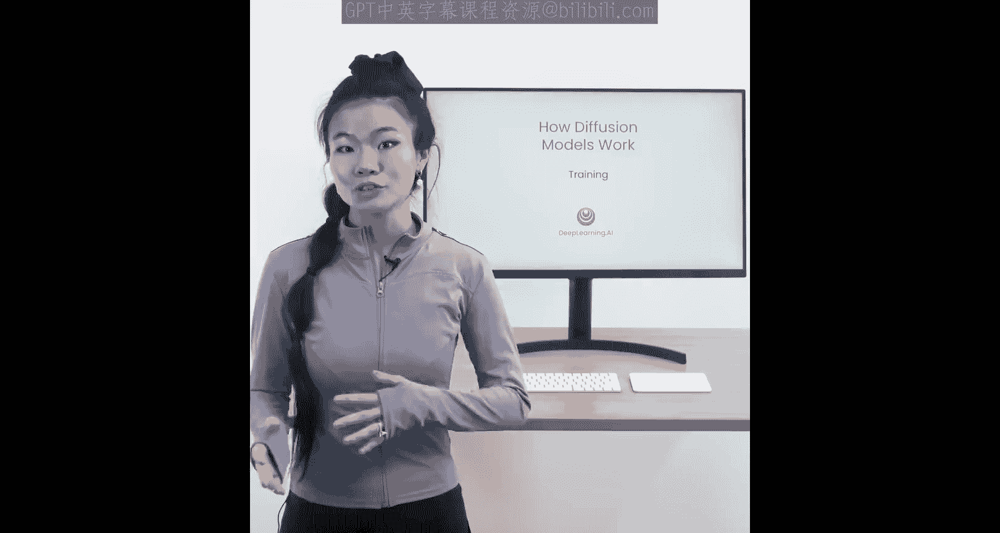

在本节课中，我们将要学习如何训练一个U-Net神经网络，使其能够预测噪声。我们将详细讲解训练过程、损失计算以及如何通过代码实现训练循环。

---

## 概述

扩散模型的核心在于训练一个神经网络，使其能够从加噪的图像中预测出所添加的噪声。通过这个过程，模型不仅学会了识别噪声，也学会了识别图像中“非噪声”的部分，即图像本身的特征。本节将深入解析这一训练机制。

## 训练目标与原理

神经网络的目标是预测噪声。更准确地说，它学习的是图像上噪声的分布，同时也学习图像本身的特征（即“精灵”的样貌）。

训练方法如下：
1.  从训练数据中取出一张精灵图像。
2.  向这张图像添加噪声。
3.  将加噪后的图像输入神经网络，并要求其预测所添加的噪声。
4.  将神经网络预测的噪声与真实添加的噪声进行比较，以此计算损失。
5.  通过反向传播更新神经网络参数，使其能更好地预测噪声。

## 时间步与噪声采样策略

你可能会问，如何确定添加的噪声量？理论上可以按时间顺序逐步增加噪声，但在实际训练中，我们不希望神经网络一直看同一张图像。

为了使训练更稳定、更均匀，我们采用随机采样的策略：
*   我们随机采样一个时间步 `t`。
*   根据这个时间步 `t` 获取对应的噪声水平，并将其添加到当前图像中。
*   让神经网络进行预测。
*   接着，我们取训练数据中的下一张图像。
*   再次随机采样一个（可能完全不同的）时间步，添加噪声，并让网络预测。

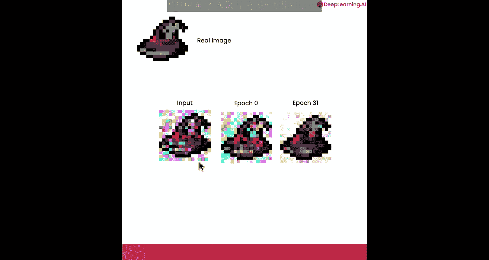

这种随机采样时间步的方法能带来更稳定的训练效果。

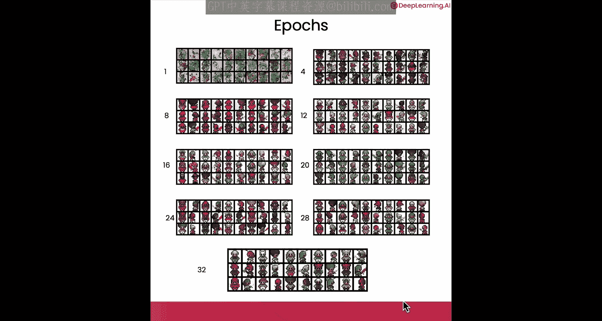

## 训练过程可视化

以下是训练过程的直观展示。我们以一个巫师帽精灵为例：

*   **初始阶段（第0轮训练）**：神经网络尚未理解精灵的样貌。它预测的噪声与输入图像差异不大，减去预测噪声后，输出结果与输入非常相似。
*   **后期阶段（第31轮训练）**：神经网络对精灵的样貌有了更好的理解。它预测的噪声被从加噪输入中减去后，能生成一个看起来很像原始巫师帽精灵的图像。

这种进步不仅体现在单个样本上。观察多个不同精灵在多轮训练中的变化，可以看到：
*   在第一轮训练时，生成结果与精灵相去甚远。
*   到了第32轮训练，生成的结果已经非常像一个个小电子游戏角色了。

## 代码实现训练算法

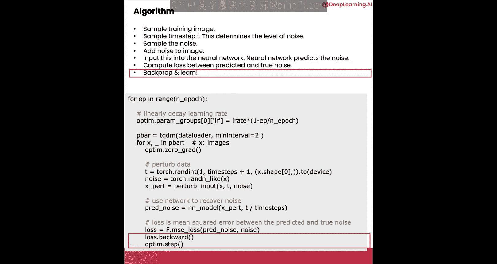

上一节我们介绍了训练的原理，本节中我们来看看如何用代码实现它。以下是训练循环的核心步骤：

首先，需要准备数据并设置循环。

```python
# 假设 data_loader 是包含所有训练图像的数据加载器
for x in data_loader:  # x 是一个训练图像
    # 训练循环在此进行
```

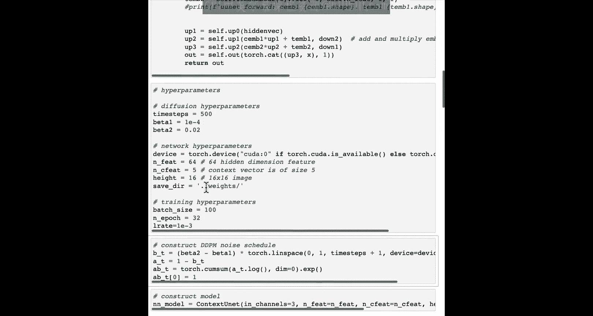

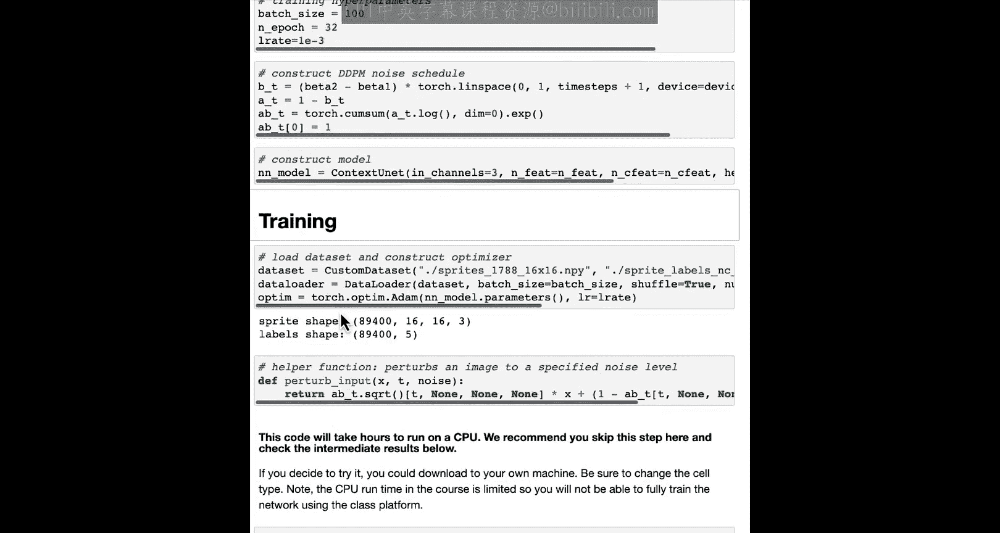

在循环内部，我们执行以下关键操作：

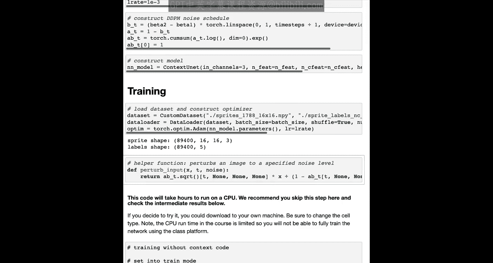

1.  **随机采样时间步**：采样一个时间步 `t`，它决定了噪声的水平。我们并非遍历所有时间步，而是每次随机采样。
2.  **生成并添加噪声**：采样一个噪声 `ε`，并根据时间步 `t` 将其添加到图像 `x` 中。
3.  **神经网络预测**：将加噪后的图像以及时间步 `t`（用于时间嵌入）输入神经网络，神经网络输出预测的噪声。
4.  **计算损失**：使用均方误差（MSE）比较预测的噪声与真实添加的噪声。
5.  **反向传播与优化**：根据损失进行反向传播，更新模型参数。通过这个过程，模型逐渐学会区分噪声和精灵特征。

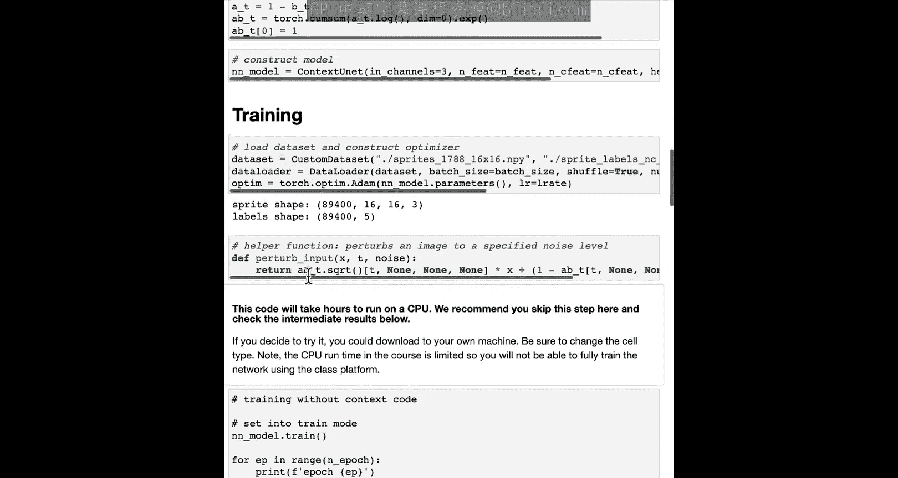

损失函数可以表示为：
**Loss = MSE(ε_predicted, ε_true)**

## 实战训练演示

现在，我们进入训练笔记本的实战部分。超参数设置如下：批量大小为100，共训练32轮，并设置了学习率。

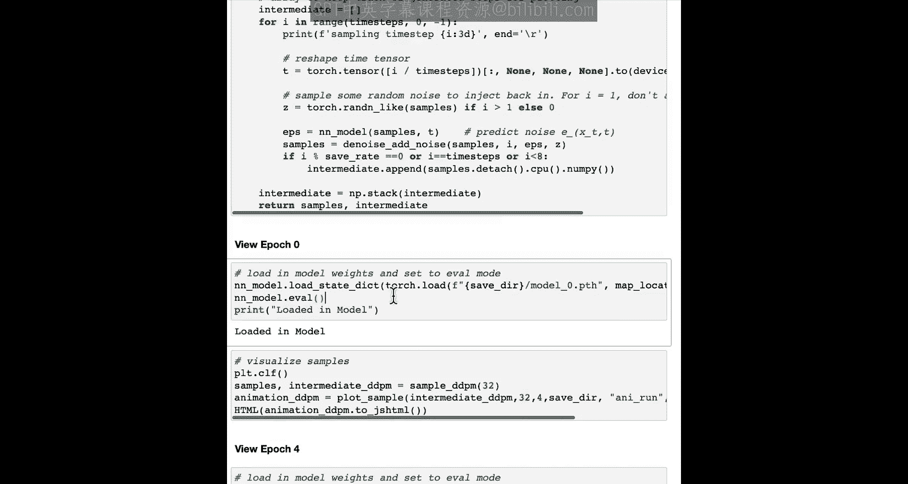

以下是训练的关键代码块：

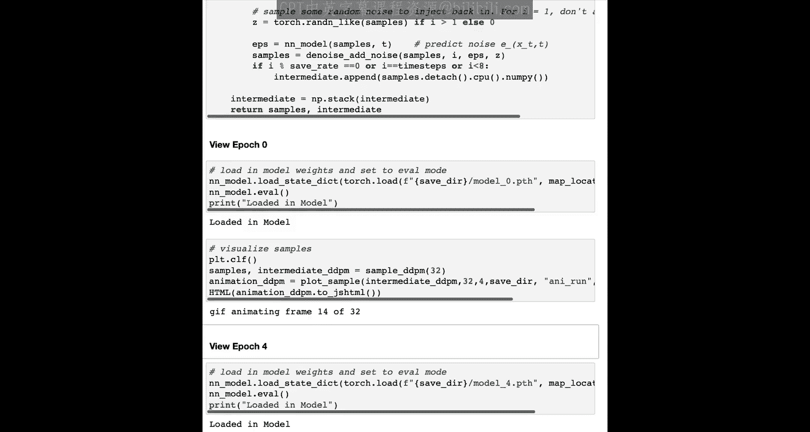

*   **数据加载**：我们加载16x16像素的精灵数据集到数据加载器中。
*   **优化器设置**：配置优化器（如Adam）。
*   **加噪函数**：定义一个函数 `perturb_input`，它接收图像和时间步 `t`，添加相应水平的噪声，然后返回加噪图像。

由于在CPU上进行完整训练需要数小时，我们在此不逐步运行。但强烈建议你亲自运行代码，这正是我们刚才一起分析过的代码。

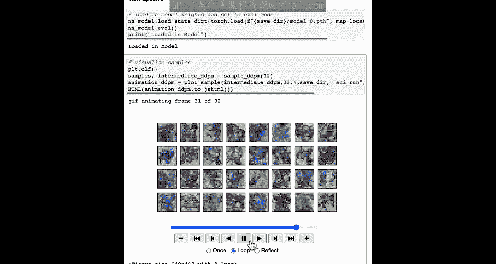

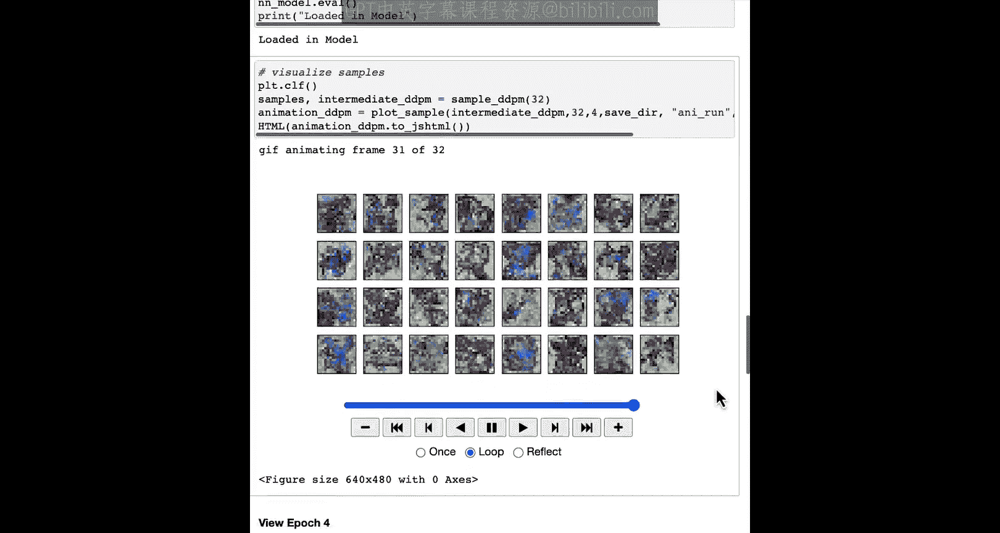

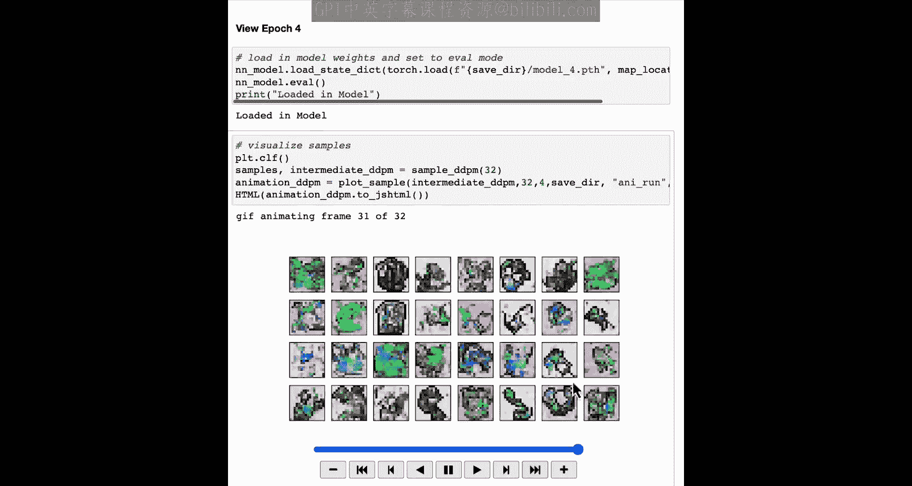

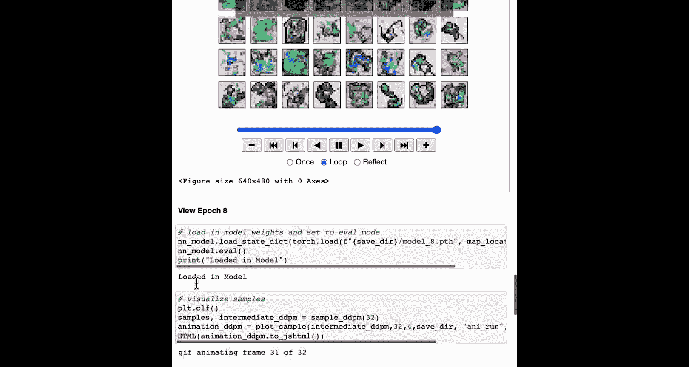

为了展示训练效果，我们提供了在不同训练轮次（如第0、4、8、31轮）保存的模型检查点。你可以加载这些模型，并使用上一节课学到的DDPM采样方法进行图像生成，直观观察模型随训练轮次增加而进步的过程：

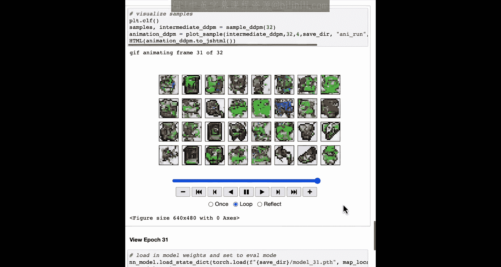

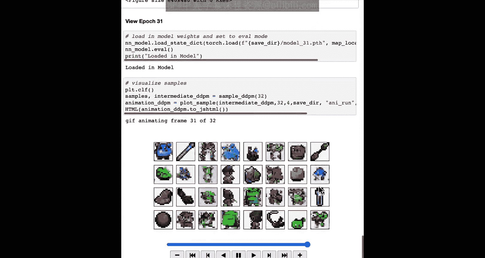

*   **第0轮**：生成结果仍有些模糊，但已开始理解精灵的大致轮廓，不再是纯噪声。
*   **第4轮**：生成结果更像精灵了。
*   **第8轮**：可以看到更多细节（例如一些书本形状）。
*   **第31/32轮**：生成结果已经非常接近精灵，可以看到剑、巫师帽、药水瓶等形状。当然，其中仍夹杂着一些模糊的团块，表明模型仍有改进空间。

## 总结

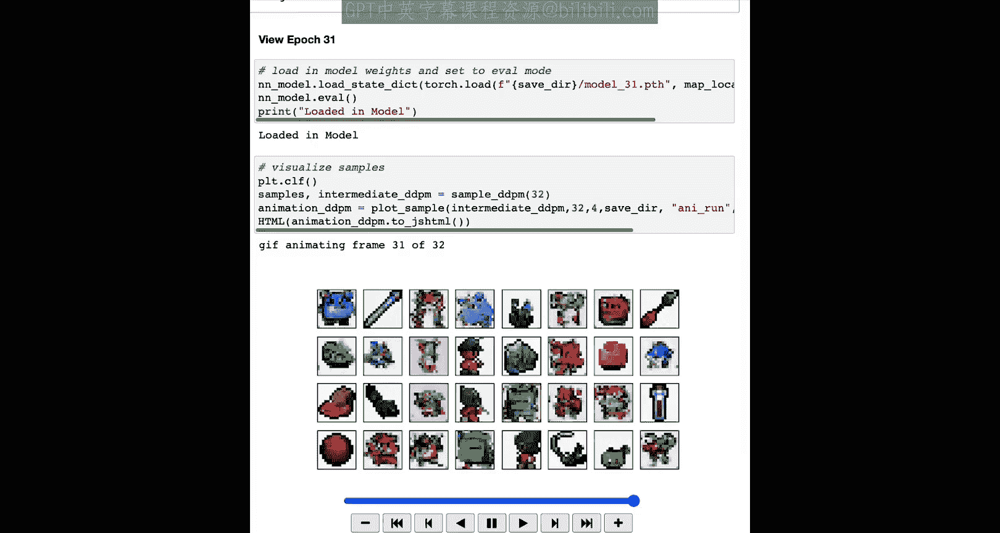

本节课中我们一起学习了扩散模型的训练过程。我们了解到，训练的核心是让U-Net神经网络学习从加噪图像中预测噪声。通过随机采样时间步、添加相应噪声、计算预测噪声与真实噪声的均方误差损失，并利用反向传播进行优化，模型逐渐掌握了从噪声中重建图像（精灵）特征的能力。代码实战部分展示了这一流程的具体实现，以及模型随着训练轮次增加而生成的图像质量提升。在下一节课中，我们将学习如何控制生成过程，例如指定生成物体或人物。