# 006：控制扩散模型生成内容 🎮

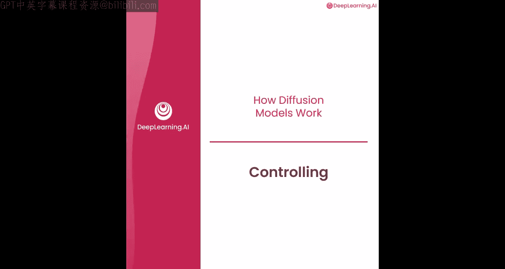

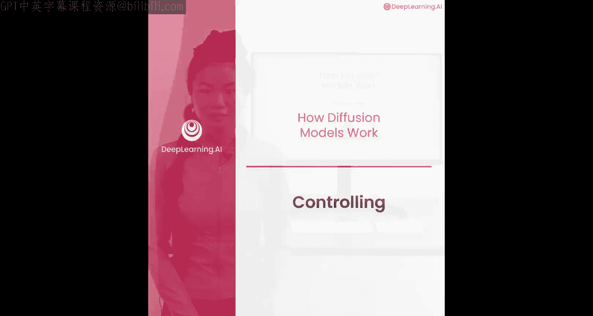

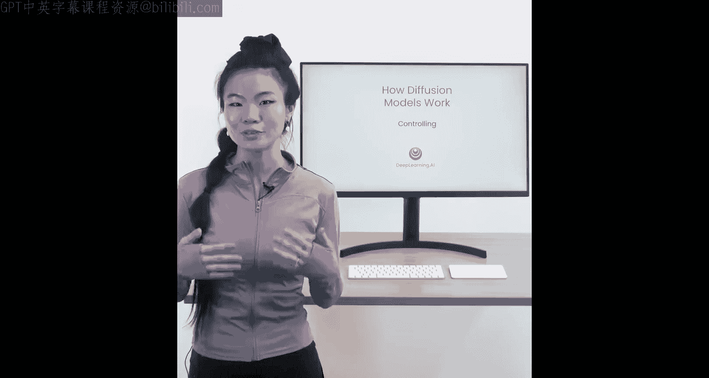

在本节课中，我们将学习如何控制扩散模型，使其根据我们的指令生成特定内容。这是最令人兴奋的部分，因为你可以告诉模型你想要什么，而模型会为你想象出来。

## 理解上下文嵌入

上一节我们介绍了扩散模型的基本工作原理，本节中我们来看看如何通过“上下文”来控制模型的生成内容。控制这些模型的关键在于使用“嵌入”。

嵌入是能够捕捉含义的向量（即一组数字）。例如，对于扩散模型，一个句子“棕熊经常互相碰撞”的含义可以被编码成一个嵌入向量。嵌入的特殊之处在于，语义相似的文本会拥有相似的向量。更神奇的是，你几乎可以对嵌入进行向量运算，例如：`巴黎向量 - 法国向量 + 英国向量 ≈ 伦敦向量`。

那么，在训练过程中，这些嵌入如何成为模型的上下文呢？

*   你有一张牛油果图片和一个描述它的标题“一个成熟的牛油果”。
*   你可以将标题转换为嵌入向量，并将其输入到神经网络中。
*   神经网络的任务仍然是预测添加到这张牛油果图片中的噪声，并计算损失。
*   这个过程可以在大量带标题的图片上重复进行，例如一张“舒适的扶手椅”图片。

这个环节的魔力在于：虽然你从互联网上抓取的训练图片是牛油果和扶手椅，但在采样生成时，你可以让模型生成它从未见过的东西，比如一个“牛油果扶手椅”。这是因为你可以将“牛油果扶手椅”这个词组嵌入到一个向量中，这个向量既包含一点牛油果的特征，也包含一点扶手椅的特征。将这个向量输入神经网络，让它预测噪声，减去噪声后，你就能得到一个牛油果扶手椅的图像。

## 上下文的多种形式

更广泛地说，上下文是一个可以控制生成的向量。它可以是像“牛油果扶手椅”这样较长的文本嵌入，但上下文也可以很短，比如长度为5的分类向量。

以下是几种上下文类型的例子：

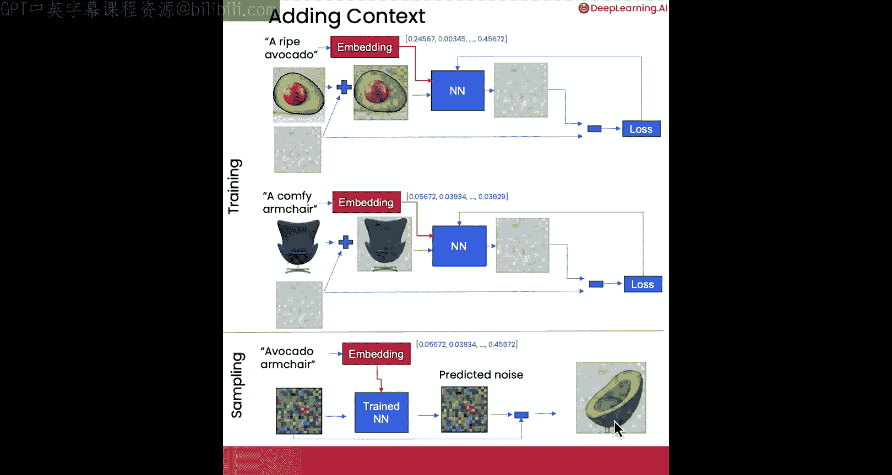

*   **英雄/非英雄**：例如火球、蘑菇等物体。
*   **食物**：例如苹果、橙子、西瓜。
*   **法术和武器**：例如弓箭、蜡烛。
*   **精灵朝向**：例如侧面朝向或非侧面朝向。

## 动手实验：为模型添加上下文

现在，让我们在接下来的实验中看看如何为模型添加上下文。

首先，我们运行设置代码，这与之前的实验相同。

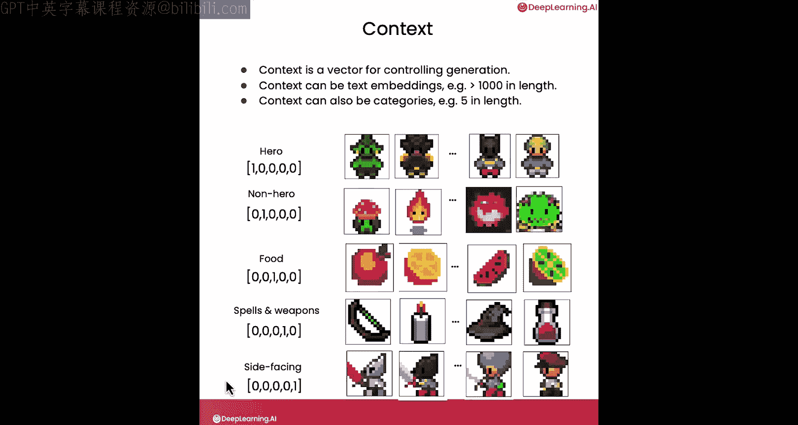

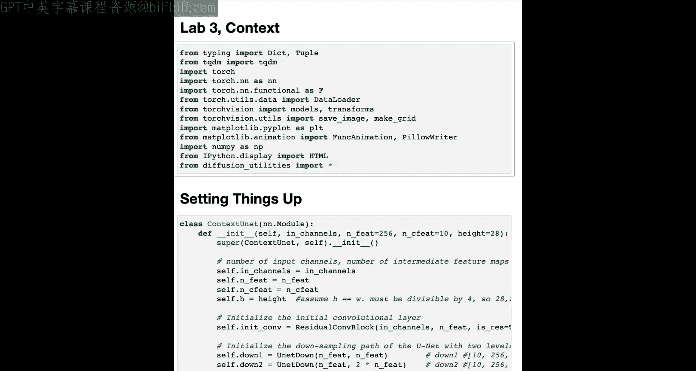

```python
# 设置代码（与之前相同）
```

然后，在上下文部分，我们再次实例化神经网络。请注意，我们不会在此训练模型，但会指出几个添加上下文的关键位置。

1.  **加载数据时**：我们现在同时遍历数据点及其关联的上下文因子。在我们的例子中，上下文是经过独热编码的向量，代表“英雄/非英雄”、“食物”、“法术/武器”、“侧面朝向”等类别。
2.  **创建上下文掩码**：这里重要的是，我们会以一定的随机概率将上下文完全掩蔽（置零）。这样做的目的是让模型既能学习特定上下文下的生成，也能学习生成一个通用的精灵图像。这在扩散模型中很常见。
3.  **调用神经网络时**：我们在调用神经网络时添加上下文。

接下来，我们加载一个已经使用上下文训练好的模型检查点。

```python
# 加载预训练模型
model.load_state_dict(torch.load('context_model.pth'))
```

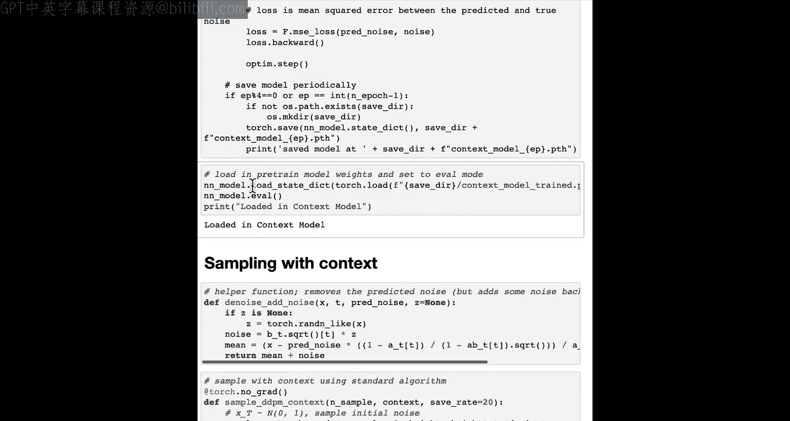

再次运行我们的采样代码。在默认情况下，这段代码会为每个样本选择完全随机的上下文，因此你会看到各种不同类型的输出，包括不同的物体和人物。

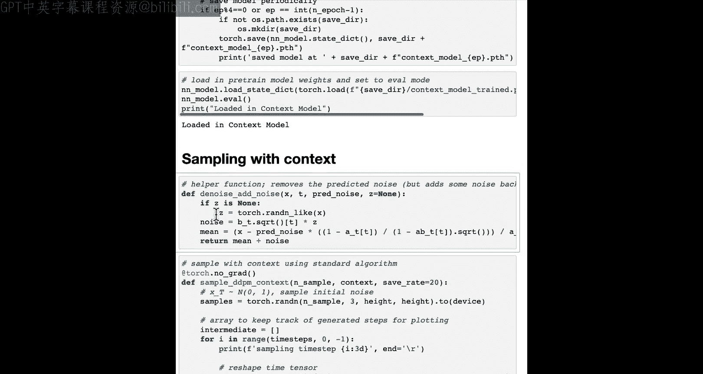

## 控制生成内容

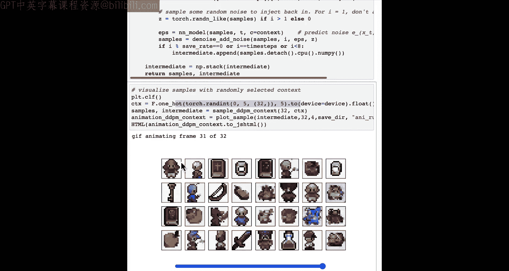

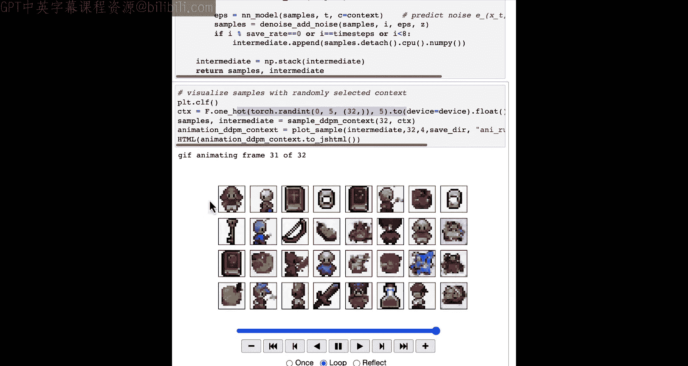

现在，我们可以开始控制生成内容了。你可以在这里定义具体的上下文。

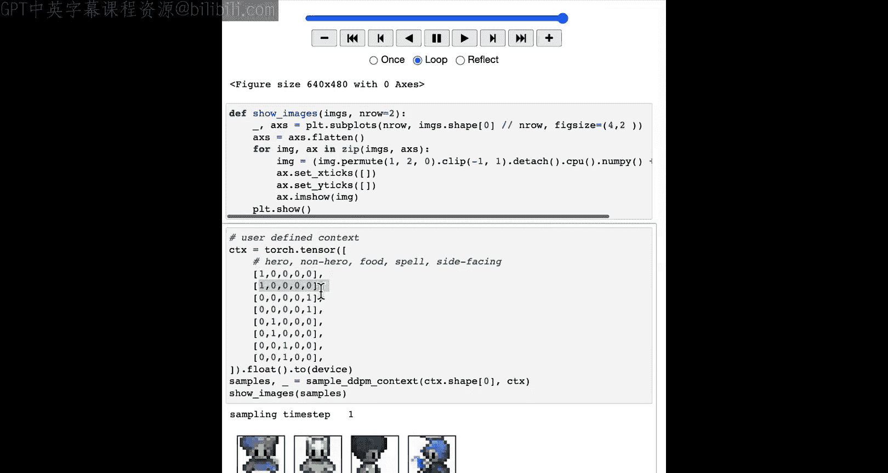

例如，我定义了以下上下文：
*   前两个样本是“英雄”。
*   接下来两个样本是“侧面朝向”（即独热编码向量的最后一个值为1）。
*   再接下来两个是“非英雄”（看起来像野兽）。
*   最后两个是“食物”（一个像苹果，一个像梨）。

进入“牛油果扶手椅”的混合模式，我们实际上可以混合匹配这些特征。虽然模型是在独热编码向量上训练的，但我们也可以提供0到1之间的浮点数来获得混合特征。

*   第二个样本是“英雄”并混合了部分“食物”特征，因此它看起来像一个“土豆人”。
*   第三个样本混合了部分“食物”和部分“法术”特征，因此它看起来像一瓶“药水”。

你可以自己尝试，甚至可以输入一些看似矛盾的特征组合，比如既是“英雄”又是“侧面朝向”（同时包含正面和侧面特征）。这非常有趣，请随时暂停视频，自己尝试修改这些值。

## 课程总结

本节课中，我们一起学习了如何通过上下文嵌入来控制扩散模型的生成内容。我们了解了嵌入如何捕捉语义信息，并作为额外的条件输入引导模型生成特定或混合特征的图像。通过动手实验，我们实践了如何定义和修改上下文向量，从而创造出“英雄”、“食物”甚至“土豆人”等多样化的生成结果。

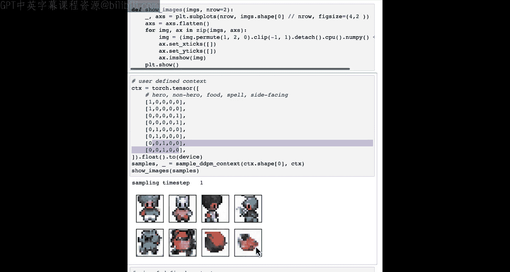

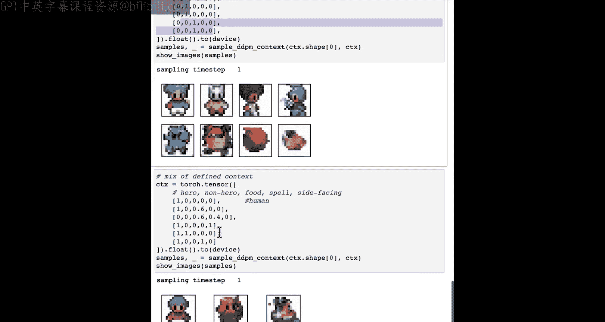

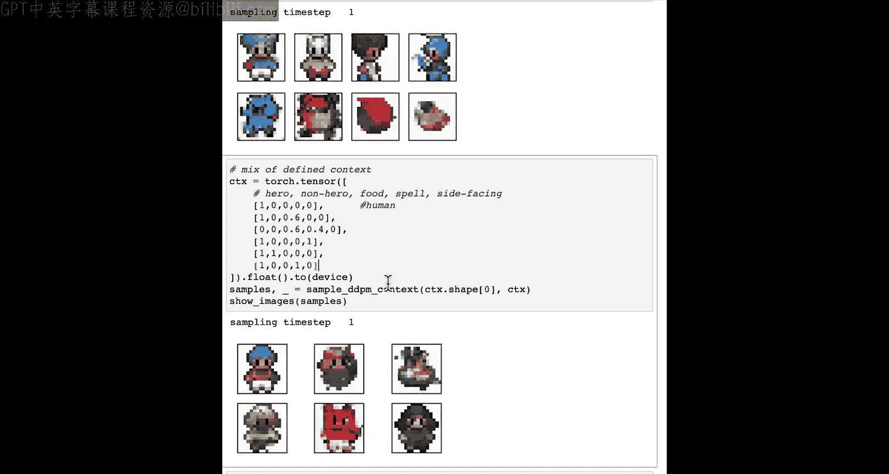

现在你已经可以创建并控制这些样本了。在下一视频中，你将探索如何加速采样过程，这样你就不需要等待那么长时间了。