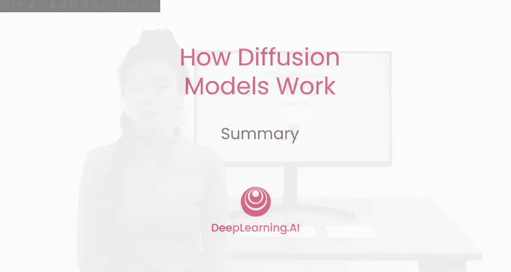
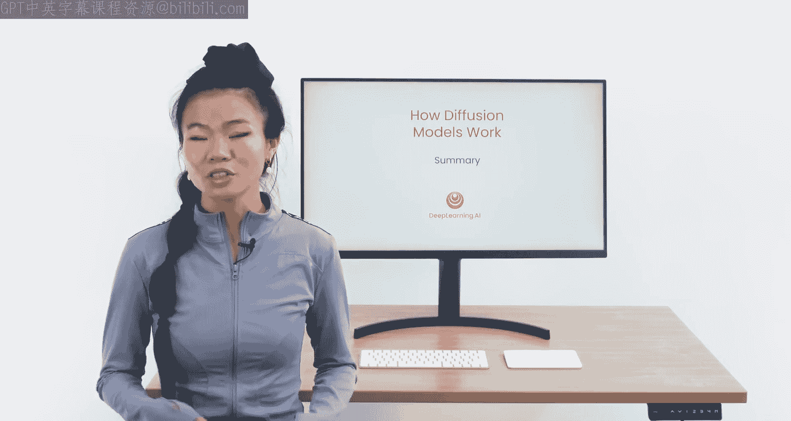
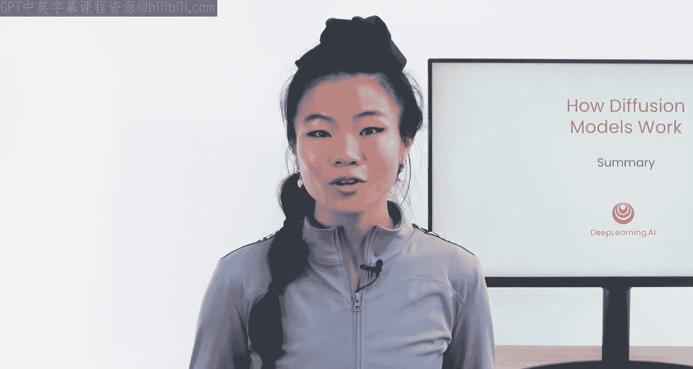
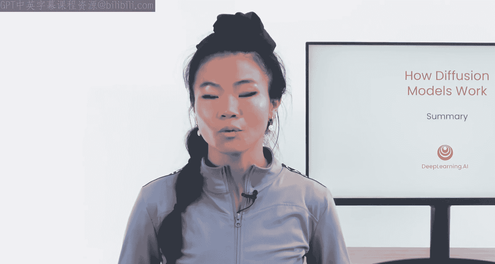

# 008：课程总结 🎉

在本节课中，我们将对扩散模型的核心知识进行总结，回顾从训练到采样的完整流程，并展望其未来的发展方向。

## 课程回顾

上一节我们介绍了模型架构与上下文控制，本节中我们将对整个课程内容进行梳理与总结。

恭喜你学习了扩散模型的基础知识。现在，让我们将所有内容整合起来。

你已能够训练一个扩散模型来预测噪声，并通过从纯噪声中迭代减去预测的噪声来获得高质量的图像。

你也能使用一个名为DDIM的更高效采样器，从训练好的神经网络中快速采样生成图像。

你学习了模型架构——U-Net。你将上下文信息输入模型，从而可以决定生成食物、咒语、英雄精灵图像，或介于其间的一些奇特内容。

最后，你探索并运行了实现所有这些功能的代码。

## 未来探索方向

现在，你可以创建自己的数据集并尝试生成新事物。

扩散模型的应用不仅限于图像，这只是它们目前最流行的领域。

以下是扩散模型的其他应用方向：
*   音乐生成：输入任何提示词即可生成音乐。
*   药物发现：用于提出新分子以加速药物研发。
*   尝试更大规模的数据集。
*   尝试新的采样器。实际上存在大量比DDIM更快、更好的采样器。

你还可以利用这些模型做更多事情，例如：
*   **图像修复**：让扩散模型在你已有的图像周围进行绘制填充。
*   **文本反转**：仅用几张样本图像，就能让模型学习一个全新的文本概念。

## 进阶发展与展望

你在这里学习的是基础和原理。该领域还有其他重要的发展。

例如，Stable Diffusion使用了一种名为**潜在扩散**的方法，其公式可简化为在潜在空间而非像素空间进行操作：`z = Encoder(x)`， `x' = Decoder(z)`。这直接处理图像嵌入而非原始图像，使过程更加高效。

其他值得关注的技术还包括交叉注意力文本条件化以及无分类器引导。

研究社区仍在致力于开发更快的采样方法，因为在推理阶段，扩散模型的速度仍然比其他生成模型慢。

总而言之，随着扩散模型和整个生成式模型的不断改进及其应用日益广泛，现在是一个极其令人兴奋的时代。

非常感谢你加入本课程的学习，我期待看到你的创作成果。😊