# 2：生成式模型 🎨

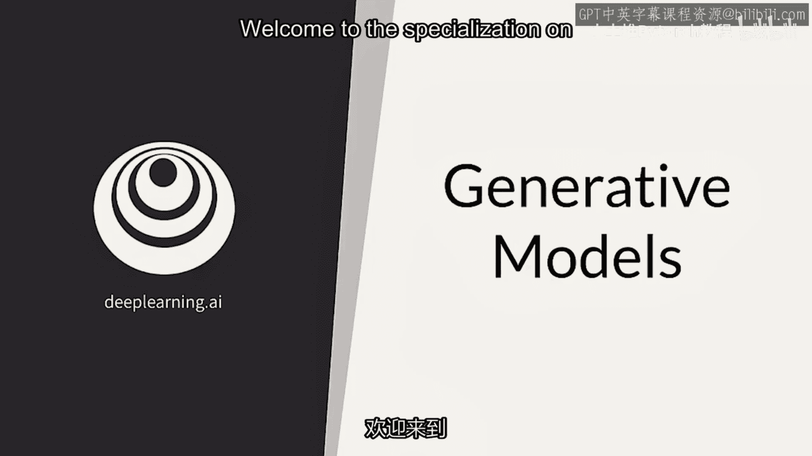

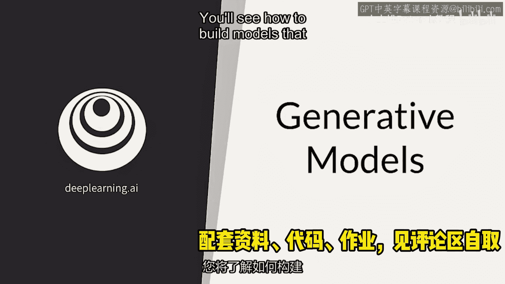

在本节课中，我们将学习生成式模型的基本概念，特别是生成对抗网络（GANs）。我们将了解生成式模型与判别式模型的区别，并介绍两种主流的生成式模型架构。

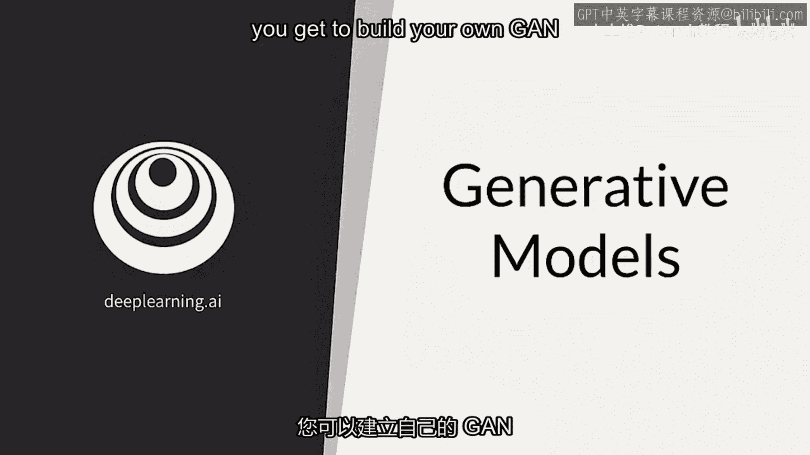

## 1. 生成式模型与判别式模型

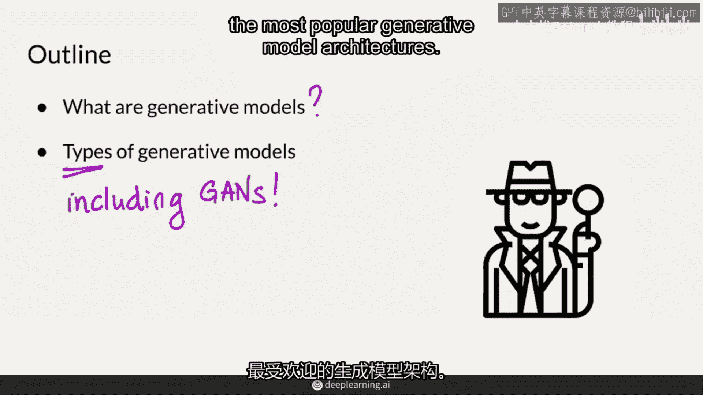

上一节我们介绍了课程概述，本节中我们来看看生成式模型与判别式模型的核心区别。

你可能熟悉判别式模型。判别式模型是机器学习中常用的分类模型。它们学习如何区分类别，如狗和猫。它们通常被称为分类器。判别式模型使用一组特征 `x`，如湿润的鼻子，或者它是否发出咕噜声。然后根据这些特征确定类别 `y`，即图像是否是狗或猫。换句话说，它们试图建模给定一组特征 `x` 时，类别为 `y` 的概率 `P(y|x)`。例如，它有湿鼻子但不咕噜，所以它很可能是一只狗。

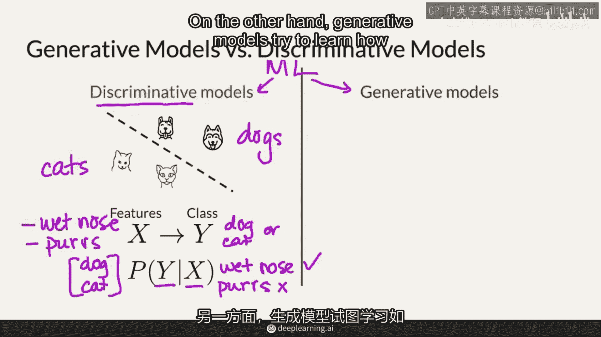

另一方面，生成模型试图学习如何制作某个类的逼真表示。例如，一只狗的逼真图片。

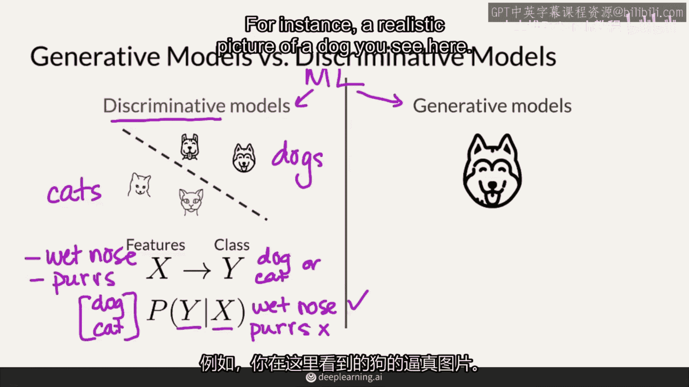

以下是判别式模型与生成式模型的直观对比：
*   **判别式模型**：学习条件概率分布 `P(y|x)`。目标是区分不同类别。
*   **生成式模型**：学习联合概率分布 `P(x, y)` 或 `P(x)`。目标是生成新的、逼真的数据样本。

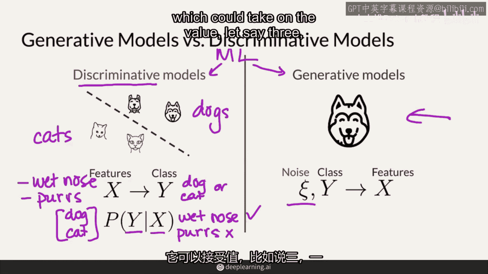

## 2. 生成式模型的工作原理

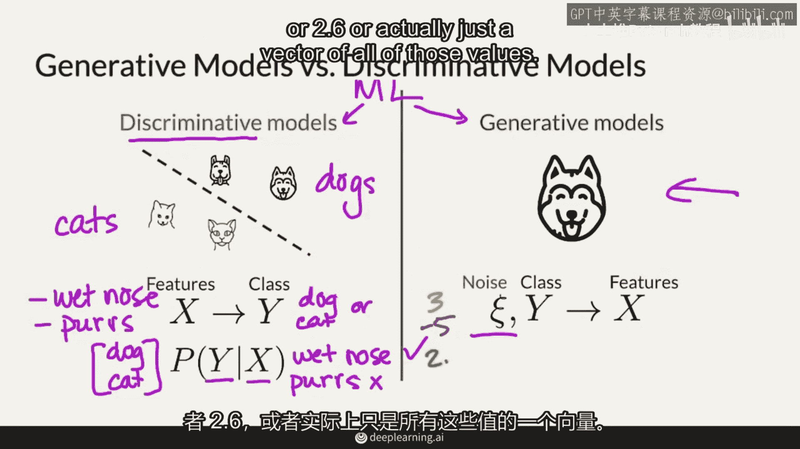

上一节我们对比了两种模型，本节中我们来看看生成式模型具体是如何工作的。

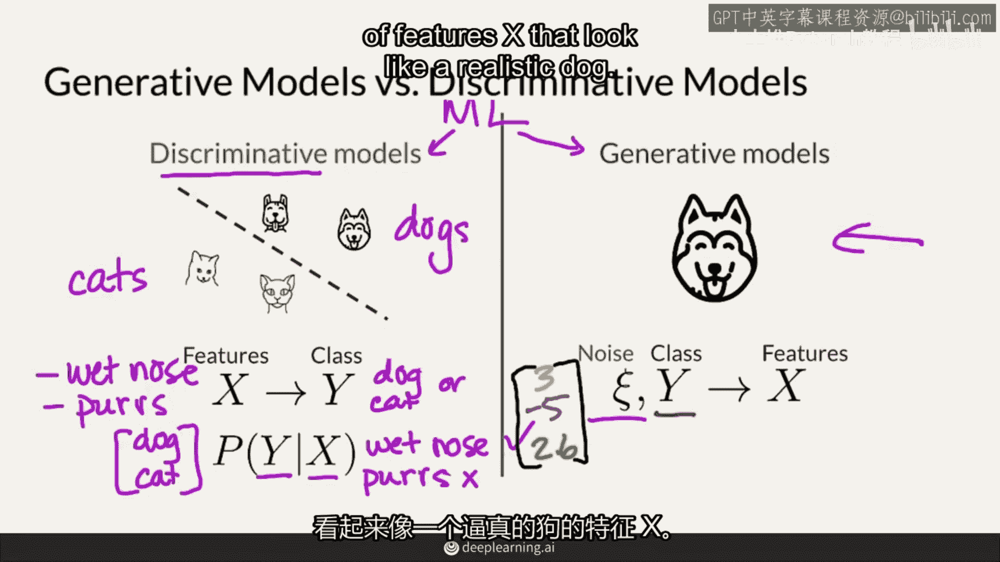

生成模型从一些随机输入开始，这里表示为噪声 `z`。这可能是一个随机数字，例如三、一个负数、五或二点六。我们实际上是使用一个所有可能值的向量。重点是噪音 `z` 代表了随机一组值输入到生成模型中。生成模型有时也会接收一个类别 `y`，例如狗。并且从这些输入中，它将生成一组特征，看起来像一只真实的狗。所以，一只狗的形象，具有湿鼻子或舌头伸出等特征。

你可能会好奇为什么需要这种噪音。为什么不能直接告诉模型生成一只狗，然后它就会生成。这里的噪音主要是确保生成的东西实际上每次不是相同的狗。你很快就会看到这种主题被重复。这是因为只生成一个狗并不有趣，而且也有点没意义。所以目前可以把这看作是一些随机噪音，这也作为输入进入。

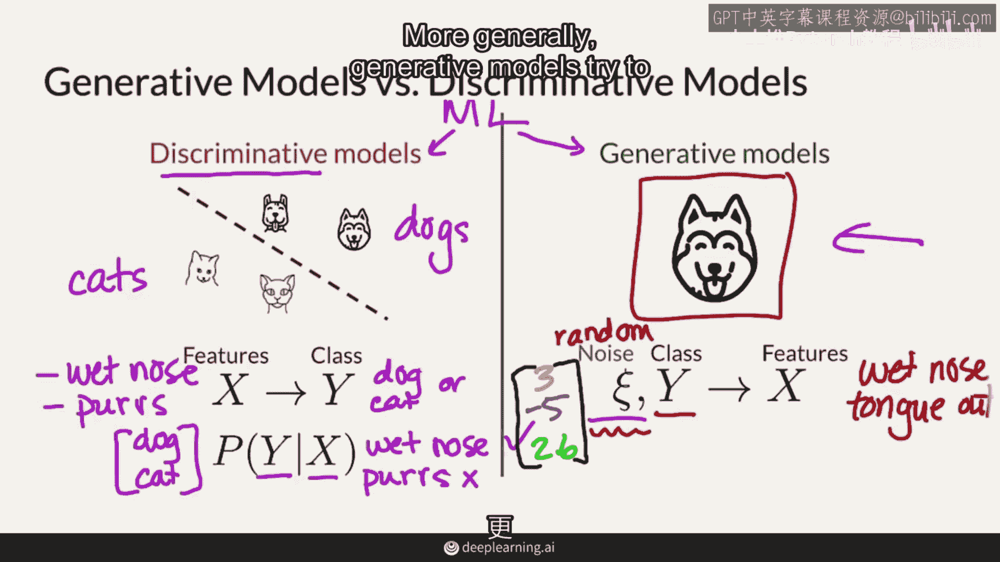

更普遍地说，生成模型试图捕捉特征 `x` 的概率分布 `P(x|y)`。例如，湿鼻子、伸出舌头、尖耳朵等特征，但总是鉴于狗的类 `y`，再加上噪音 `z`。这些模型将生成这个类 `y` 的真实和多样化的表示。实际上，如果你只生成狗这一个类，那么你可能不需要对这个 `y` 进行条件约束。相反，这只是对所有特征 `x` 的概率 `P(x)`。

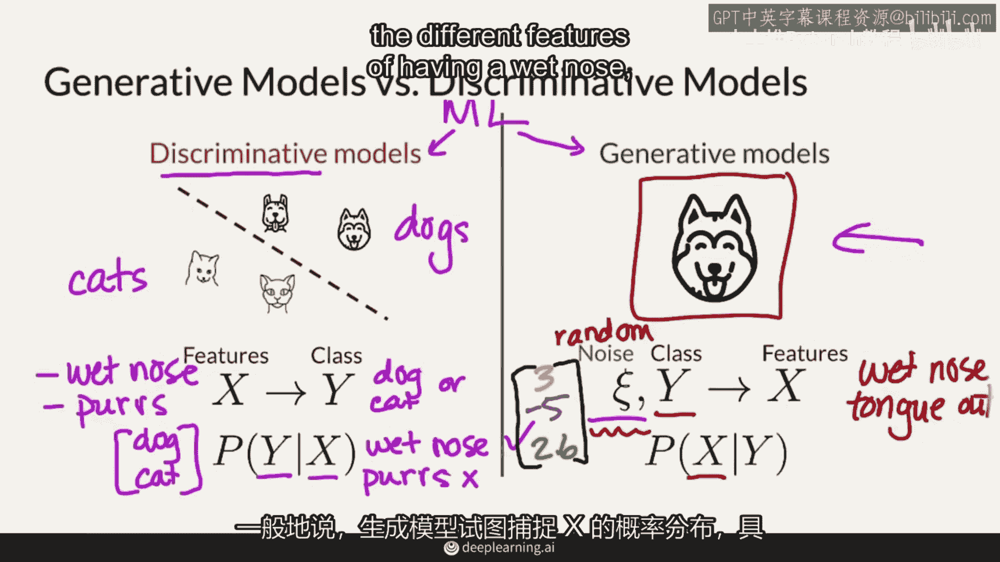

你可以从侧面比较看出，判别式模型和生成式模型在这里实际上有点相互映照。

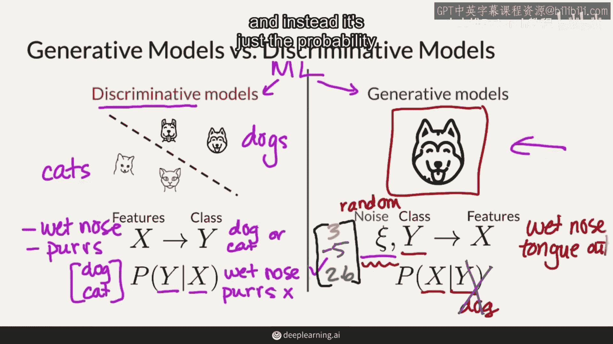

在一个良好的生成模型运行中，你可以得到这些鹅啄食的图片。而在另一个运行中，你可以得到一只西藏獒犬的图片。如果你继续多次运行它，没有任何限制，你将会得到更多代表你生成模型训练数据集的图片。这可能看起来像很多可爱的拉布拉多寻回犬。

## 3. 主流生成式模型架构

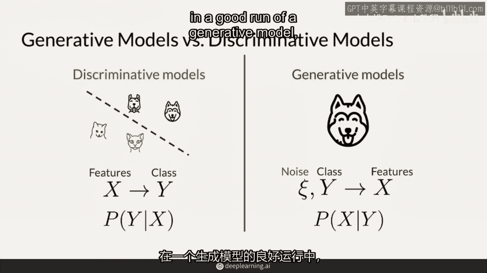

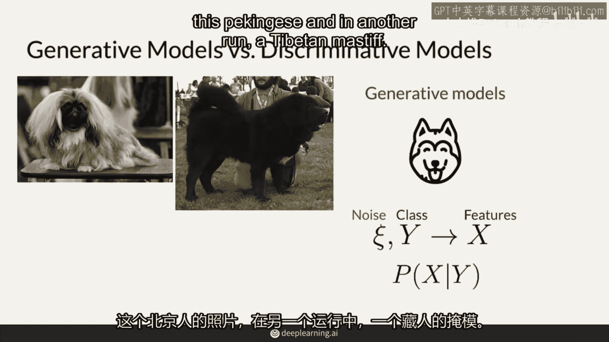

上一节我们了解了生成式模型的基本流程，本节中我们来看看两种最受欢迎的生成式模型架构。

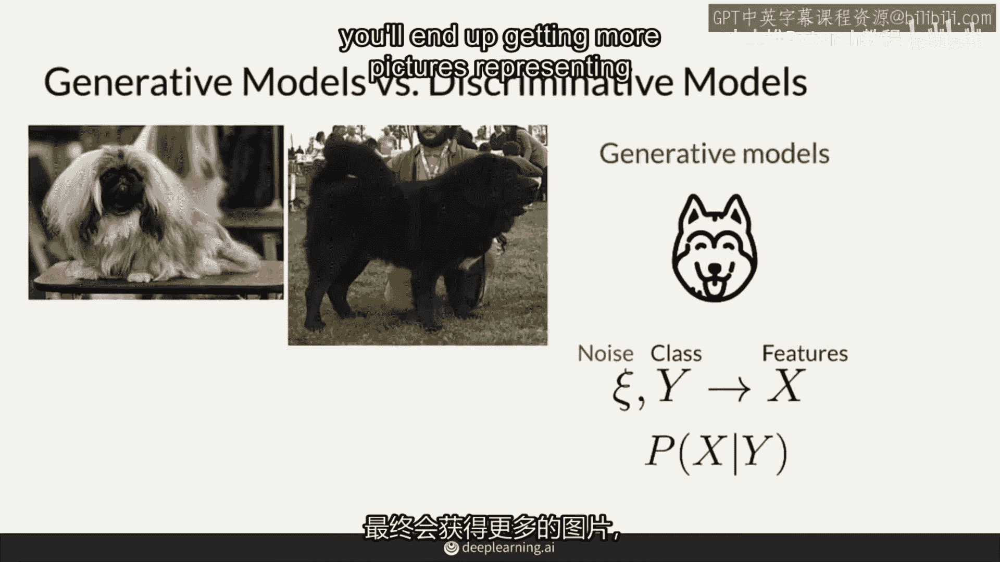

有许多类型的生成模型，我将简要向你介绍最受欢迎的那些：变分自编码器（VAE）和生成对抗网络（GANs）。

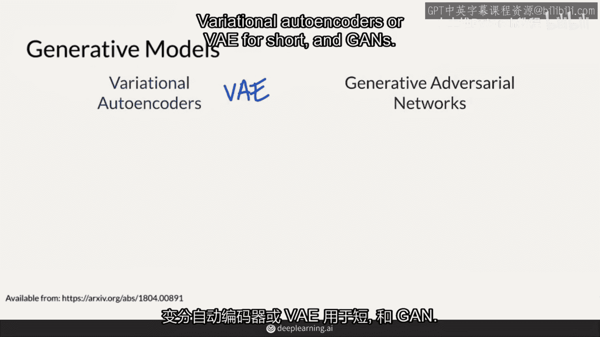

### 变分自编码器 (VAE)

VAE使用两个模型工作：一个编码器和一个解码器。这些通常是神经网络。

它们首先通过将真实图像喂入编码器来学习。例如，一张逼真的狗图片。然后编码器的任务是找到一种很好的方式来表示这张图像，在这个扭曲的潜在空间中。假设它找到了这里，假设这个点在潜在空间中可以用这组数字表示：`[6.2, -0.321]`。

现在VAE会做以下操作：它将这个潜在表示，或者接近它的点，通过解码器。解码器的目标是重建编码器之前看到的真实图像。所以假设解码器已经训练得很好。但是在一开始，解码器可能无法重建图像。也许这只狗的后代会有邪恶的眼睛。

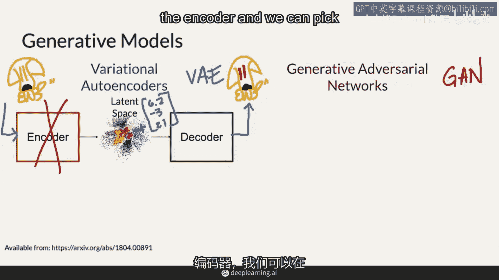

训练后，我们实际上可以去掉编码器。我们可以在潜在空间中随机选择点，比如这里，解码器将学会生成一张真实狗的图片。

我刚才描述的是大部分自编码器。变分自编码器的一部分，变分的部分实际上在训练过程中向整个模型注入一些噪声。编码器不是将图像编码到潜在空间的单一点中，而是将图像编码到一个整个分布中。然后从那个分布中采样一个点，喂给解码器，以便生成一个真实的图像。这添加一些噪声，因为这个分布上的不同点可以被采样。

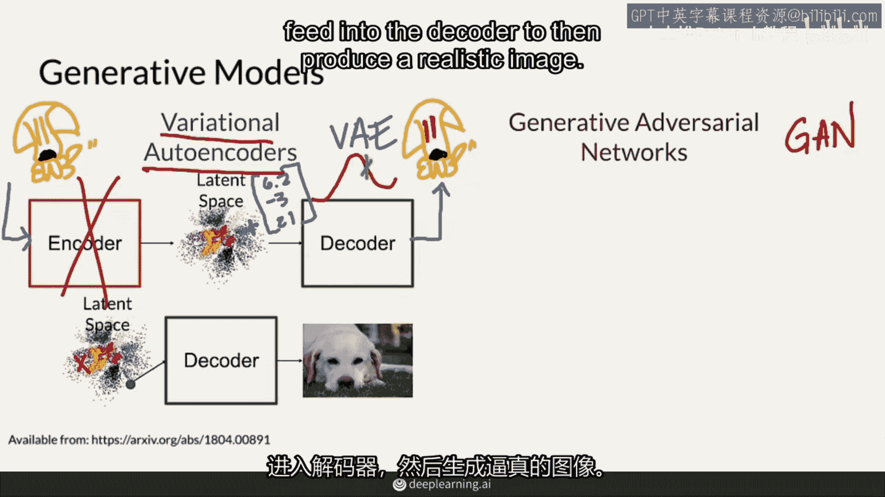

### 生成对抗网络 (GANs)

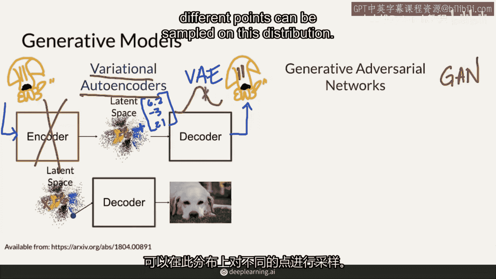

GANs以一种相当不同的方式工作。它们也由两个模型组成：一个生成器和一个判别器。

生成器输入一些随机噪音 `z`，就像你之前看到的那样，例如 `[1, 2, 3, 5]` 作为一个向量，并将这些输入到这个生成器中。当然，还可以选择狗的种类，但如果我们只是想生成狗，我们不需要输入那个。作为输出，它可以随时间生成同一只狗。当然，一开始它生成的图像可能不真实。

生成器的角色，在某种程度上它与VAE中的解码器非常相似。不同之处在于没有指导编码器来决定输入到生成器中的噪声向量应该看起来像什么。

相反，有一个**判别器**在看假的和真实的图像，同时试图理清哪些是真实的，哪些是虚假的。判别器本身是一个判别式模型，其任务是区分“真实图像”和“生成器生成的假图像”这两个类别。

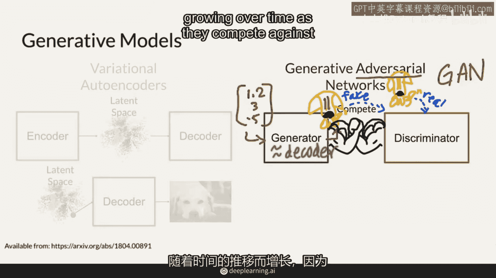

随着时间的推移，每个模型都在试图超越彼此。生成器试图生成足以骗过判别器的假图像，而判别器则试图更准确地区分真假。因此，这些模型彼此竞争。这就是为什么它们在名字中被称为“对抗性的”——生成对抗网络。

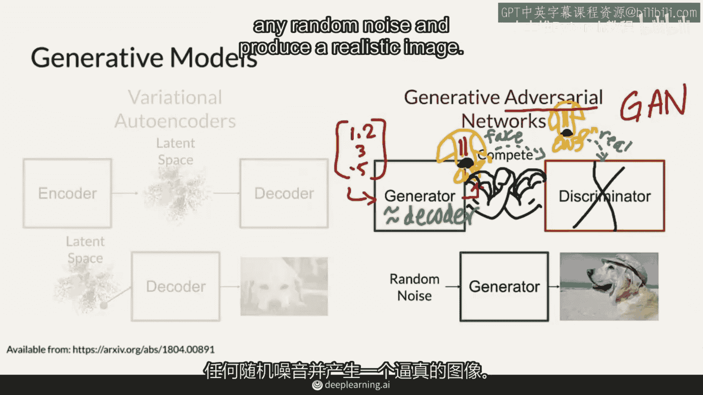

你可以想象两个模型在训练中就像肌肉随着时间的推移在彼此竞争中增长。直到他们达到一个点，我们再次不再需要第二个模型了。生成器可以输入任何随机噪声并生成一张逼真的图像。例如，一组随机数向量 `[-5, 6, 2, 8]`，可以生成这只可爱的拉布拉多寻回犬。

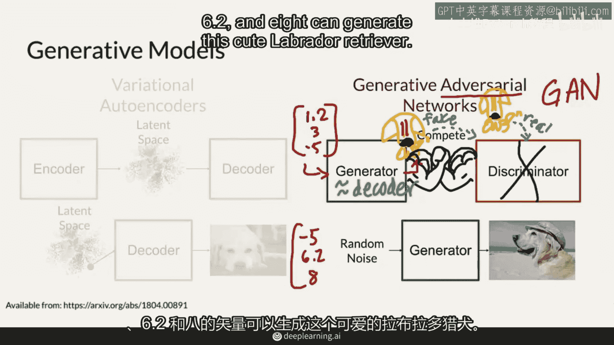

在这门专业化课程期间，你将专注于生成对抗网络（GANs）。但请随意阅读更多关于VAE的内容，如果你发现它们有趣。不要担心，如果你还不完全理解GAN的工作原理。我将更深入地研究它们的架构，在接下来的视频中他们将学到的方式。

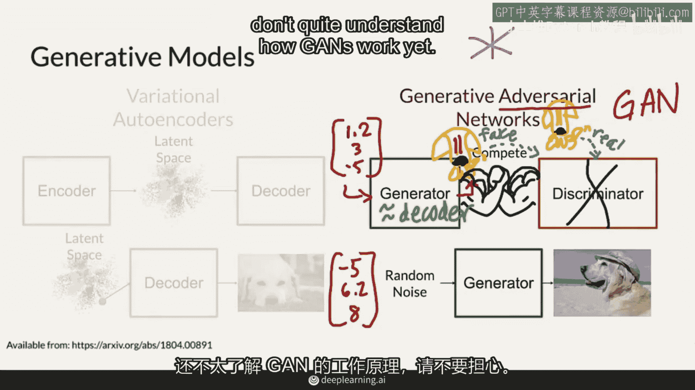

## 4. 总结

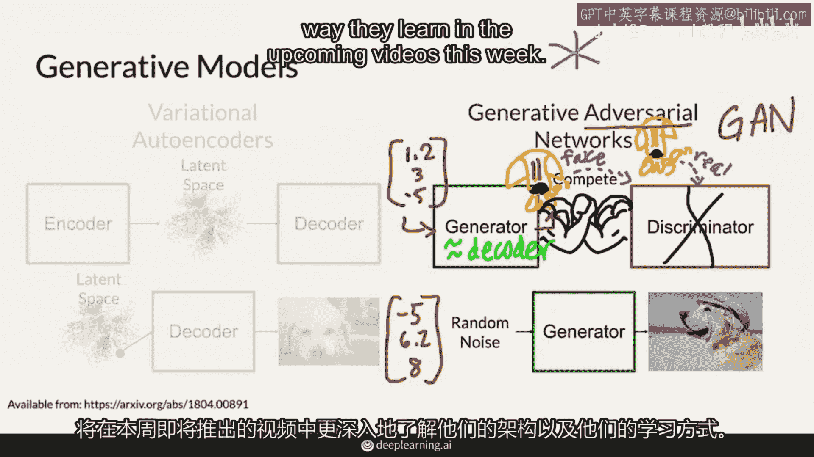

本节课中我们一起学习了生成式模型的核心知识。

总之，生成模型学习产生逼真的例子，就像一位艺术家可以画出看起来像照片的画作。例如，产生那些可爱的狗的照片。一个生成模型有点像一个艺术家，他正在尝试学习如何创作超写实艺术。

同时，判别模型能够区分不同的类别，比如一只狗或一只猫。但是当然，你也看到了，一个判别模型可以是一个生成模型的子组件，例如GAN中的判别器，其类别为“真实”和“伪造”。

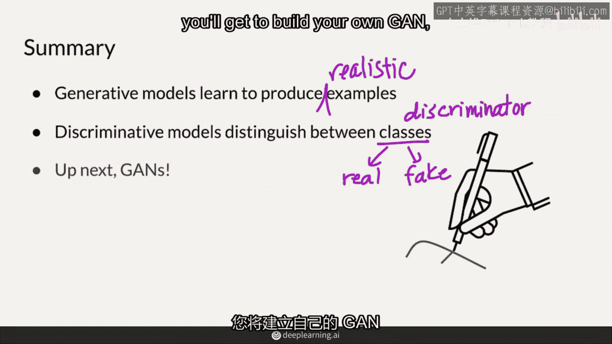

有许多种生成模型，但在本系列课程中，你将学习GAN。本周末结束的时候，你可以构建自己的生成对抗网络（GAN），它能够生成手写数字。