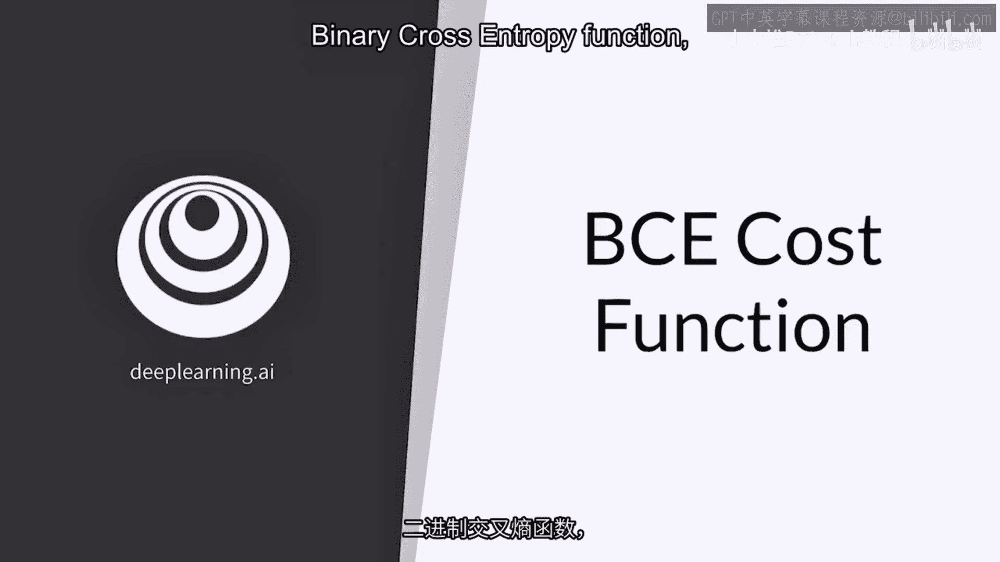
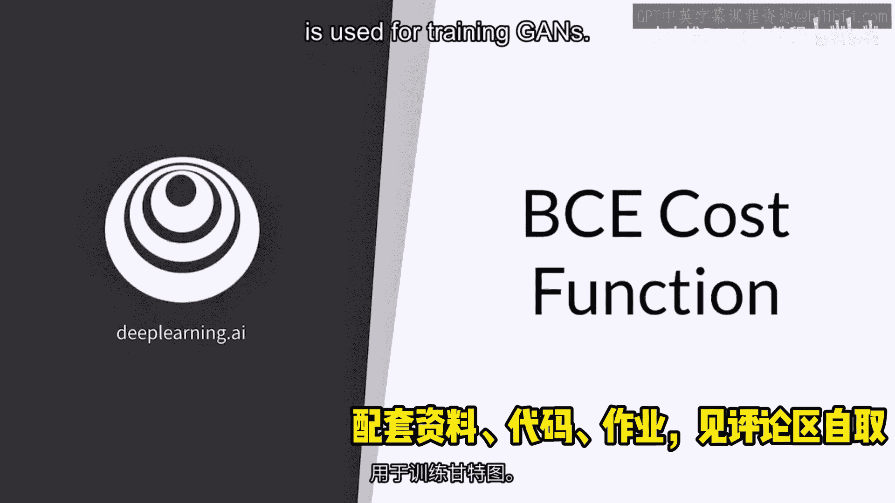
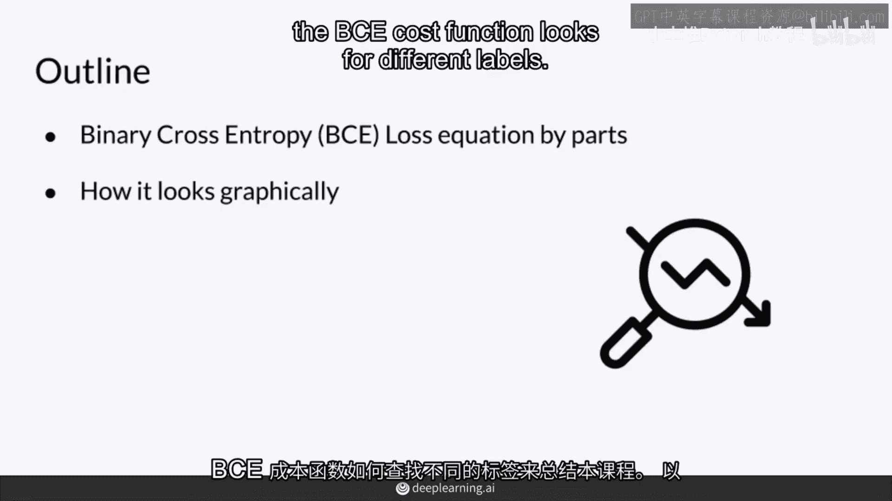
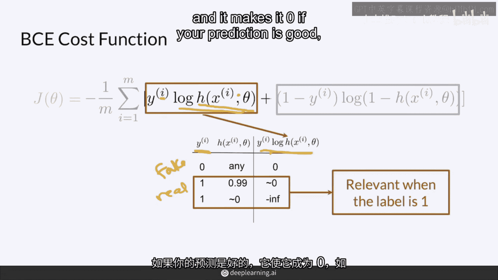
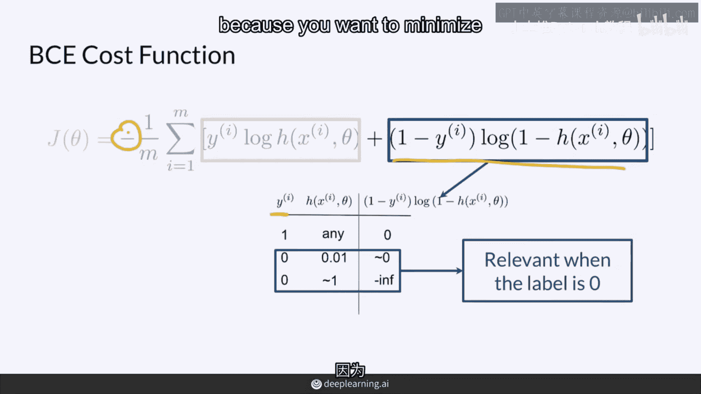
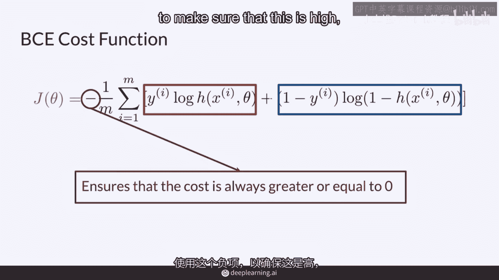
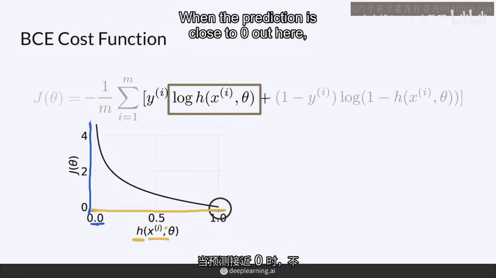
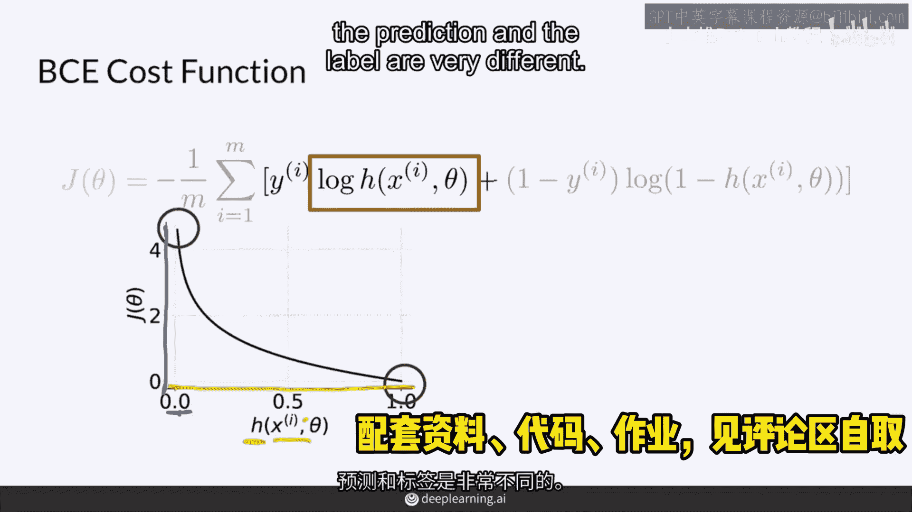
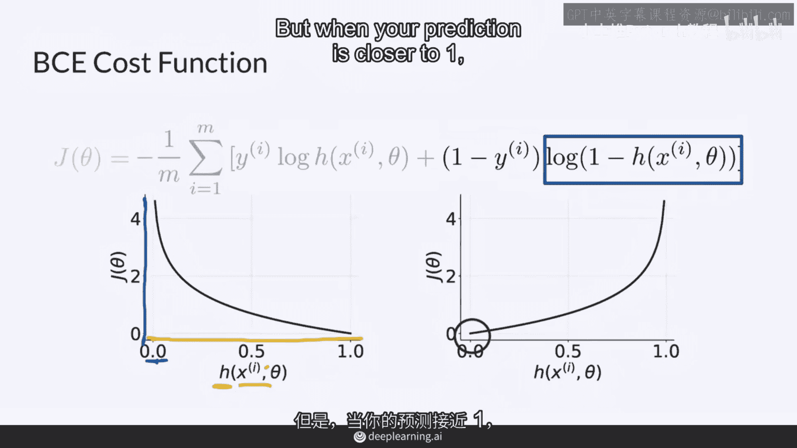
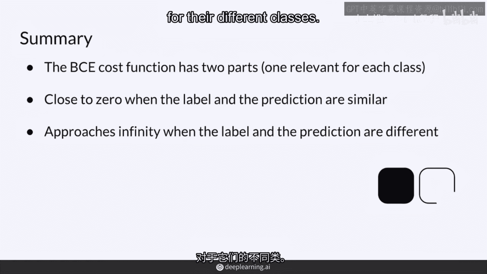

# 7：BCE代价函数详解 🧮





在本节课中，我们将学习二进制交叉熵（BCE）代价函数。该函数是训练生成对抗网络（GANs）等模型的关键组件，特别适用于处理二分类任务，例如区分“真实”与“伪造”的数据。


---

## 函数公式与组成部分



完整的BCE代价函数公式如下：

$$
J(\theta) = -\frac{1}{m} \sum_{i=1}^{m} \left[ y^{(i)} \log(h_{\theta}(x^{(i)})) + (1 - y^{(i)}) \log(1 - h_{\theta}(x^{(i)})) \right]
$$

这个公式可能初看有些复杂，但我们可以将其分解为几个核心部分来理解。

首先，公式开头的求和符号 $\sum_{i=1}^{m}$ 和除以 $m$ 表示我们需要计算整个批次（包含 $m$ 个样本）的平均损失。前面的负号 `-` 是为了确保最终的损失值为正数，这是优化算法所期望的。

公式中的符号含义如下：
*   $y^{(i)}$：第 $i$ 个样本的真实标签，通常为1（真实）或0（伪造）。
*   $h_{\theta}(x^{(i)})$：模型（例如判别器）对第 $i$ 个样本 $x^{(i)}$ 的预测概率，由参数 $\theta$ 决定。
*   $\log$：自然对数函数。

---

## 公式分解与工作原理

上一节我们介绍了BCE函数的整体结构，本节中我们来看看公式中的两个核心项是如何工作的。它们分别对应了样本标签为1和0的情况。

以下是公式中两个关键项的解读：

1.  **$y \log(h_{\theta}(x))$**：此项在**真实标签 $y=1$** 时起作用。
    *   如果模型预测正确（$h_{\theta}(x) \approx 1$），则 $\log(1) \approx 0$，此项贡献的损失很小。
    *   如果模型预测错误（$h_{\theta}(x) \approx 0$），则 $\log(0)$ 会趋向负无穷，此项贡献的损失会非常大。

2.  **$(1-y) \log(1 - h_{\theta}(x))$**：此项在**真实标签 $y=0$** 时起作用。
    *   如果模型预测正确（$h_{\theta}(x) \approx 0$），则 $\log(1-0) \approx 0$，此项贡献的损失很小。
    *   如果模型预测错误（$h_{\theta}(x) \approx 1$），则 $\log(1-1) = \log(0)$ 趋向负无穷，此项贡献的损失会非常大。



公式前的负号 `-` 至关重要。它将上述两项中因预测错误而产生的“负无穷大”趋势，转换为“正无穷大”的损失值。这样，神经网络的目标就明确为：**通过调整参数 $\theta$，最小化这个始终为正的损失值 $J(\theta)$**。

---

## 损失函数可视化

理解了公式的数学含义后，我们通过图像来直观感受BCE损失函数的行为。

以下是针对不同标签时，损失随预测值变化的示意图：

*   **当真实标签 $y=1$ 时**，损失函数简化为 $-\log(h_{\theta}(x))$。
    *   当预测值 $h_{\theta}(x)$ 接近1（正确）时，损失趋近于0。
    *   当预测值 $h_{\theta}(x)$ 接近0（错误）时，损失会急剧上升并趋向无穷大。



*   **当真实标签 $y=0$ 时**，损失函数简化为 $-\log(1 - h_{\theta}(x))$。
    *   当预测值 $h_{\theta}(x)$ 接近0（正确）时，损失趋近于0。
    *   当预测值 $h_{\theta}(x)$ 接近1（错误）时，损失同样会急剧上升并趋向无穷大。

图像清晰地表明：**预测值与真实标签越接近，BCE损失越小；预测值与真实标签差异越大，BCE损失越大，甚至趋向无穷大。** 这完美地符合了我们对一个良好损失函数的期望。



---

## 批处理计算

在实际训练中，我们很少只计算单个样本的损失。以下是BCE损失在批处理中的计算方式：



模型会同时处理一个批次（例如 $N=5$ 个）的样本。对于批次中的每一个样本，都独立计算其BCE损失。最终，整个批次的损失是这 $N$ 个样本损失的平均值。这种批处理方式使得训练过程更加高效和稳定。



```python
# 伪代码示意批处理BCE损失计算
batch_loss = 0
for i in range(batch_size):
    # 计算第i个样本的损失
    sample_loss = bce_loss(y_true[i], y_pred[i])
    batch_loss += sample_loss
average_loss = batch_loss / batch_size # 得到批次的平均损失
```

---



## 总结

本节课中我们一起学习了二进制交叉熵（BCE）代价函数。

我们首先了解了它的完整公式，并拆解了求和、平均以及两个核心对数项的组成部分。我们深入分析了每一项分别在真实标签为1和0时所起的作用，以及负号如何确保损失值为正。通过可视化图像，我们直观地看到了损失如何随着预测准确度而变化：预测正确时损失接近0，预测错误时损失趋向无穷大。最后，我们明确了BCE损失在实际应用中是通过计算一个批次内所有样本损失的平均值来使用的。



总而言之，BCE损失函数通过严厉惩罚错误的预测、轻微奖励正确的预测，有效地驱动模型（如GANs中的判别器）朝着做出准确二分类预测的方向进行学习和优化。