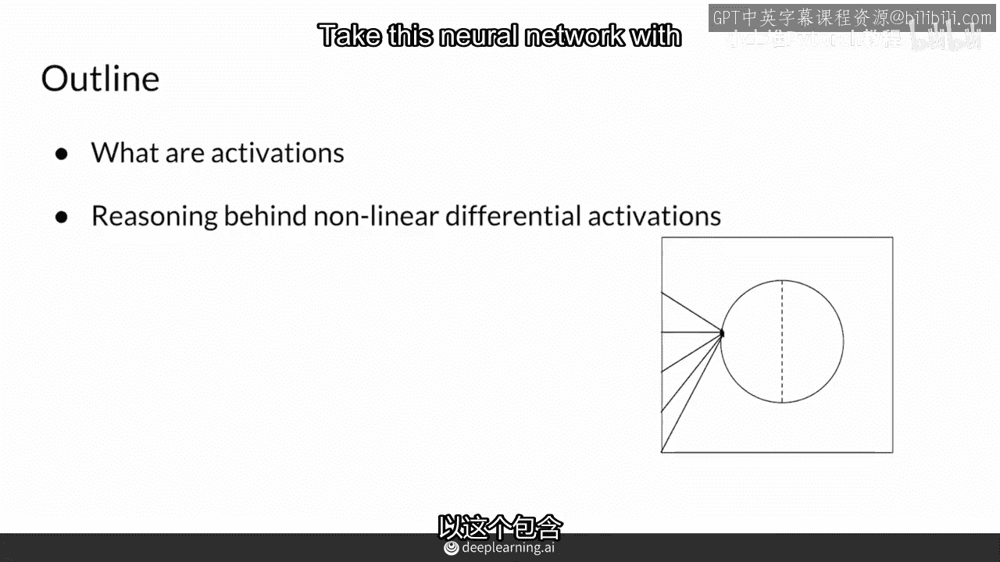
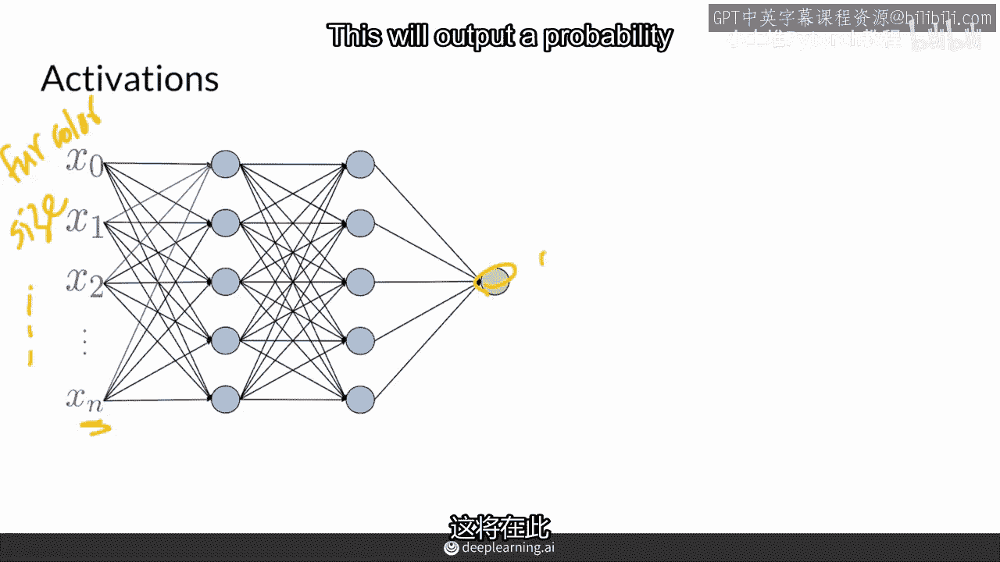
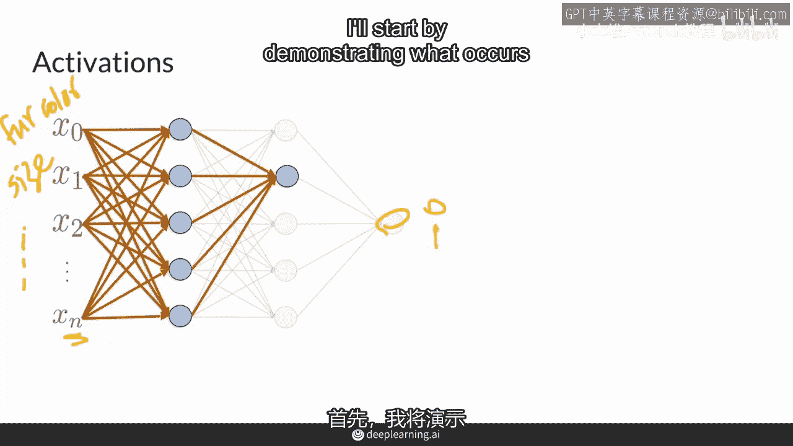
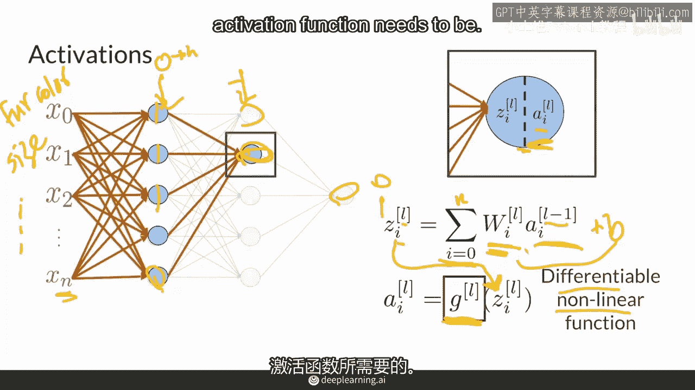
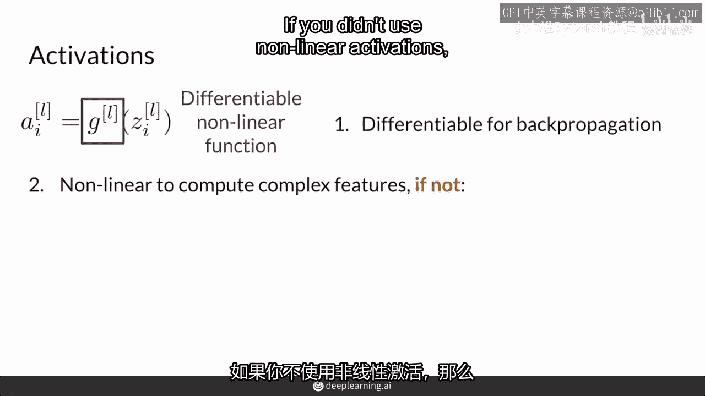
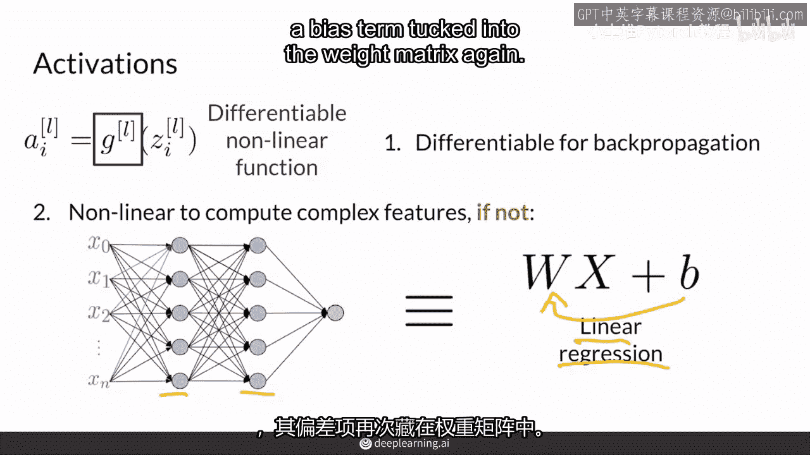
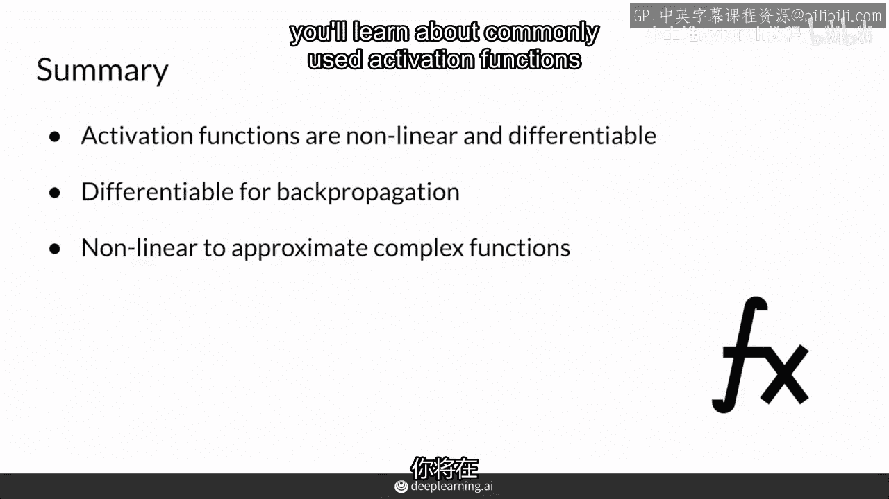

# 11：11.激活函数的基本属性 🧠

在本节课中，我们将要学习神经网络中激活函数的基本概念、核心属性及其重要性。激活函数是构建深度学习模型的关键组件，理解其工作原理对于掌握神经网络至关重要。

---

## 概述

激活函数是一个数学函数，它接收任意实数作为输入（即其定义域），并输出一个特定范围内的数值。激活函数通常是非线性且可微分的函数。在深度神经网络中，激活函数通常被用在某些层之间，尤其是在进行分类等复杂任务时。本教程将详细解释激活函数的概念、其必须满足的属性，以及它们在神经网络中的作用。

---

## 激活函数的作用

上一节我们概述了激活函数的基本定义，本节中我们来看看它在神经网络中的具体位置和作用。

考虑一个用于预测图像是否为猫的神经网络。该网络可能有两个隐藏层和多个输入特征。例如，`X0` 可能代表毛色，`X1` 代表动物大小，以及其他各种特征。网络的最终输出是一个介于0到1之间的概率值，表示“是猫”的可能性。

那么，网络中间的所有节点是如何工作的呢？这些节点共同构成了整个神经网络的架构。要理解这一点，我们需要从单个节点的操作开始。

---

## 单个节点的计算过程

一个节点从前一层接收信息，并进行两项主要计算。我们可以用一条虚线将这个过程分开来看。

首先，节点计算一个值 `z`。这里的 `i` 表示当前是第几个节点（例如，第一个节点 `i=1`），`l` 表示当前所在的层（例如，第一层 `l=1`）。

`z` 的计算公式是前一层所有输出的加权和：

**公式：** `z_i^l = Σ (w_ij^l * a_j^{l-1}) + b_i^l`

其中：
*   `a_j^{l-1}` 是前一层（第 `l-1` 层）第 `j` 个节点的输出。
*   `w_ij^l` 是连接前一层第 `j` 个节点到当前层第 `i` 个节点的权重。
*   `b_i^l` 是当前节点的偏置项。
*   求和范围 `j` 从 `0` 到 `n`（前一层节点的总数）。

这部分计算通常被称为**线性层**，因为它只涉及输入的线性加权组合。

在计算完 `z` 之后，节点会应用一个激活函数 `g`。节点的最终输出 `a` 是激活函数作用于 `z` 的结果：

**公式：** `a_i^l = g(z_i^l)`

---

## 激活函数的两个核心属性

上一节我们介绍了节点如何计算 `z` 和 `a`，本节中我们重点看看激活函数 `g` 本身。激活函数必须满足两个核心属性：**非线性**和**可微分**。

### 1. 可微分性

激活函数需要是可微分的，这意味着它必须有导数（或者说梯度）。这一点至关重要，因为神经网络通过**反向传播**算法来训练和更新其参数（权重和偏置）。反向传播需要计算损失函数相对于每个参数的梯度，这个过程依赖于链式法则，要求网络中每一层的变换（包括激活函数）都是可微分的，以便梯度能够从输出层一直传递回输入层。

### 2. 非线性

激活函数必须是非线性的。如果神经网络中只使用线性运算（即没有非线性激活函数），那么无论堆叠多少层，整个网络都可以被等价地简化为一个单一的线性变换。

**公式推导（简化理解）：**
假设有两层线性变换：`layer2_output = W2 * (W1 * X + b1) + b2`。
这可以合并为：`layer2_output = (W2 * W1) * X + (W2 * b1 + b2)`。
令 `W_combined = W2 * W1`， `b_combined = W2 * b1 + b2`。
最终得到：`layer2_output = W_combined * X + b_combined`，这仍然只是一个线性回归模型。

因此，非线性激活函数的引入，确保了堆叠的多个层能够真正构建出复杂的、非线性的函数，从而让神经网络有能力学习数据中复杂的模式和关系。线性回归本身就是一个带有偏置项的线性层，缺乏处理复杂非线性问题的能力。

---

## 总结

本节课中我们一起学习了激活函数的基本属性。

1.  **作用**：激活函数是神经网络层之间的非线性变换单元，它决定了节点的最终输出 `a`。
2.  **核心属性**：激活函数必须同时具备**非线性**和**可微分**两个属性。
    *   **非线性**确保了多层神经网络不会退化为简单的线性模型，使其能够学习和表示复杂的函数。
    *   **可微分**确保了反向传播算法可以顺利进行，使得网络能够通过梯度下降来学习和优化参数。
3.  **灵活性**：只要满足非线性和可微分的条件，理论上任何自定义函数都可以用作激活函数。研究人员会通过实验来探索不同激活函数在不同任务上的效果。

理解激活函数的这些基本属性，是深入学习各种具体激活函数（如Sigmoid、ReLU、Tanh等）及其应用场景的重要基础。