# 12：常见的激活函数 🧠

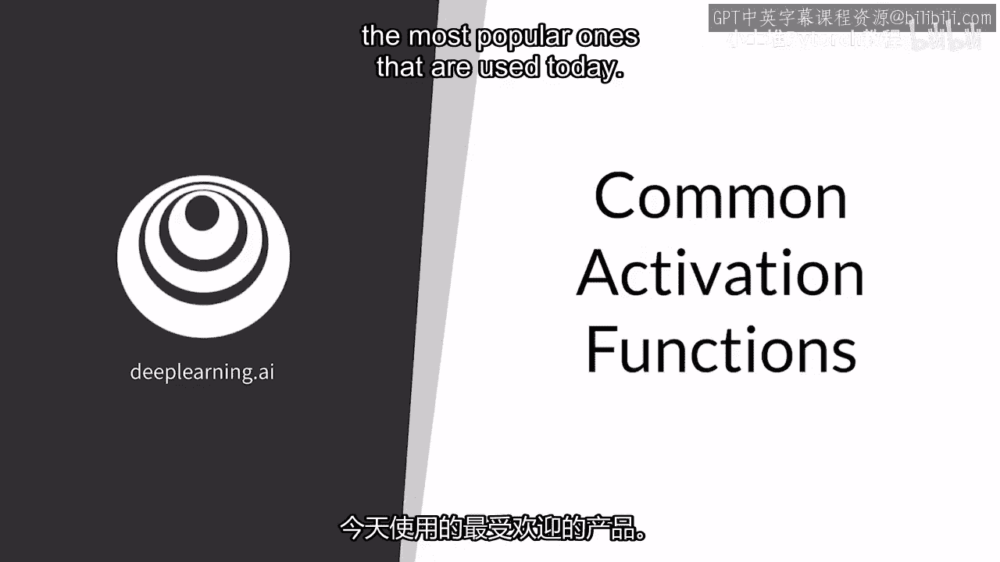

在本节课中，我们将学习深度学习模型中至关重要的组件——激活函数。激活函数为神经网络引入了非线性，使其能够学习和模拟复杂的数据模式。我们将重点介绍四种最常用的激活函数：ReLU、Leaky ReLU、Sigmoid 和 Tanh，并探讨它们各自的特性、优缺点。

## 概述 📋

激活函数是神经网络中的非线性变换，它决定了神经元是否应该被激活。没有激活函数，无论神经网络有多少层，其输出都将是输入的线性组合，从而无法学习复杂的模式。本节将详细介绍四种常见的激活函数，帮助你理解它们的工作原理及适用场景。

## 1. ReLU（修正线性单元）⚡

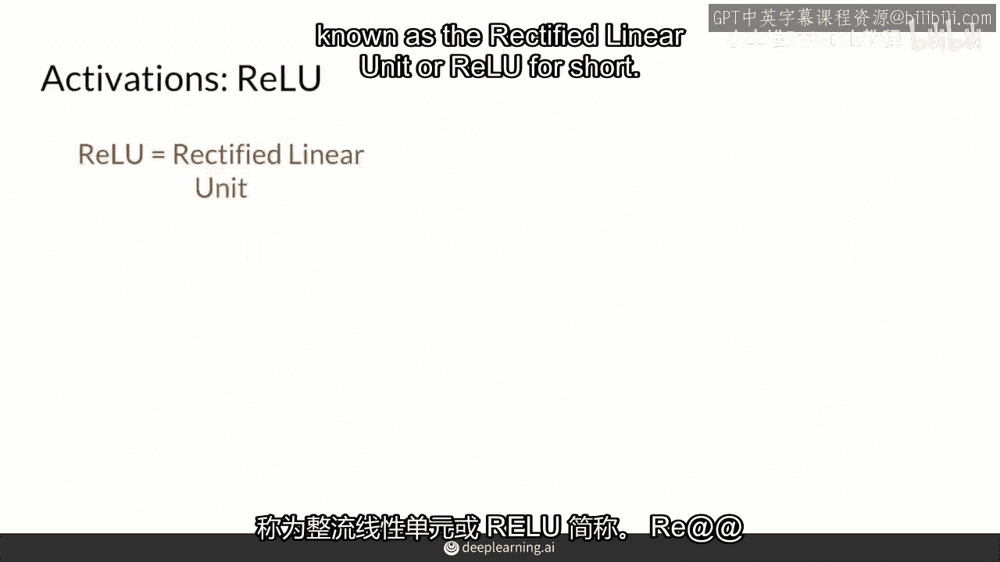

上一节我们介绍了激活函数的重要性，本节中我们首先来看看最受欢迎的激活函数之一——ReLU。

ReLU 函数的定义非常简单：它取输入值 `z` 和 0 之间的最大值。其数学公式如下：

**g(z) = max(0, z)**

这意味着，如果输入 `z` 是正数，输出就等于 `z`；如果 `z` 是负数或零，输出则为 0。从图形上看，ReLU 函数在正数区域是一条斜率为 1 的直线，在负数区域则是一条值为 0 的水平线，形状类似于一个“曲棍球棍”。这种特性使其成为一个非线性函数。

以下是 ReLU 函数的关键特点：

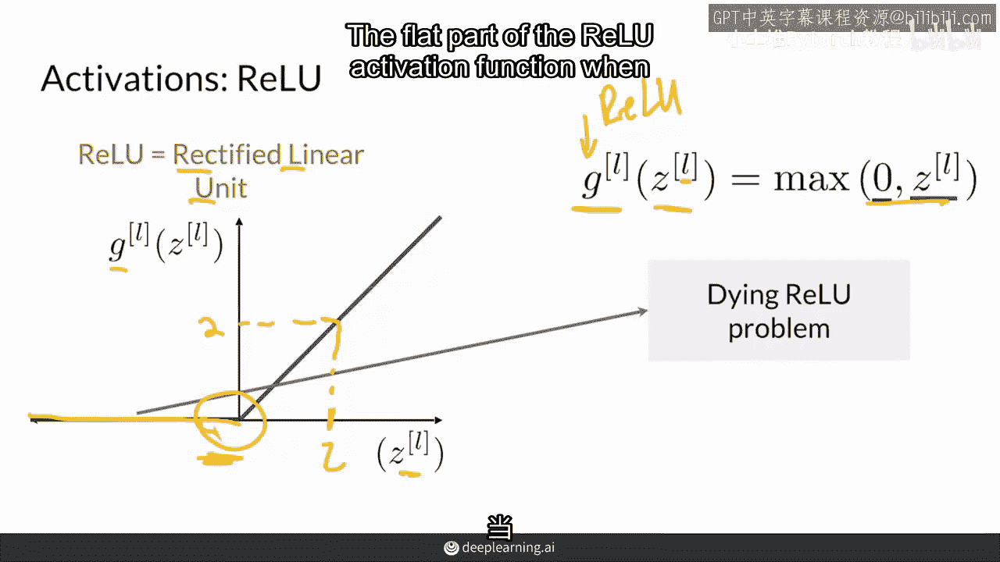

*   **非线性**：其“曲棍球棍”形状打破了线性关系。
*   **计算高效**：只涉及简单的比较和赋值操作。
*   **缓解梯度消失**：在正数区域，梯度恒为 1，有助于梯度在深层网络中传播。

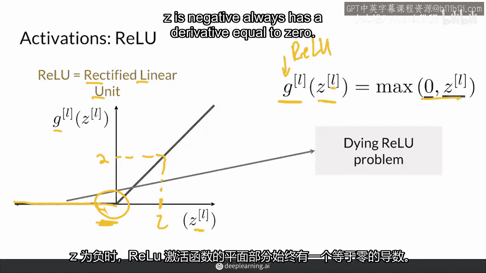

然而，ReLU 也存在一个显著的问题。

## 2. Leaky ReLU（带泄漏的修正线性单元）💧

上一节我们了解到 ReLU 在输入为负时输出为零，这可能导致“神经元死亡”问题。为了解决这个问题，我们来看看 ReLU 的一个变体——Leaky ReLU。

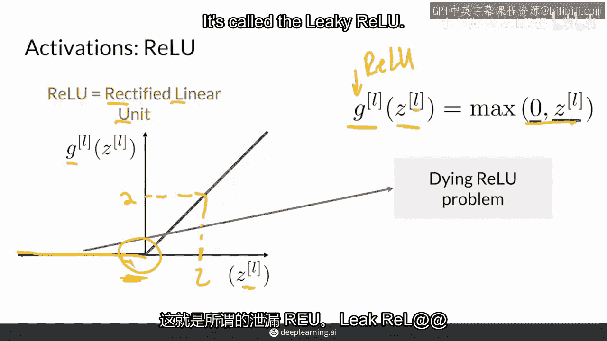

Leaky ReLU 对 ReLU 进行了微调：当输入 `z` 为负时，它不再输出 0，而是输出一个很小的、非零的值。其数学公式通常定义为：

**g(z) = max(αz, z)**

其中，`α` 是一个很小的超参数（例如 0.01）。这意味着，当 `z` 为负时，输出是一个很小的斜率（`α`）乘以 `z`，从而确保导数不为零。

以下是 Leaky ReLU 的主要改进：

*   **解决“死亡ReLU”问题**：负值区域有一个小的斜率，使得梯度可以继续反向传播。
*   **保持稀疏性**：虽然负值区域有输出，但值非常小，依然保持了 ReLU 的部分稀疏激活特性。
*   **超参数 `α`**：通常设置为一个很小的固定值（如 0.01），也可以作为可学习的参数。

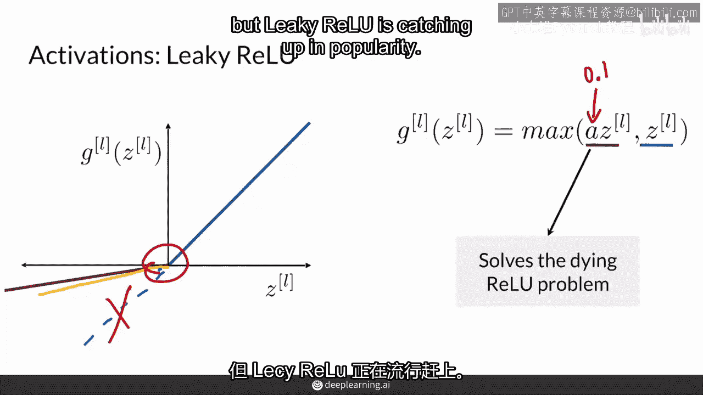

在实践中，ReLU 仍然被广泛使用，但 Leaky ReLU 在处理某些问题时能提供更稳定的训练效果。

## 3. Sigmoid 函数 📈

前面我们介绍了两种基于线性修正的激活函数。现在，我们来看看两种形状相似、但输出范围不同的经典函数。首先是 Sigmoid 函数。

Sigmoid 函数将任何实数输入“挤压”到 (0, 1) 区间内，其形状是一个平滑的“S”形曲线。其数学公式为：

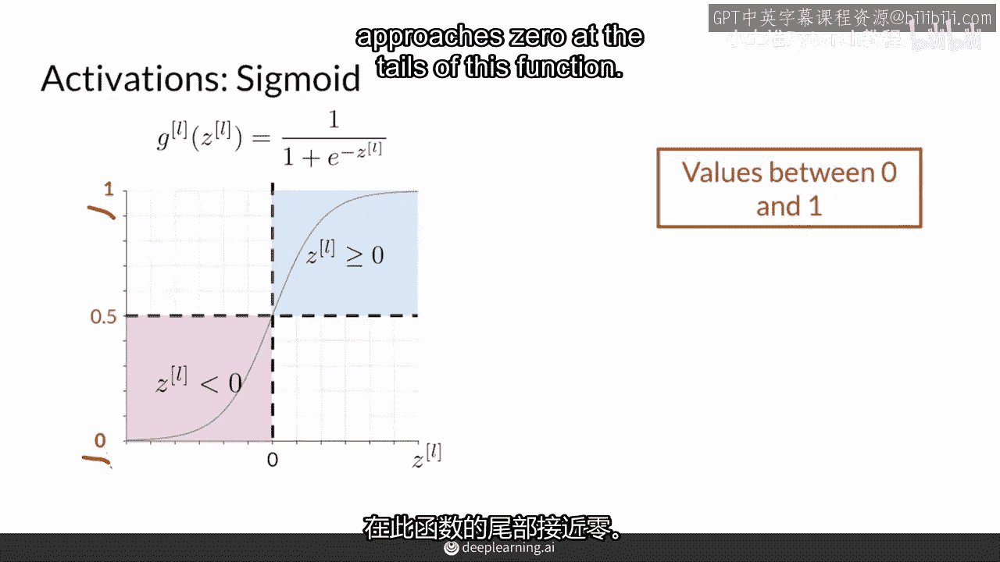

**g(z) = 1 / (1 + e^{-z})**

当 `z` 为正且很大时，输出趋近于 1；当 `z` 为负且绝对值很大时，输出趋近于 0；当 `z` 为 0 时，输出为 0.5。

以下是 Sigmoid 函数的常见用途与问题：

*   **输出为概率**：由于其输出在 0 到 1 之间，它经常被用作二分类模型输出层的激活函数，以表示概率。
*   **梯度消失问题**：在函数的“尾部”（即当 `z` 的绝对值很大时），Sigmoid 函数的导数趋近于 0。这会导致在反向传播时，梯度难以更新较早层的权重，使得网络训练缓慢甚至停滞，这被称为“梯度消失”或“饱和”问题。
*   **非零中心化**：其输出恒大于 0，这可能导致后续层的输入始终为正，影响梯度下降的效率。

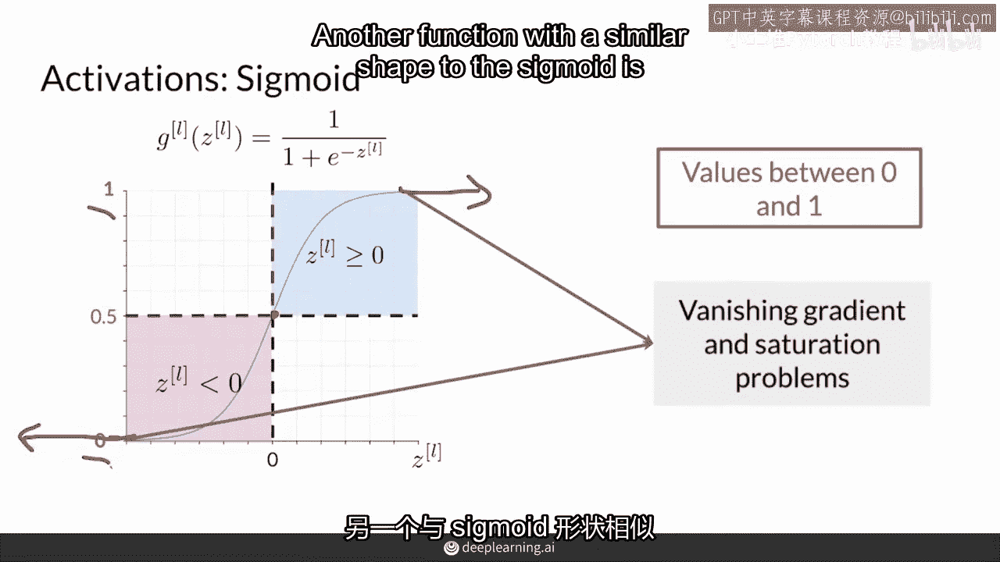

因此，Sigmoid 函数现在较少用于神经网络的隐藏层。

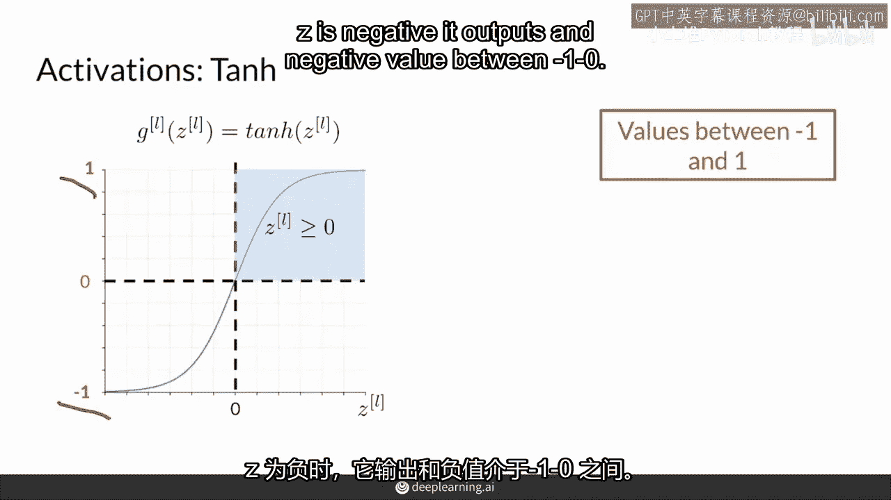

## 4. Tanh（双曲正切）函数 🔄

与 Sigmoid 函数形状相似但输出范围不同的是 Tanh 函数。它解决了 Sigmoid 函数非零中心化的问题。

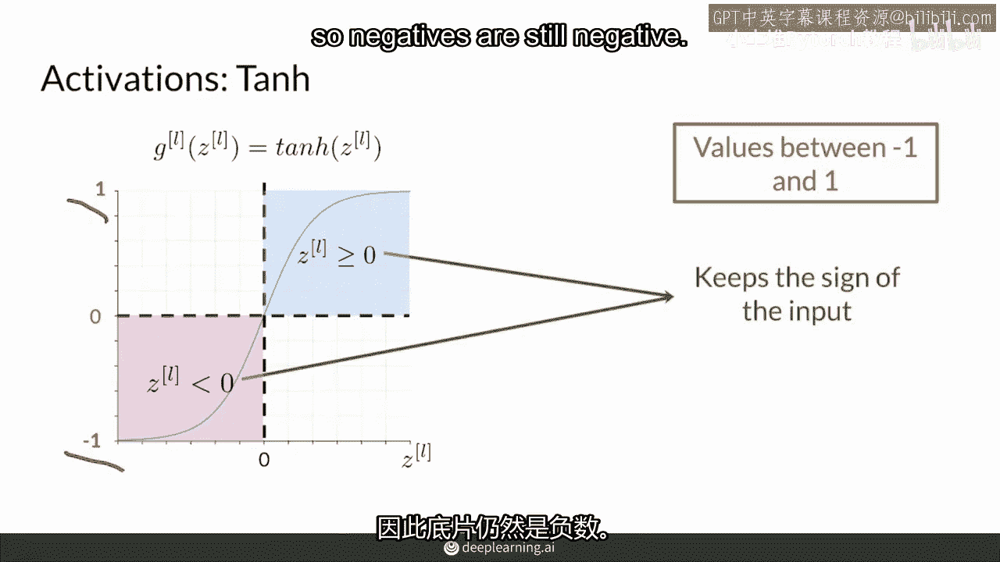

Tanh 函数同样是一个“S”形曲线，但它将输入“挤压”到 (-1, 1) 区间内。其数学公式为：

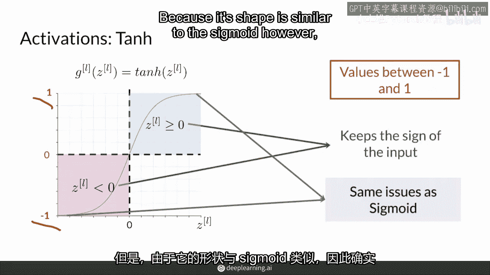

**g(z) = (e^{z} - e^{-z}) / (e^{z} + e^{-z})**

Tanh 函数是零中心化的，即当输入为 0 时，输出也为 0。这使得其输出均值更接近 0，有助于加速收敛。

以下是 Tanh 函数的特点：

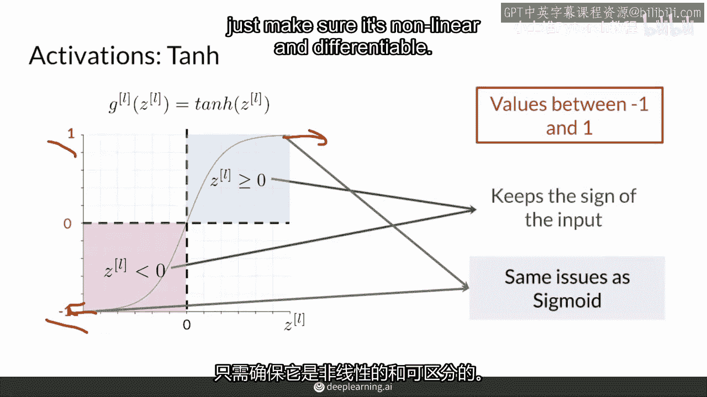

*   **零中心化**：输出范围在 -1 到 1 之间，改善了梯度流动。
*   **与 Sigmoid 的关系**：`tanh(z) = 2 * sigmoid(2z) - 1`。
*   **同样存在梯度消失**：和 Sigmoid 一样，在 `|z|` 很大时，Tanh 函数的导数也会趋近于 0，导致梯度消失问题。

尽管存在梯度消失问题，Tanh 在循环神经网络（RNN）等模型中仍有应用。

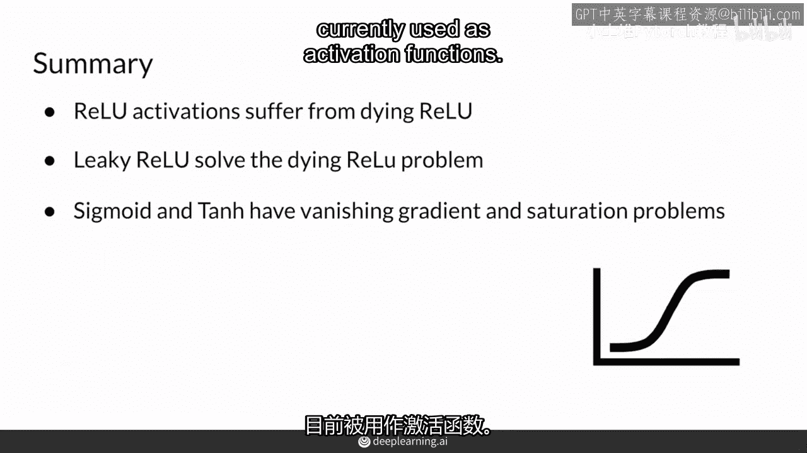

## 总结 🎯

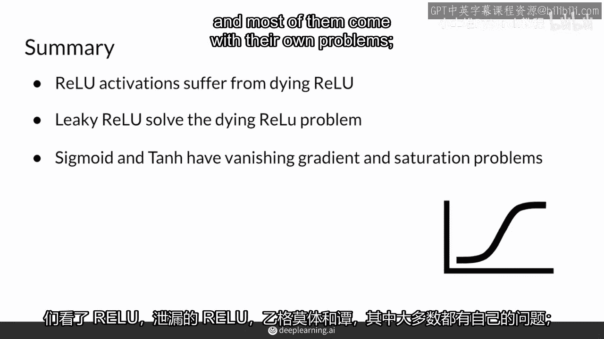

本节课我们一起学习了深度学习中四种常见的激活函数：

1.  **ReLU**：计算高效，能缓解梯度消失，但存在“神经元死亡”风险。
2.  **Leaky ReLU**：ReLU 的改进版，通过引入一个小的负斜率来解决“死亡”问题。
3.  **Sigmoid**：将输出压缩到 (0,1)，常用于输出层表示概率，但易导致梯度消失和训练缓慢。
4.  **Tanh**：将输出压缩到 (-1,1)，是零中心化的，但同样面临梯度消失的挑战。

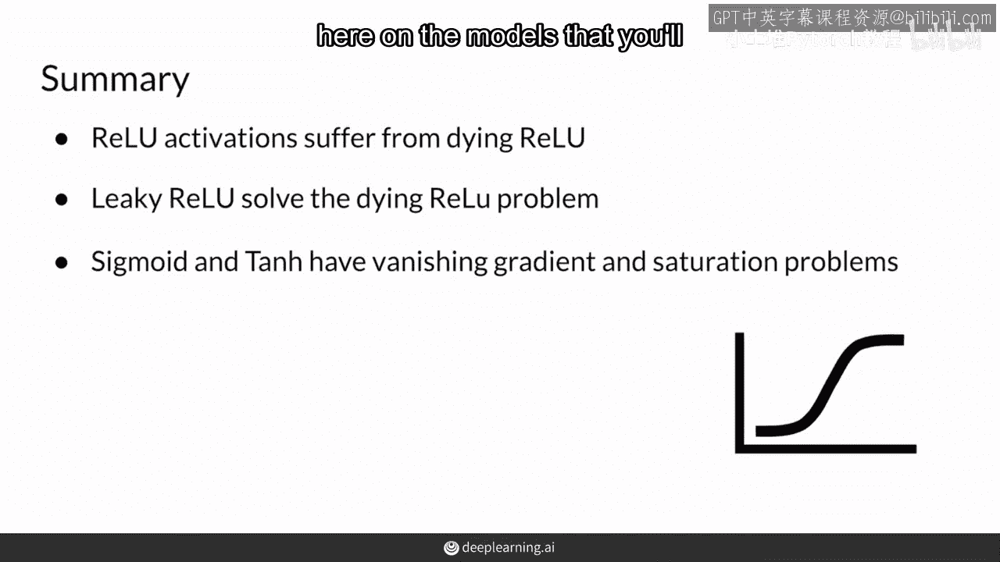

每种激活函数都有其适用的场景和局限性。在实际构建神经网络（包括后续将要学习的 GAN）时，ReLU 及其变体通常是隐藏层的首选，而 Sigmoid 或 Tanh 可能用于特定的输出层。理解这些函数的特性，将帮助你更好地设计和调试神经网络模型。