# 14：14. 批归一化过程 📊

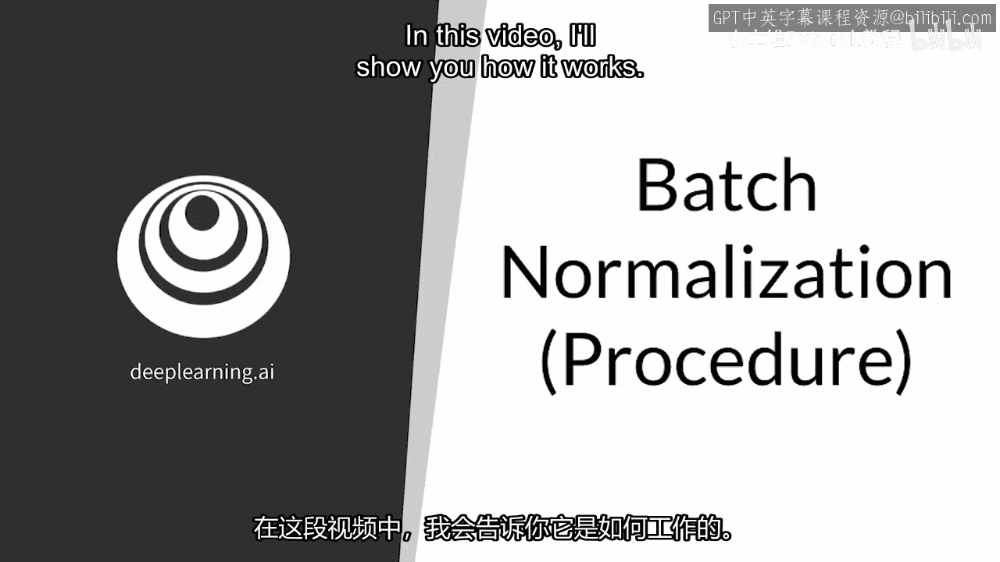

在本节课中，我们将学习批归一化的核心概念与工作原理。批归一化是深度学习中一项重要的技术，它通过规范化神经网络中间层的激活值分布，来加速训练并提升模型稳定性。我们将从零开始理解其计算过程，并了解其在训练与测试阶段的差异。

## 批归一化概述

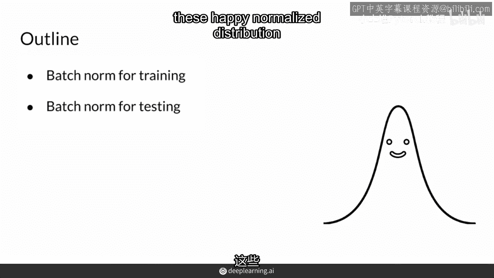

批归一化听起来可能有些复杂，但其过程相当直接。虽然你可以从零开始实现它，但像PyTorch这样的深度学习框架已经内置了此功能。本教程将向你展示它是如何工作的。

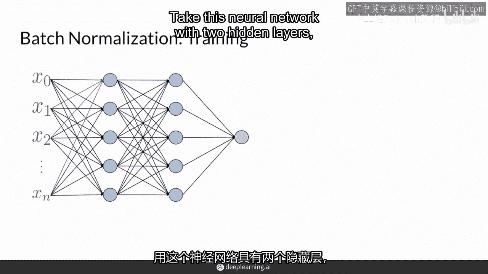

你将了解批归一化操作，以及它在训练和测试期间的不同之处。批归一化的目标是创建归一化的值分布。

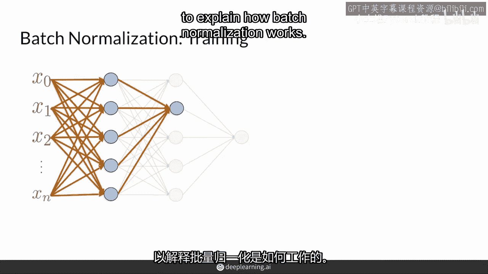

## 批归一化的工作流程

假设我们有一个包含两个隐藏层的神经网络。它有多个输入和一个输出。为了解释批归一化如何工作，我们将聚焦于其中一个内部的隐藏层。

从输入开始，这里的 `Z` 来自前一层的所有节点。批归一化会考虑批次中每个样本的张量 `Z_i`。例如，你可以有一个批次大小为32，那么你就会有32个 `Z` 值。需要提醒的是，这里的下标 `i` 表示这是该层中的第 `i` 个节点，而上标 `l` 表示这是第 `l` 层。

因此，批归一化会取一个批次（例如32个样本）的 `Z` 值，并希望将其归一化，使其均值为0，标准差为1。

以下是实现这一目标的具体步骤：

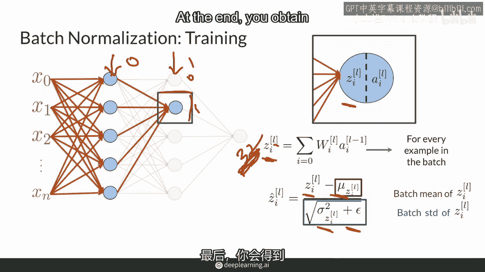

1.  **计算批次均值与方差**：首先，计算该批次数据的均值 `μ` 和方差 `σ²`。
    *   均值公式：`μ = (1/m) * Σ Z_i`，其中 `m` 是批次大小。
    *   方差公式：`σ² = (1/m) * Σ (Z_i - μ)²`

2.  **归一化**：然后，使用计算出的均值和方差对每个 `Z` 值进行归一化，得到 `Ẑ`。
    *   归一化公式：`Ẑ = (Z - μ) / √(σ² + ε)`
    *   这里添加了一个极小的常数 `ε`（例如 `1e-5`），是为了防止分母为零，确保数值稳定性。

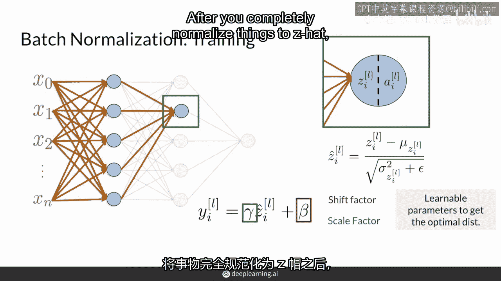

## 引入可学习参数

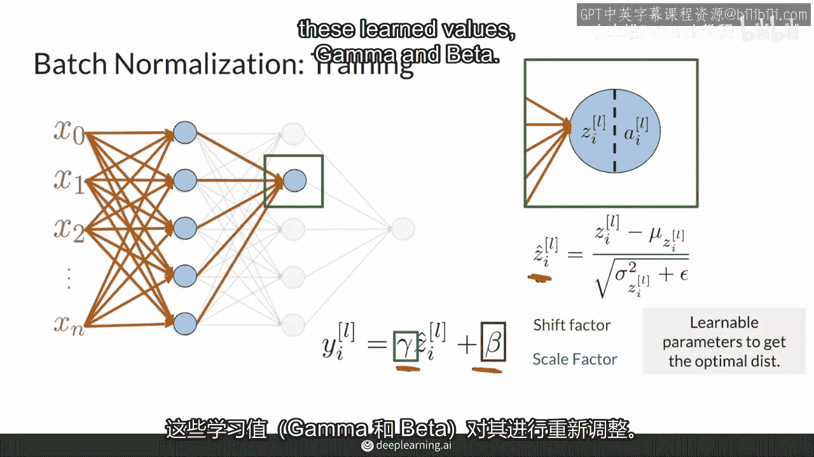

在得到归一化值 `Ẑ` 之后，批归一化层会引入两个可学习的参数：缩放因子 `γ` 和偏移量 `β`。这些参数在训练过程中通过梯度下降进行学习。

其目的是确保网络能将 `Z` 值归一化为对当前任务最优的分布，而不是强制其始终保持均值为0、标准差为1。这是批归一化与简单的输入归一化的主要区别。

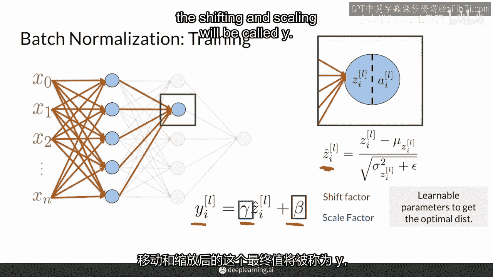

以下是应用可学习参数的步骤：

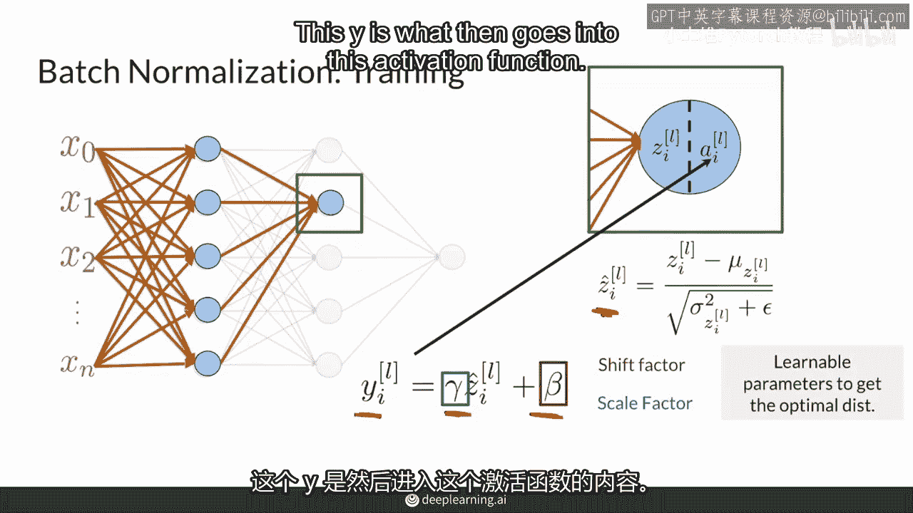

1.  **缩放与偏移**：使用学习到的 `γ` 和 `β` 对归一化后的值 `Ẑ` 进行缩放和偏移。
    *   最终输出公式：`Y = γ * Ẑ + β`

这个经过缩放和偏移后的值 `Y`，随后会被送入激活函数（如ReLU），作为下一层的输入。

## 训练与测试模式的差异

在训练和测试期间，批归一化的行为有所不同，这是为了保证模型的稳定性。

**在训练时**，我们使用当前小批次的统计数据（均值和方差）进行归一化。这带来了两个好处：一是减少了计算量，无需等待整个数据集；二是引入了轻微噪声，可能起到正则化的效果。

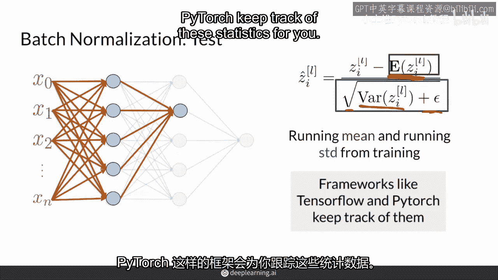

**在测试/推理时**，我们不再使用单个批次的统计数据。因为同一个样本在不同批次中，会因批次统计量的不同而被归一化成不同的值，导致预测不稳定。

为了解决这个问题，在测试时我们使用的是在**整个训练集**上计算得到的**运行均值**和**运行方差**。这些统计量在训练过程中通过移动平均的方式不断更新，训练结束后便固定下来。测试时的计算过程与训练时类似，只是替换了使用的统计量：
*   测试时归一化公式：`Ẑ_test = (Z - μ_running) / √(σ²_running + ε)`

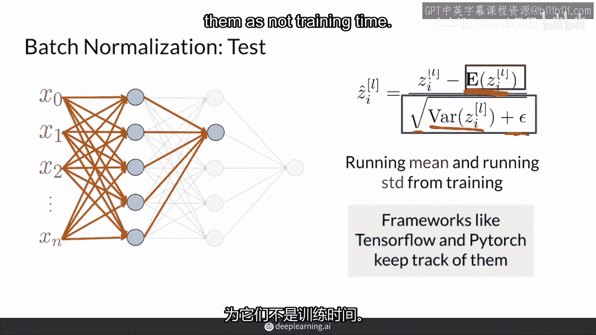

你无需过度担心这些统计量的具体维护细节。像TensorFlow和PyTorch这样的框架会自动跟踪这些运行统计量。你只需要创建一个批归一化层，当模型切换到评估模式（`model.eval()`）时，框架会自动使用运行统计量。

## 核心要点总结

本节课我们一起学习了批归一化的完整过程。我们来总结一下关键点：

*   **与标准归一化的区别**：批归一化在训练时使用每个小批次的统计量，而非整个数据集，这提升了训练效率。
*   **引入灵活性**：通过可学习的参数 `γ` 和 `β`，网络可以学习最适合当前任务的分布，而不被强制约束为零均值和单位方差。
*   **保证预测稳定性**：在测试时，使用训练阶段积累的运行统计量，确保了相同输入在不同时间会得到相同的输出。
*   **框架支持**：现代深度学习框架完整实现了训练和测试时的整个流程，开发者只需正确调用即可。

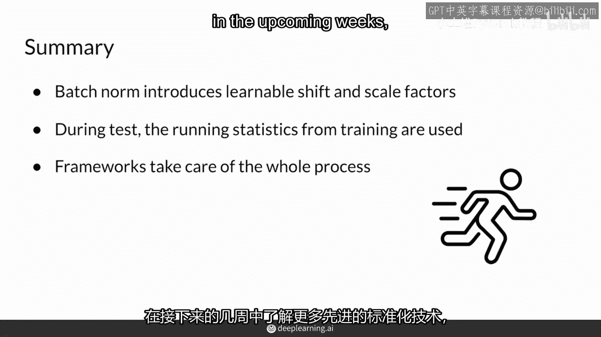

批归一化是构建稳定、高效深度学习模型的重要工具，理解其原理将帮助你在构建GAN或其他复杂模型时更好地应用它。在接下来的课程中，我们还将接触到更多先进的归一化技术。