# 18：18. 转置卷积 🧩

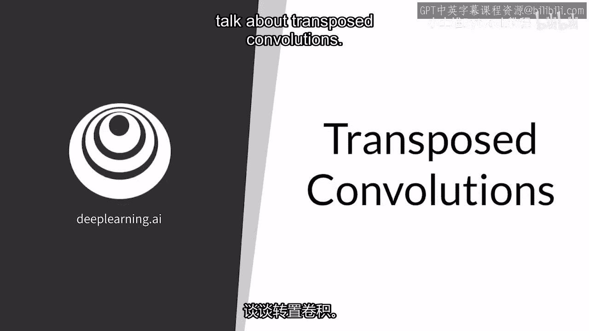

在本节课中，我们将学习转置卷积。这是一种用于上采样的技术，它使用可学习的滤波器来扩大输入数据的尺寸。我们将了解其工作原理，并探讨它可能带来的一个特殊问题。

---

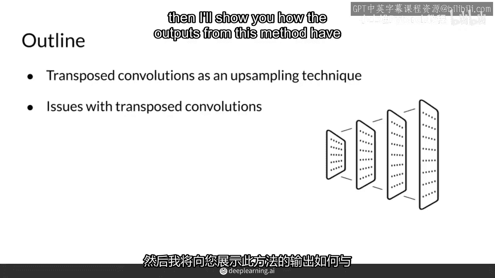

## 概述

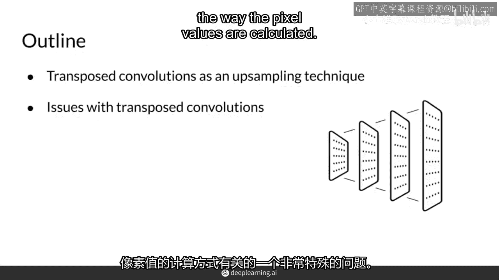

你已经熟悉了卷积、池化和上采样层。本节我们将介绍转置卷积。转置卷积是一种上采样方法，它通过一个可学习的滤波器来放大输入尺寸。然而，这种方法的输出可能会产生一个被称为“棋盘格问题”的特殊现象。

---

## 转置卷积的工作原理

上一节我们介绍了转置卷积的基本概念。本节中我们来看看它的具体计算过程。

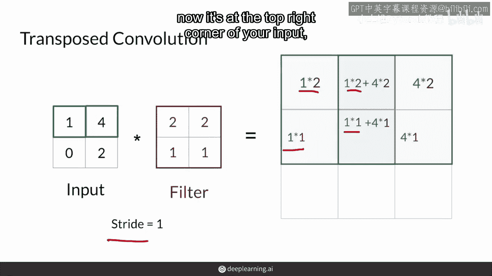

转置卷积的操作程序与常规卷积非常相似。以下是一个使用2x2输入、2x2滤波器、步幅为1，上采样到3x3输出的示例过程。

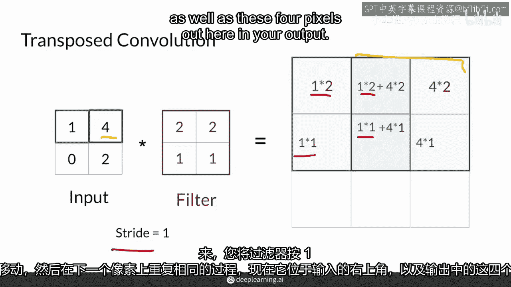

以下是计算步骤的分解：

1.  从输入的左上角像素开始，将其与滤波器中的2x2权重值相乘。
2.  将相乘的结果保存在输出特征图左上角的2x2区域中。
3.  将滤波器向右移动一步（步幅为1），在下一个像素上重复相同的相乘操作。
4.  将滤波器向下移动一步，在下一个像素上重复操作。
5.  在整个输入上重复此过程，当输出位置重叠时，将新的乘积结果与之前的结果相加。

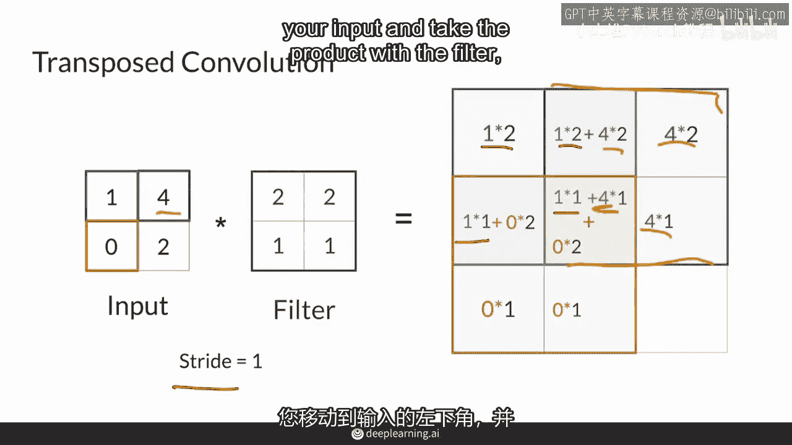

通过这样的计算，输出中的某些像素值会受到输入中多个值的影响，而有些则只受单个值影响。

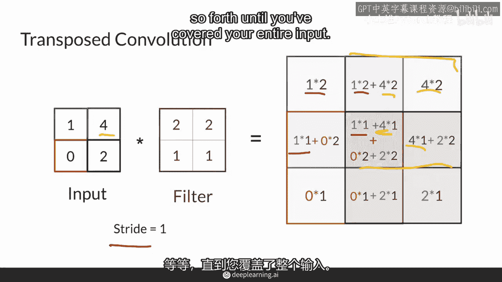

---

## 转置卷积的问题

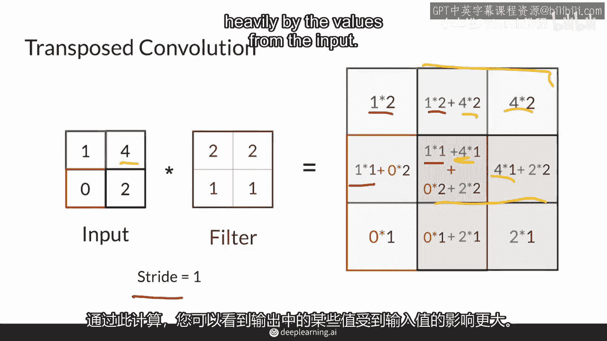

了解了转置卷积如何工作后，我们来看看它存在的一个问题。

转置卷积的一个核心问题是输出像素受输入影响的程度不均匀。例如，输出特征图的中心像素被访问了四次，并受到所有输入像素的影响。而输出特征图的角落像素可能只被访问一次，仅受单个输入像素影响。

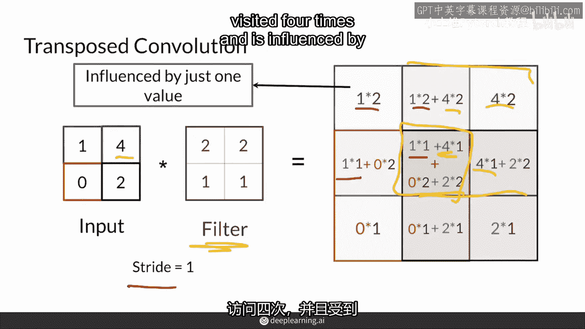

这种不均匀的影响会导致输出出现一种类似棋盘格的图案，这被称为**棋盘格问题**。以下图片展示了一个转置卷积的真实输出，其中放大的圆圈区域清晰地显示了这种棋盘格效应。

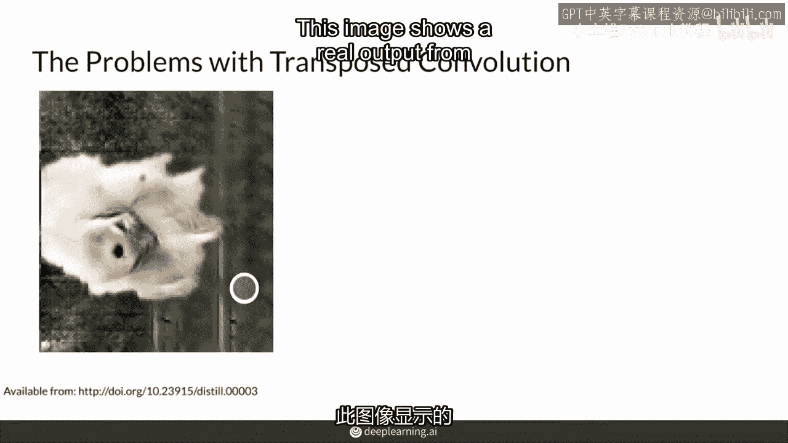

---

## 总结与现状

本节课中我们一起学习了转置卷积。

总结一下，转置卷积是一种具有可学习参数的上采样方法。它通过类似卷积反向过程的方式放大特征图尺寸。然而，其计算方式会导致输出出现**棋盘格问题**，即像素值分布不均匀，形成网格状伪影。

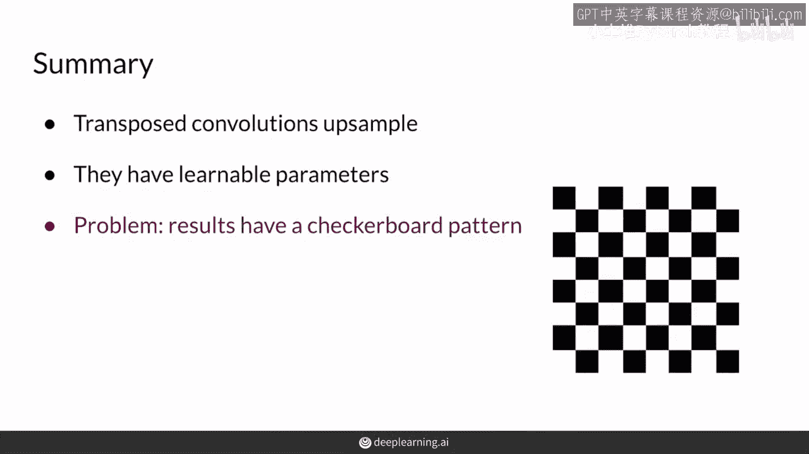

尽管存在这个问题，转置卷积在研究社区中仍然相当流行。不过，目前一种更流行的技术是**先进行上采样（如双线性插值），再进行常规卷积**，这种方法能有效避免棋盘格问题。