# 21：21. BCE损失的问题 🧠

在本节课中，我们将要学习在生成对抗网络中，使用二元交叉熵损失函数时可能遇到的问题。我们将回顾BCE损失函数的形式，理解它对生成器和判别器目标的影响，并重点分析由此可能引发的梯度消失问题。

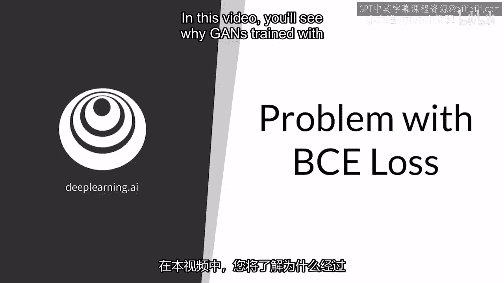

---

## 📊 BCE损失函数回顾

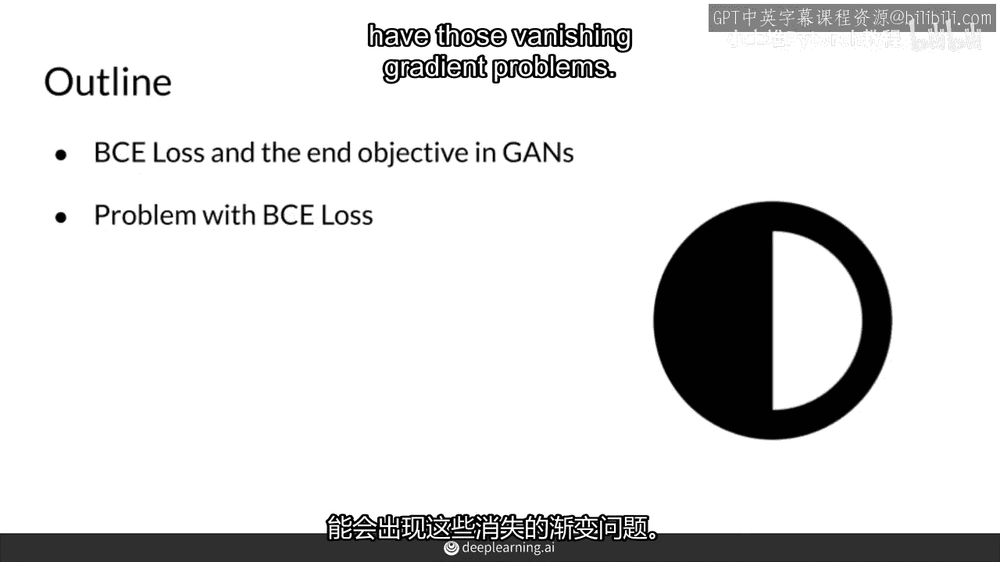

上一节我们介绍了GAN的基本概念，本节中我们来看看其传统训练中使用的损失函数。

二元交叉熵损失函数是GAN训练中常用的损失函数。它衡量的是分类器对真实数据和生成数据错误分类的平均成本。

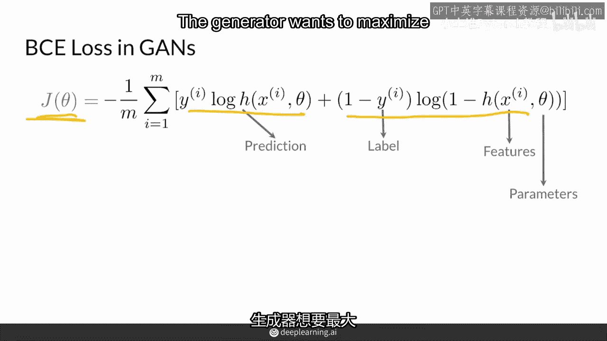

以下是BCE损失函数的标准形式：

**公式：**
```
L(D, G) = E[log(D(x))] + E[log(1 - D(G(z)))]
```
其中：
*   `D(x)` 是判别器对真实数据 `x` 的预测概率。
*   `D(G(z))` 是判别器对生成数据 `G(z)` 的预测概率。
*   `E` 表示期望值。

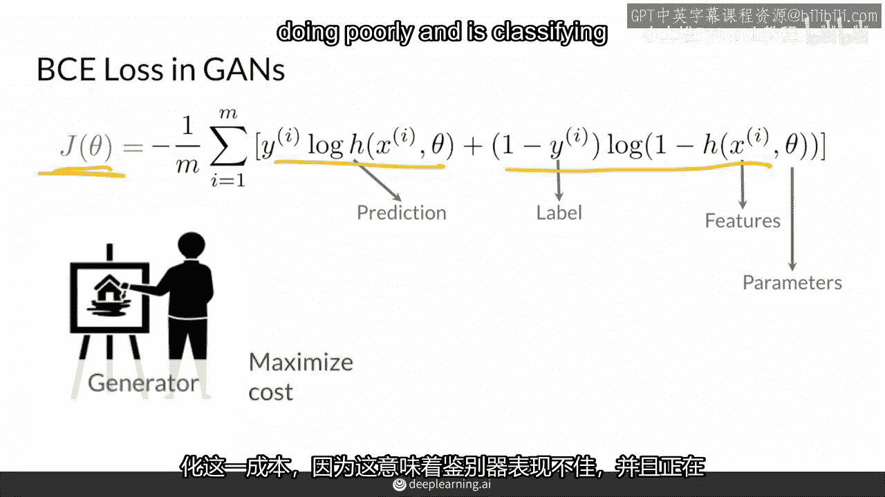

这个公式包含两项：
1.  第一项 `E[log(D(x))]` 对应**真实数据**。判别器希望最大化此项，即正确地将真实数据识别为“真”。
2.  第二项 `E[log(1 - D(G(z)))]` 对应**生成数据**。判别器希望最小化此项（即让 `D(G(z))` 接近0），从而正确地将生成数据识别为“假”。

对于生成器 `G` 而言，它的目标恰恰相反：它希望**最大化**判别器对生成数据的误判概率 `D(G(z))`，即最小化 `E[log(1 - D(G(z)))]`。这种生成器与判别器之间的对抗性目标，构成了一个**极小极大博弈**。

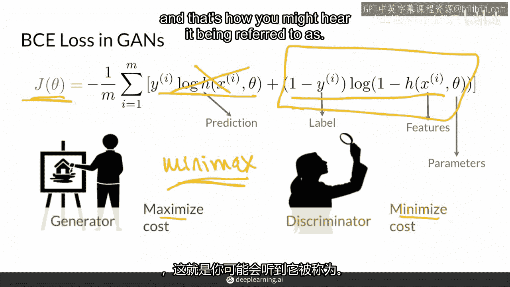

---

## ⚖️ 极小极大博弈与训练目标

通过上述极小极大博弈，GAN的宏观训练目标得以实现：让生成数据 `G(z)` 的分布 `P_g` 无限接近真实数据 `x` 的分布 `P_data`。

**核心目标公式：**
```
min_G max_D L(D, G) ≈ min_G divergence(P_data || P_g)
```
这个博弈过程近似于在最小化真实分布与生成分布之间的某种差异。

在训练过程中：
*   **判别器** `D` 会自然地试图最大化自身区分真假的能力，拉开 `P_data` 和 `P_g` 的距离。
*   **生成器** `G` 则试图学习并调整 `P_g`，使其向 `P_data` 靠拢，以“欺骗”判别器。

---

## 🎭 判别器与生成器的角色差异

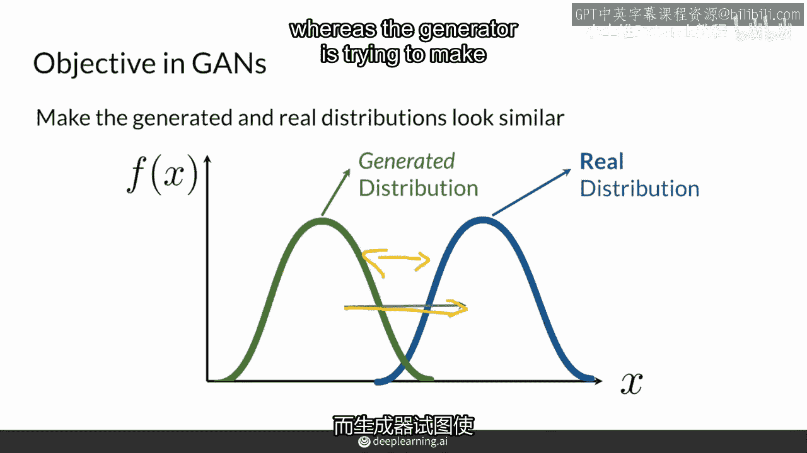

然而，让我们退一步，重新审视生成器和判别器的角色差异。

判别器的任务相对简单：它只需要输出一个介于0到1之间的标量值，表示输入为“真”的概率。

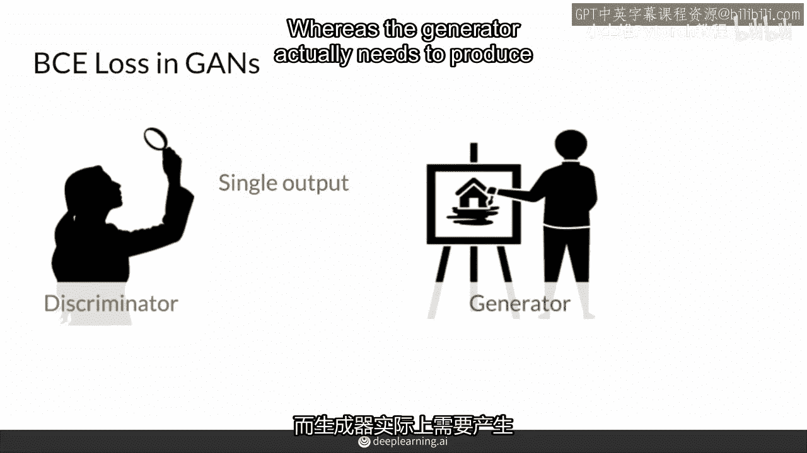

生成器的任务则复杂得多：它需要将一个随机噪声向量 `z` 映射为一个高维、结构化的输出（例如一张图片），这个输出需要包含丰富的特征以成功欺骗判别器。

**代码示例（角色差异）：**
```python
# 判别器输出：一个标量概率
discriminator_output = D(input_image)  # 例如：tensor([0.85])

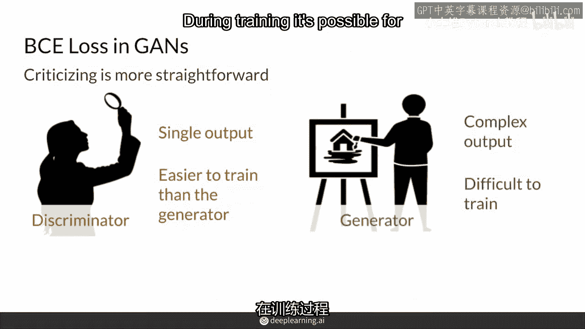

# 生成器输出：一张完整的图片（高维张量）
generated_image = G(random_noise)  # 例如：tensor of shape [3, 256, 256]
```

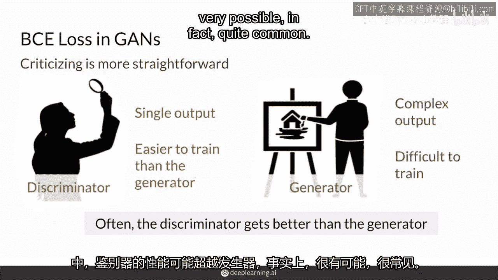

这好比在博物馆鉴赏画作（判别器）与创作一幅杰作（生成器）。通常，前者比后者更容易。因此，在训练过程中，判别器的学习速度往往快于生成器，这是一个非常普遍的现象。

---

## 🧨 梯度消失问题

在训练初期，判别器能力不强，对真假数据的判断存在不确定性，其预测概率 `D(G(z))` 不会极端接近0或1。此时，它能为生成器提供有效的、非零的梯度反馈，指导生成器改进。

但是，随着判别器快速变得强大，它能非常清晰地区分真假分布。对于生成的数据，判别器的预测 `D(G(z))` 会趋近于0。让我们看看这如何影响生成器的梯度。

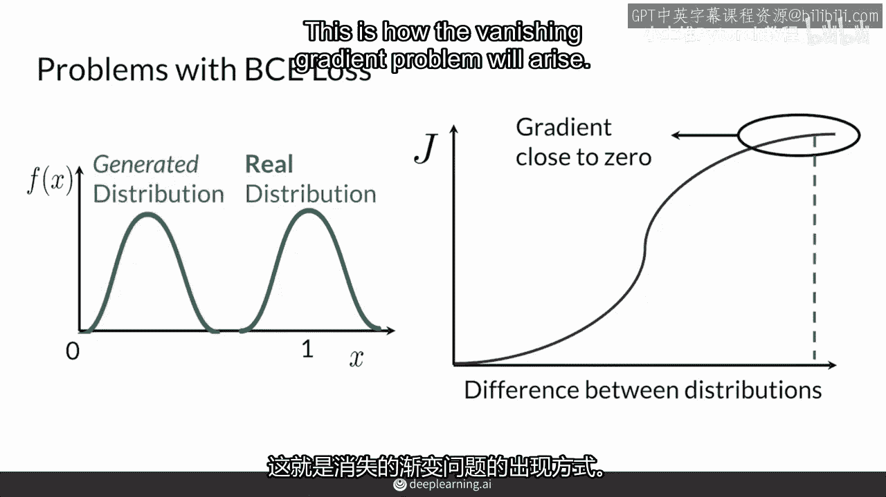

生成器的损失函数是 `E[log(1 - D(G(z)))]`。当 `D(G(z)) → 0` 时，`log(1 - D(G(z))) → log(1) = 0`。这个损失函数在 `D(G(z))` 接近0的区域会变得非常平坦。

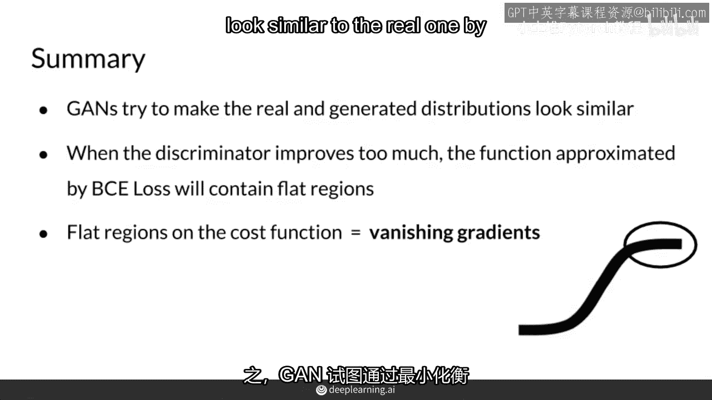

**梯度计算：**
生成器的梯度依赖于损失函数对 `D(G(z))` 的导数：
```
∂/∂D(G(z)) [log(1 - D(G(z)))] = -1 / (1 - D(G(z)))
```
当 `D(G(z)) → 0` 时，梯度趋近于 `-1`，看似没问题。但关键在于，当判别器非常确信生成数据为假时，它对生成器参数的梯度 `∂D(G(z))/∂G` 会变得非常小（接近0）。这导致最终传回生成器的总梯度 `∂L/∂G` 变得极其微弱，甚至消失。

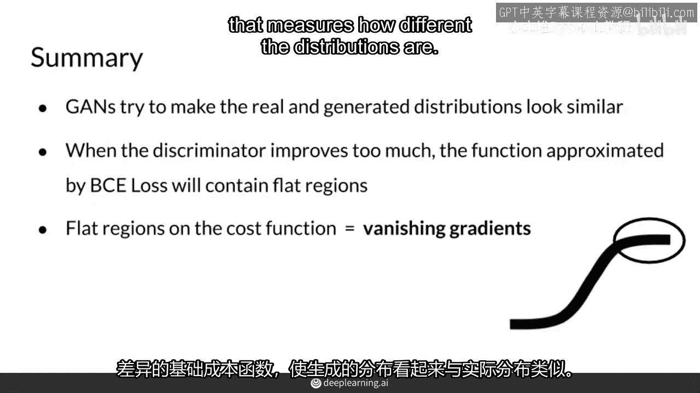

**结果就是：**
*   判别器给出非常自信的判断：“真数据=1，假数据=0”。
*   生成器因无法获得有效的梯度更新而停止学习，陷入“梯度消失”的困境。

---

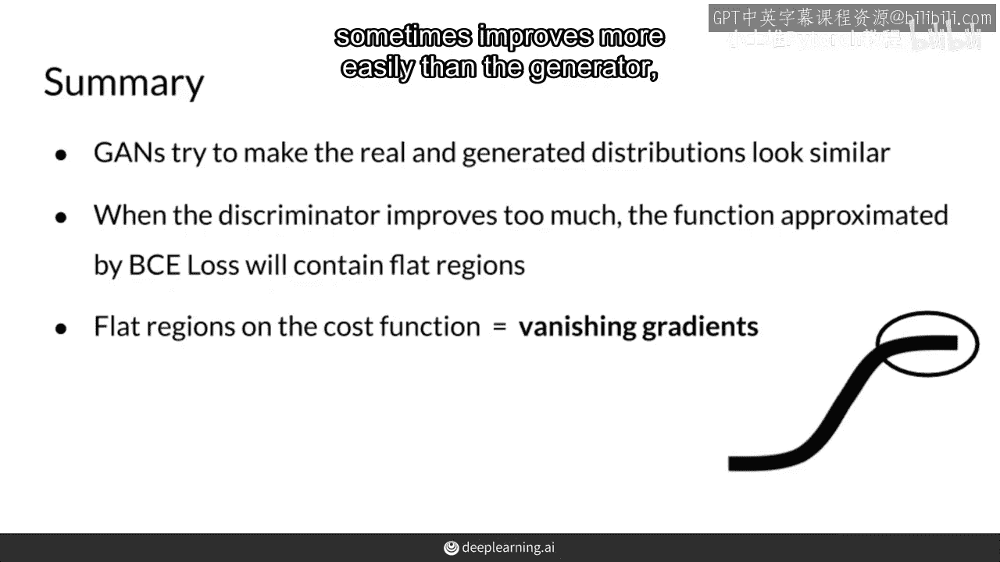

## 📝 总结

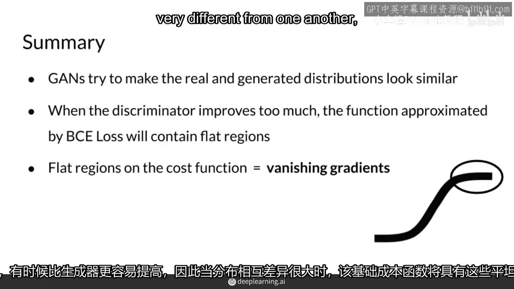

本节课中我们一起学习了使用BCE损失训练GAN时的一个核心问题。

1.  **目标回顾**：GAN通过极小极大博弈，旨在让生成分布 `P_g` 逼近真实分布 `P_data`。
2.  **角色差异**：判别器的学习任务通常比生成器更简单，导致其能力可能过早地强于生成器。
3.  **问题根源**：当判别器过于强大时，它对生成数据的预测概率 `D(G(z))` 会饱和（接近0），导致生成器损失函数的梯度区域变得平坦。
4.  **最终后果**：生成器无法获得有意义的梯度更新，训练停滞，这就是**梯度消失问题**。这解释了为什么传统的BCE损失并非训练GAN的最佳选择，并可能导致模式崩溃等问题。

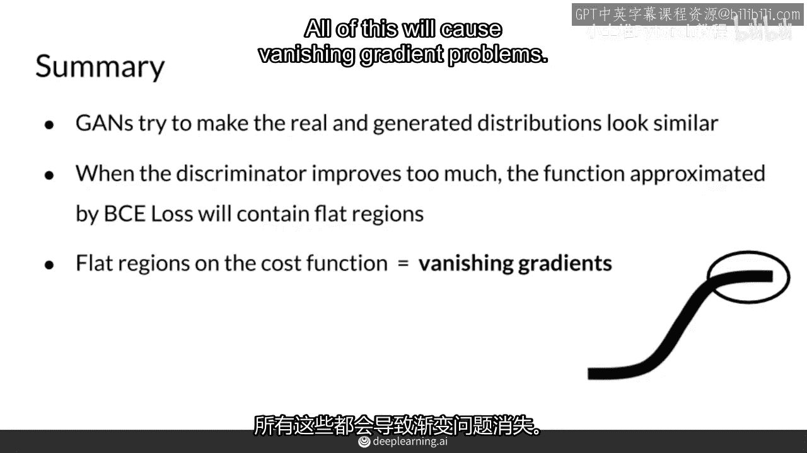

在后续课程中，我们将探讨如何改进损失函数（例如使用Wasserstein距离）来缓解这一问题。