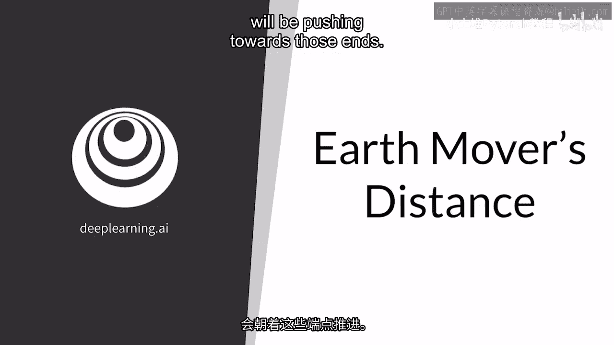
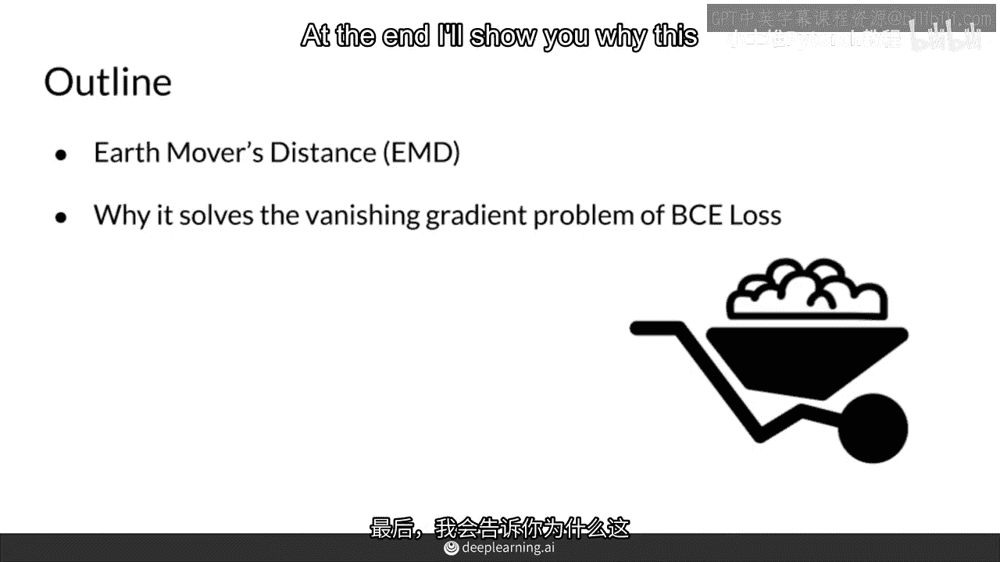
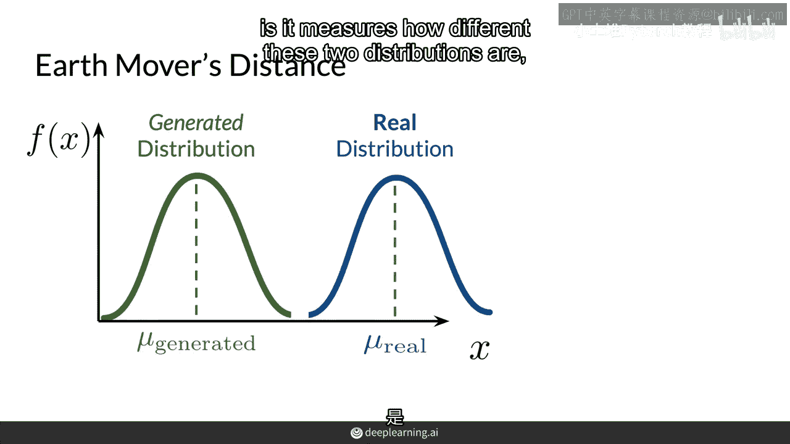
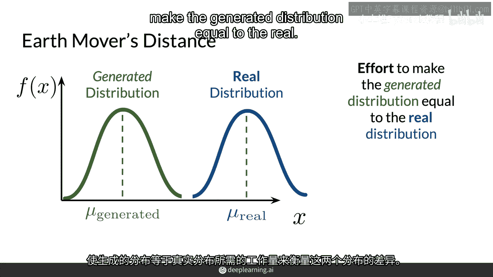
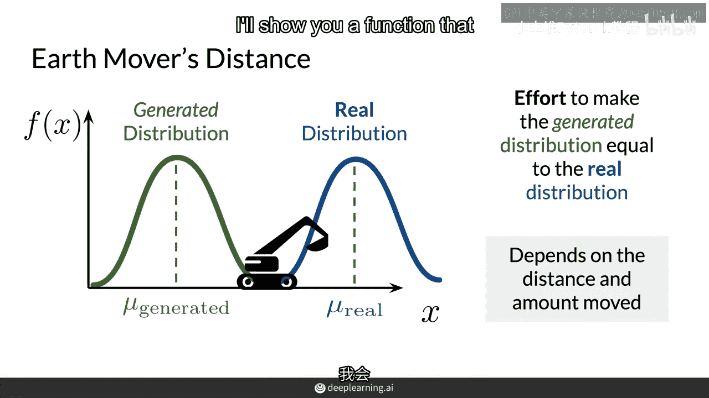
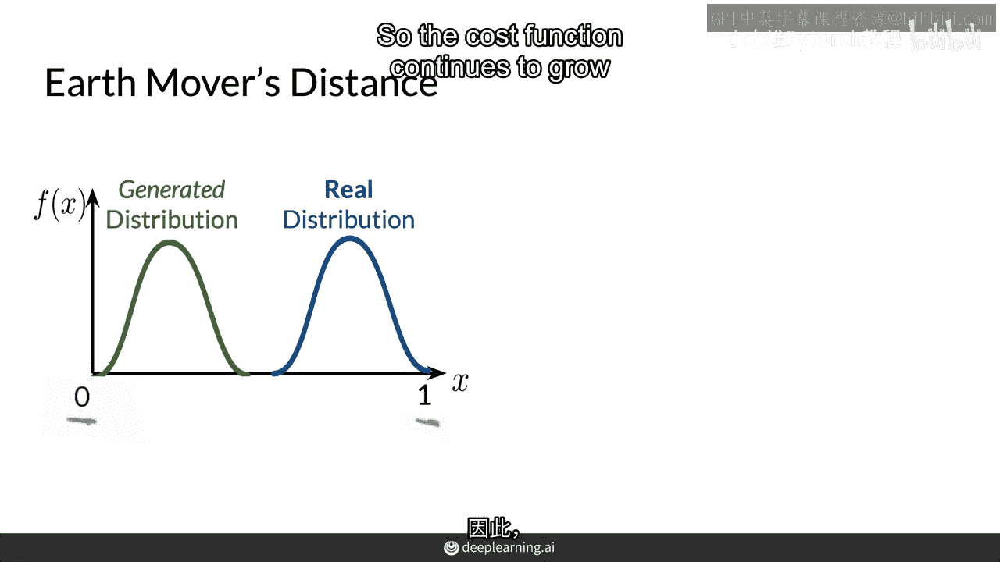
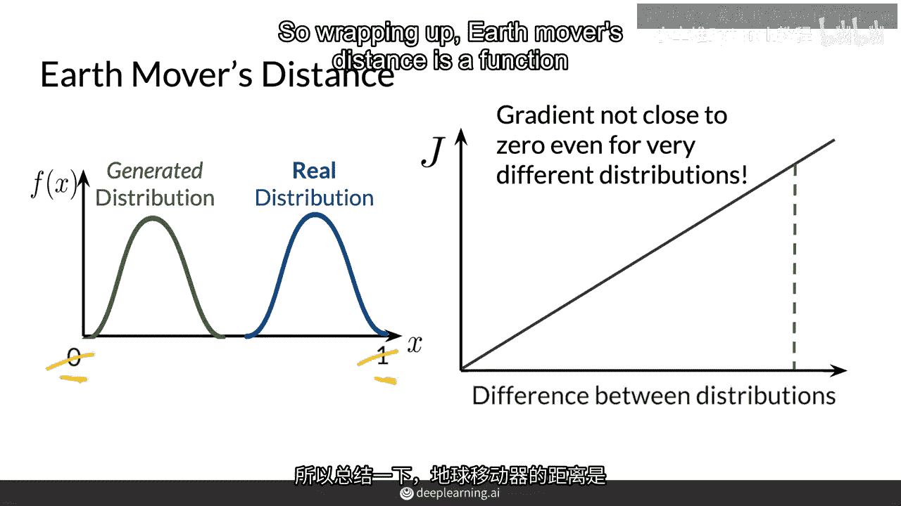
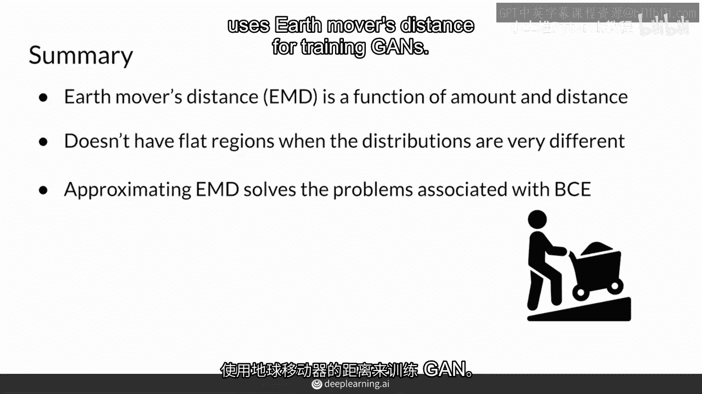

# 22：22. 地球移动者距离 🚜

在本节课中，我们将学习一种在训练生成对抗网络（GAN）时常用的、不同于二元交叉熵（BCE）损失的成本函数——地球移动者距离（Earth Mover‘s Distance）。我们将了解它的直观含义、优势，以及它如何帮助解决GAN训练中的常见问题。

上一节我们介绍了使用BCE损失训练GAN时遇到的问题。本节中，我们来看看一种替代方案。

## 什么是地球移动者距离？

地球移动者距离是一种用于测量两个概率分布之间差异的度量。假设我们有一个生成的分布和一个真实的分布，它们的方差相同但均值不同（例如，都呈正态分布）。地球移动者距离衡量的就是这两个分布之间的差异。

具体而言，它通过估计“将生成的分布调整为真实分布所需付出的努力程度”来量化这种差异。

我们可以做一个直观的类比：将生成的分布想象成一堆泥土，将真实的分布想象成目标形状。那么，地球移动者距离就相当于移动并塑造这堆泥土，使其完全匹配目标形状的难度和工作量。这个“工作量”函数取决于两个因素：泥土需要移动的**距离**和需要移动的泥土**数量**。

## BCE损失的问题与EMD的优势

在上一部分，我们了解了EMD的直观概念。现在，我们来对比一下它和BCE损失的关键区别。

BCE损失的核心问题在于，随着判别器（Discriminator）性能的提升，它对真实样本和生成样本的判别输出会趋向于两个极端值（1和0）。这导致生成器（Generator）获得的梯度反馈变得非常微弱，从而引发**梯度消失**问题，使得生成器停止学习。同时，这也容易导致**模式崩溃**，即生成器只产生有限的几种样本。

然而，地球移动者距离不存在这样的上限。它的值可以随着两个分布差异的增大而持续增长。

这意味着，无论两个分布相距多远，地球移动者距离提供的梯度都不会趋近于零。因此，使用基于EMD的损失函数训练的GAN，不易受到梯度消失和模式崩溃问题的影响。

## 总结与回顾

本节课中，我们一起学习了地球移动者距离。

以下是本节课的核心要点总结：
*   **定义**：地球移动者距离是衡量使一个分布等于另一个分布所需“工作量”的函数。这个工作量取决于移动的**距离**和**数量**。
*   **公式/代码概念**：虽然其数学形式（如Wasserstein距离）涉及最优传输理论，但其优化目标常通过以下对抗形式实现：
    `Loss = E[D(real)] - E[D(fake)]`
    其中需要判别器D满足Lipschitz连续性约束（例如通过梯度惩罚）。
*   **优势**：与BCE损失不同，EMD没有“饱和区”。即使判别器性能很好或分布差异很大，它也能提供有效的梯度，从而**缓解了梯度消失问题**，并**降低了模式崩溃的可能性**。

在接下来的课程中，我们将进一步探讨如何具体计算和应用这一距离来训练更稳定的GAN模型。

