# 24：24. 对Wasserstein判别器加条件 🧠

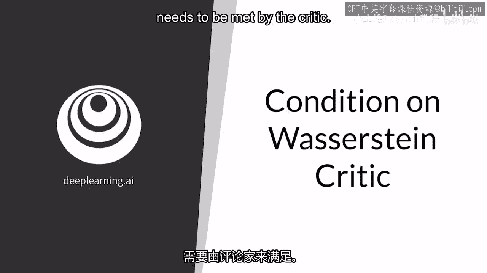

在本节课中，我们将要学习Wasserstein GAN（WGAN）中的一个核心概念：判别器（或称批评家）需要满足的Lipschitz连续性条件。我们将解释这个条件的含义、重要性以及如何直观地理解它。

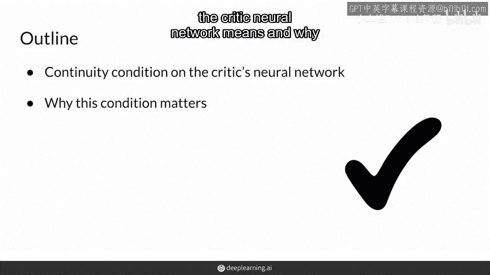

---

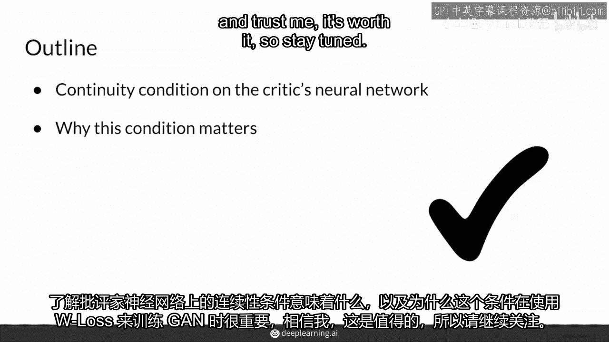

Wasserstein损失（或称W损失）解决了传统GAN面临的一些问题，例如模式崩溃和梯度消失。但要使WGAN效果良好，判别器的神经网络需要满足一个特殊的条件。

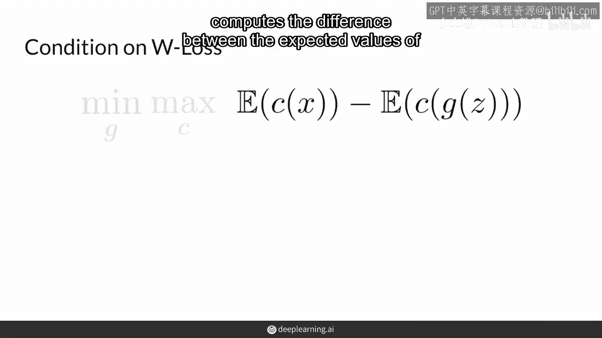

在这段视频中，你将看到对判别器神经网络提出的连续性条件意味着什么。

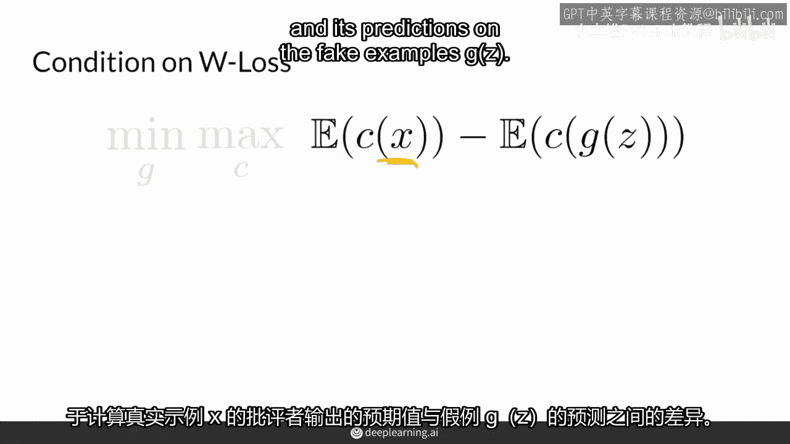

以及为什么当使用W损失训练GAN时，这个条件很重要。

所以请耐心等待，W损失是一个简单的表达式，它计算判别器对真实样本和生成样本输出期望值的差异。

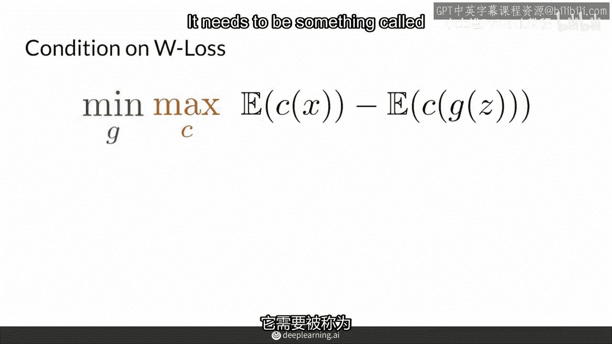

对于真实的例子`x`及其对假例子的预测。

生成器`G`试图最小化这个表达式，试图使生成的例子尽可能接近真实例子。而判别器希望最大化这个表达式，因为它希望区分真实和假例子，它希望距离尽可能大。然而，在使用WGAN训练时，判别器有一个特殊的条件。

它需要成为所谓的一阶Lipschitz连续函数，或简称一阶L连续函数。

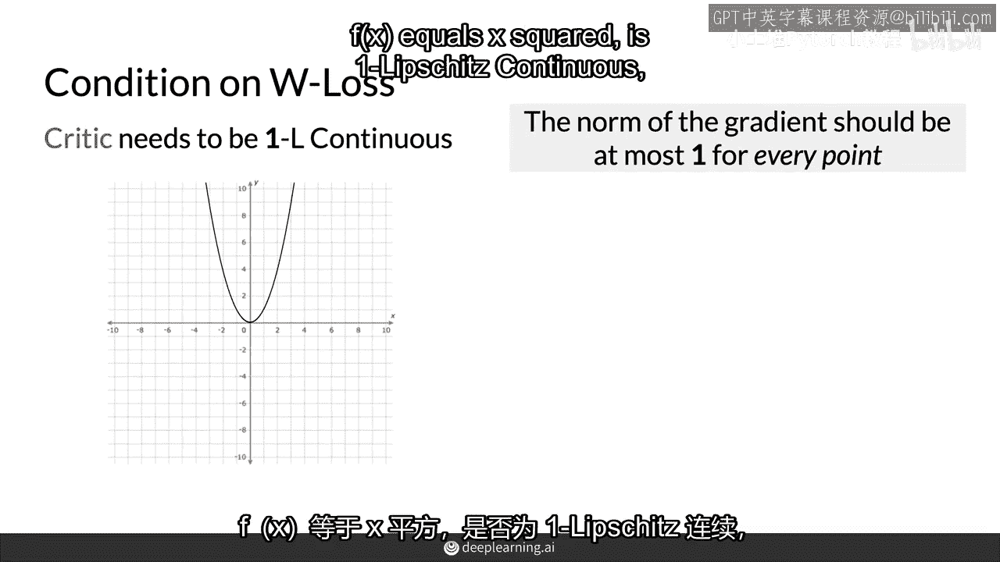

这个条件听起来比实际上更复杂。对于一个像判别器这样的函数（神经网络），要成为一个Lipschitz连续函数，它的梯度的范数需要小于或等于1。这意味着在任何一点，斜率不能大于1。在任何一点，它的梯度不能大于1。

要检查一个函数是否是Lipschitz连续的，你需要沿着这个函数的每一点走。

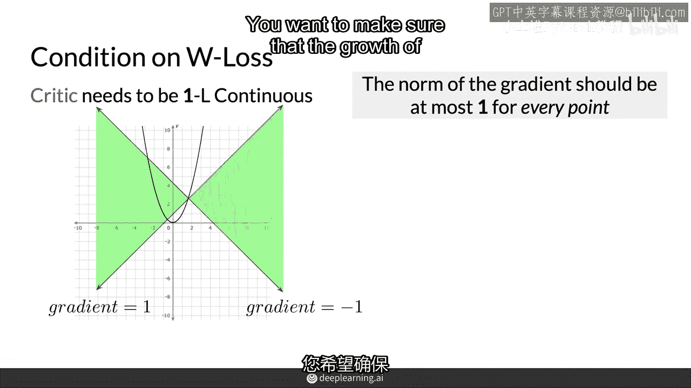

并确保斜率小于或等于1，或它的梯度小于或等于1。你可以做两件事：你可以实际上画两条线，一条在这个特定点的斜率正好是1，你在评估这个函数，并且有一个斜率是负的情况，一个你正在评估这个函数的情况。

并且你想要确保，这个函数的增长永远不会超出这些线之外，因为保持在这些线内意味着这个函数是线性增长的。

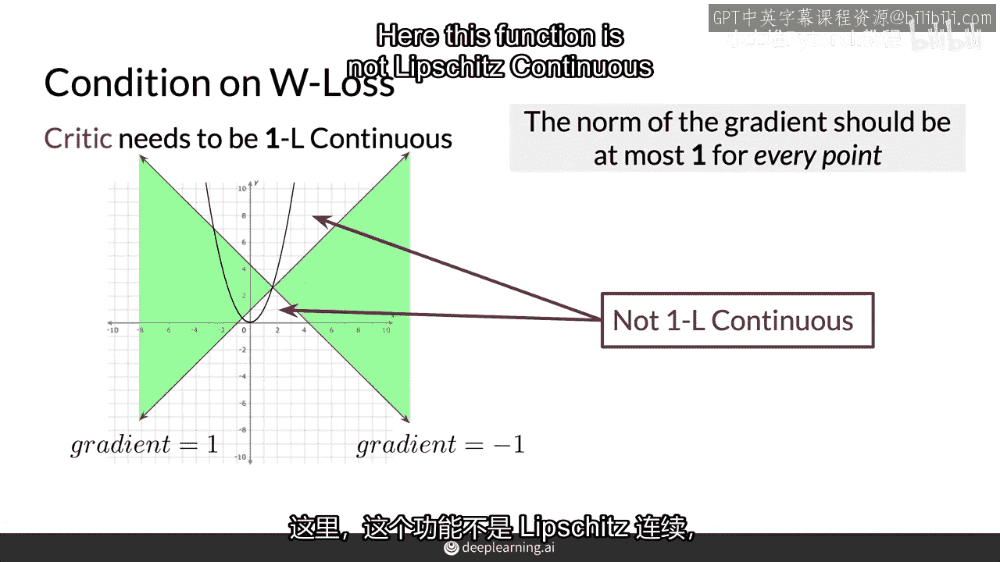

所以这里这个函数不是Lipschitz连续的，因为它在这些部分都超出了范围，它没有保持在这个绿色区域。

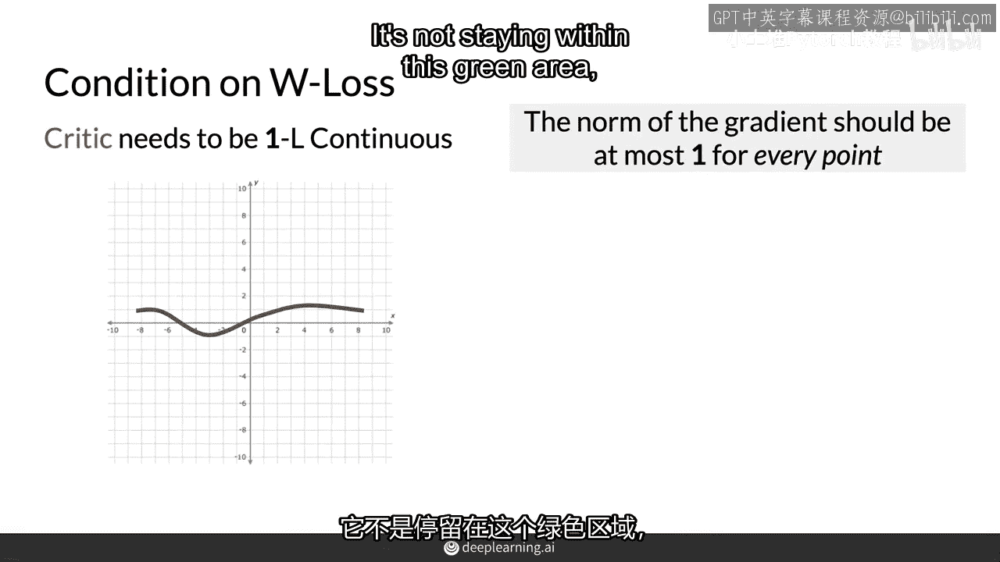

这表明它增长超过了线性。所以看另一个例子这里。

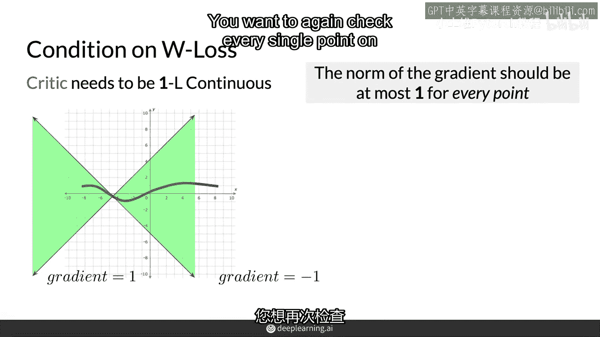

所以这是一个光滑曲线函数，您需要再次检查这个函数上的每个单个点，在您能够确定这是否是一个Lipschitz连续函数之前，在这里看起来有趣。

函数在这里看起来不错，它也在这里看起来不错，它看起来不错。所以让我们假设您检查了每个单个值，并且函数从不以超线性方式增长，因此这个函数是Lipschitz连续的。

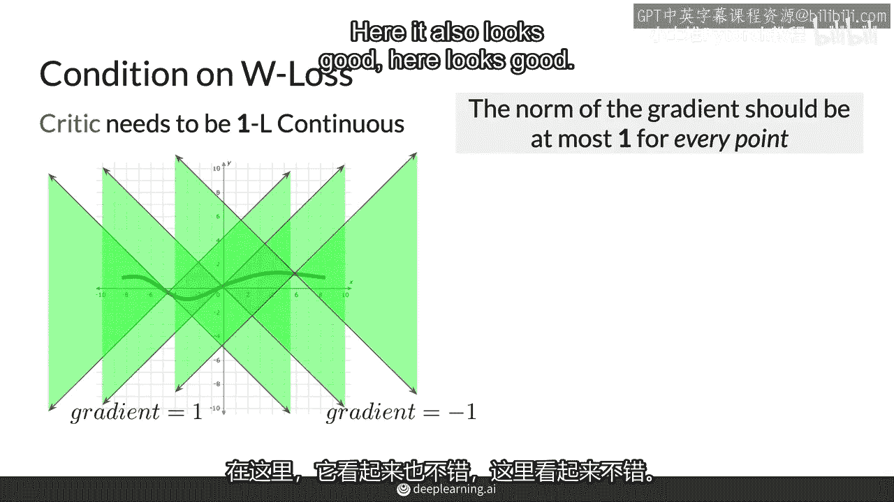

对于W损失的判别神经网络，这个条件很重要，因为这样可以确保损失函数不仅连续可导，而且不会增长过多，并在训练过程中保持一定的稳定性。这也是使底层的地球移动器距离（Earth Mover‘s Distance）有效的原因，这正是W损失所基于的。

这对于训练判别器和生成器的神经网络都是必需的。

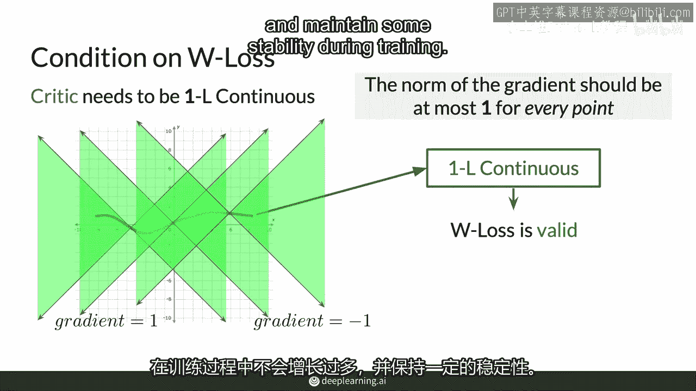

这也增加了稳定性，因为GAN学习的变化将被限制。因此，总结起来，在使用W损失训练的GAN中。

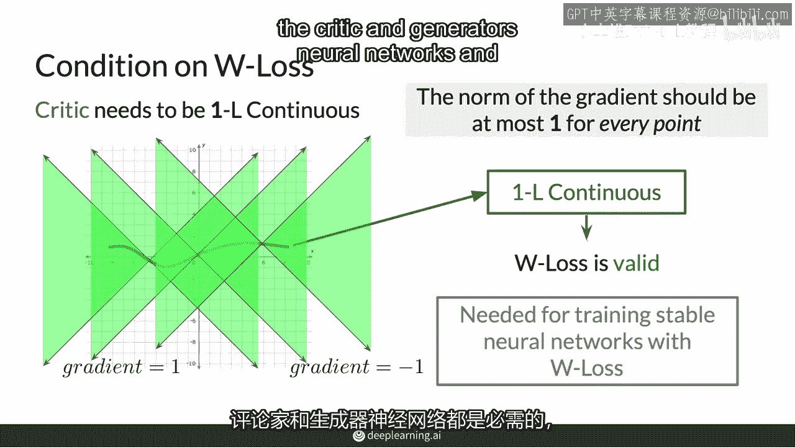

判别器需要是Lipschitz连续的，以便其底层的地球移动距离，在真实和假数据之间的比较，为了满足或尝试满足这个条件，需要进行有效的比较。在训练期间，有多种不同的方法。

---

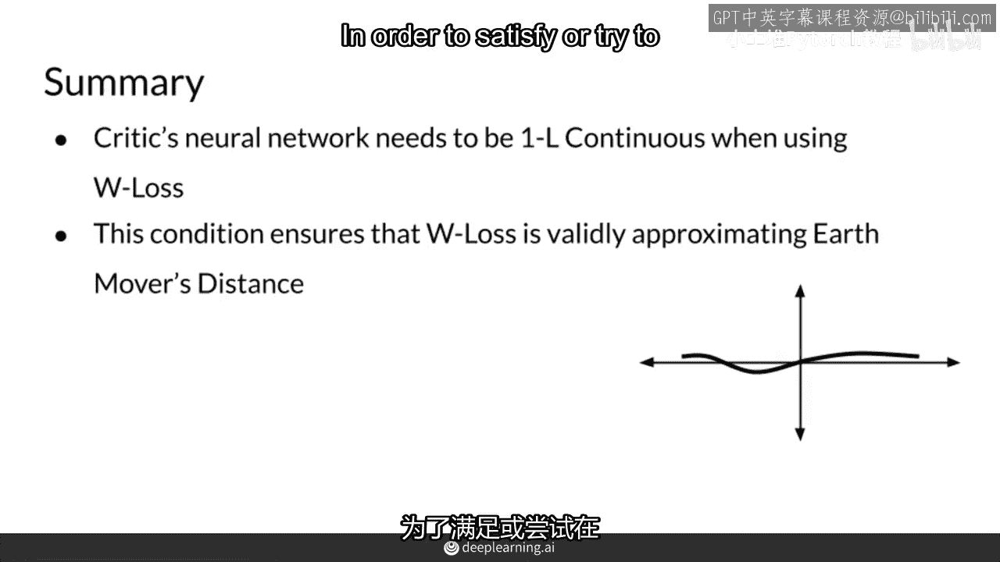

本节课中我们一起学习了Wasserstein GAN中判别器需要满足的Lipschitz连续性条件。我们了解到，这个条件要求判别器函数在任何点的梯度范数不超过1，这确保了训练的稳定性和Wasserstein距离的有效性。理解这个条件是掌握WGAN工作原理的关键一步。