# 25：WGAN-GP中的Lipschitz连续性强制 🧠

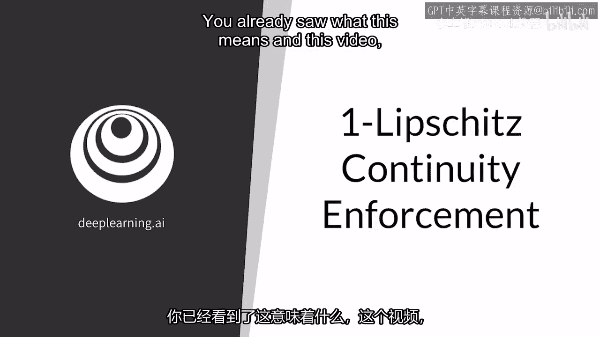

在本节课中，我们将学习如何在Wasserstein GAN（WGAN）中，为判别器（Critic）强制实施Lipschitz连续性条件。这是确保Wasserstein损失有效性的关键。我们将介绍两种主要方法：权重裁剪（Weight Clipping）和梯度惩罚（Gradient Penalty），并比较它们的优劣。

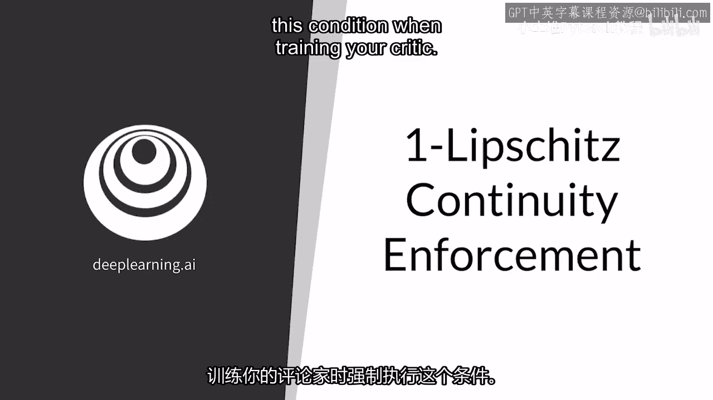

---

## 1. Lipschitz连续性回顾 📚

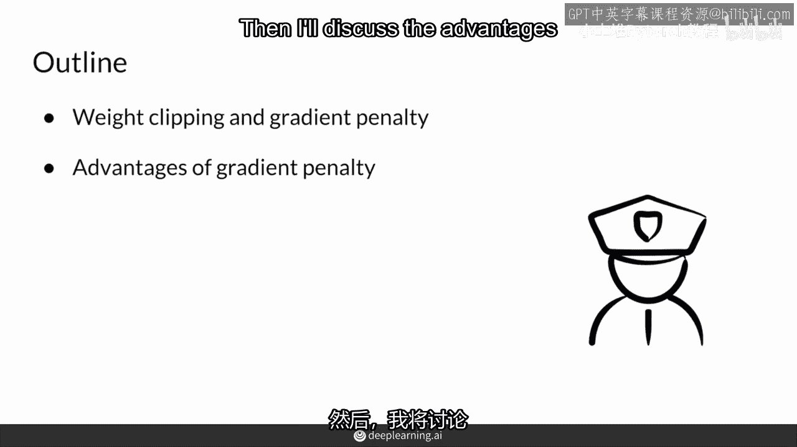

上一节我们介绍了Wasserstein损失。本节中我们来看看确保其有效的核心条件：判别器的一阶Lipschitz连续性。

判别器的一阶Lipschitz连续性意味着，该函数在任意点的梯度范数（Norm）不超过1。这可以用以下公式表示：

**公式：** `‖∇f(x)‖ ≤ 1`

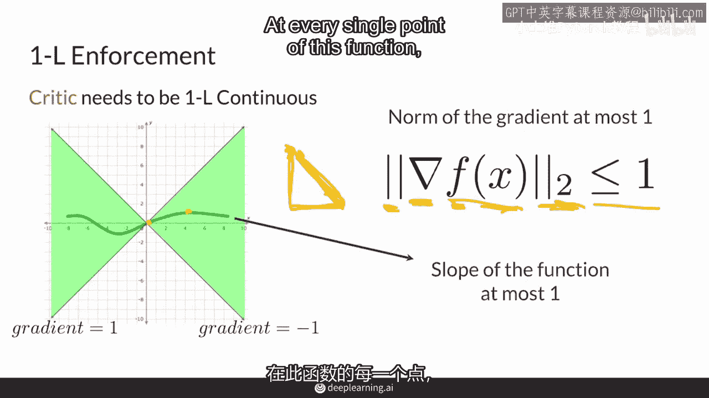

其中：
*   `∇f(x)` 表示判别器函数 `f` 在输入 `x`（例如一张图像）处的梯度。
*   `‖·‖` 通常指L2范数（即欧几里得距离）。

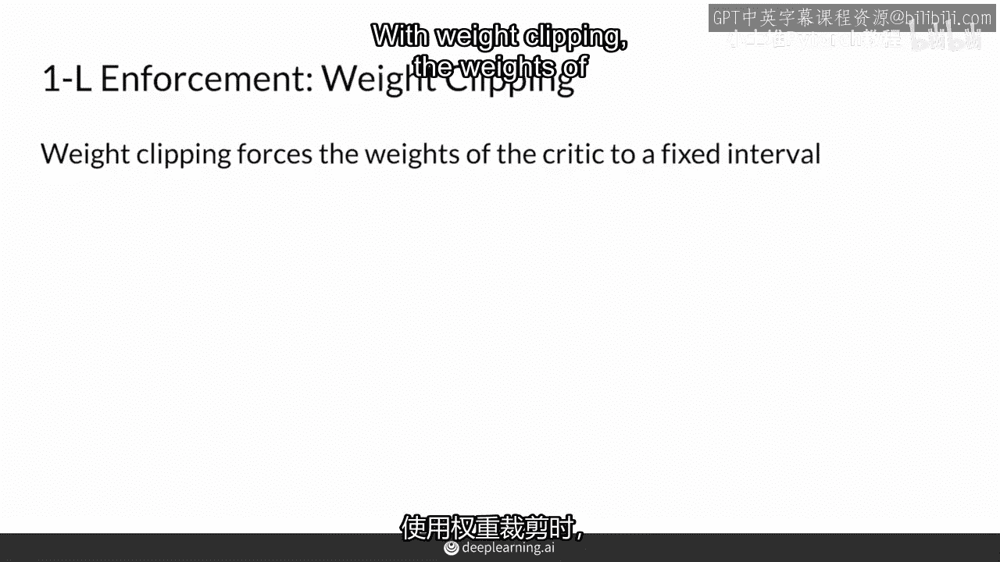

直观上，这限制了函数在每个点的“斜率”或变化率。在二维空间中，函数的图像将被限制在斜率为±1的绿色三角形区域内。

---

## 2. 强制Lipschitz连续性的方法 ⚙️

为了在训练中满足上述条件，主要有两种方法。以下是这两种方法的详细介绍。

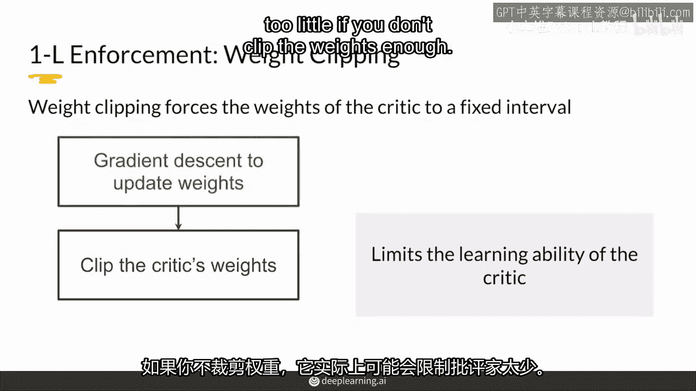

### 方法一：权重裁剪（Weight Clipping）

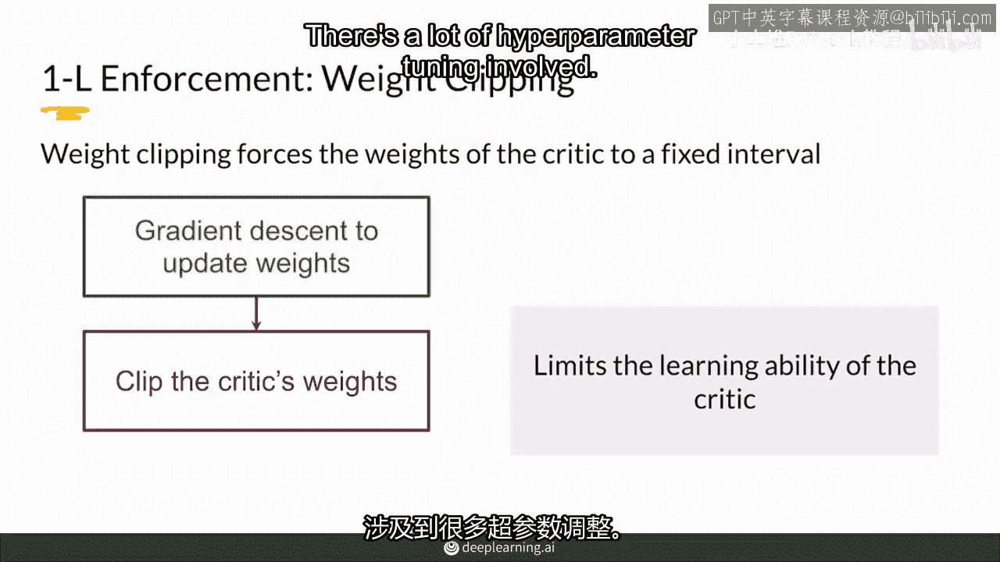

权重裁剪是一种直接的方法。在每次梯度下降更新判别器的权重后，将所有权重强制限制在一个固定的区间 `[-c, c]` 内。

**操作流程：**
1.  正常进行梯度下降更新权重。
2.  遍历所有权重参数。
3.  将任何小于 `-c` 的权重设置为 `-c`。
4.  将任何大于 `c` 的权重设置为 `c`。

**代码描述：**
```python
# 假设 w 是判别器的权重参数，c 是裁剪阈值（如 0.01）
w = torch.clamp(w, -c, c)
```

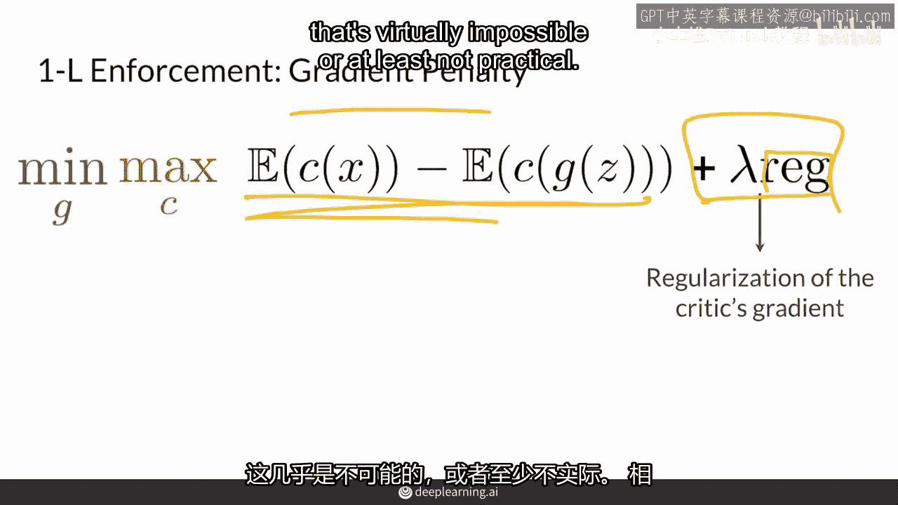

然而，这种方法存在严重缺点。将权重严格限制在固定区间内，可能会过度限制判别器的学习能力和表达能力，从而影响整个GAN的性能。它引入了额外的超参数 `c`，需要进行大量调整：如果 `c` 太小，判别器能力受限；如果 `c` 太大，则约束力不足。

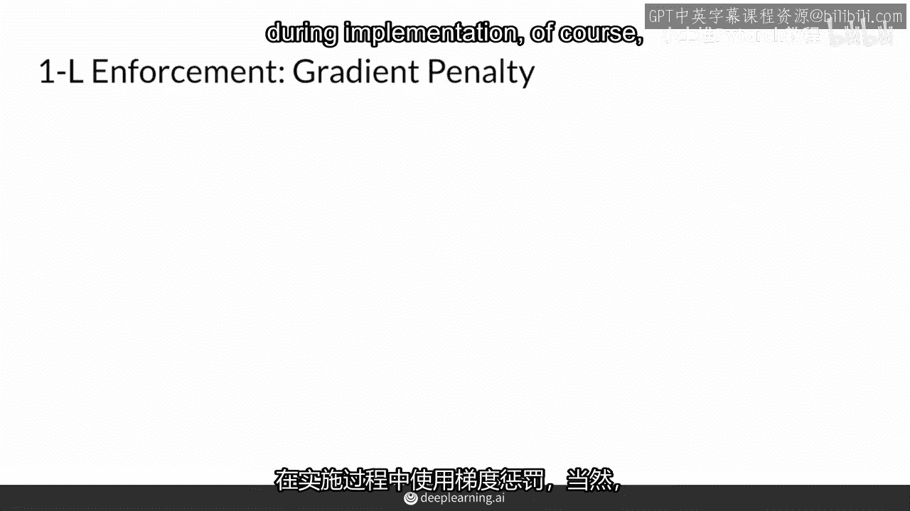

### 方法二：梯度惩罚（Gradient Penalty）

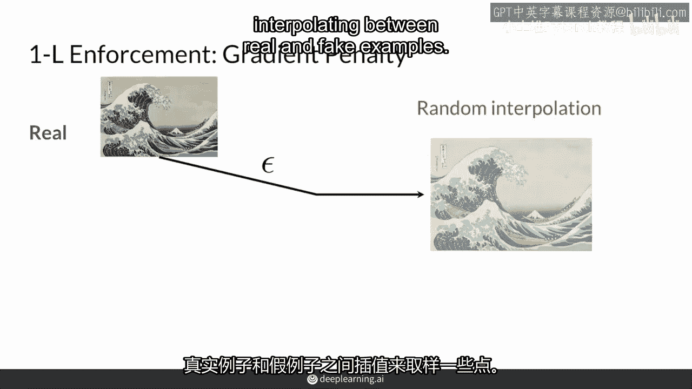

梯度惩罚是一种更柔和、更有效的强制方式。它在原始的Wasserstein损失函数中添加一个正则化项，直接惩罚那些梯度范数偏离1的判别器行为。

**损失函数公式：**
`L = E[D(x_fake)] - E[D(x_real)] + λ * E[(‖∇D(x_hat)‖ - 1)²]`

其中：
*   前两项是标准的Wasserstein损失。
*   第三项是梯度惩罚项。
*   `λ` 是一个超参数，用于控制惩罚项的权重。
*   `x_hat` 是关键，它是在真实样本和生成样本之间随机插值得到的点。

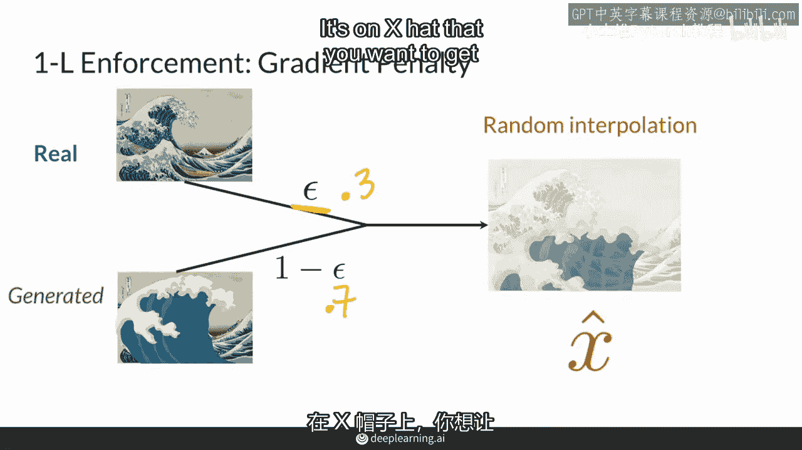

**为什么使用插值点 `x_hat`？**
理论上，我们需要判别器在整个输入空间的所有点上都满足梯度约束，但这不切实际。实践表明，通过在真实数据和生成数据的连线上进行随机采样来施加约束，效果非常好。

**生成插值点 `x_hat` 的代码描述：**
```python
# 假设 x_real 是真实样本， x_fake 是生成样本
epsilon = torch.rand(x_real.size(0), 1, 1, 1)  # 生成随机权重
x_hat = epsilon * x_real + (1 - epsilon) * x_fake
x_hat.requires_grad_(True)  # 启用梯度计算
```

然后，计算判别器对 `x_hat` 的输出的梯度，并计算其范数与1的平方差作为惩罚。这种方法并不严格保证每一点的梯度范数都≤1，而是鼓励其接近1，被证明比权重裁剪更有效、更稳定。

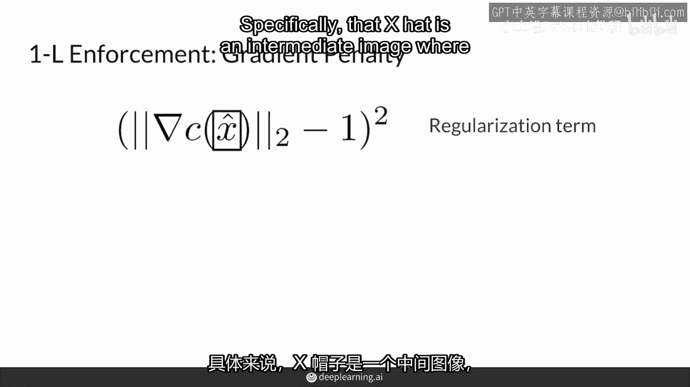

---

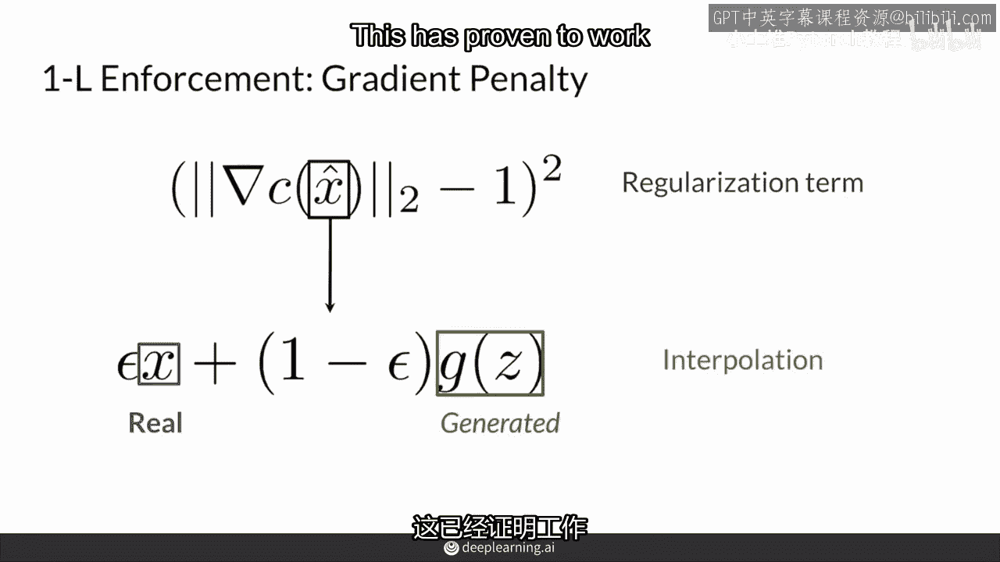

## 3. 完整损失函数与优势总结 🏆

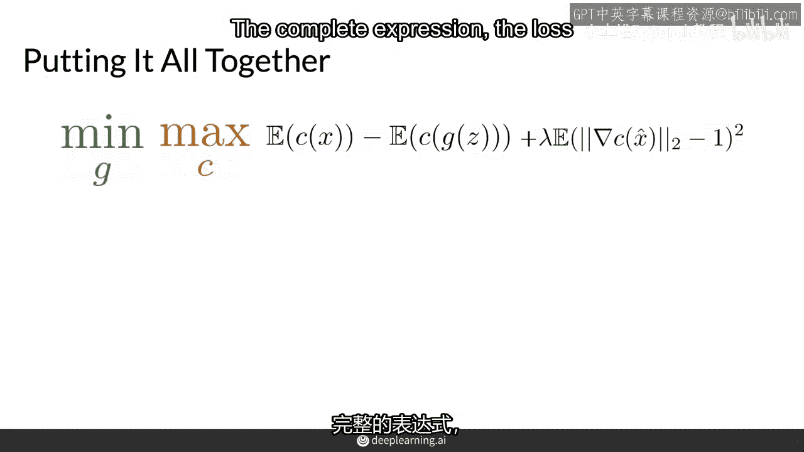

现在，我们将主要损失项和梯度惩罚项结合起来。

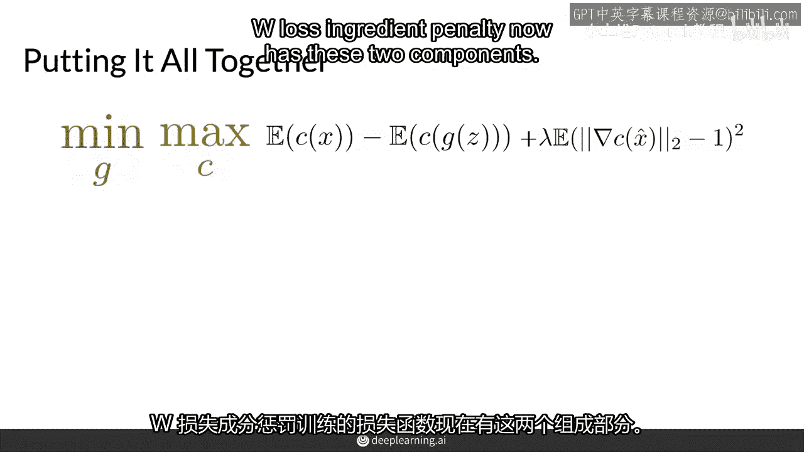

用于训练的完整损失函数表达式如下：

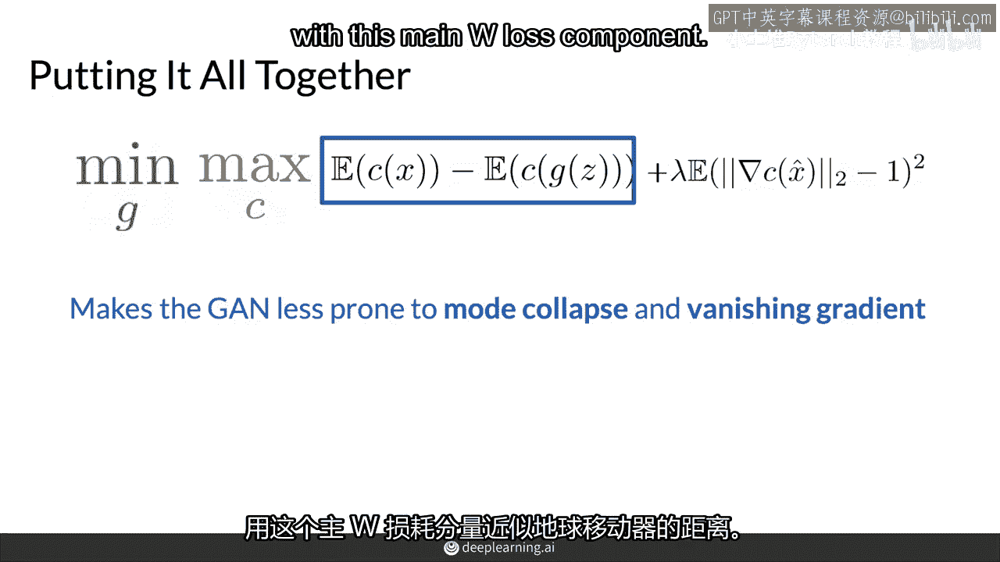

`L_total = E[D(x_fake)] - E[D(x_real)] + λ * E[(‖∇D(x_hat)‖ - 1)²]`

这个损失函数由两部分组成：
1.  **Wasserstein距离近似项**：驱使生成器产生更逼真的样本，同时缓解了模式崩溃问题。
2.  **梯度惩罚正则化项**：对判别器实施Lipschitz连续性软约束，确保第一项的有效性。

研究表明，这种梯度惩罚方法能非常有效地让判别器在“几乎处处”满足梯度范数接近1的条件，从而显著提升WGAN的训练稳定性和生成质量。

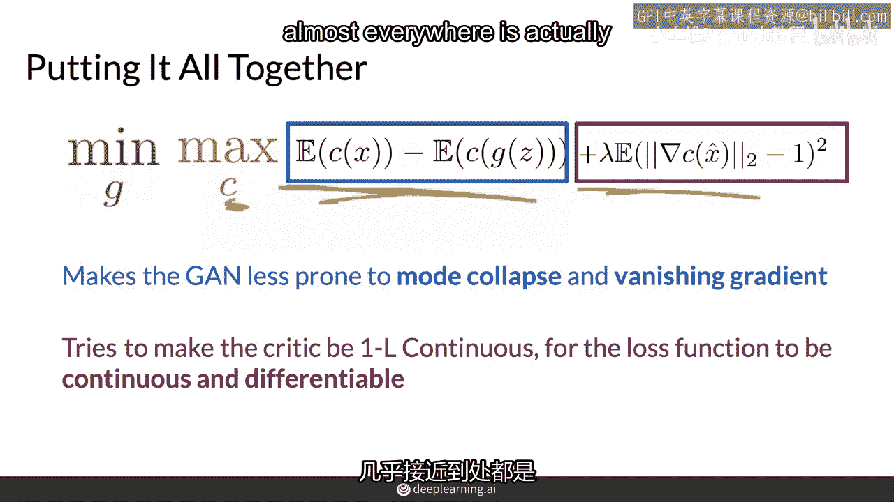

---

## 4. 课程总结 ✨

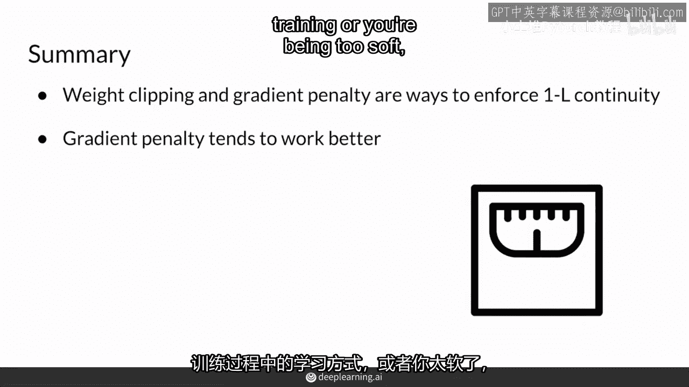

本节课中我们一起学习了在WGAN中强制判别器满足Lipschitz连续性的两种方法。

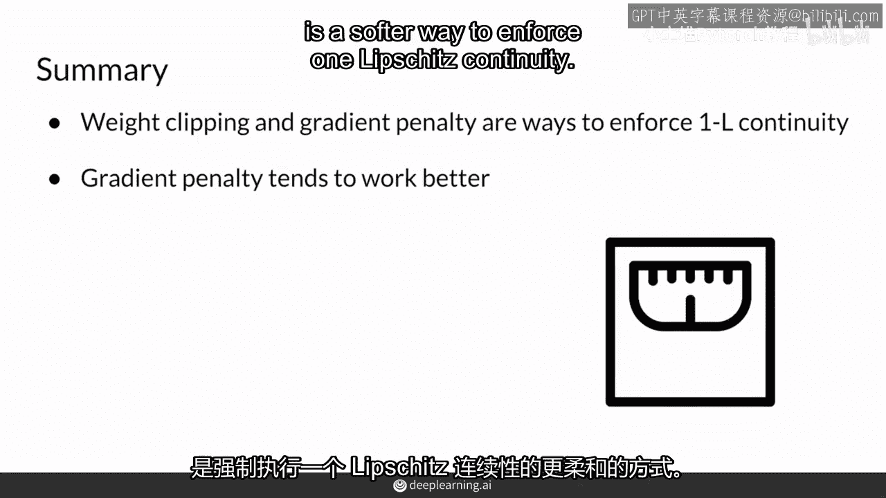

*   **权重裁剪**：通过硬性截断权重值来实施约束。方法简单，但可能因限制过强或过弱而影响性能，且需要仔细调整超参数。
*   **梯度惩罚**：通过在损失函数中添加正则项来软性约束梯度范数。这种方法更为柔和有效，是当前WGAN-GP等改进模型的标准做法，虽然不提供严格保证，但在实践中能带来更稳定、更优异的训练结果。

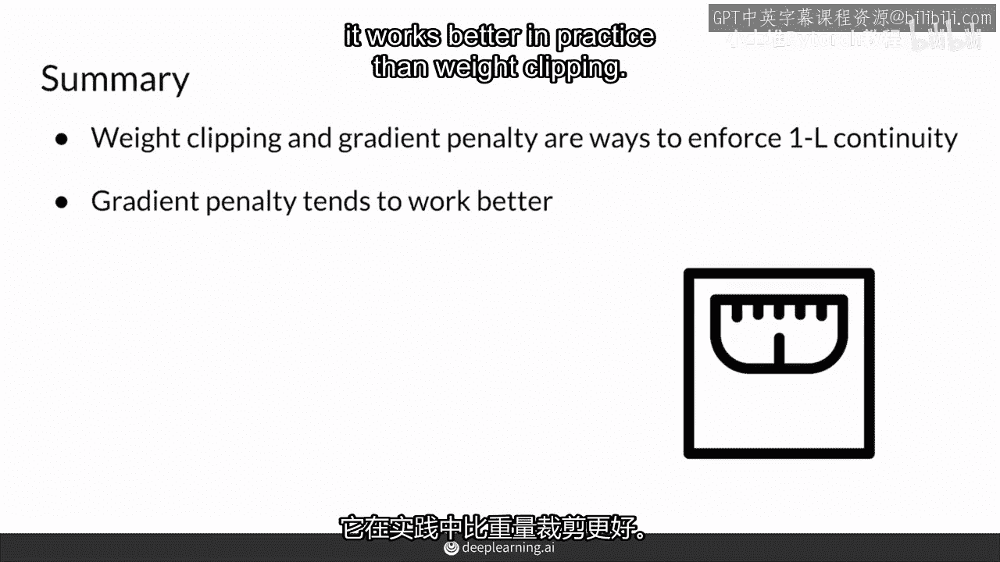

理解并应用梯度惩罚，是成功训练Wasserstein GAN的关键一步。