# 27：条件生成的直觉 🧠

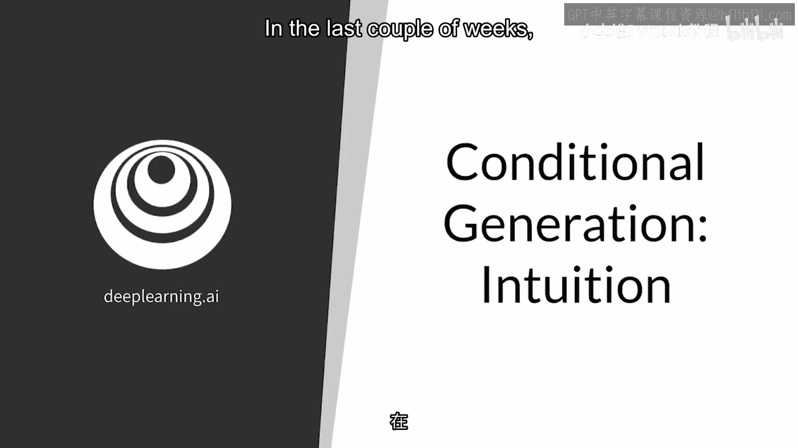

在本节课中，我们将学习生成式对抗网络（GAN）的一个重要扩展——**条件生成**。我们将通过对比无条件生成，理解条件生成如何让我们控制生成样本的类别或特征。

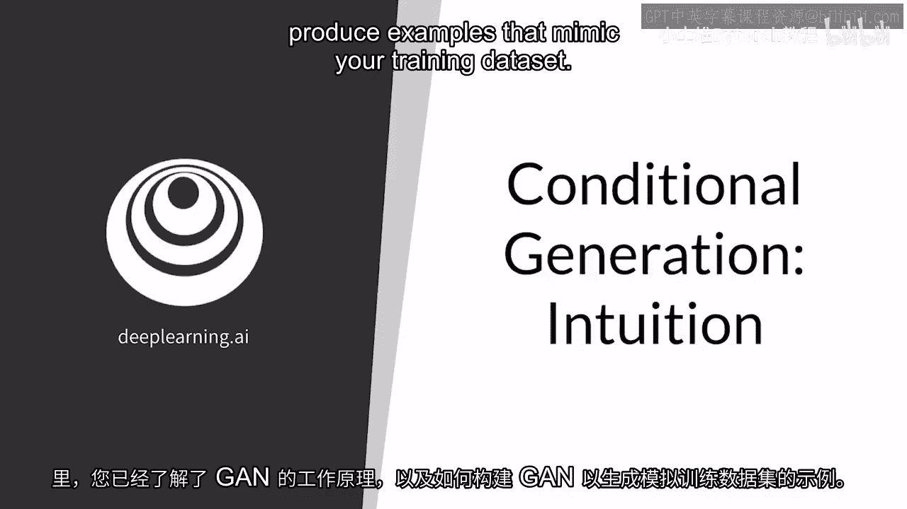

在过去的几周里，你已经了解了生成式对抗网络（GANs）的工作原理，以及如何构建它们来生成模仿训练数据集的样本。

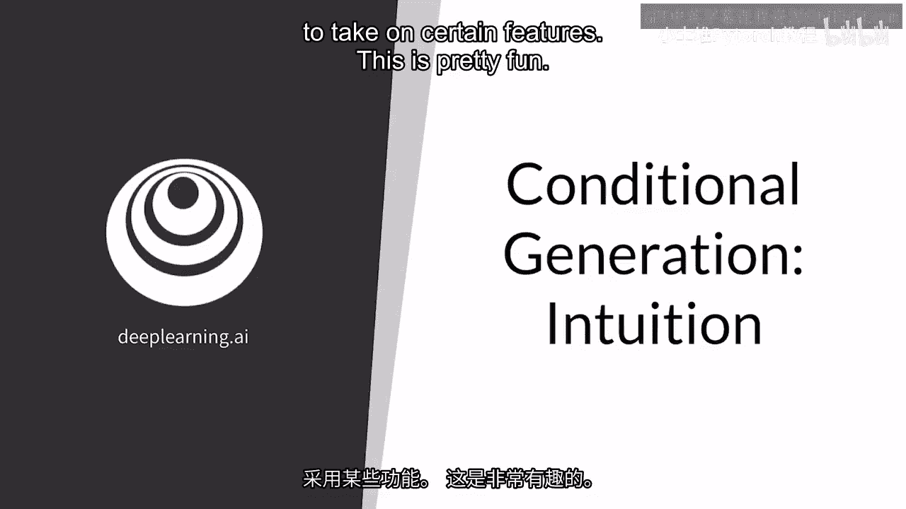

接下来，我们将展示如何控制输出，以获取特定类别的样本，或者使样本具有某些特定特征。

## 🔄 回顾：无条件生成

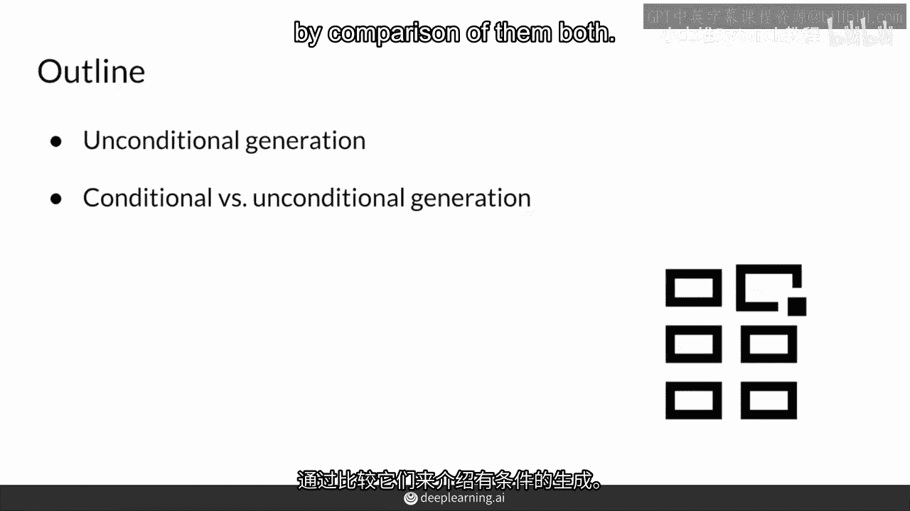

首先，让我们快速回顾一下你已经熟悉的无条件生成。

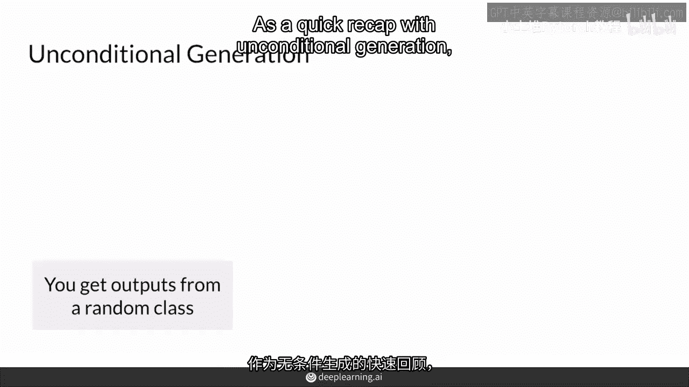

在无条件生成中，你得到的是随机类别的输出。你可以将其想象成一个自动售货机：你投入硬币（随机噪声向量 `z`），然后得到一个随机颜色的软糖（生成的图像 `G(z)`）。

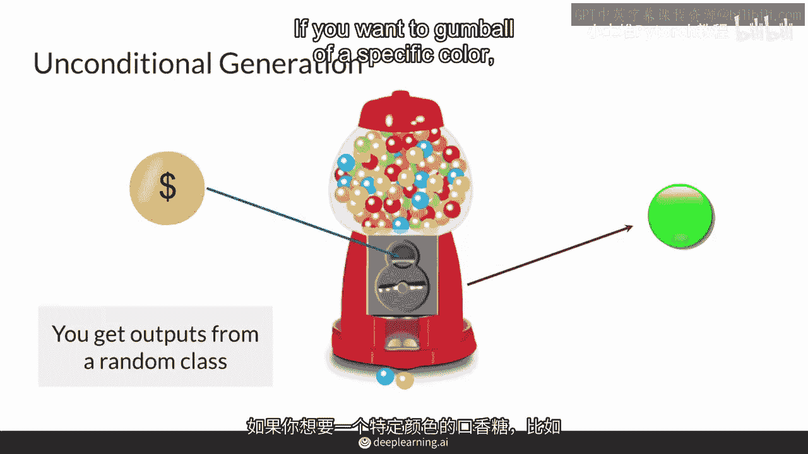

**公式表示：**
`无条件生成输出 = G(z)`

如果你想要特定颜色的软糖（例如红色），你必须不断投币（生成）直到得到它。在这个过程中，你无法控制最终会得到哪种颜色的输出。

## 🎯 引入：条件生成

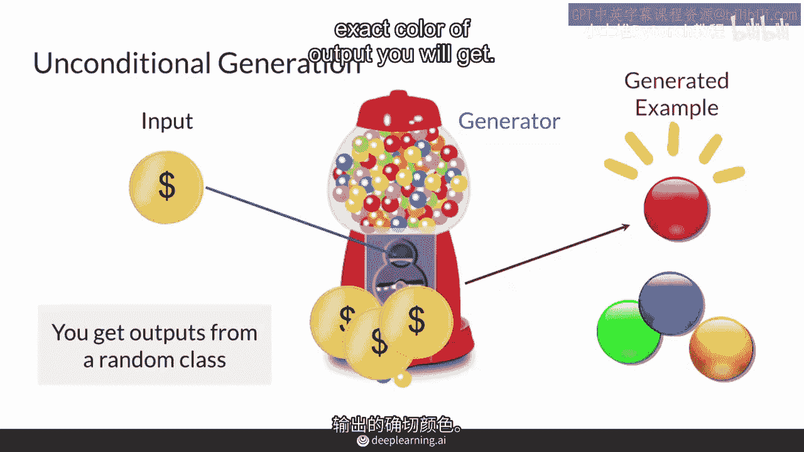

另一方面，条件生成允许你请求来自特定类别的样本。

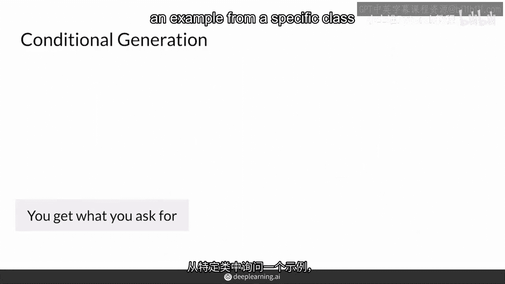

这就像一个更高级的自动售货机：你不仅投入硬币（随机噪声向量 `z`），还输入你想要的物品代码（条件标签 `y`），例如“红色苏打水”。然后，机器就会给你一瓶红色苏打水。

**公式表示：**
`条件生成输出 = G(z, y)`

请注意，你仍然无法控制这瓶苏打水的某些具体特性（例如最新鲜的或最满的一瓶），但你一定能得到一瓶红色苏打水，而不是蓝色糖果。这里的“硬币”和“代码”共同构成了生成器的输入。

## ⚖️ 核心比较

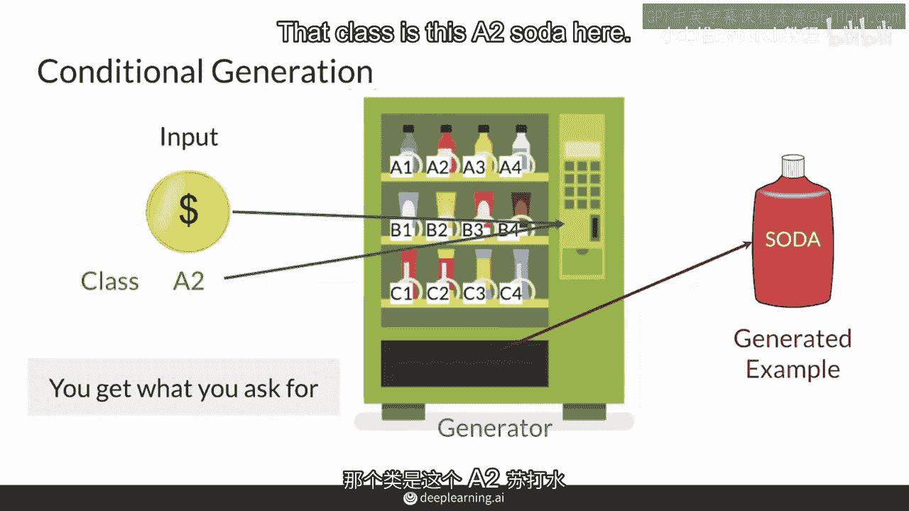

现在，你对条件生成和无条件生成的关系有了概念，让我们系统地比较一下它们。

以下是两者的主要区别：

*   **输出控制**：条件生成让你从**你决定的类别**中获得生成的样本。无条件生成则从**随机类别**中获得样本。
*   **数据要求**：条件生成必须使用**带有标签的数据集**来训练你的GAN，这些标签对应你想要生成的不同类别。无条件生成则**不需要任何标签**，只需要一堆真实的样本。
*   **模型输入**：在条件生成中，数据集的标签会同时馈送给**生成器（G）** 和**鉴别器（D）**，以指导网络学习生成所需类别的样本。

## 📝 本节总结

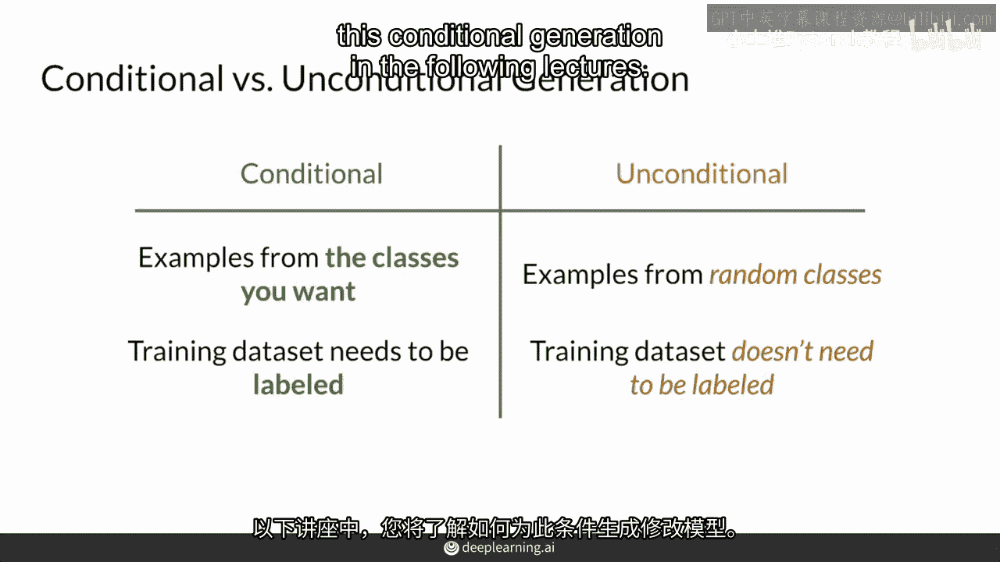

本节课中，我们一起学习了条件生成的核心直觉。

我们回顾了无条件生成的过程，并将其与条件生成进行了对比。关键点在于，条件生成通过在生成过程中引入额外的标签信息（`y`），使得我们能够控制生成样本的类别。为了实现这一点，需要使用带标签的数据集进行训练，并将标签信息同时提供给生成器和鉴别器。

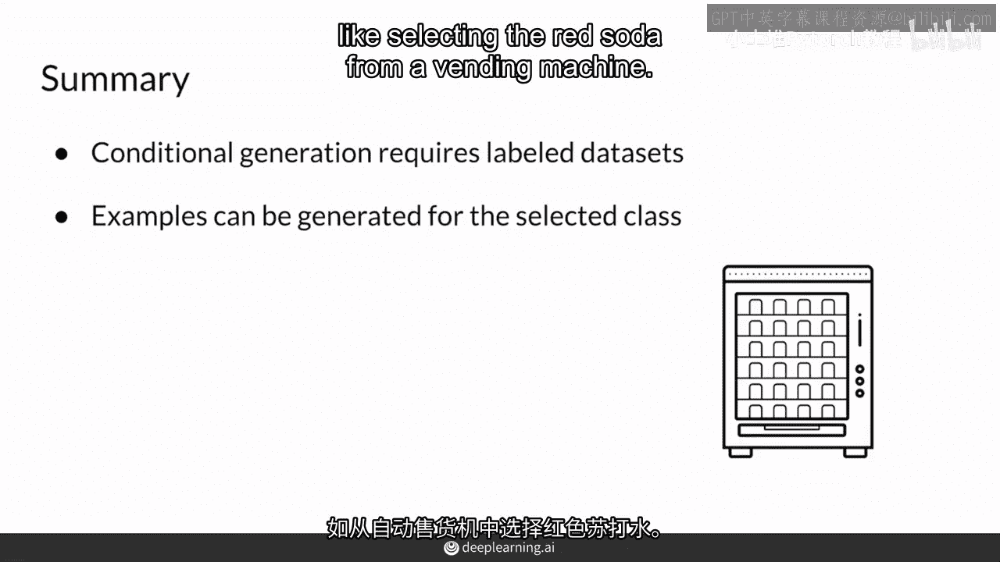

在随后的课程中，你将看到如何具体修改你的GAN模型，以实现这种强大的条件生成功能。