# 28：条件生成的输入 🧠

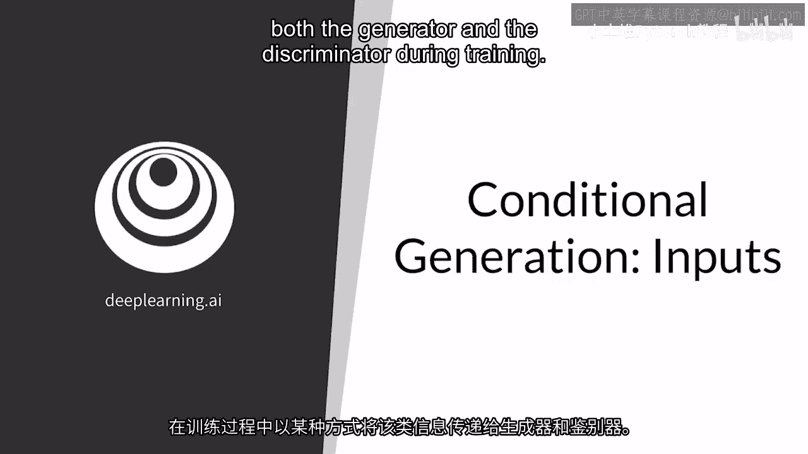

在本节课中，我们将学习条件生成对抗网络（Conditional GAN）的核心概念，特别是如何将类别信息传递给生成器和判别器，从而控制生成特定类别的样本。

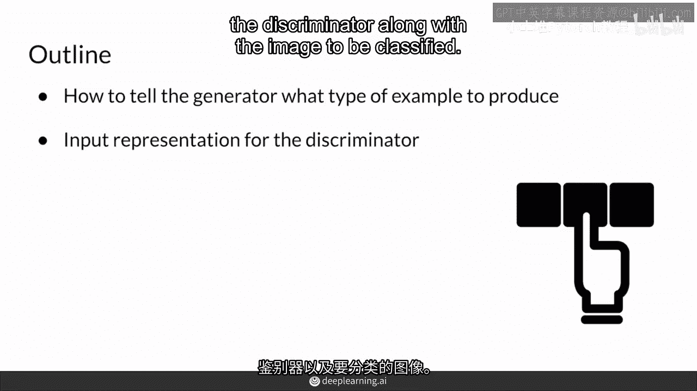

---

## 概述 📋

条件生成允许你生成指定类别的样本。为了实现这一点，你需要一个带有标签的数据集，并在训练过程中将类别信息传递给生成器和判别器。

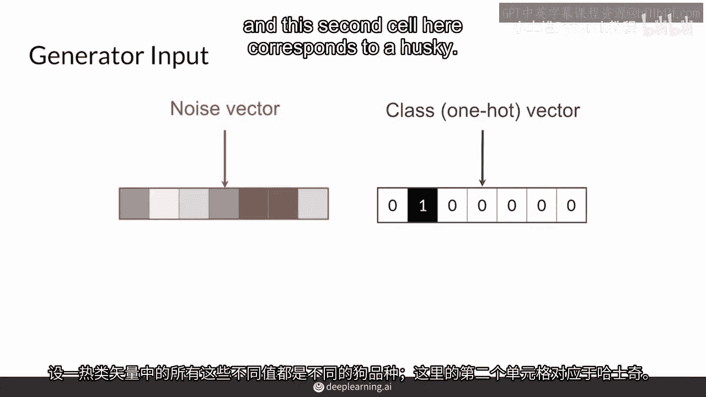

## 条件生成的基本原理

上一节我们介绍了无条件生成，本节中我们来看看如何为生成过程添加条件控制。

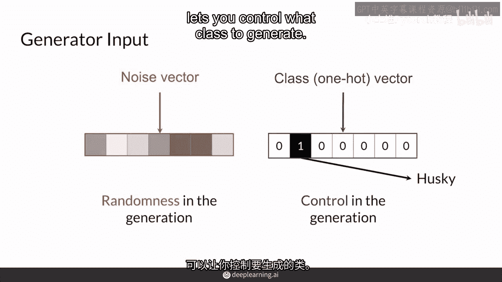

条件生成的核心在于，除了随机噪声向量，我们还需要一个向量来告诉生成器应该生成哪个类别的样本。这个向量通常是 **one-hot向量**，其特点是除了目标类别对应的位置为1，其余位置均为0。

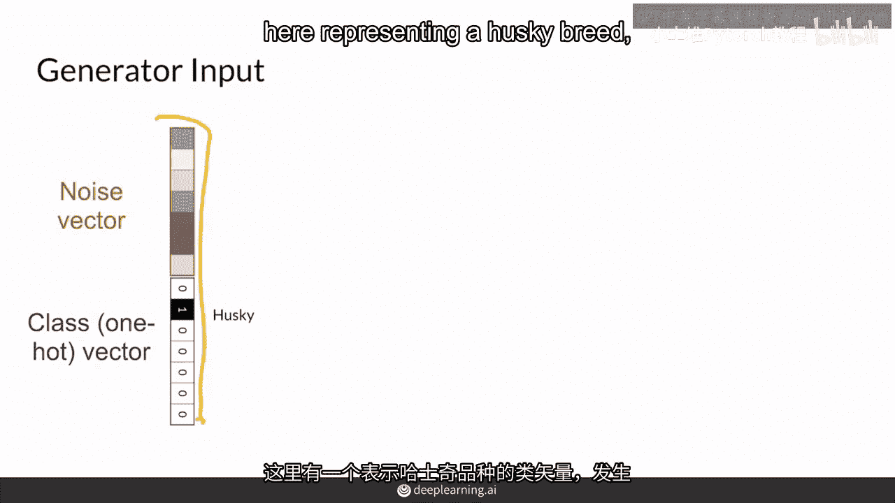

例如，假设我们有一个包含不同犬种的数据集，one-hot向量 `[0, 1, 0, 0, 0]` 中的“1”位于第二个位置，这代表我们希望生成器生成一只“哈士奇”。

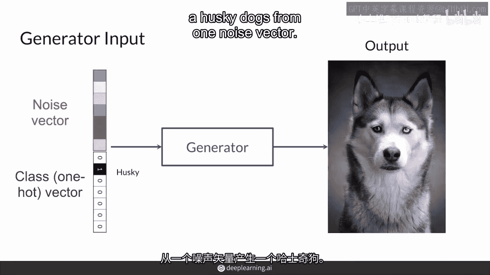

噪声向量 `z` 负责提供生成样本所需的随机性，确保即使在同一个类别下，也能生成多样化的样本。因此，生成器的输入变成了噪声向量和one-hot类别向量的拼接。

**公式表示生成器输入：**
`生成器输入 = concat(噪声向量 z, one-hot类别向量 c)`

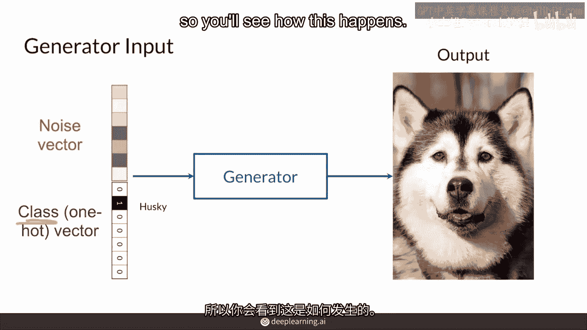

## 判别器如何接收条件信息

为了让生成器学会生成指定类别的样本，判别器也必须知晓样本的“目标类别”。

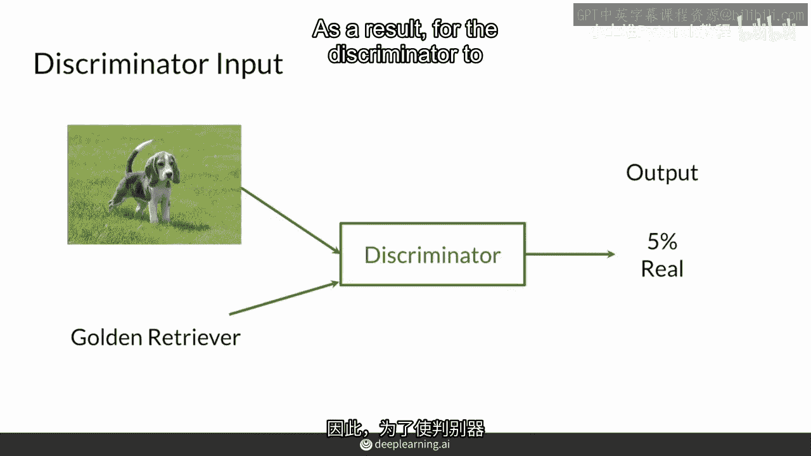

判别器的输入是图像和对应的类别信息。判别器的任务是判断：“给定的图像是否是**该指定类别**的真实样本？” 这意味着，即使一张比格犬的图片非常逼真，但如果它被标记为“金毛寻回犬”，判别器也应该将其判定为“假”。

为了实现这一点，类别信息需要被整合到判别器的输入中。一种常见的方法是将类别向量（如one-hot向量）扩展成与图像尺寸相同的通道图，然后将其作为额外的通道与原始图像通道拼接在一起。

**代码示例（概念性描述）：**
```python
# 假设 image 形状为 [C, H, W]， label_one_hot 形状为 [num_classes]
# 将标签扩展为与图像空间尺寸相同的张量
label_map = label_one_hot.unsqueeze(-1).unsqueeze(-1)  # 形状变为 [num_classes, 1, 1]
label_map = label_map.expand(-1, H, W)                 # 形状变为 [num_classes, H, W]
# 将标签通道与图像通道拼接
discriminator_input = torch.cat([image, label_map], dim=0)  # 形状为 [C+num_classes, H, W]
```

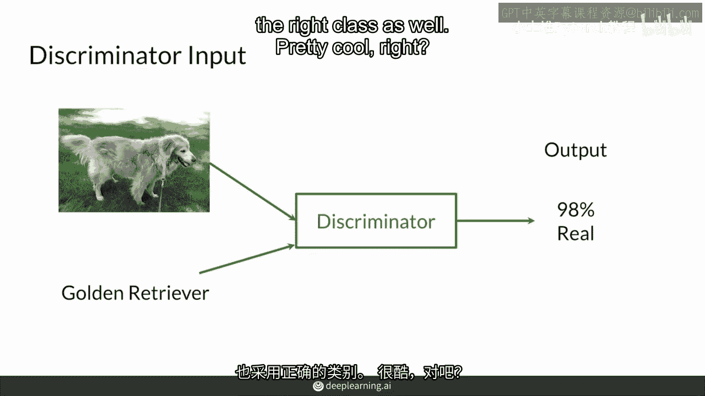

## 训练过程的动态

以下是条件GAN训练中生成器和判别器的互动过程：

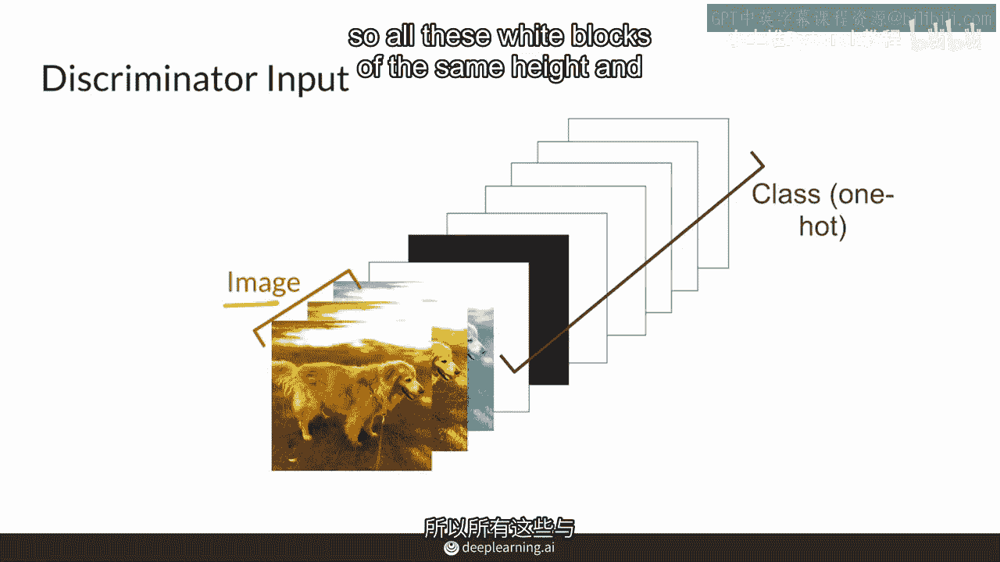

1.  **生成器**：接收拼接了类别信息的噪声向量，尝试生成指定类别的逼真图像。
2.  **判别器**：接收真实图像及其正确标签，或生成图像及其目标标签。它学习区分“指定类别的真实图像”和“指定类别的生成图像”。
3.  **对抗博弈**：生成器努力生成能以假乱真、且符合目标类别的图像来欺骗判别器；判别器则努力提升自己的鉴别能力。这个过程迫使生成器不断改进，最终学会生成高质量、符合条件约束的样本。

## 总结 🎯

本节课中我们一起学习了条件生成对抗网络中输入部分的关键设计：

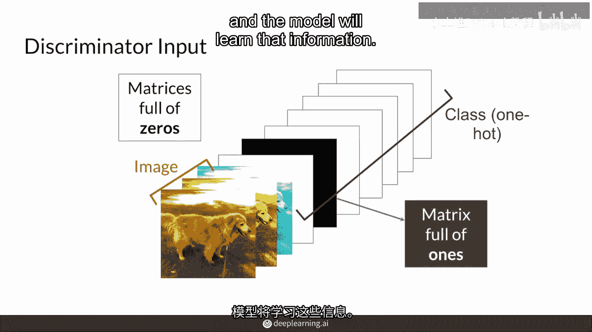

*   **核心思想**：通过引入类别信息，控制生成样本的类别。
*   **生成器输入**：由随机噪声向量 `z` 和 one-hot 类别向量 `c` 拼接而成。
*   **判别器输入**：由图像和扩展后的类别信息（通常作为额外通道）拼接而成。
*   **训练机制**：判别器根据“图像-类别”对进行真假判断，从而引导生成器生成符合目标类别的逼真样本。

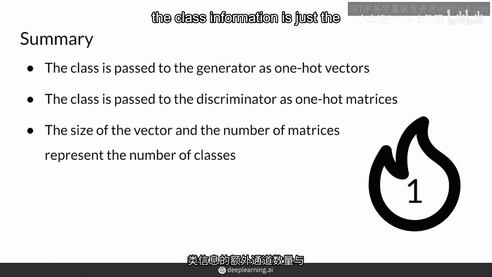

通过这种设计，我们能够引导GAN生成我们想要的特定类型的图像，这是许多高级图像生成和应用的基础。