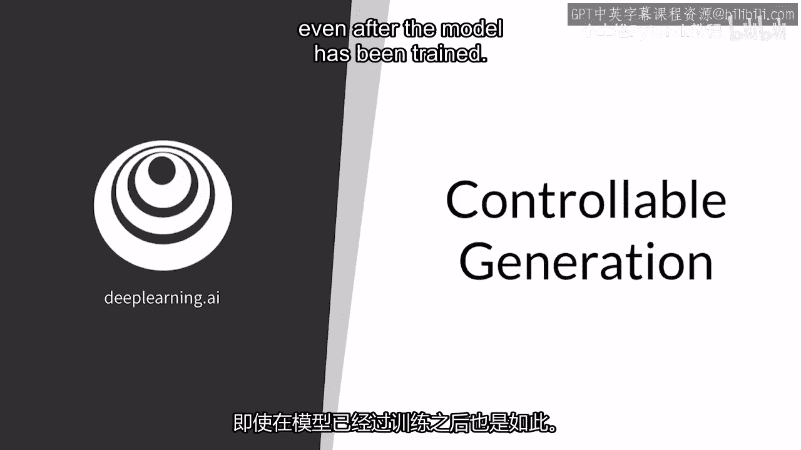
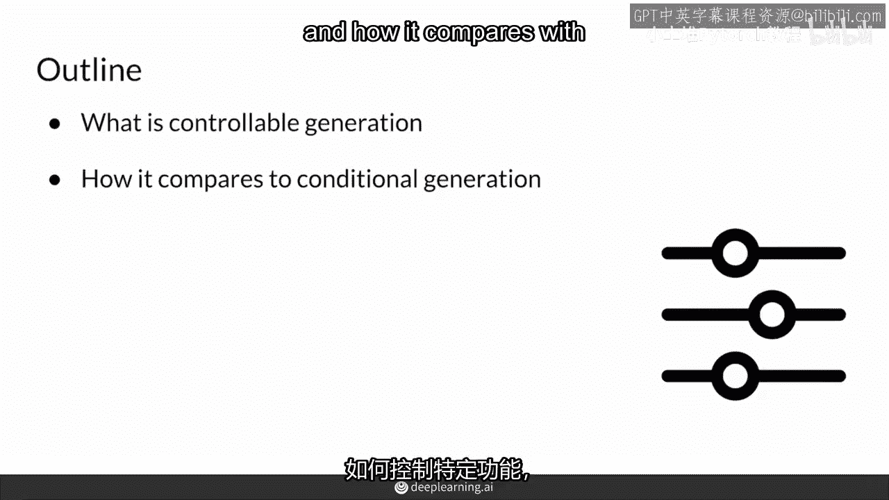
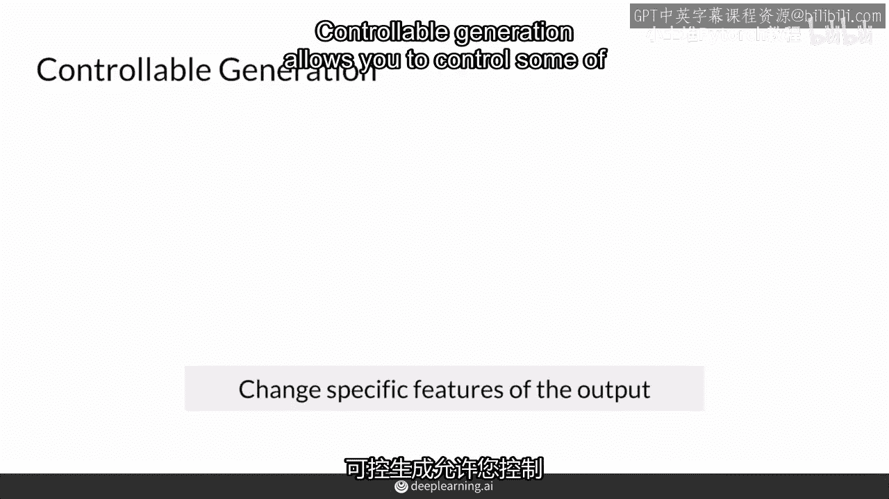
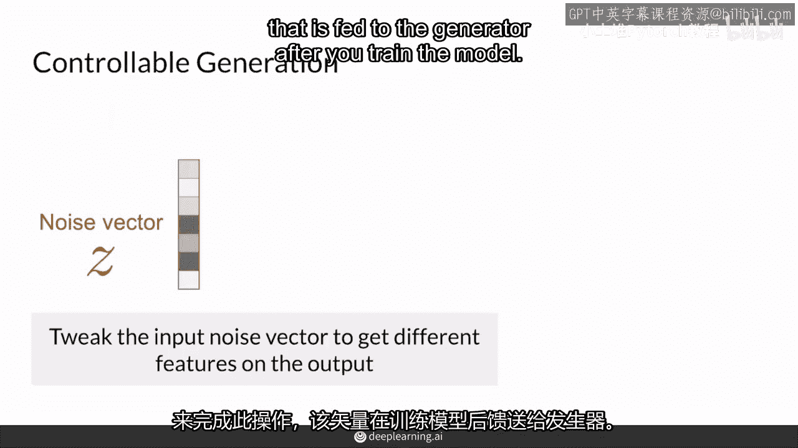
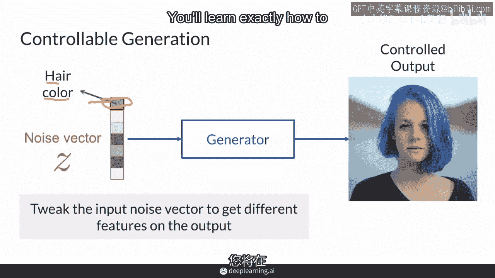
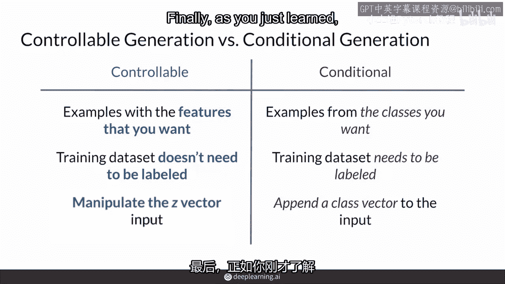
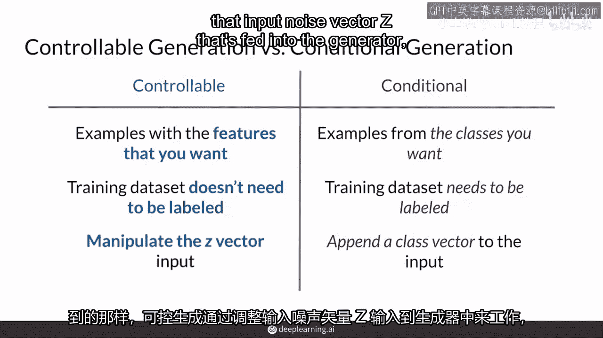
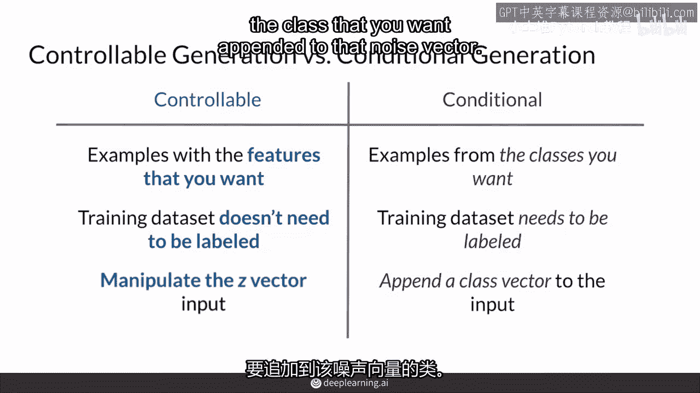
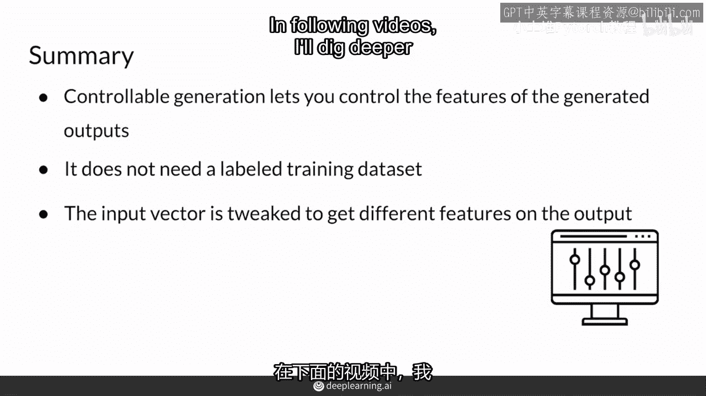

# 29：可控生成 🎛️



在本节课中，我们将学习一种名为“可控生成”的技术。这是一种在生成对抗网络（GAN）训练完成后，控制其输出图像特定特征（如年龄、发色、是否戴眼镜等）的方法。我们将了解其核心概念，并将其与之前学过的“条件生成”进行比较。

---



## 概述



可控生成允许我们在模型训练完毕后，通过调整输入给生成器的噪声向量 `z`，来控制生成图像的特征。这与条件生成不同，后者在训练时就需要使用带标签的数据来指定类别。

## 可控生成是什么？



可控生成是一种控制GAN生成输出的方法。它专注于控制你希望在输出图像中呈现的特征，即使模型已经训练完毕。

例如，对于一个生成人脸的GAN，你可以控制图像中人物的年龄、是否戴太阳镜、视线方向或感知性别。这是通过调整输入给生成器的噪声向量 `z` 来实现的。



## 一个直观的例子

假设我们有一个噪声向量 `z`，输入生成器后得到一张红发女性的图像。
```python
# 伪代码示意
z = torch.randn(1, latent_dim)  # 原始噪声向量
image_red_hair = generator(z)   # 生成红发图像
```
如果我们调整 `z` 中代表“发色”的特征方向，就可能得到一张蓝发女性的图像。
```python
z_modified = z + alpha * direction_hair_color  # 沿特定方向调整
image_blue_hair = generator(z_modified)        # 生成蓝发图像
```
这非常酷。在下一节课中，我们将学习如何精确地调整 `z`。

## 可控生成 vs. 条件生成

为了更好地理解可控生成，我们将其与条件生成进行快速比较。研究人员常用“可控生成”这个术语，虽然其定义有时并不完全清晰，有时它也包括条件生成，因为两者都以某种方式控制GAN。

以下是两者的主要区别：

*   **可控生成**：你可以得到具有你想要的**特定特征**的示例，例如老年人、绿头发、戴眼镜的脸。它通常控制**连续的特征**（如年龄大小），并且可以在模型训练**后**进行。
*   **条件生成**：你可以得到你想要的**特定类别**的示例，比如“人类”或“鸟类”。当然，你也可以指定“戴太阳镜的人”。这通常需要在**训练时**使用标记数据集来实现。

简而言之，条件生成是“指定类别”，而可控生成更侧重于“调整特征的强度或数值”。你可能不想为每种发色都标注数据，可控生成可以帮你做到这一点。它更多是关于在潜在空间中找到代表特定特征的方向。



最后，正如你刚刚学到的，可控生成是通过调整输入噪声向量 `z` 来实现的，而条件生成则需要将表示类别的额外信息附加到噪声向量 `z` 上一起输入。



## 总结



本节课我们一起学习了可控生成。总结来说：

*   可控生成让你能够控制生成对抗网络输出中的**特征**。
*   与条件生成对比，它通常**不需要带标签的训练数据集**。
*   为了以可控的方式改变输出，我们需要对输入的噪声向量 `z` 进行特定方向的调整。



通过掌握这种方法，我们可以在不重新训练模型的情况下，灵活地操控生成内容的各种属性。