# 30：30. Z空间中的向量代数 🔢

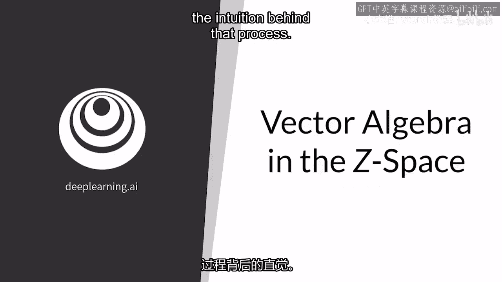

在本节课中，我们将学习生成对抗网络中“可控生成”背后的核心思想。我们将从回顾图像插值开始，逐步理解如何通过操纵输入生成器的噪声向量，来控制生成图像的特征。

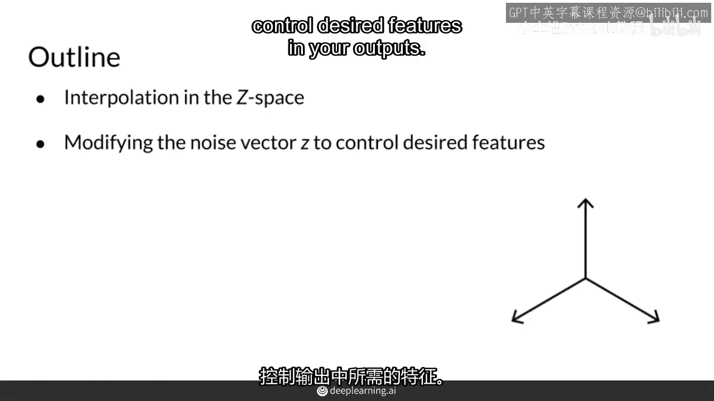

---

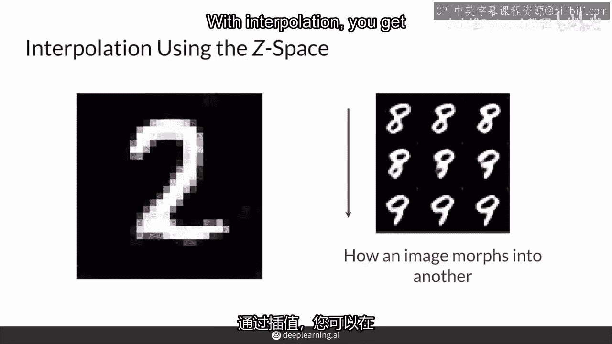

## 回顾：图像插值

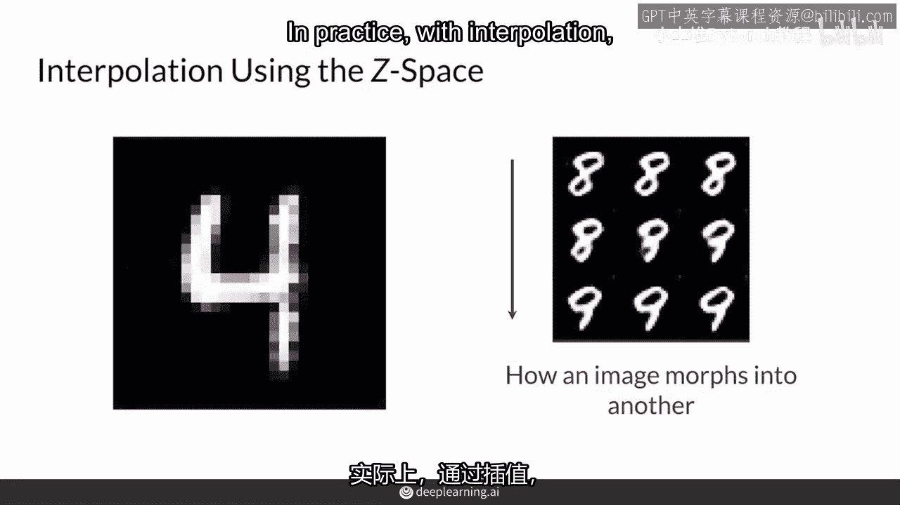

在之前的课程中，我们了解到可控生成是通过操纵输入生成器的噪声向量 `z` 来实现的。为了理解这个过程，我们先回顾一个相关概念：**图像插值**。

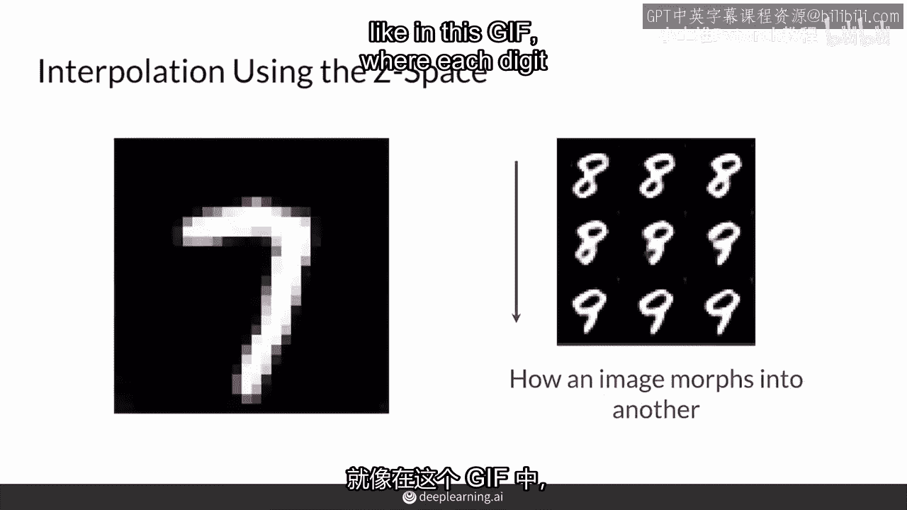

图像插值是指，在两个由GAN生成的图像之间，生成一系列平滑过渡的中间图像。在实践中，你可以看到一张图片如何逐渐变成另一张图片。

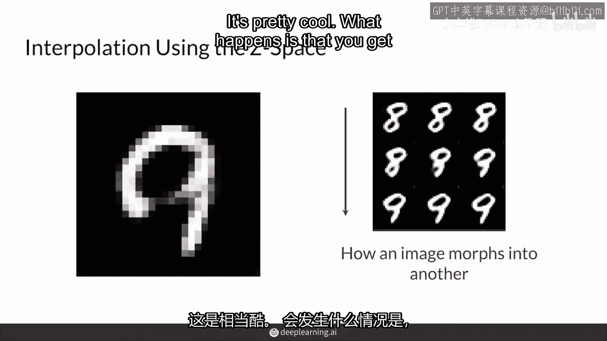

以下是进行插值的基本步骤：

1.  首先，我们有两个噪声向量，`v1` 和 `v2`，它们位于一个被称为 **Z空间** 的向量空间中。Z空间是所有可能的噪声向量所在的空间。
2.  将 `v1` 输入生成器 `G`，得到图像 `Image1`；将 `v2` 输入生成器 `G`，得到图像 `Image2`。
3.  为了得到这两张图像之间的中间图像，我们在Z空间中对两个输入向量 `v1` 和 `v2` 进行**线性插值**。这意味着我们计算一系列中间向量，公式为：
    `v_interp = α * v1 + (1 - α) * v2`
    其中，`α` 是一个从0到1变化的参数。
4.  最后，将这些中间向量 `v_interp` 依次输入生成器 `G`，就能得到一系列在 `Image1` 和 `Image2` 之间平滑过渡的图像。

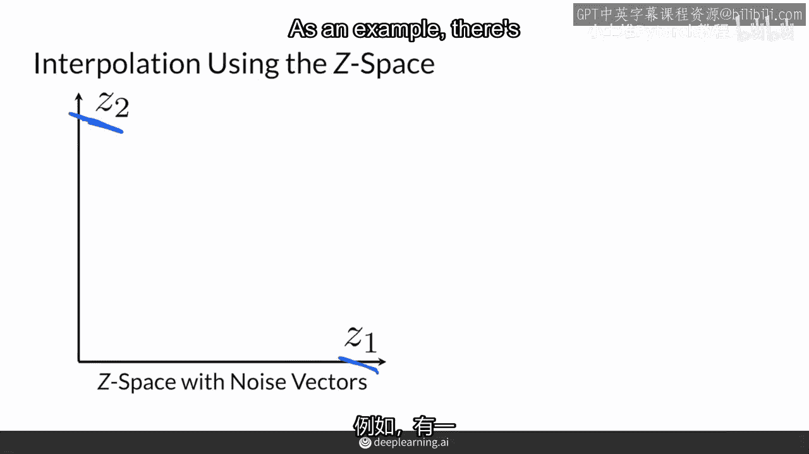

因此，插值展示了在Z空间中移动向量，会如何系统性地改变生成器的输出。

---

## 从插值到可控生成

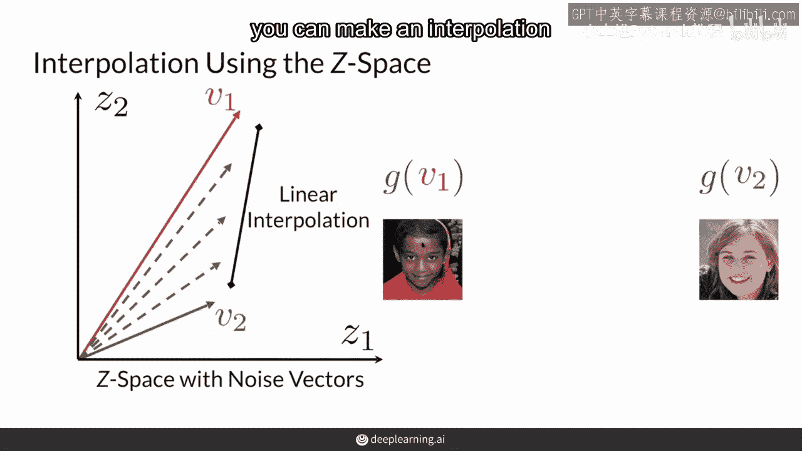

上一节我们介绍了图像插值，本节中我们来看看**可控生成**。你会发现，可控生成和插值在思路上是相似的，但目标不同。

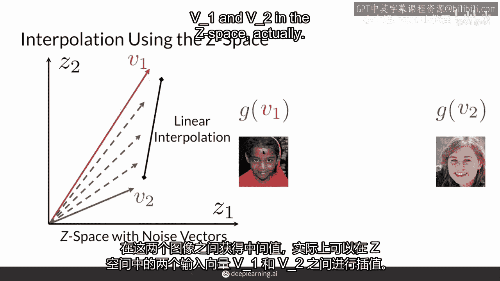

可控生成同样利用Z空间的变化，并观察修改噪声向量如何反映在生成器的输出上。关键在于，我们需要找到Z空间中与**特定特征变化**相关的**方向**。

举个例子：
*   用一个噪声向量 `v_red`，生成一张红头发女士的图片。
*   用另一个噪声向量 `v_blue`，生成一张蓝头发（其他特征相同）的女士图片。
*   这两个向量之间的差异 `d = v_blue - v_red`，就代表了Z空间中一个特定的“方向”。沿着这个方向移动，就能修改生成图像中的**头发颜色**。

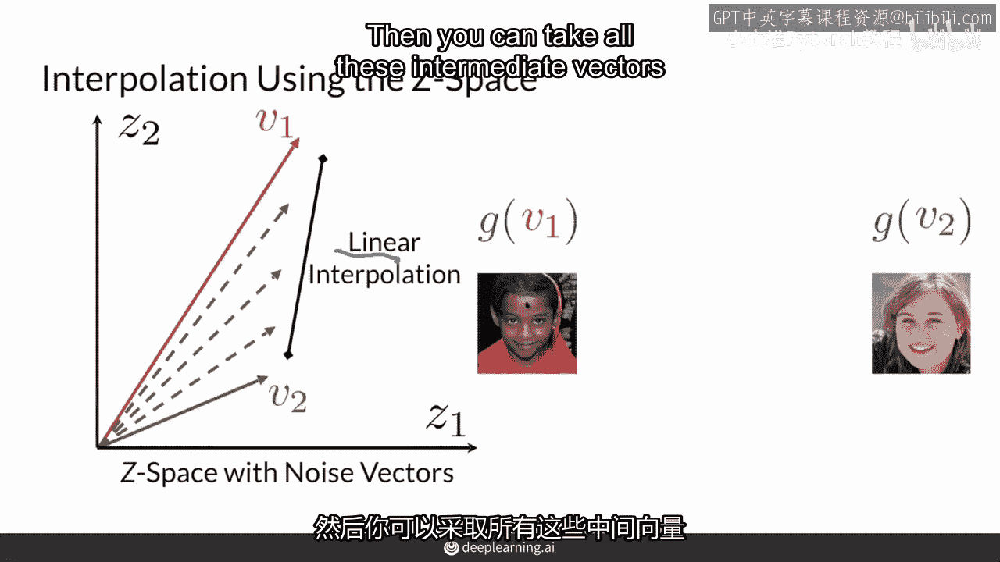

在可控生成中，我们的目标就是为各种关心的特征（如笑容、年龄、发型等）找到这些隐藏的“方向向量” `d`。

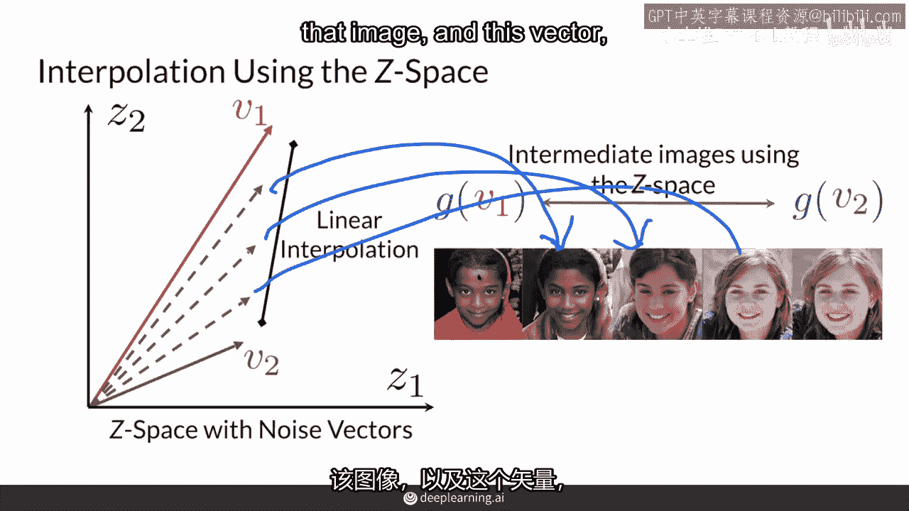

---

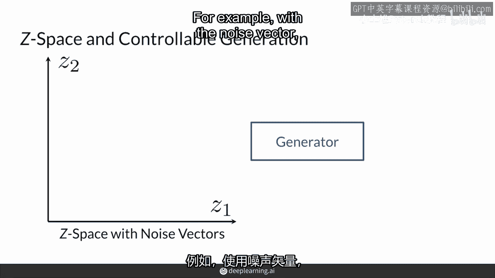

## 可控生成的实现方法

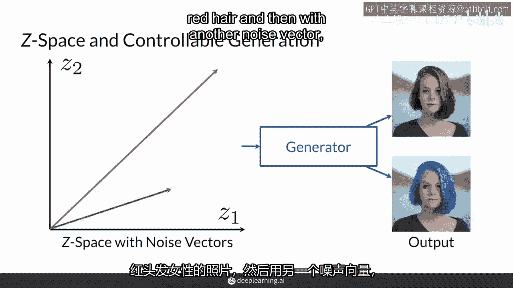

有了代表某个特征变化的方向 `d`，我们就可以控制GAN的输出了。这非常令人兴奋，因为它意味着我们可以有目的地编辑生成的内容。

以下是实现可控生成的基本操作：

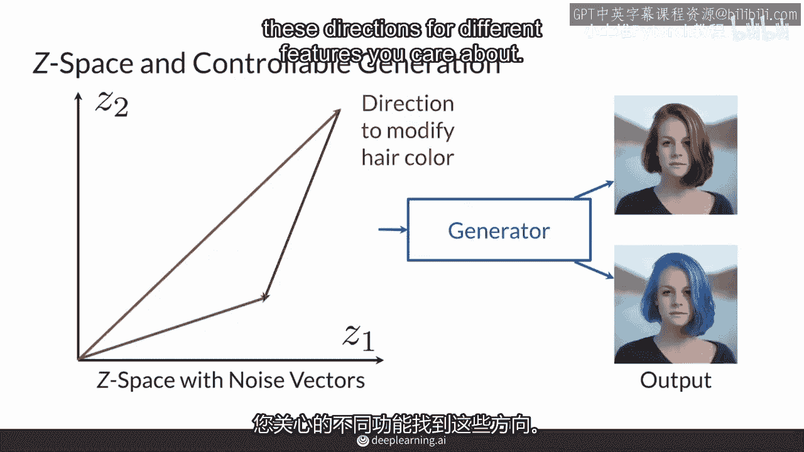

1.  首先生成一张初始图像。例如，使用噪声向量 `v1` 输入生成器 `G`，得到一张红发男士的图像。
2.  为了修改他的头发颜色，我们只需将找到的“头发颜色方向” `d` 加到原始噪声向量上，创建一个新的噪声向量：
    `v_new = v1 + β * d`
    其中，`β` 是一个控制变化强度的系数。
3.  将这个新向量 `v_new` 输入到同一个生成器 `G` 中，就能得到一张该男士头发变为蓝色的图像。

通过调整系数 `β`，我们可以控制特征变化的程度（例如，从深红变为浅蓝）。

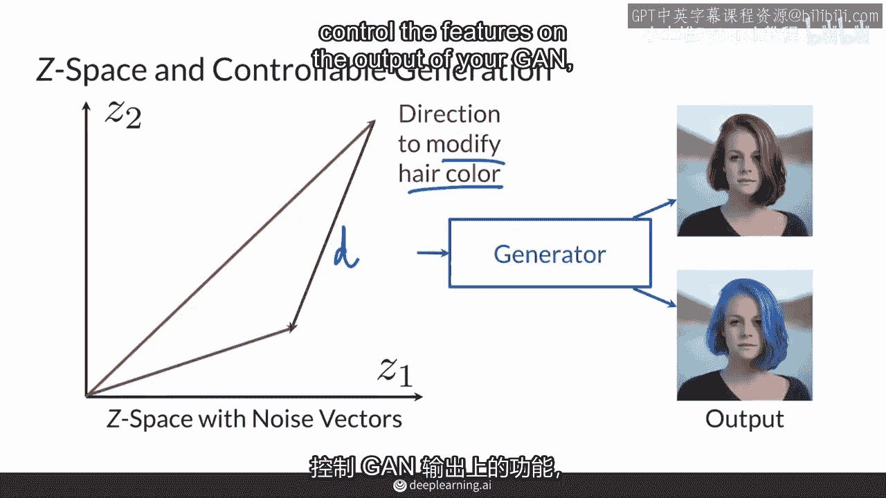

---

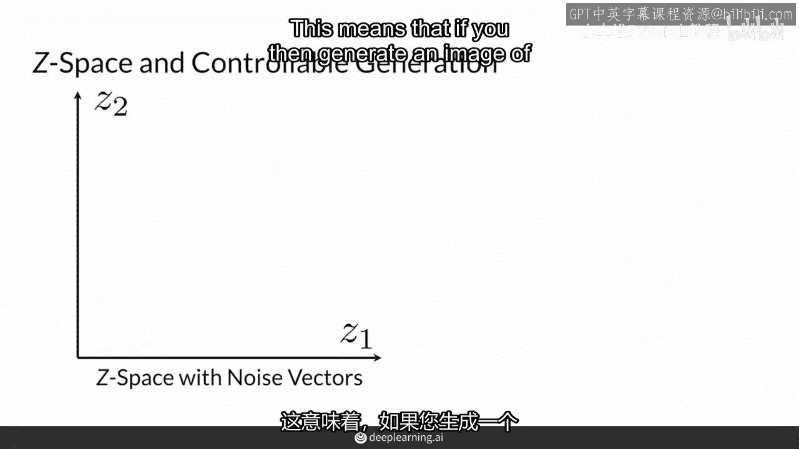

## 挑战与总结

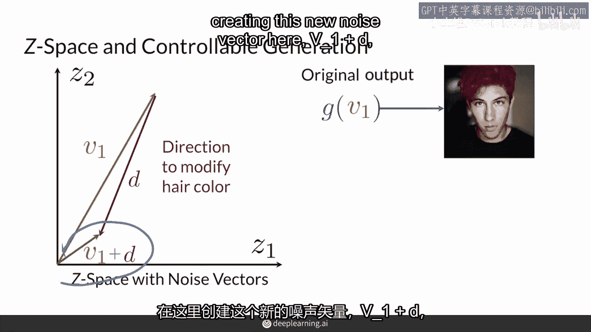

本节课中，我们一起学习了Z空间向量代数的核心概念。

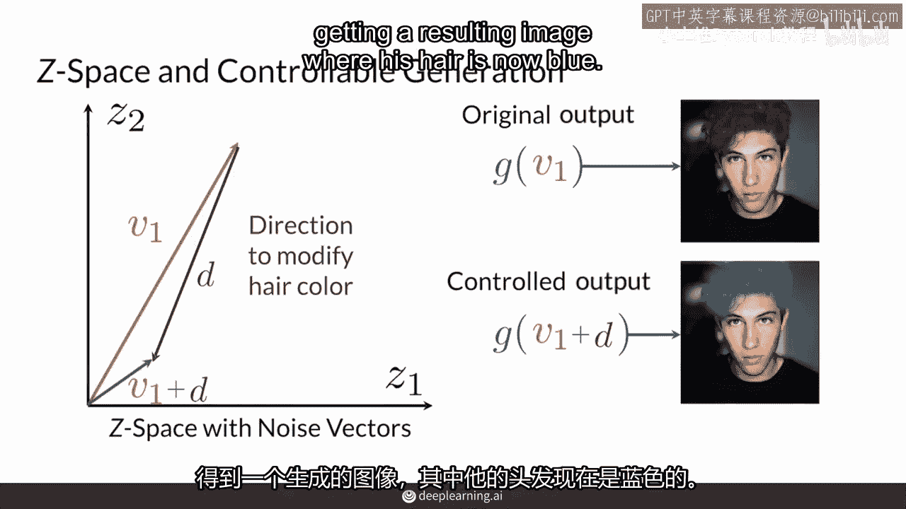

**总结如下：**
1.  **Z空间**是生成器输入噪声向量所在的高维空间。
2.  **图像插值**通过在两个向量间进行线性插值（`v_interp = α * v1 + (1 - α) * v2`），实现了图像间的平滑过渡。
3.  **可控生成**的本质是在Z空间中寻找与特定特征（如头发颜色）对应的**方向向量** `d`。
4.  通过在原噪声向量上加上该方向向量（`v_new = v + β * d`），即可实现对生成图像特征的定向编辑。

然而，可控生成也面临一些挑战，例如：
*   如何准确且高效地找到对应不同语义特征的可靠方向 `d`？
*   当同时修改多个特征时，方向之间可能会发生干扰。
*   确保沿着方向移动时，图像的其他无关属性保持不变。

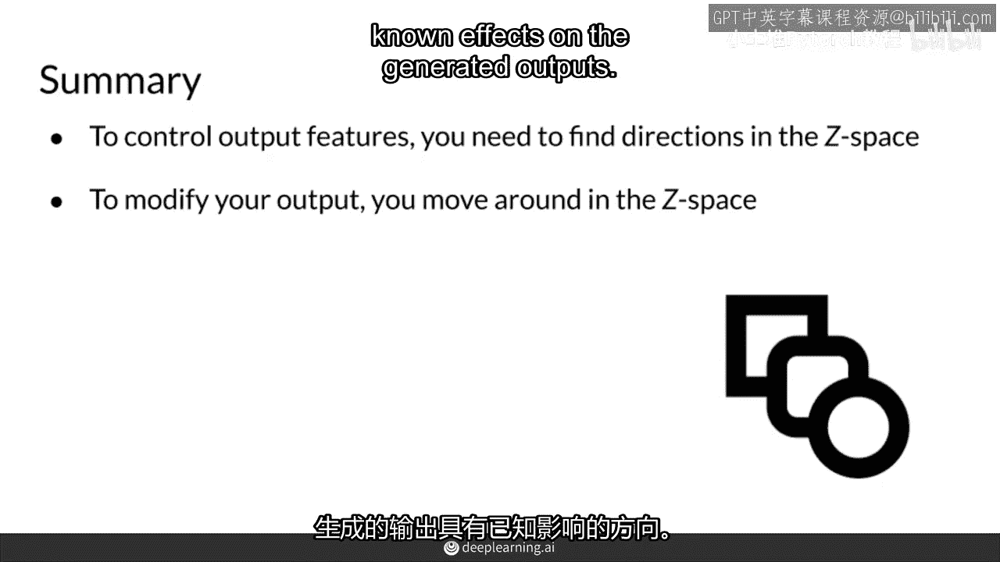

理解Z空间中的这些向量操作，是掌握高级GAN应用的重要基础。在接下来的课程中，我们将深入探讨如何实际寻找这些控制方向。