# 31：可控生成的挑战 🎯

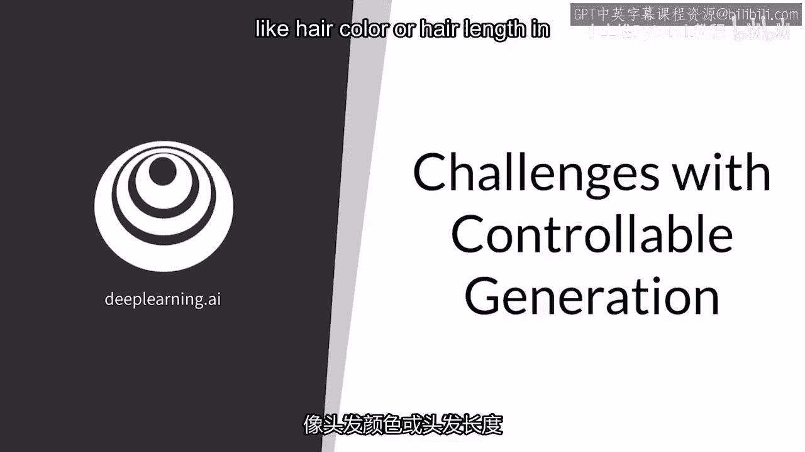

在本节课中，我们将要学习可控生成技术所面临的两个主要挑战：**输出空间的特征相关性**与**Z空间的纠缠**。理解这些挑战是掌握如何有效控制生成对抗网络（GAN）输出的关键。

---

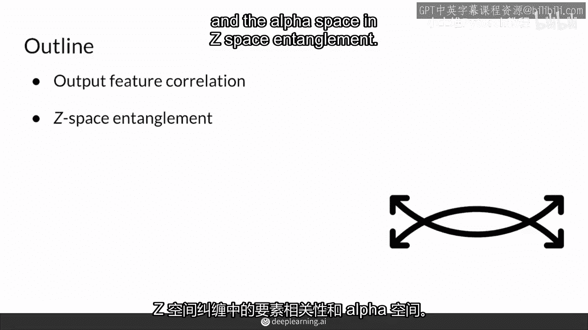

## 概述 📋

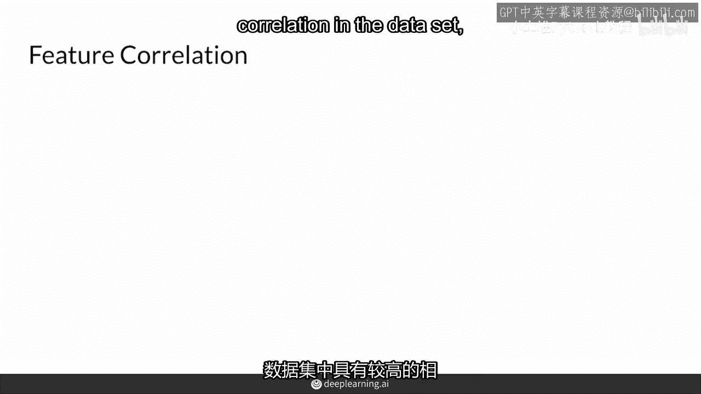

可控生成技术允许我们决定生成图像的特征，例如人物的发色或发长。然而，在实际应用中，实现精确控制会遇到一些困难。本节课程将详细探讨这些挑战及其成因。

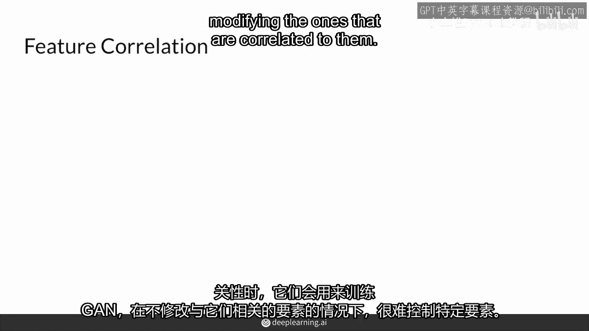

---

## 挑战一：输出空间的特征相关性 🔗

上一节我们介绍了可控生成的基本概念，本节中我们来看看第一个挑战——输出空间的特征相关性。当训练数据集中不同特征之间存在高度关联时，控制单一特征会变得困难。

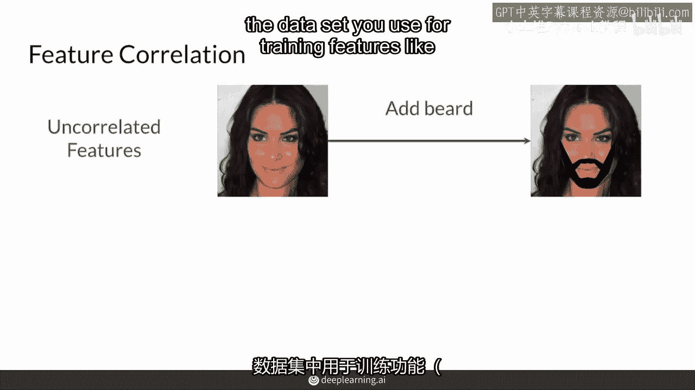

例如，你希望控制生成图像中人物的胡须量。如果数据集中“胡须的存在”与“面部的男性化程度”这两个特征高度相关，那么当你尝试给一张女性图片添加胡须时，模型可能不仅会添加胡须，还会同时改变面部结构，使其更男性化。

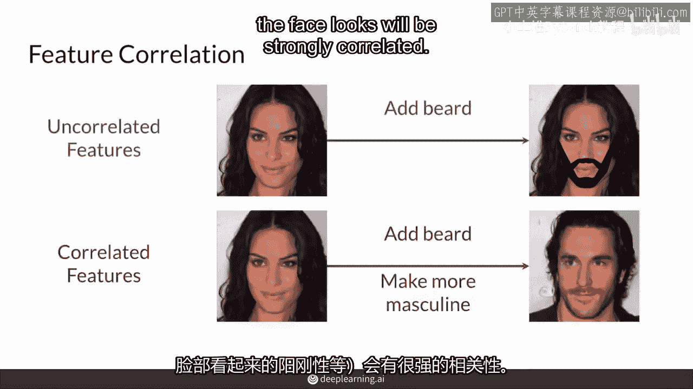

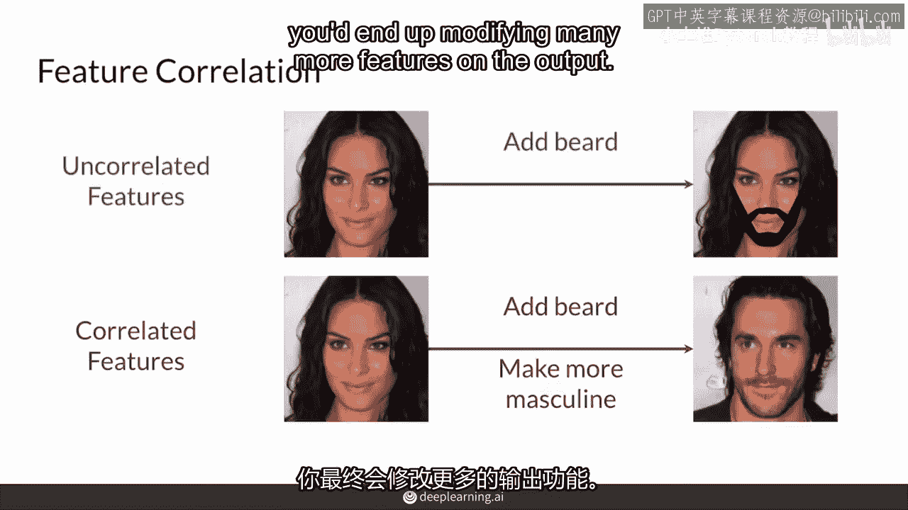

以下是特征相关性导致的问题：

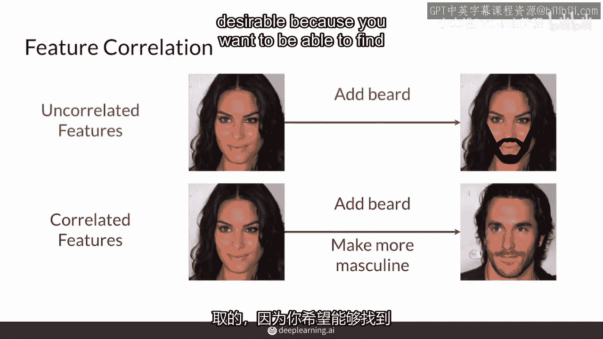

*   你希望控制单一特征（如胡须）。
*   但由于特征相关性，改变一个特征会连带改变其他相关特征。
*   这导致你无法实现精确、独立的特征编辑。

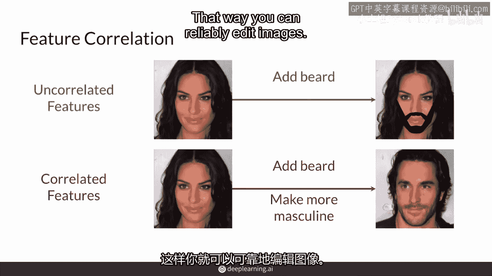

---

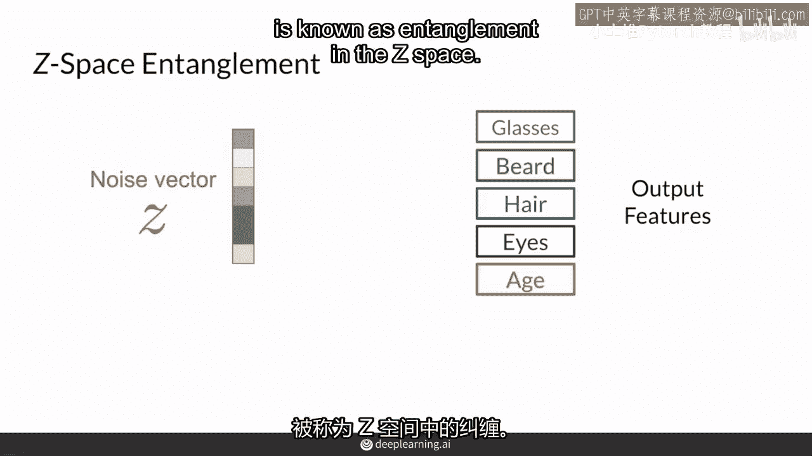

## 挑战二：Z空间的纠缠 🌀

在了解了特征相关性的挑战后，我们再来看看另一个常见问题——Z空间的纠缠。Z空间是生成器的输入噪声空间。当Z空间发生纠缠时，意味着噪声向量不同方向上的变化会同时影响输出中的多个特征。

即使这些特征在原始数据集中并无关联，仅仅因为噪声空间的学习方式不够解耦，就会导致这个问题。

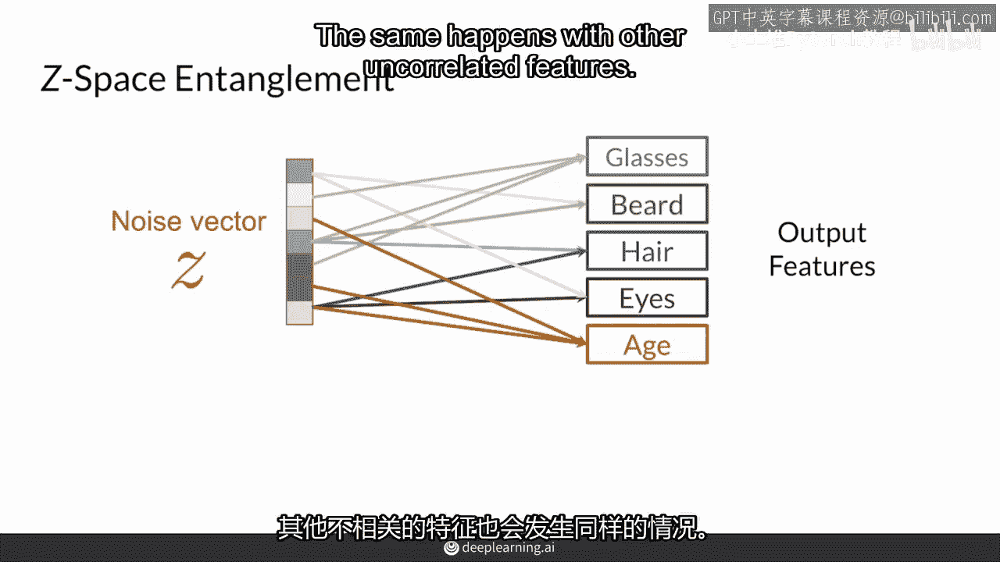

以下是Z空间纠缠的具体表现：

*   当你试图改变人物的年龄时，可能同时改变了她的眼睛和头发颜色。
*   当你试图给人物添加眼镜时，可能意外地改变了她的发型或胡须。
*   噪声向量 `z` 中某个分量的变化，会同时改变输出图像的多个特征，公式上可以理解为：`Δ输出 = f(Δz_i)`，其中 `Δz_i` 是噪声向量的一个变化，而 `f` 是一个复杂的映射，导致多个特征同时改变。

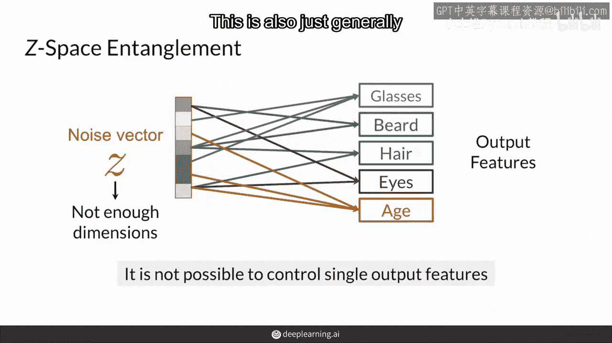

这种情况在Z空间的维度不足以清晰分离所有待控制特征时尤为常见，因为噪声向量无法与输出特征形成一一对应的关系。

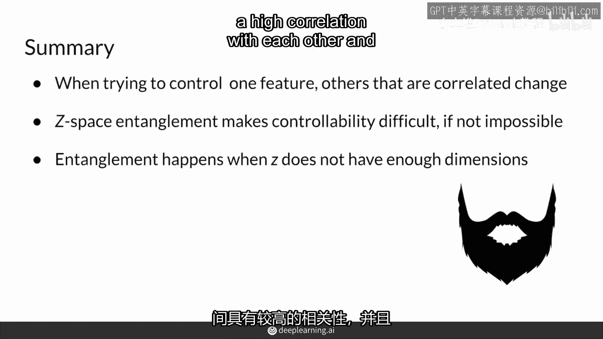

---

## 总结 🏁

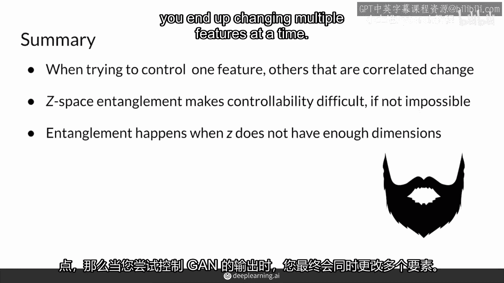

本节课中我们一起学习了可控生成面临的两大核心挑战。

1.  **输出空间的特征相关性**：由于训练数据中特征本身存在关联，试图控制一个特征会不可避免地影响其他相关特征。
2.  **Z空间的纠缠**：由于生成器输入噪声空间的结构问题，调整噪声向量会同时改变输出中多个不相关的特征，使得独立控制变得困难。

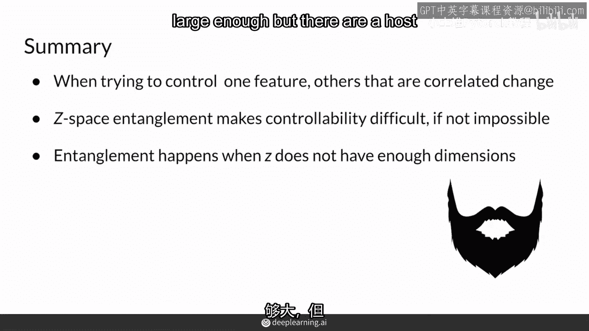

理解这些挑战是后续学习如何解决它们（例如通过解耦表示学习）的第一步。只有克服了这些障碍，我们才能实现真正精准、可靠的可控图像生成。