# 33：33. 解耦 🧩

在本节课中，我们将要学习生成对抗网络中一个重要的概念——**解耦**。我们将探讨什么是解耦的潜在空间，为什么它对可控生成至关重要，以及如何鼓励模型学习这样的空间。

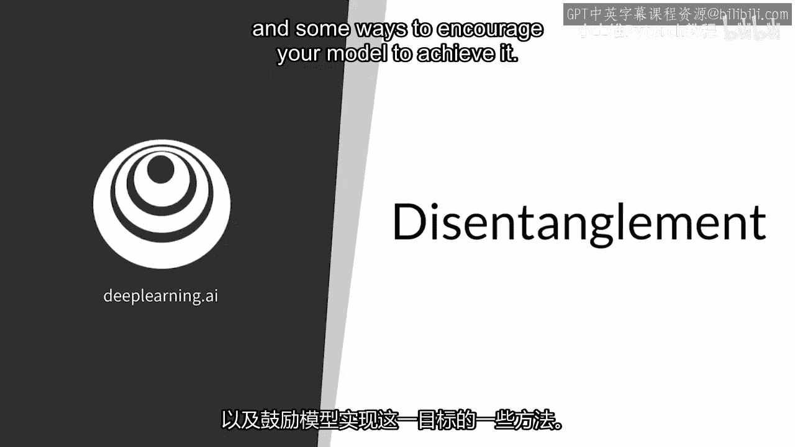

---

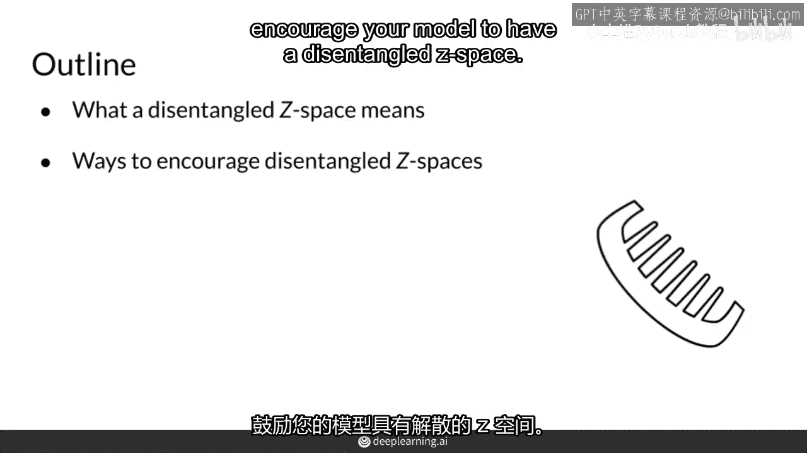

## 回顾：纠缠与非纠缠的潜在空间

上一节我们介绍了潜在空间中“纠缠”的含义及其在可控生成中带来的问题。本节中，我们来看看其对立面——“解耦”或“非纠缠”的潜在空间。

一个**解耦的潜在空间**意味着，输入噪声向量 `z` 中的每一个维度（或一组维度）都独立地、明确地对应着生成输出（如图像）中的某一个特定特征。

例如，假设我们有以下两个噪声向量 `v1` 和 `v2`，它们来自一个解耦的潜在空间：
```python
# 示例：解耦的噪声向量
v1 = [z_hair_color, z_hair_length, z_other1, z_other2, ...]
v2 = [z'_hair_color, z'_hair_length, z'_other1, z'_other2, ...]
```
在这个例子中：
*   噪声向量的**第一个维度** `z[0]` 可能对应生成人像的**发色**。
*   噪声向量的**第二个维度** `z[1]` 可能对应生成人像的**发长**。

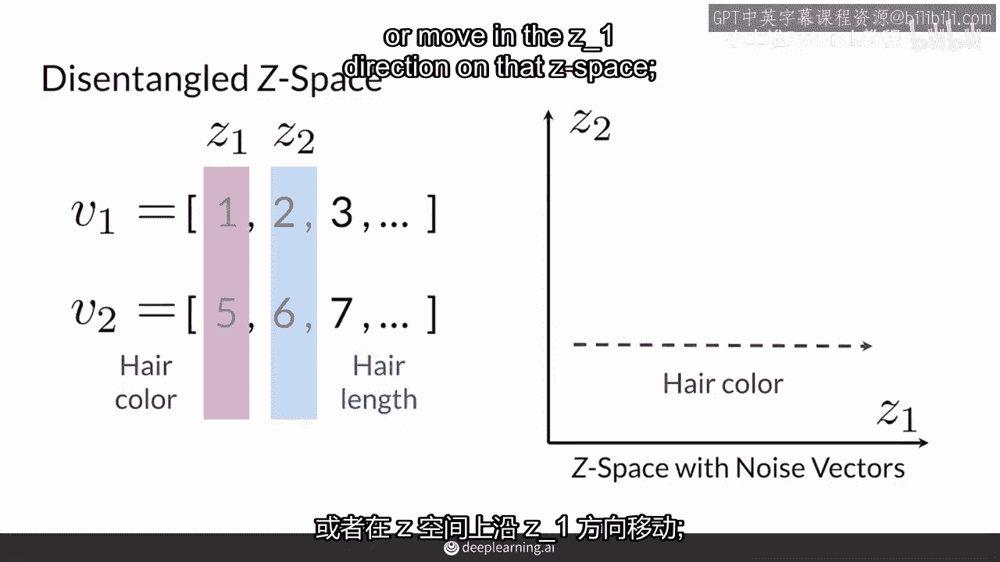

因此，如果你想改变生成图像中人物的发色，你只需要改变噪声向量中第一个维度的值。同样，要改变头发长度，只需改变第二个维度的值。其他维度的值可能不直接对应某个具体特征，但它们为模型提供了额外的灵活性，有助于学习更丰富的表达。

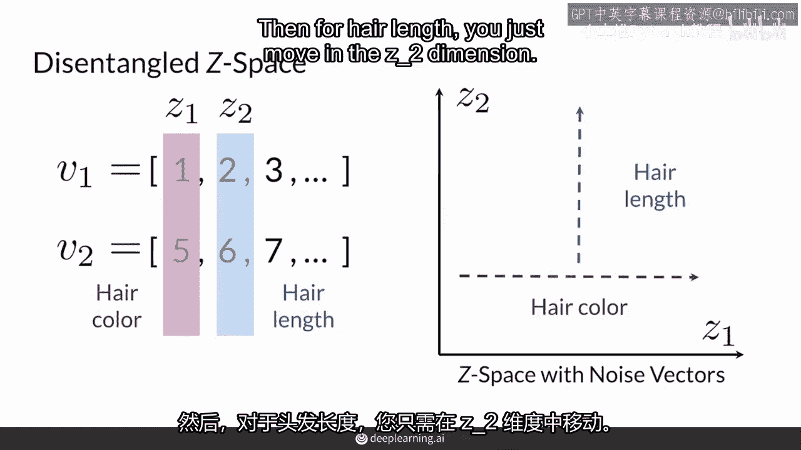

这些由噪声向量控制、决定输出外观但不直接显示在输出中的因素，通常被称为**潜在因素**或**变异因素**。

---

## 解耦与纠缠的关键区别

理解解耦空间的核心在于把握其与纠缠空间的关键区别。

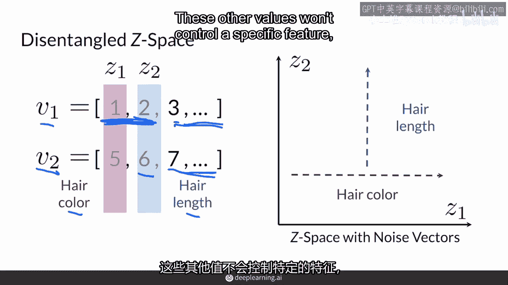

在**解耦的潜在空间**中，当你改变某个维度以控制一个输出特征（例如，是否戴眼镜）时，**其他特征（如胡须、发型）会保持不变**。

反之，在**纠缠的潜在空间**中，改变一个维度可能会同时影响多个不相关的特征。例如，试图给一个女性形象添加胡须时，可能会意外地改变其面部轮廓或发型。

解耦空间的目标是实现精准、独立的控制，公式化地表达这一理想状态就是：
**改变 z[i] → 仅改变 特征_i， 而 特征_j (j ≠ i) 保持不变。**

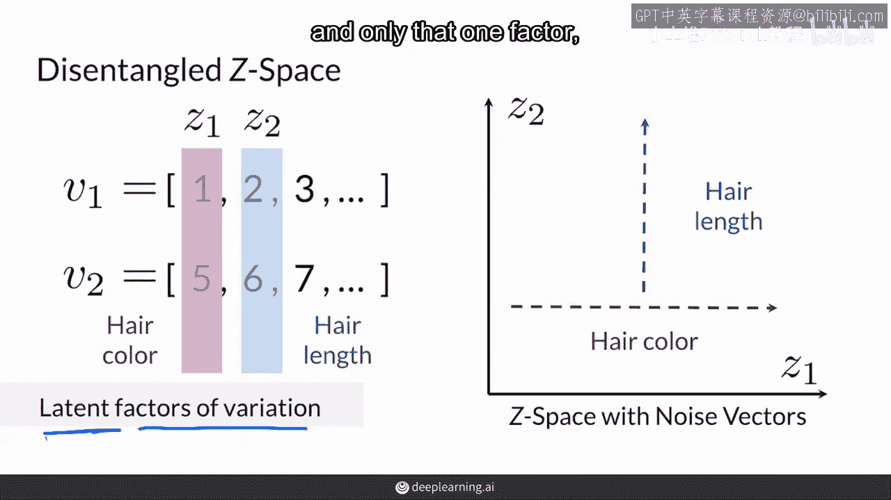

---

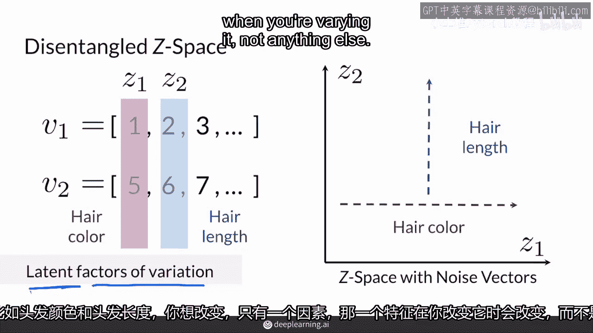

## 如何鼓励模型实现解耦

鼓励模型学习解耦潜在空间主要有两大类方法。

### 方法一：使用带标签的数据（监督方法）

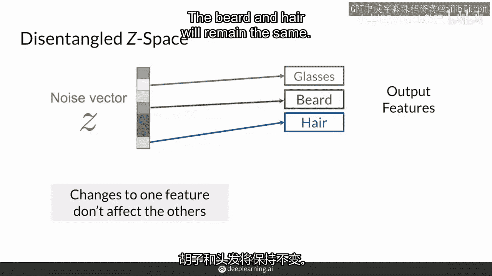

这种方法类似于条件生成，但信息嵌入的方式不同。

*   **核心思路**：对训练数据进行标注（例如，为每张人脸图片标记发色、是否戴眼镜等），然后在训练过程中，引导模型将特定的标签信息与噪声向量中特定的维度关联起来。
*   **优点**：如果标签准确，能较直接地引导模型学习解耦表示。
*   **挑战**：需要大量人工标注数据。对于连续值特征（如头发长度），定义离散的类别（“桶”）可能不够精确且工作量大。

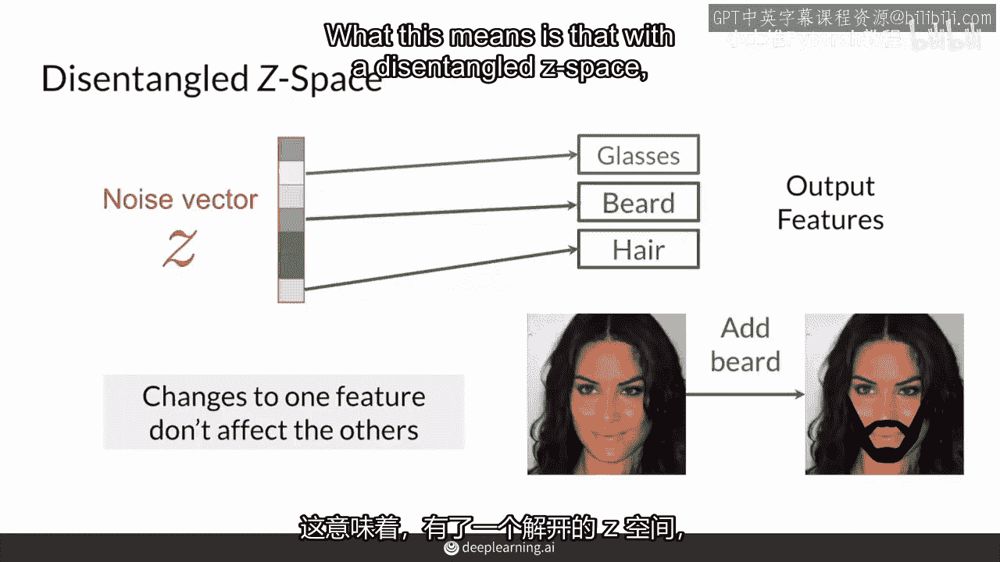

### 方法二：添加正则化项（无监督/半监督方法）

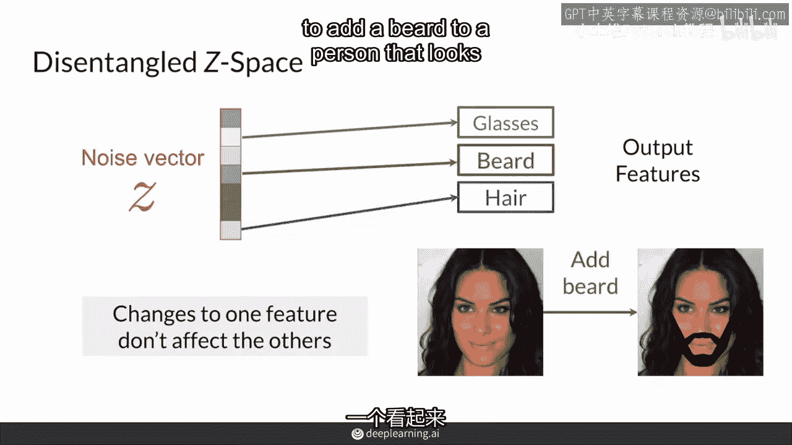

这种方法不需要对数据进行详细标注，而是通过修改损失函数来鼓励解耦。

*   **核心思路**：在标准的GAN损失函数（如BCE损失或Wasserstein损失）基础上，增加一个**正则化项**。这个正则化项的设计目标是鼓励噪声向量的每个维度与输出图像的某个独立特征相关联。
*   **常见技术**：许多先进方法利用**分类器的梯度**作为正则化信号的来源。例如，训练一个辅助分类器来识别图像中的某个属性（如微笑），然后通过分析生成器对此属性最敏感的噪声维度，来建立关联。
*   **优点**：避免了繁重的数据标注工作。
*   **公式示意**：
    `总损失 = 原始GAN损失 + λ * 正则化项`
    其中，正则化项用于惩罚不同特征维度之间的相关性。

以下是两种方法的简要对比：

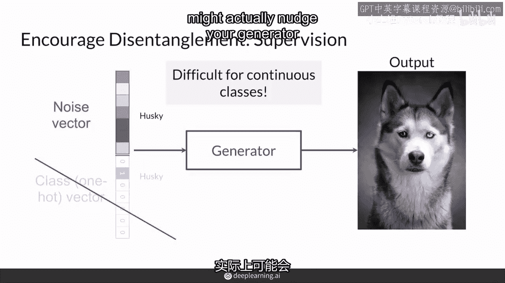

| 方法 | 是否需要详细标签 | 核心思想 | 优点 | 缺点 |
| :--- | :--- | :--- | :--- | :--- |
| **监督方法** | **是** | 将标签信息编码进噪声向量的特定维度 | 目标明确，引导直接 | 标注成本高，对连续特征处理不便 |
| **无监督方法** | **否** | 在损失函数中添加鼓励解耦的正则化项 | 无需标注，灵活性高 | 实现复杂，解耦效果可能不如监督方法明确 |

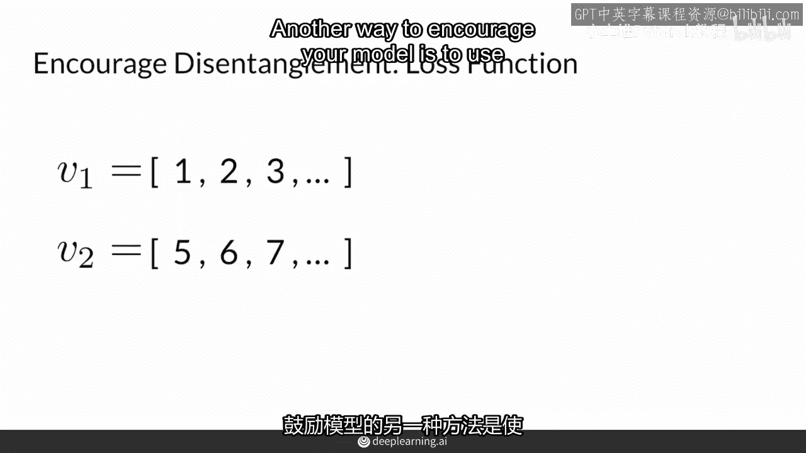

---

## 总结

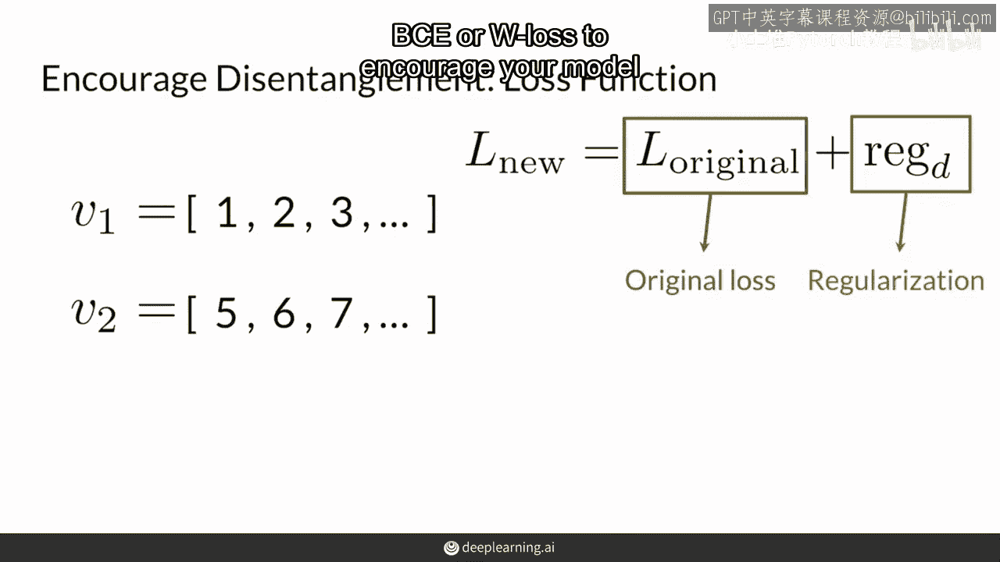

本节课中，我们一起学习了生成对抗网络中**解耦潜在空间**的概念。

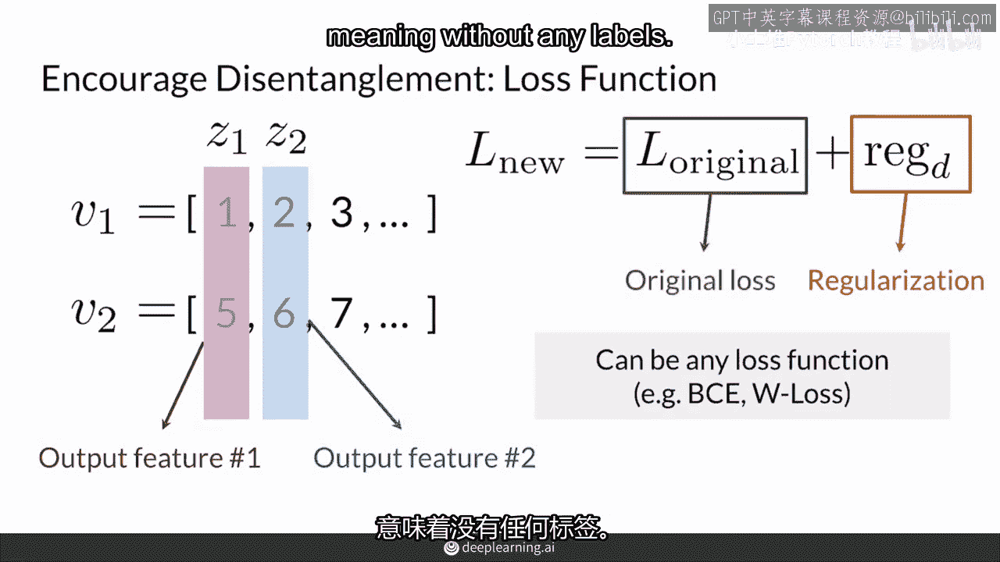

我们首先明确了**解耦空间**的含义：它是一个噪声向量 `z` 的每个维度独立控制生成输出单一特征的空间。这与**纠缠空间**形成对比，在纠缠空间中，改变一个维度会影响多个特征。

接着，我们探讨了鼓励模型实现解耦的两种主要途径：
1.  **使用带标签数据的监督方法**，通过将类别信息嵌入噪声向量来引导模型。
2.  **通过添加正则化项的无监督方法**，修改损失函数以鼓励噪声维度与输出特征间的独立性。

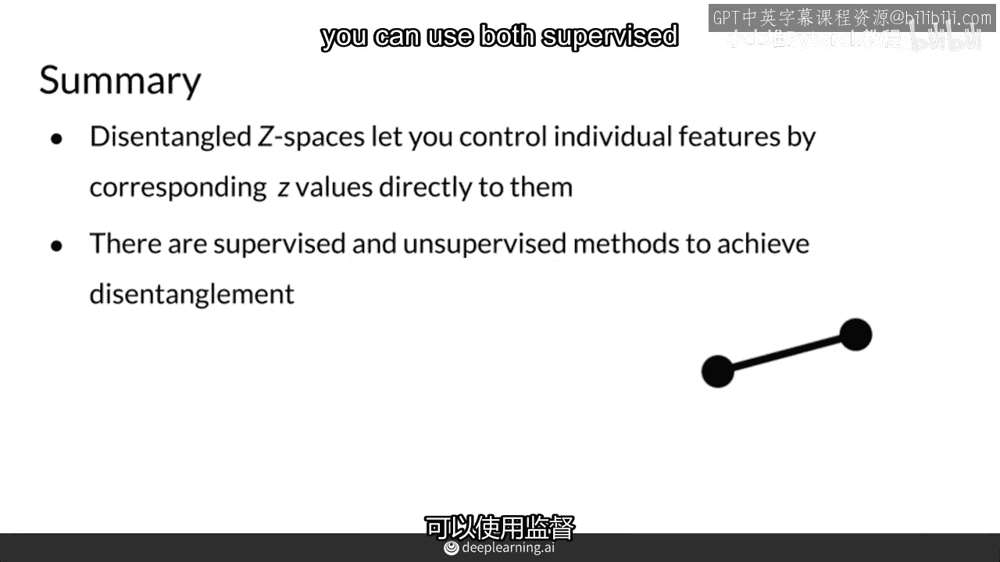

掌握解耦技术对于实现精准、可控的图像生成至关重要，是迈向高级生成模型应用的关键一步。