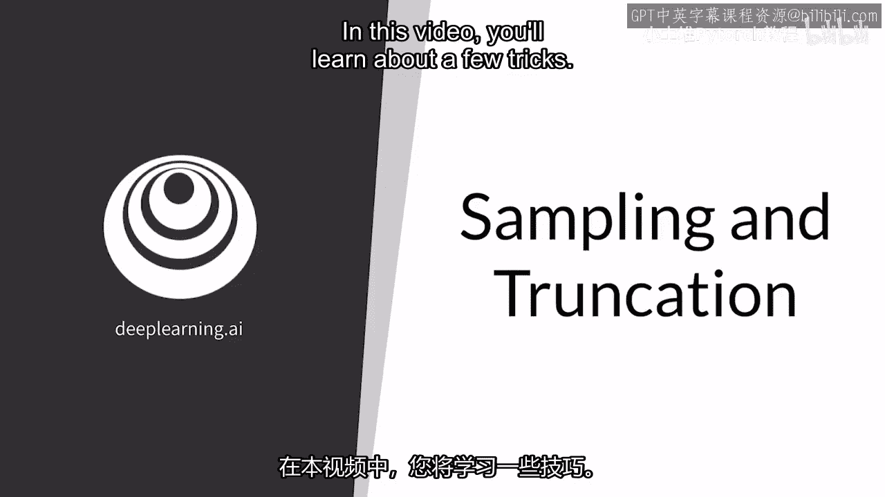
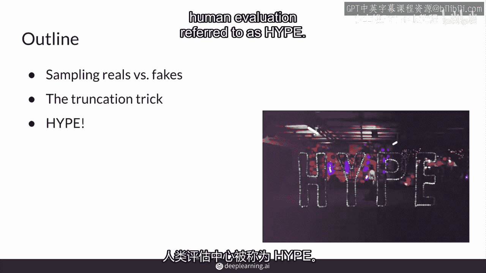
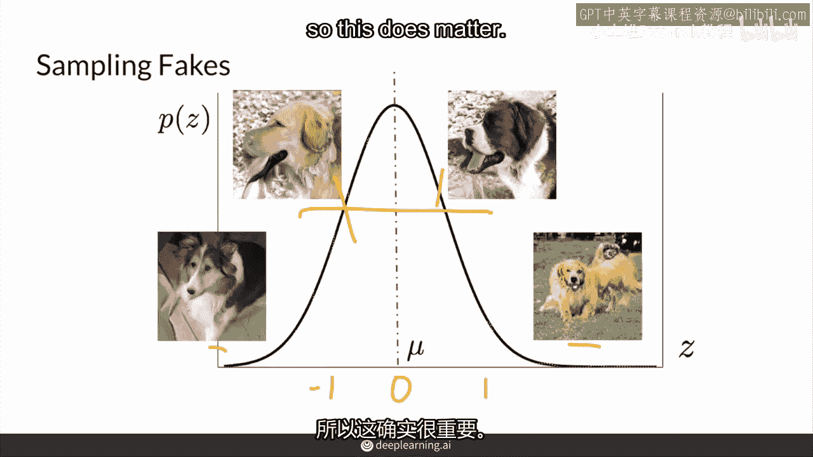
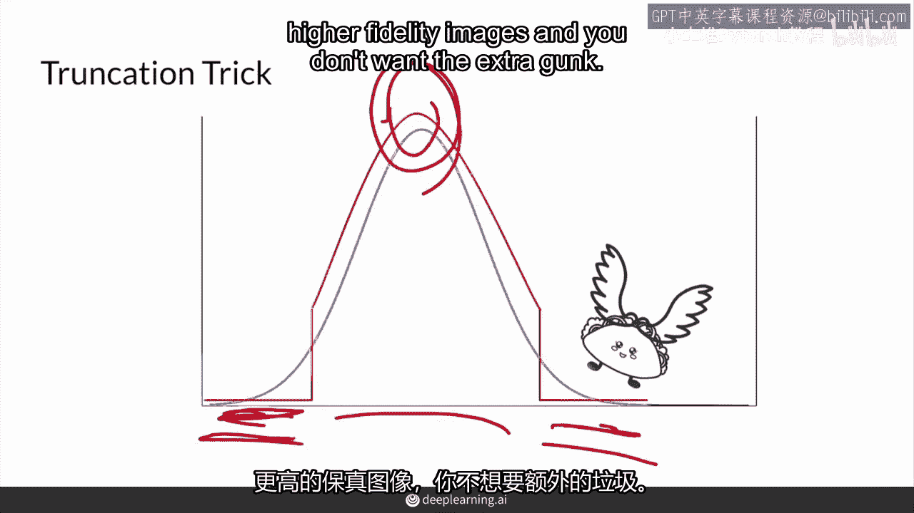
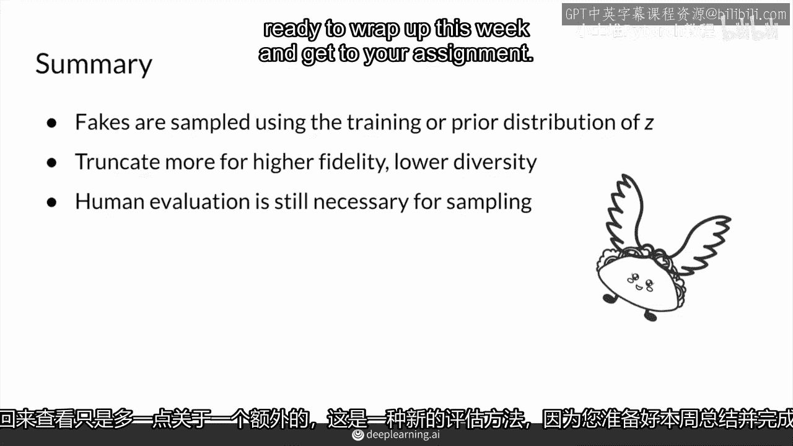

# 43：43. 采样和截断 🎲✂️

在本节课中，我们将要学习生成对抗网络（GAN）评估中的两个重要技巧：**采样**与**截断**。你将了解如何通过不同的采样策略来影响生成图像的质量与多样性，并掌握一个在模型训练完成后用于调整生成效果的实用技巧。

---

## 概述

你已经了解了GAN的主要评估方法。本节将深入探讨评估过程中的具体技巧，特别是如何通过控制噪声向量的采样来影响生成结果。我们将从采样策略的重要性开始，然后介绍一个广泛使用的“截断技巧”，最后讨论人类评估在GAN发展中的关键作用。

---

## 采样策略的重要性

上一节我们介绍了GAN的评估框架，本节中我们来看看评估时一个基础但关键的环节：**如何采样生成图像**。

在评估时，真实数据与伪造数据的统计数据都很重要。你会发现它们之间存在差异。一个在训练后可以进行的技巧是调整采样策略，以偏向更高的真实性或多样性。

以下是关于采样策略的核心要点：

*   **真实数据采样**：对于真实数据，通常可以随机均匀地采样。
*   **伪造数据采样**：对于伪造数据，通常的做法是根据训练时使用的噪声向量 `z` 的先验分布进行采样。
*   **常用先验分布**：在训练GAN时，通常使用正态分布作为噪声向量 `z` 的分布，其公式为 `z ~ N(0, 1)`。这意味着接近零的向量值在训练中出现频率更高。
*   **采样位置的影响**：使用接近零的 `z` 值进行采样，生成的图像质量（保真度）通常较高，但会导致多样性降低。使用远离零的 `z` 值采样，可能会生成更奇怪、多样性更高但质量较差的图像。

因此，你的采样技术实际上成为评估和后续应用的一个重要方面。因为像FID或Inception Score这样的评价指标是基于模型生成的**样本**运行的，而非模型参数本身，这意味着评估结果在很大程度上依赖于你所采样的图像。

---

## 截断技巧：权衡保真度与多样性

遵循对保真度与多样性之间权衡的观察，有一种叫做**截断技巧**的采样方法被广泛使用。

截断技巧是一个在模型训练完成后进行的后处理步骤，它通过在保真度和多样性之间进行权衡来调整生成效果。

该技巧的核心是截断训练时使用的正态分布（例如 `N(0,1)`）的尾部。通过设定一个超参数（截断阈值），决定保留分布中心的多少部分，而舍弃两端的极端值。

以下是截断技巧的工作原理：

*   **追求高保真度**：如果你希望生成图像的质量和真实感更高，你应在零附近采样，并截断更大比例的尾部（即使用较高的截断阈值）。但这会减少生成图像的多样性，因为一些“古怪”但可能新颖的样本被排除在外。
*   **追求高多样性**：如果你希望生成图像的多样性更大，你应在分布的尾部更多地采样，并使用较低的截断阈值。然而，这些图像的保真度可能会降低，因为生成器在训练时很少接收到关于这些极端噪声向量应生成何种“真实”图像的反馈。

你当然也可以使用不同的先验噪声分布（如均匀分布）来训练模型。但正态分布之所以流行，正是因为人们可以方便地在其上应用截断技巧来调整权衡。

研究表明，当人们尝试不同的先验噪声分布时，并未发现显著区别。正如预期的那样，一个模型的FID分数在缺乏多样性或保真度时会变差。因此，使用截断技巧生成的样本在自动化指标上可能表现不佳，但在特定的下游应用中，若你需要更高保真度的图像且不希望出现“垃圾”输出，这个技巧可能非常符合你的需求。

---

## 人类感知评估：最终的标尺

说到使用那些截断后“在人眼中看起来更好”的样本，我们必须承认，使用人类进行评估仍然是GAN评价的重要组成部分，通常是开发过程中的关键环节。

自动化评价指标仍然不能完全捕捉我们想要的生成质量，因此人类感知评估仍然设定着基准和标准。

最近开发的一种基于原则的众包感知任务系统，为GAN评估提供了一种系统化方法。它被称为 **HYPE**（Human eYe Perceptual Evaluation，人眼感知评估）。

HYPE的工作方式是向众包评估者（如亚马逊 Mechanical Turk 工作者）连续展示一系列图像，并要求他们判断每张图片是真实的还是伪造的。

HYPE的一个变体版本会以不同的毫秒时长闪现图片，以测试评估者在多短的时间内能判断图片真伪。你的生成模型越好，人类就需要更长的时间来判断图片是否是伪造的。而HYPE Infinity版本则移除了时间阈值，只是简单地浏览图片。

当然，最终的评估将取决于你想要的**下游任务**。例如，如果你的GAN生成的是带有肺炎的X光图像，你希望确保专业医生认可其真实性，而不是让非专业人士或预训练在ImageNet上的分类器来做决定。

---

## 总结

本节课中我们一起学习了GAN评估中的采样与截断技巧。

现在你知道了如何通过在训练期间使用的 `z` 的先验分布来采样伪造图像。在测试或推理阶段，你还掌握了一个新技巧——**截断技巧**。它可以让你通过截断采样分布的尾部（或多或少），来调整你是对更高的保真度还是更高的多样性感兴趣。

虽然自动化的评价指标是一个良好的近似，但它们仍无法完全替代人类感知。人类评估在设定质量基准方面仍然至关重要，而HYPE等方法为快速评估图片质量提供了系统化的途径。

感谢你花时间学习。请继续关注关于其他新评估方法的更多内容。