# 44：44. 精确率与召回率 🎯

在本节课中，我们将学习生成对抗网络（GAN）及其他生成模型的两个重要评价指标：**精确率**与**召回率**。我们将理解它们如何分别衡量生成样本的**真实性**与**多样性**，并探讨它们之间的关系。

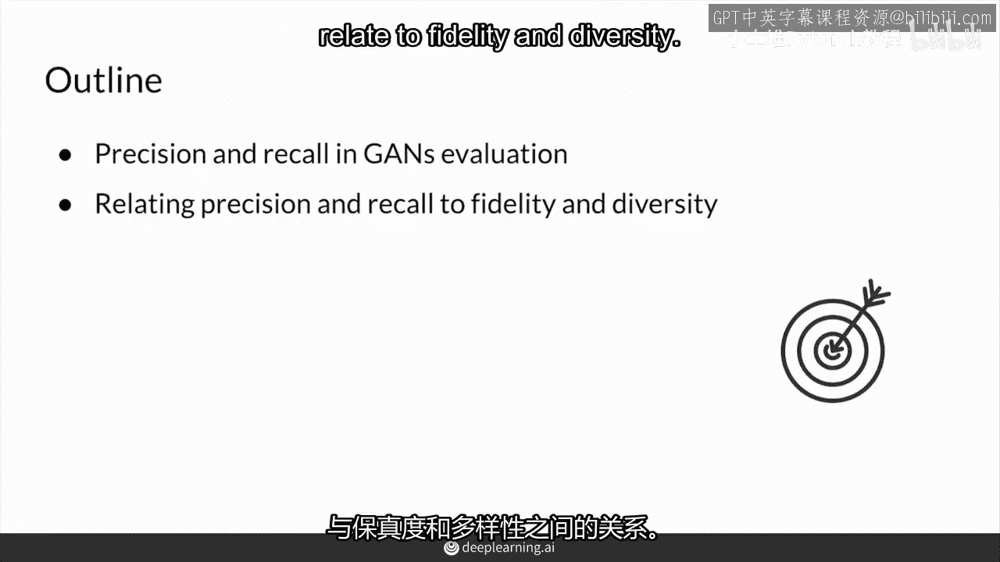

---

## 概述

在生成模型的评价中，除了传统的指标，近年来出现了一些新的评价方法。其中，将分类任务中的**精确率**与**召回率**概念扩展到生成模型领域，是一种特别值得注意且有趣的做法。它帮助我们更直观地理解生成器的性能。

---

## 核心概念：真实分布与生成分布

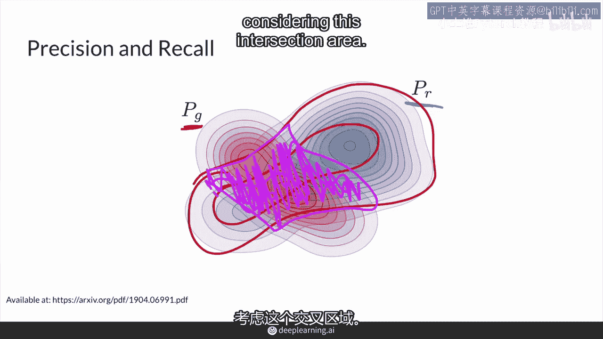

首先，我们引入两个核心分布：
*   **真实分布 (Pr)**：代表真实数据（例如，真实的人脸图片）在数据空间中的概率分布。
*   **生成分布 (Pg)**：代表生成器模型（如GAN的生成器）能够生成的所有样本的分布。

理想情况下，生成器的最佳目标是让生成分布 **Pg** 与真实分布 **Pr** 完全重叠。这意味着生成器不仅能生成逼真的样本，还能覆盖真实数据的所有变化。

---

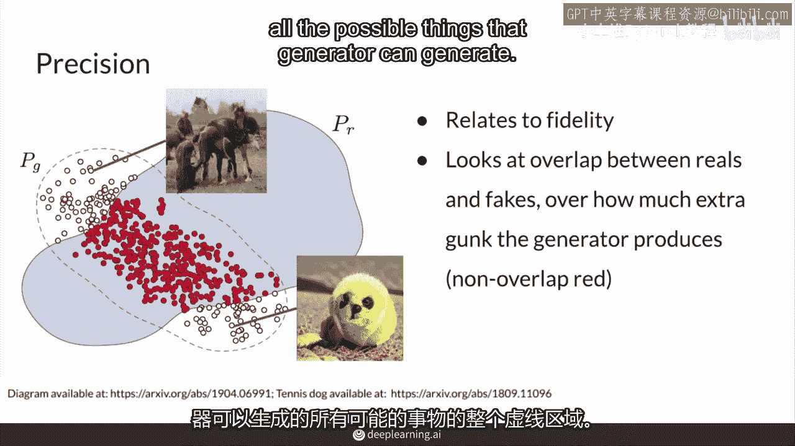

## 精确率 (Precision)

上一节我们介绍了两个核心分布，本节中我们来看看**精确率**。

精确率关注的是**生成样本的质量**。它衡量在所有生成的样本中，有多少是“好”的（即看起来真实的）。

以下是精确率的直观解释：
*   **分子（交集）**：生成的、且与真实分布重叠的样本（即看起来逼真的假样本）。
*   **分母（整个生成区域）**：生成器能够生成的所有样本，包括逼真的和“垃圾”的。

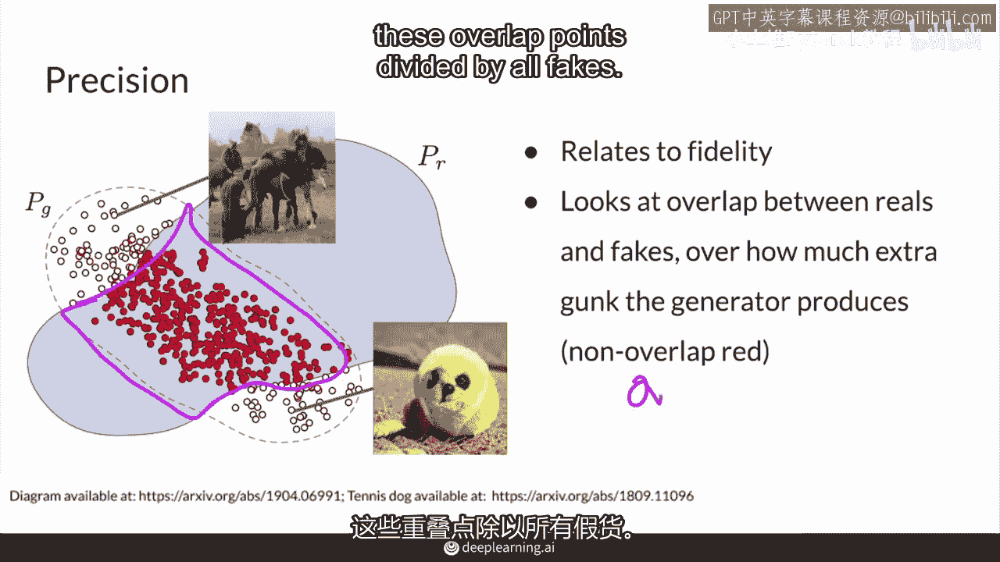

因此，精确率的**公式**可以理解为：
**精确率 = (看起来真实的生成样本数量) / (所有生成样本的数量)**

**高精确率**意味着生成器产生的样本大部分质量都很高，看起来很真实。但它不要求生成器能生成所有类型的真实样本。即使生成器只擅长生成某一小类逼真的图像（例如，只生成正面人脸），它的精确率也可能很高。

**核心要点**：精确率与生成样本的**真实性**或**保真度**直接相关。

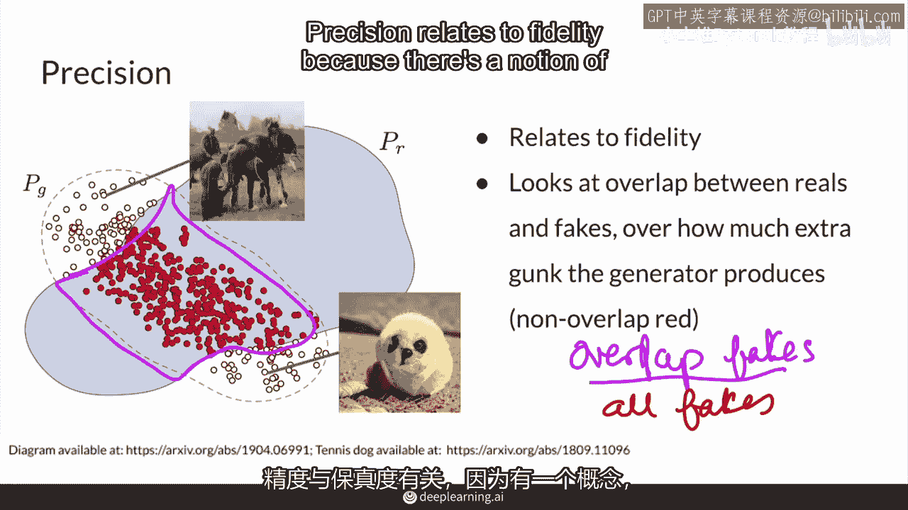

---

## 召回率 (Recall)

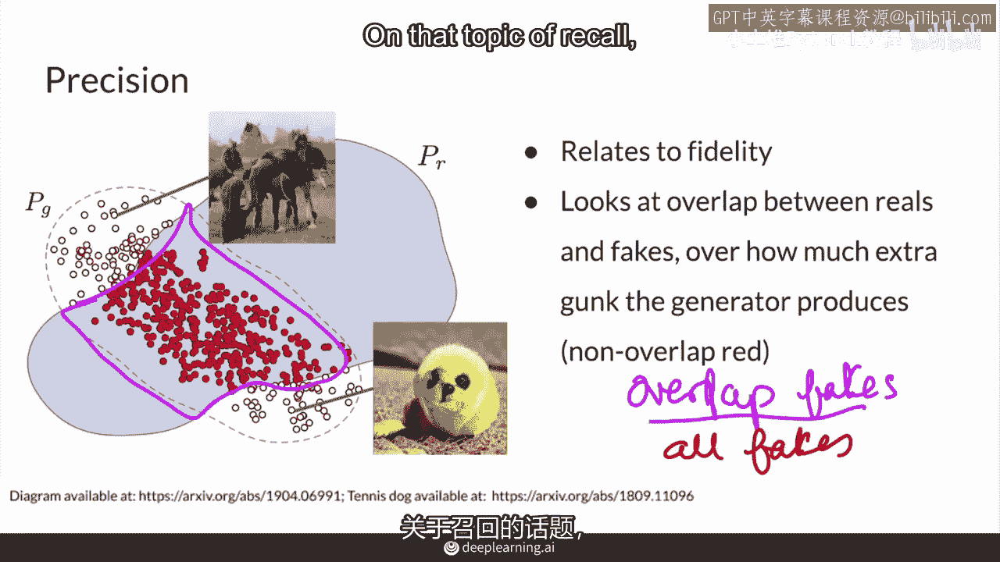

理解了衡量质量的精确率后，我们再来看看衡量覆盖范围的**召回率**。

召回率关注的是**生成样本的多样性**。它衡量生成器能够覆盖多少真实数据分布。

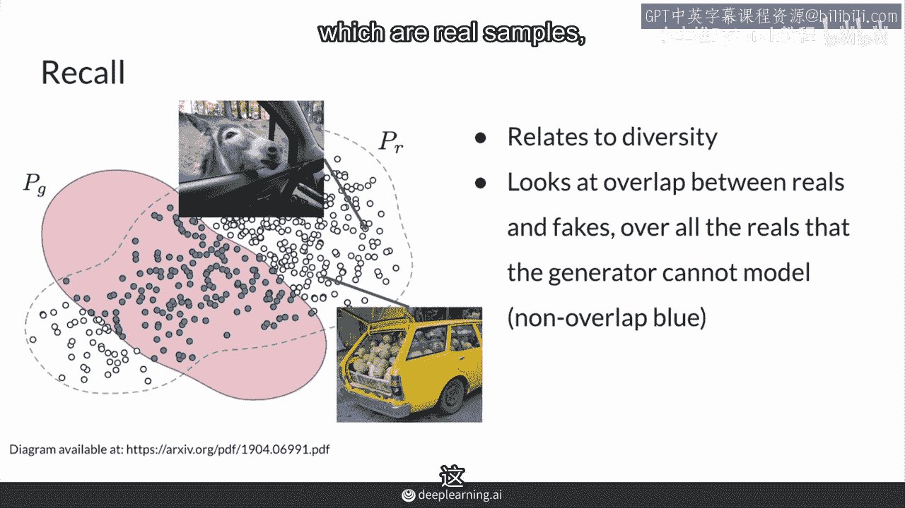

以下是召回率的直观解释：
*   **分子（交集）**：同样是生成的、且与真实分布重叠的样本。
*   **分母（整个真实区域）**：所有可能的真实样本。

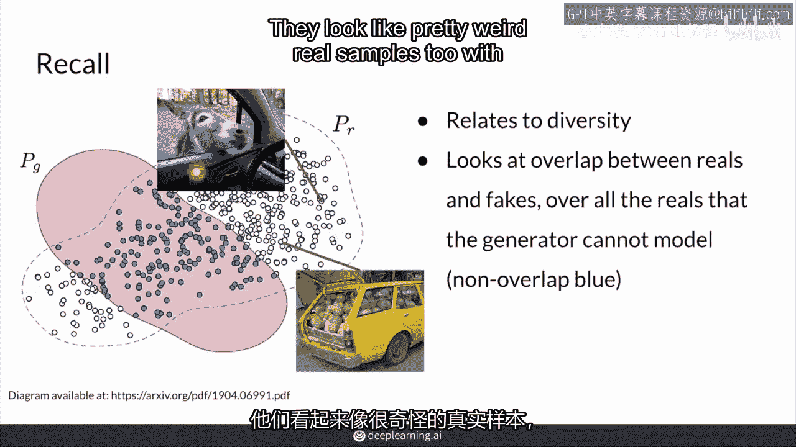

因此，召回率的**公式**可以理解为：
**召回率 = (看起来真实的生成样本数量) / (所有真实样本的数量)**

**高召回率**意味着生成器能够建模出真实数据中几乎所有的变化和模式。它衡量的是生成器的“创造力”或覆盖能力。

**核心要点**：召回率与生成样本的**多样性**直接相关。

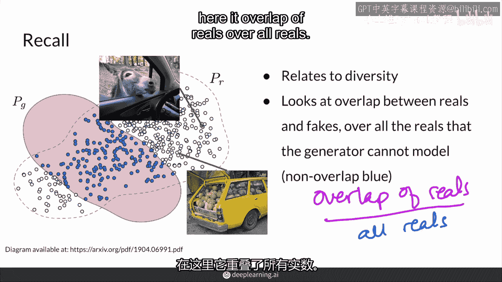

---

## 精确率与召回率的权衡

在实际的生成模型中，尤其是参数量巨大的现代模型（如大型GAN），往往存在一种权衡。

模型通常更容易获得较高的**召回率**，因为它有足够的能力去记忆和覆盖训练集中的所有模式，甚至生成更多变化。然而，这也可能导致它产生许多不属于真实分布的、奇怪的“垃圾”样本，从而拉低**精确率**。

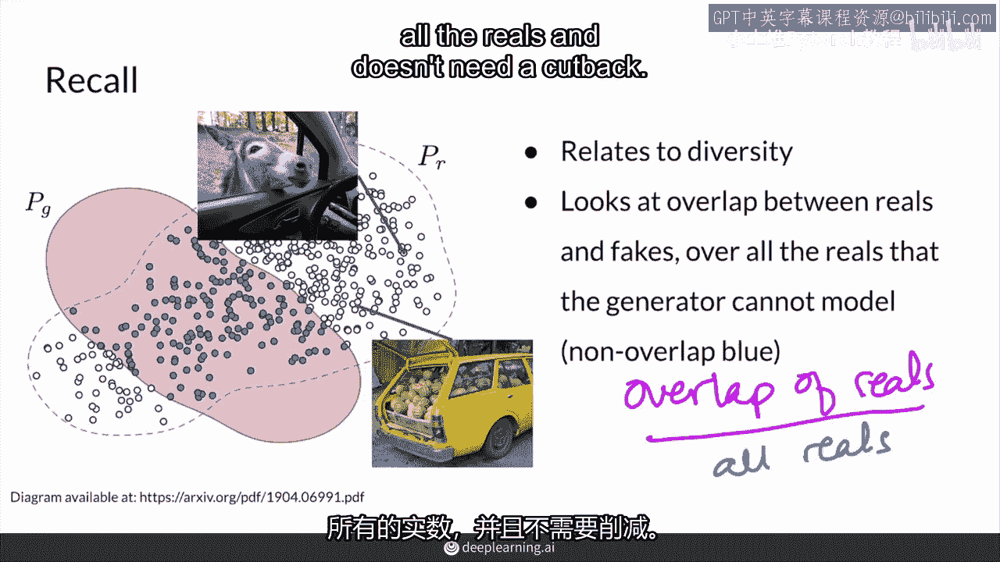

这就引出了**截断技巧**的应用。通过限制生成器的输入噪声范围，可以牺牲一部分多样性（召回率），来过滤掉那些低质量的生成样本，从而显著提升生成样本的整体质量（精确率）。这对于许多下游应用（如图像编辑、合成）非常有用。

---

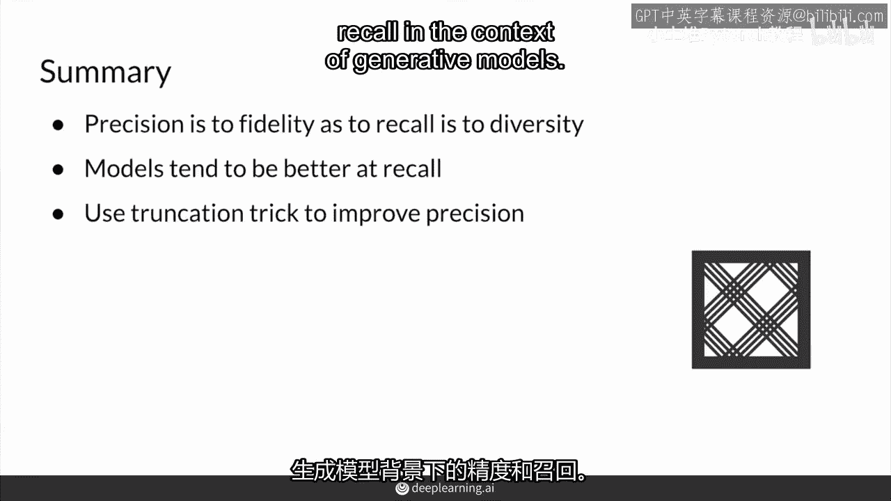

## 总结

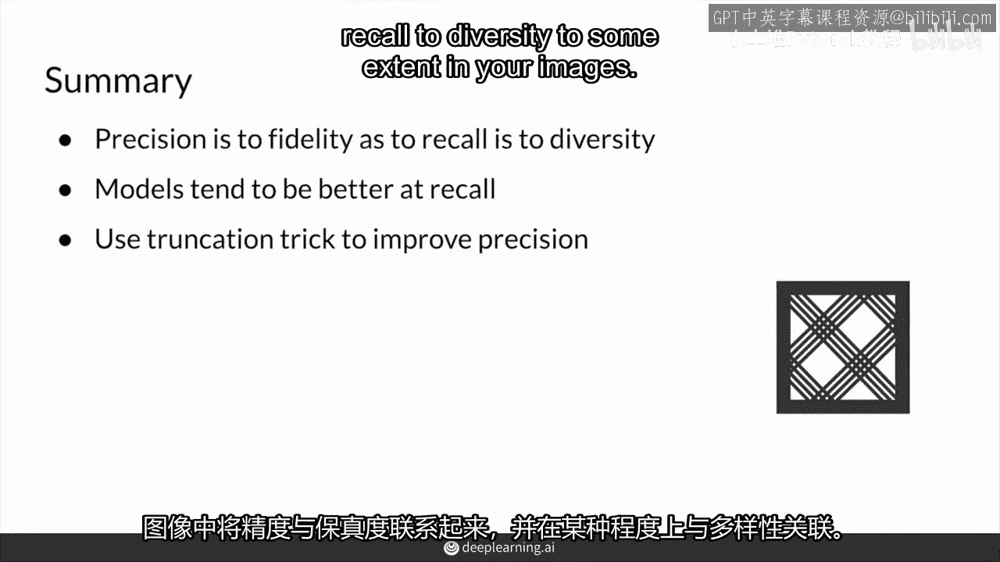

本节课中，我们一起学习了生成模型评价中的两个关键指标：

1.  **精确率**：衡量**生成样本的质量**。高精确率意味着“生成的样本大多很逼真”。
2.  **召回率**：衡量**生成样本的多样性**。高召回率意味着“生成器能创造出真实数据中的各种类型”。

你现在可以将精确率与**真实性**关联，将召回率与**多样性**关联。理解这种权衡有助于你评估模型，并在实际应用中使用像**截断技巧**这样的方法来优化模型输出，以获得最佳性能。

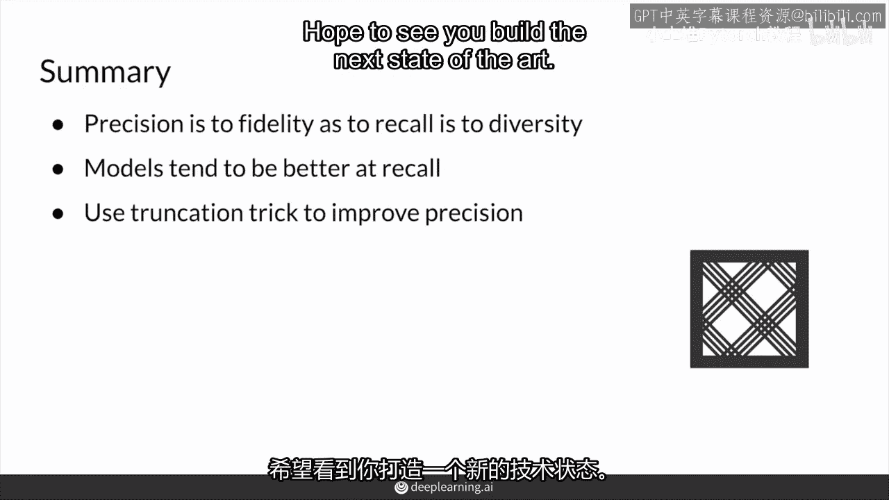

你已经完成了本周课程的所有理论材料，准备好进入实践环节吧。找出你的最佳模型检查点，享受编码的乐趣！