# 46：GAN的缺点 🧐

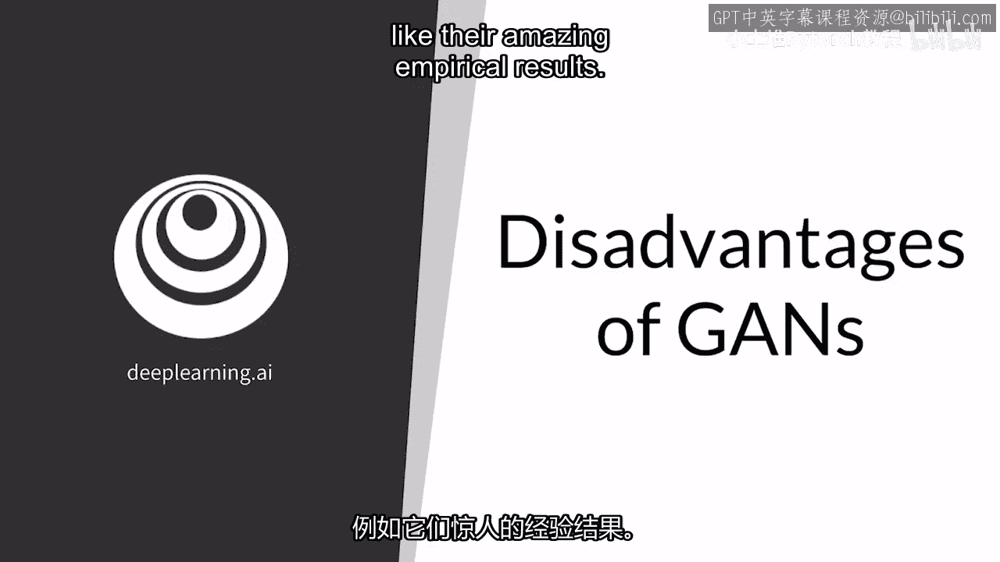

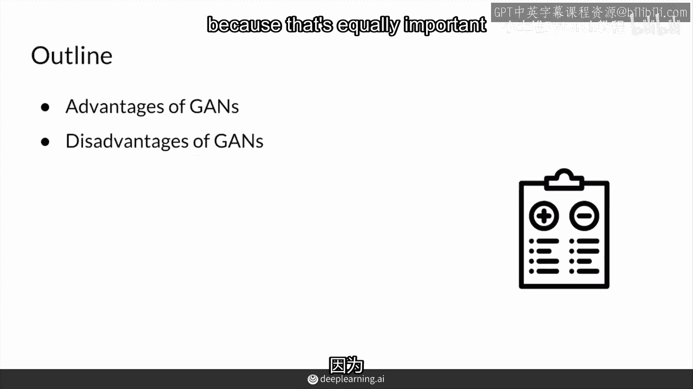

在本节课中，我们将学习生成对抗网络（GAN）的一些主要缺点。了解这些局限性对于全面掌握GAN技术至关重要。

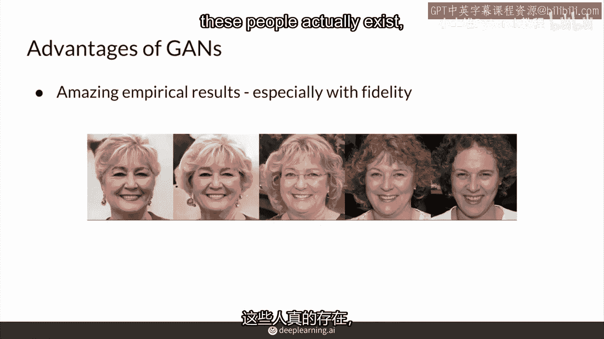

之前我们学习了如何让GAN工作，并主要关注了其优点，例如它能够生成惊人的逼真效果。现在，我们将看到GAN的一些缺点，这对于学习任何新技术都同样重要。

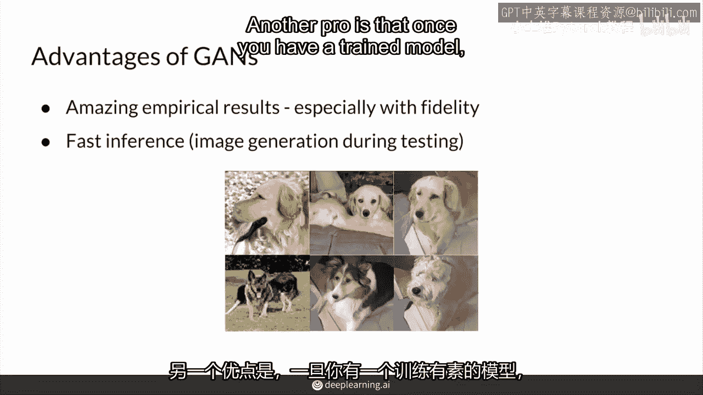

## 优点回顾

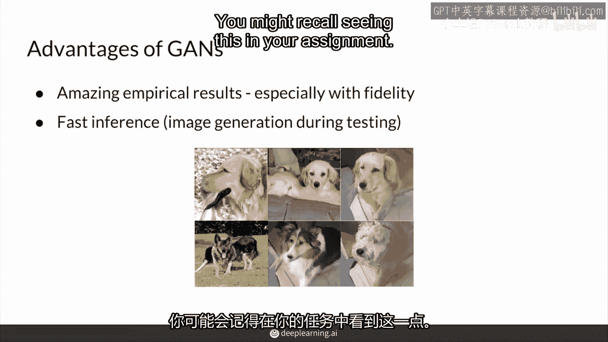

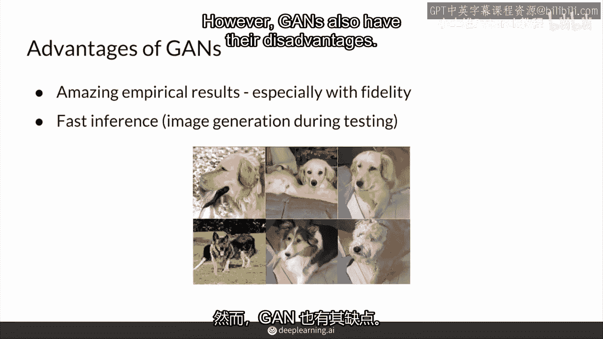

在深入探讨缺点之前，我们先简要回顾一下GAN的显著优势。

*   **生成高质量图像**：GAN可以生成对肉眼来说非常逼真的图像，以至于可能被误认为是真实存在的。
*   **快速生成**：一旦拥有训练好的模型，加载模型权重并输入噪声，即可快速生成对象。

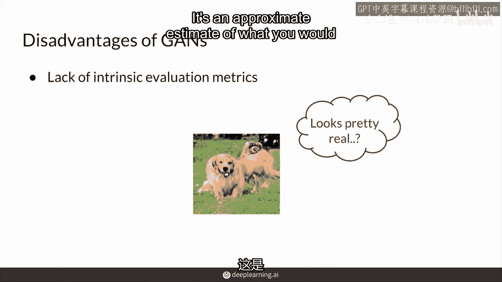

## GAN的主要缺点

然而，GAN也存在其固有的缺点。以下是几个关键方面。

### 1. 缺乏明确的评估指标 🎯

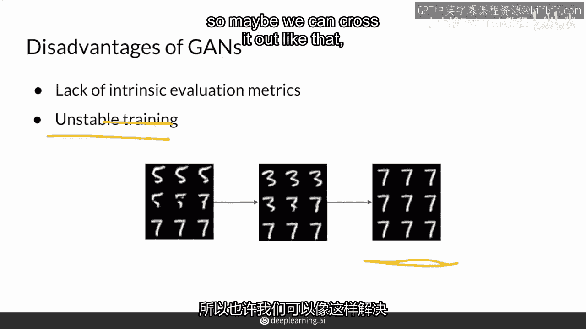

GAN缺乏明确、理论上的内在评价指标。你无法仅通过查看模型权重或输出就轻易判断哪个模型更好。为了评估GAN，通常需要比较许多生成样本的特征，并与真实图像进行对比。但即使这种方法也不完全可靠，它只是理想评价方法的一种近似估计。

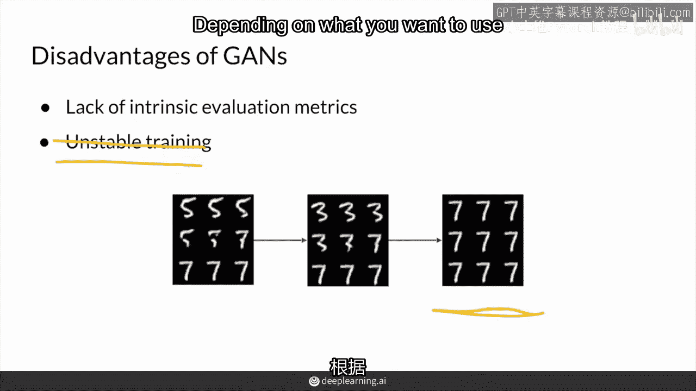

### 2. 训练不稳定与耗时 ⏳

在训练过程中，模型可能会不稳定，并且需要很长时间才能收敛。这有时感觉更像是一门艺术而非科学，因为梯度下降并不总能得到你想要的生成器。例如，**模式崩塌**（Mode Collapse）就是一个典型问题，即生成器卡在生成有限几种样本（如所有输出都是数字“7”）的模式上。你不能简单地继续训练并期望GAN自动收敛，需要经常检查并在合适时机停止训练，这通常需要定性检查生成的样本。不过，这个问题在一定程度上已被 **Wasserstein Loss** 和 **Lipschitz连续性** 等技术所缓解。

### 3. 缺乏显式的概率密度估计 📊

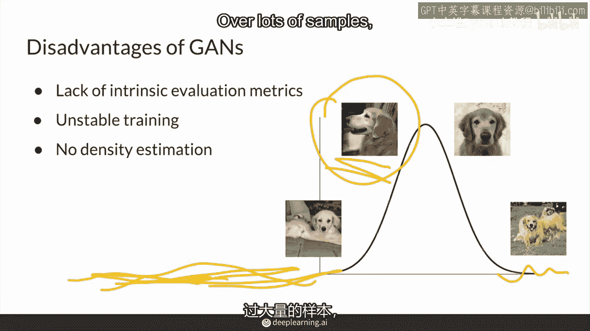

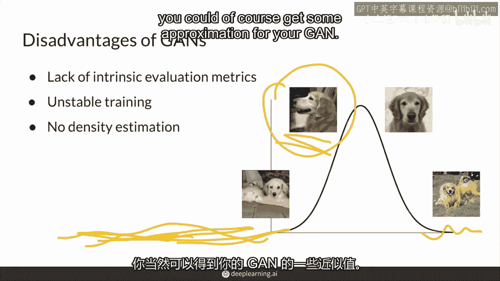

GAN模型通常不提供对建模特征的显式概率密度估计。这意味着你无法直接计算某个特定图像（或其特征）出现的可能性（即概率 `P(x)`）。这种密度估计能力对于**异常检测**等任务很有用，例如，通过判断一张“狗”的图片是否具有低概率特征来发现异常。虽然可以通过大量样本来近似得到某种密度估计，但GAN本身并不直接提供这一功能。

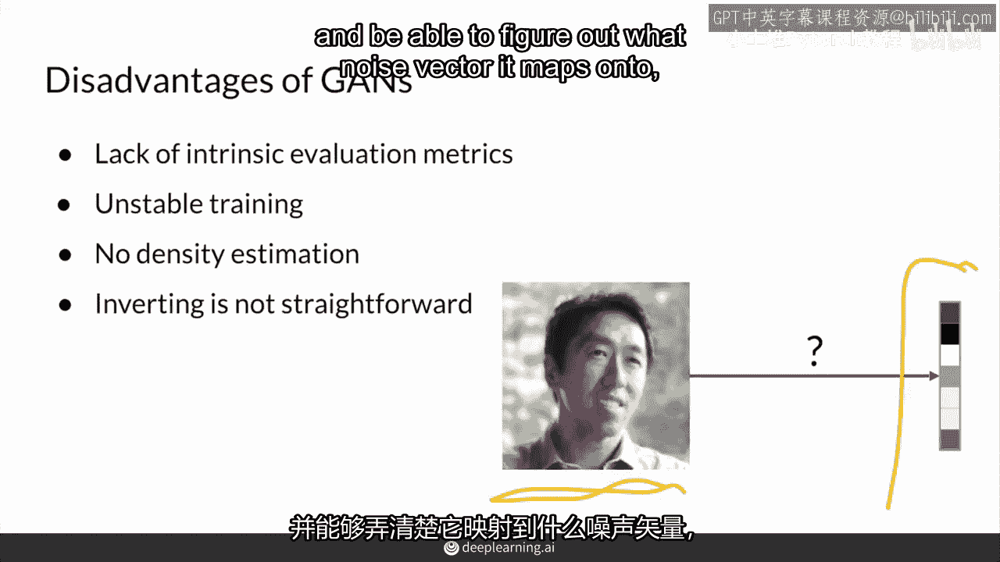

### 4. 生成器通常不可逆 🔄

标准的GAN生成器没有被训练成**可逆**的。这意味着常规任务是输入一个噪声向量 `z` 并输出一张图片 `G(z)`。而相反的任务——输入一张图片 `x` 来找出其对应的潜在噪声向量 `z`（即 `G^{-1}(x)`）——则非常困难。虽然已有一些新方法（如使用另一个模型或设计双向GAN）来解决可逆性问题，但这并非标准GAN的固有特性。

可逆性对于**图像编辑**特别有用。它意味着你可以将任何图像（包括真实图像）映射回其潜在空间中的噪声向量，然后利用可控生成技术（例如调整年龄、发色等属性）来修改这个噪声向量，从而实现对原图的编辑。

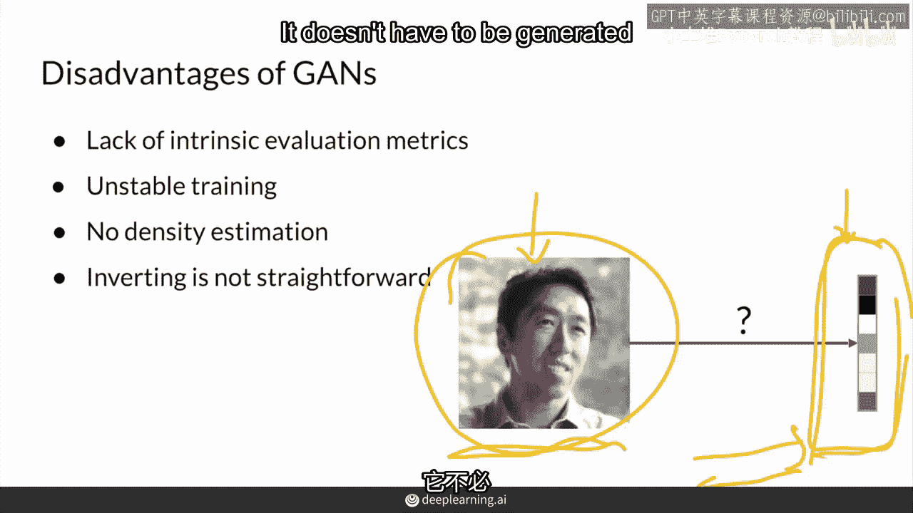

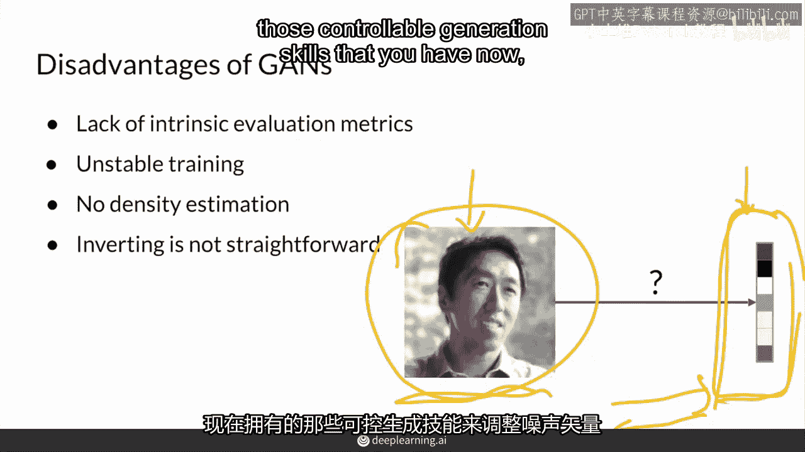

## 总结与展望

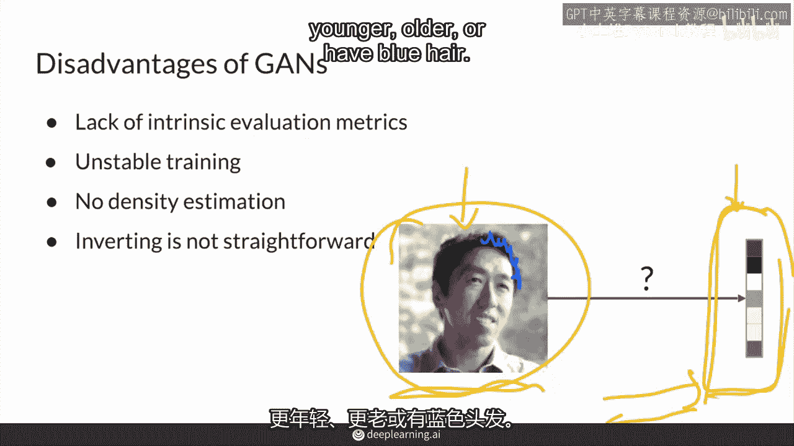

本节课我们一起学习了GAN的主要缺点。

总结来说，GAN虽然能产生**难以置信的高质量结果**并支持**相对快速的样本生成**，但也存在以下局限性：**缺乏内在的评估指标**、**训练过程可能不稳定**（尽管已得到部分解决）、**模型不提供显式的概率密度估计**，以及**将图像转换回其潜在表示具有挑战性**。

尽管如此，强调GAN在生成**高保真结果**方面的能力依然非常重要。GAN可以说是最早也是最好的能实现如此逼真且一致输出的AI模型之一。因此，GAN的技术经常被用于增强其他模型的输出真实性，并在许多不同领域得到应用。

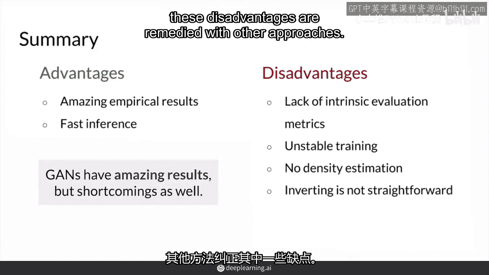

在下一个视频中，我们将继续探索GAN的更多相关内容。