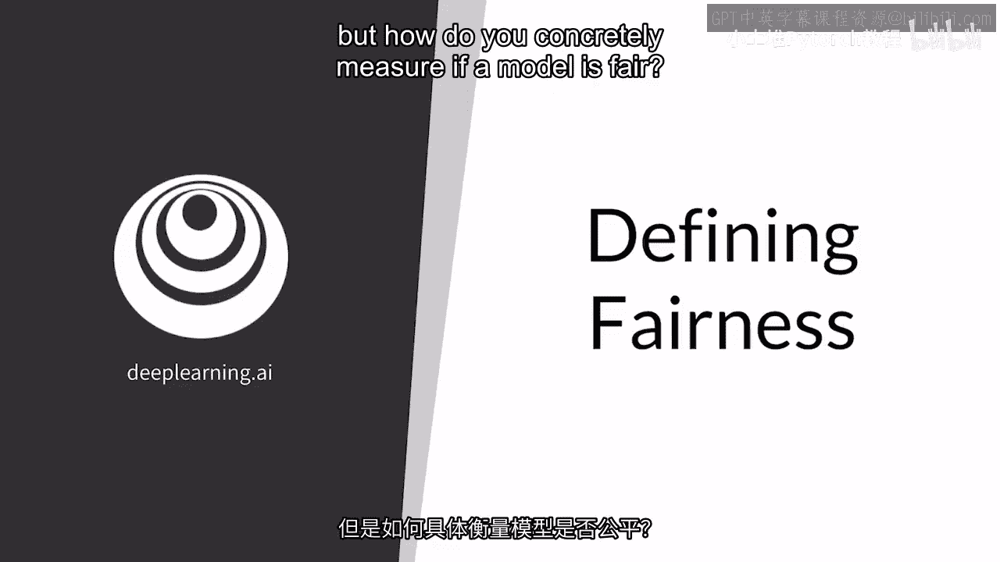
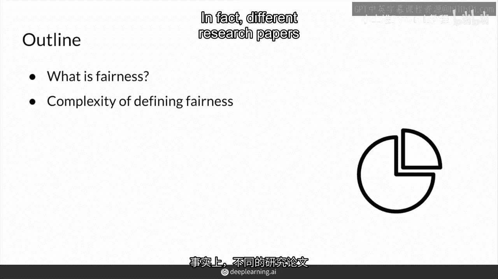
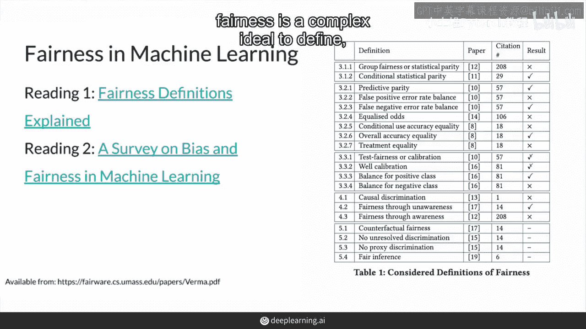
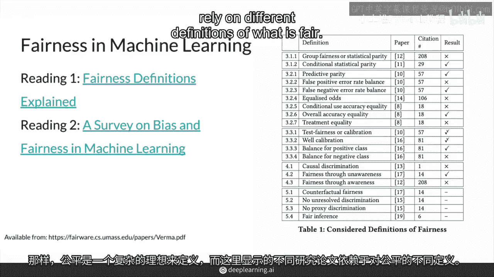
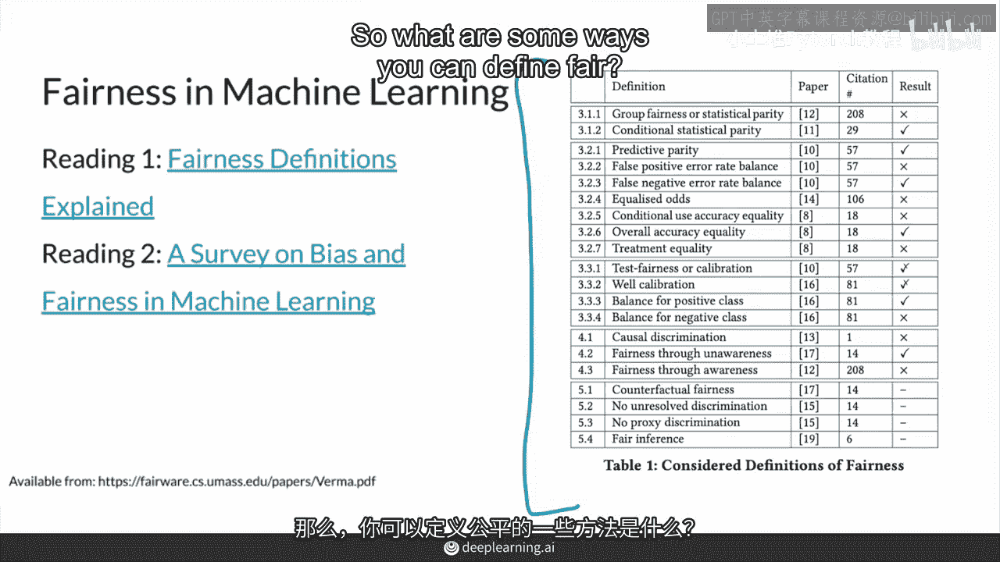
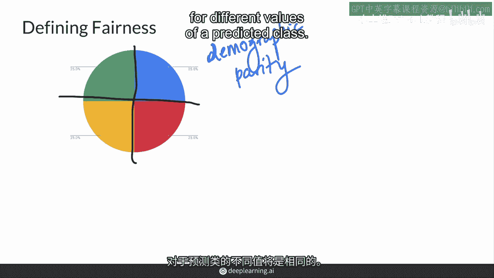
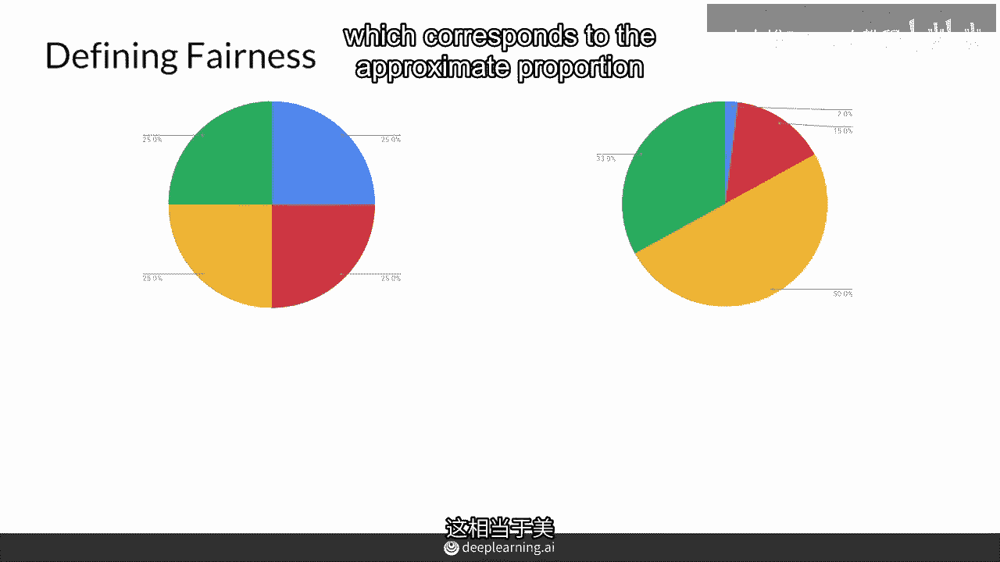
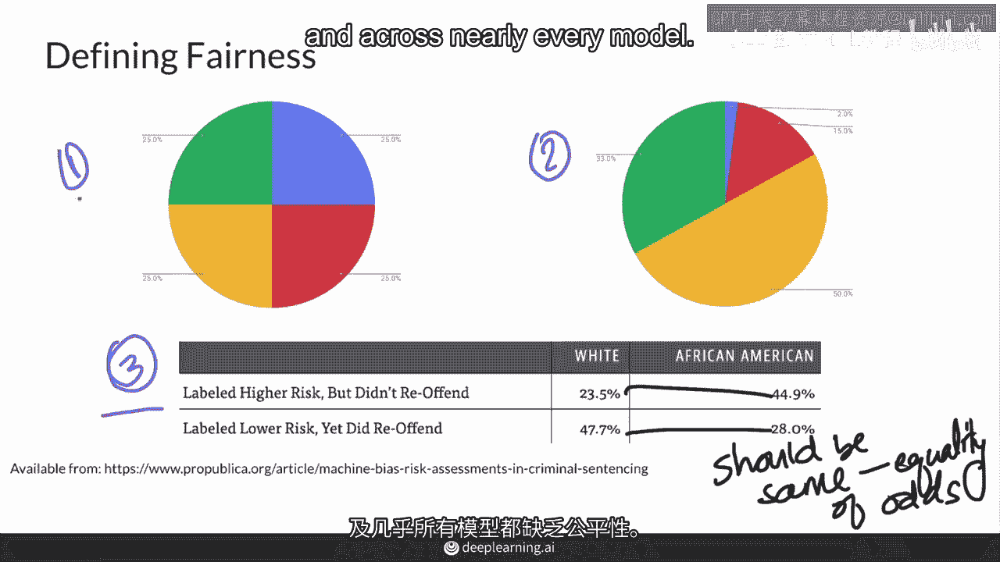
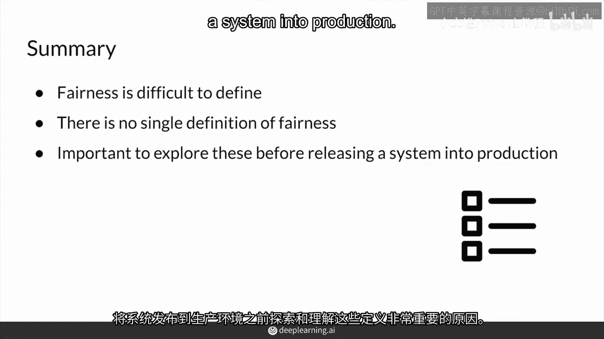

# 49：定义公平 🔍

在本节课中，我们将探讨机器学习模型中的“公平性”概念。我们将了解公平性为何难以精确定义，并学习几种常见的公平性定义方式。

---

上一节我们讨论了模型偏见，本节中我们来看看如何具体衡量一个模型是否公平。指南针模型的偏见似乎显而易见，但公平性本身是一个复杂的理想概念。事实上，不同的研究论文依赖于公平性的不同定义。

以下是公平性的几种常见定义方式：

*   **人口统计学平行 / 结果独立**：模型预测结果的分布应独立于“敏感属性”（如种族、性别）。这意味着，对于敏感属性的不同取值，模型预测的期望值应该完全相等。
    *   **核心概念**：`P(预测 | 敏感属性=A) = P(预测 | 敏感属性=B)`
*   **代表性结果**：模型在测试集上产生的结果，其人口统计比例应与现实世界的人口分布相匹配。
    *   **举例**：在美国，生成亚洲人面孔的图像生成模型，其输出中亚洲人面孔的比例应接近美国亚裔人口的实际比例（约6%）。
*   **平等机会**：模型在不同群体中应具有相同的假阳性率或假阴性率。这在风险评估等模型中尤为重要。
    *   **核心概念**：`P(错误预测 | 敏感属性=A) = P(错误预测 | 敏感属性=B)`

如你所见，公平性有三种不同的定义。显然，并不存在一个单一的、普适的公平性定义，以上只是三种非常基本的定义方式，当然还存在其他定义。

尽管没有单一的公平性定义，但我们仍然可以观察到，在所有这些定义下，几乎所有模型都可能存在公平性缺失的问题。

---

总之，公平性难以精确定义，也没有一个放之四海而皆准的定义。这就是为什么在将机器学习系统部署到生产环境之前，充分了解和探索这些不同的公平性定义至关重要。公平性的定义有很多种，尽管没有单一标准，但审视模型在多种定义下的表现，有助于我们更全面地识别和缓解潜在的公平性问题。