# 54：渐进增长 🚀


在本节课中，我们将要学习**渐进增长**，这是StyleGAN中的一个核心组成部分。我们将解释其背后的直觉与动机，并深入探讨其实现方式。

---

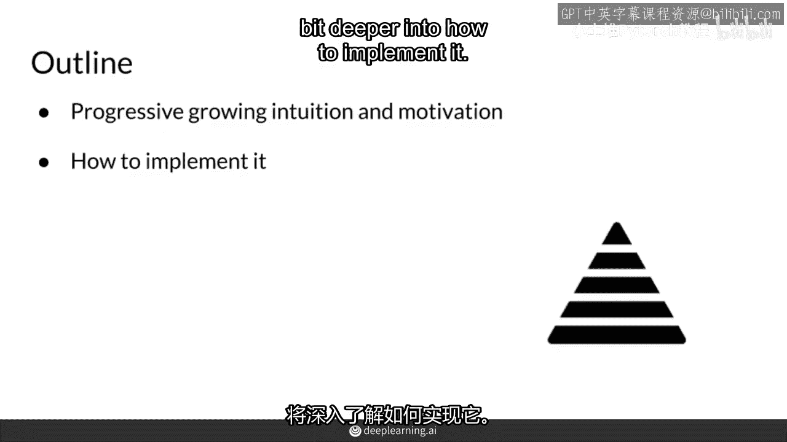

## 概述

渐进增长旨在使生成器更容易生成高分辨率图像。其核心思想是**从低分辨率图像开始训练，逐步过渡到高分辨率图像**。这种方法让模型从更简单的任务入手，逐步学习复杂的细节。

---

## 渐进增长的动机与直觉

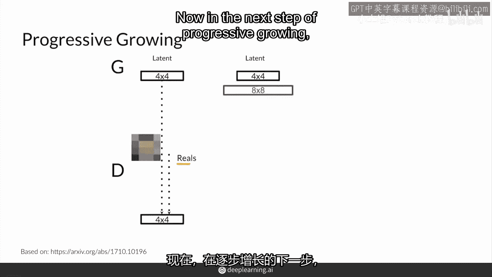

上一节我们介绍了渐进增长的目标，本节中我们来看看其具体动机。

首先，在StyleGAN中，渐进增长让生成器从生成非常模糊的低分辨率图像开始。例如，初始阶段可能只生成4x4像素的图像。这是一个相对简单的任务。


为了使判别器的任务也相匹配，真实的训练图像也会被下采样到相同的低分辨率（如4x4）。这样，判别器在初始阶段也只需评估低分辨率图像的真伪。

---

## 渐进增长的过程

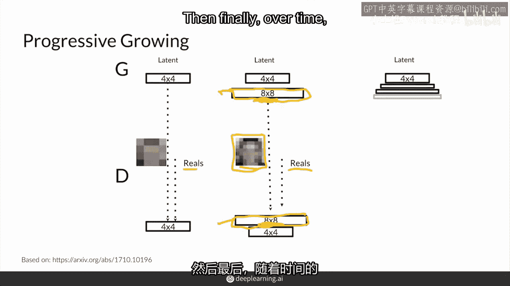

理解了动机后，我们来看看渐进增长是如何一步步实现的。

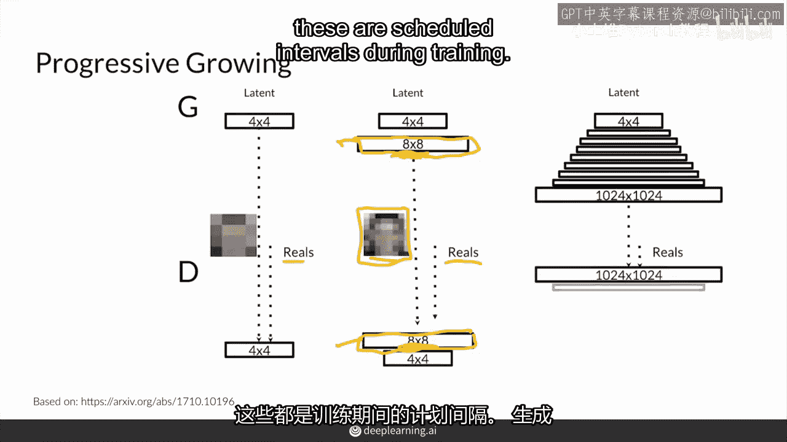

以下是渐进增长的基本步骤：

1.  **初始阶段**：生成器生成4x4图像，判别器评估下采样至4x4的真实图像。
2.  **尺寸翻倍**：经过预定的训练间隔后，生成器和判别器的目标分辨率翻倍，例如从4x4变为8x8。
3.  **添加新层**：生成器会添加新的上采样和卷积层来生成更高分辨率的图像。判别器也会添加新的卷积层来处理更高分辨率的输入。
4.  **重复过程**：上述过程不断重复，分辨率持续翻倍（如16x16, 32x32...），直到达到目标的高分辨率（如1024x1024）。

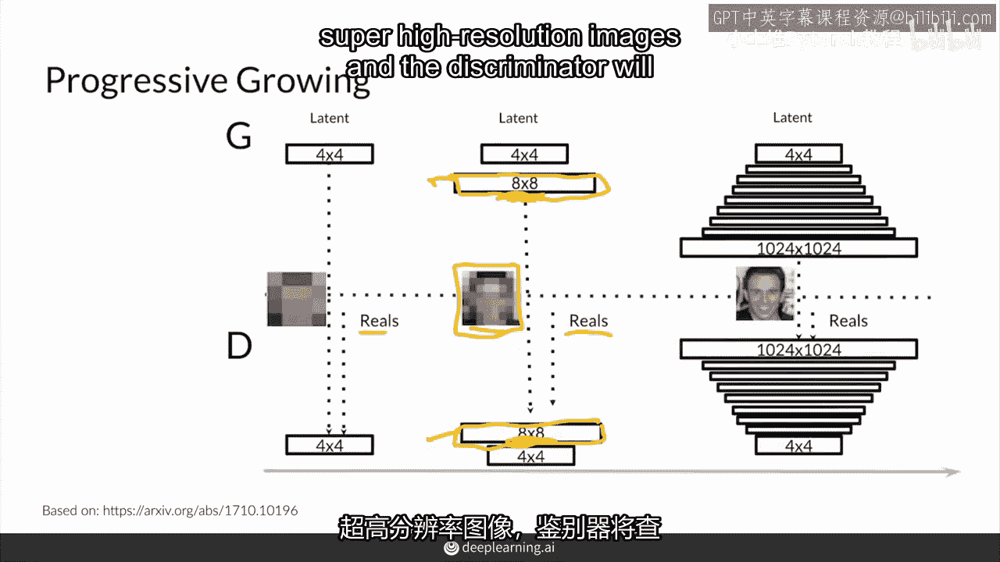


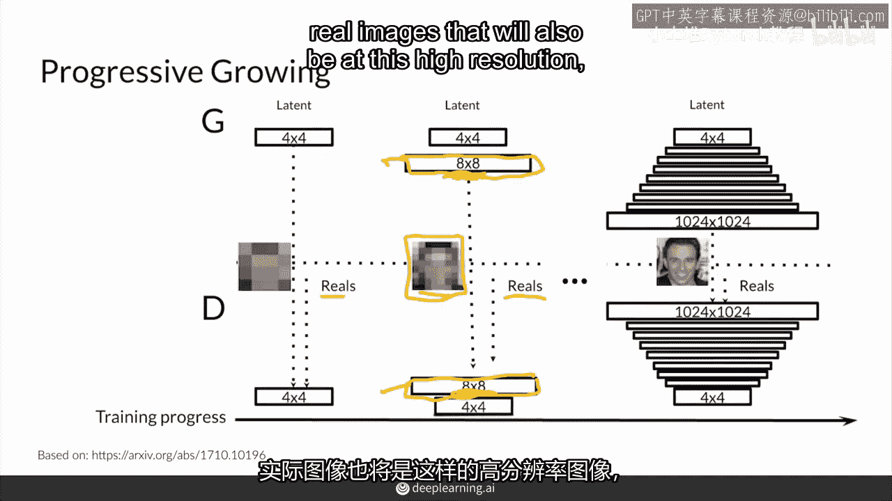

在这个过程中，生成器逐步学习生成更清晰、细节更丰富的图像，而判别器也同步提升其鉴别能力。

---

## 平滑过渡：Alpha混合

然而，渐进增长并非简单地直接切换分辨率。为了实现从旧分辨率到新分辨率的**平滑过渡**，StyleGAN引入了一个关键的`alpha`参数。

当需要将分辨率从4x4提升到8x8时，并非立即让新添加的网络层完全生成图像。而是分两步走：

1.  首先，将旧的4x4输出通过一个**固定的上采样方法**（如最近邻插值）直接放大到8x8。这称为`上采样图像`。
2.  同时，将旧的4x4输出输入到**新添加的可学习网络层**中，让其尝试生成8x8图像。这称为`生成图像`。

最终的8x8输出是这两部分的加权和，由`alpha`参数控制：

```python
# 伪代码表示最终的输出混合
最终输出 = (1 - alpha) * 上采样图像 + alpha * 生成图像
```

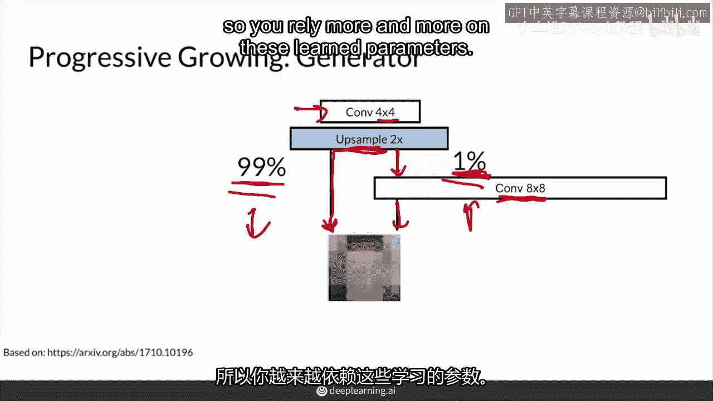

以下是`alpha`参数的变化过程：

*   **初始 (`alpha = 0`)**：完全使用上采样图像，新网络层不发挥作用。
*   **过渡期 (`0 < alpha < 1`)**：随着训练进行，`alpha`从0逐渐线性增加到1。模型越来越依赖新网络层学习到的特征，而非简单的像素放大。
*   **最终 (`alpha = 1`)**：完全使用新网络层生成的图像，上采样部分被弃用。此时新层已完全融入网络，可以独立生成该分辨率的图像。


这种平滑过渡避免了分辨率突变带来的训练不稳定，让网络能够平稳地学习新尺度下的特征。

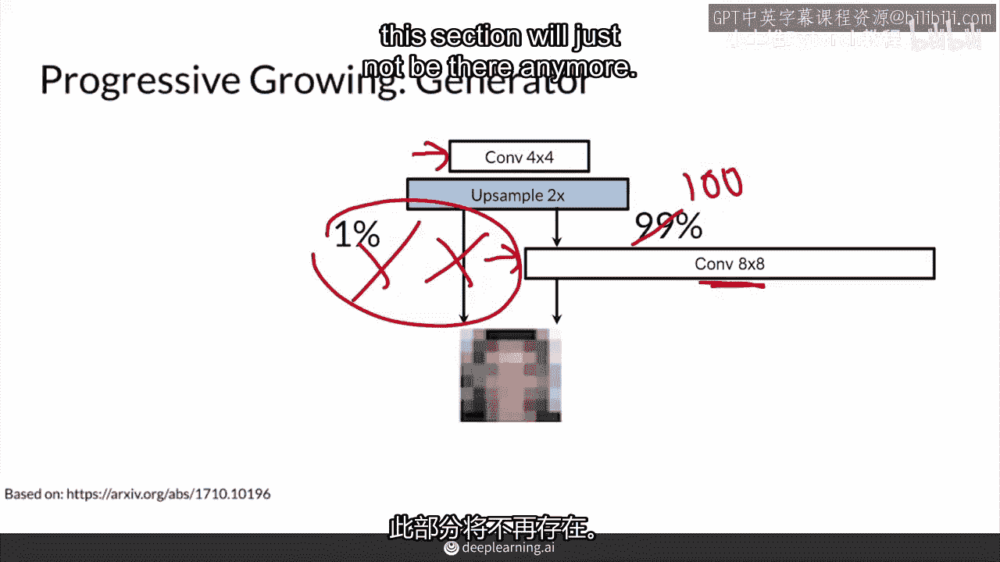

---

## 判别器的对应处理

生成器的变化理解了，判别器也需要进行对应的调整以处理逐渐变大的图像。

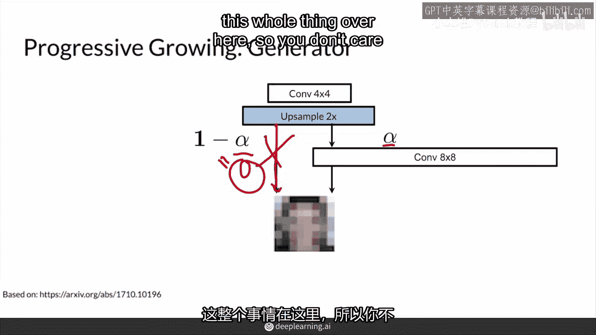

判别器进行的是相反方向的操作。当输入图像分辨率从4x4增加到8x8时：

1.  一方面，将高分辨率（8x8）输入直接**下采样**到低分辨率（4x4），然后送入原有的判别器网络。
2.  另一方面，将高分辨率输入送入**新添加的判别器层**进行处理，再下采样并与原有网络流合并。

判别器同样使用与生成器**同步的`alpha`参数**来混合这两个处理路径的结果，实现平滑过渡。

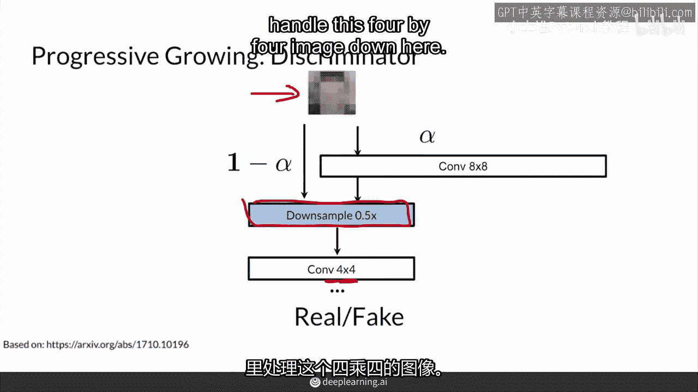


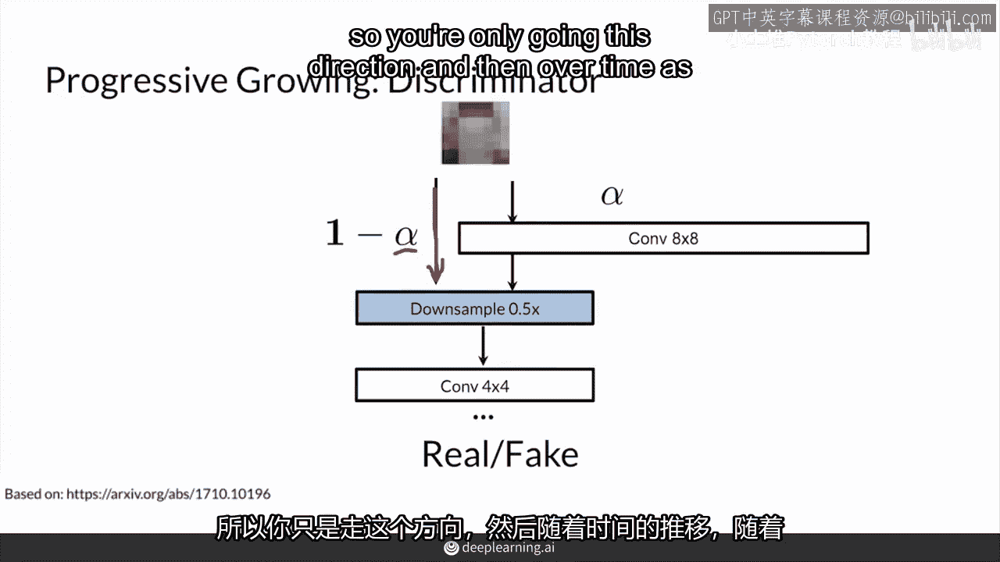

---

## 在StyleGAN中的结构

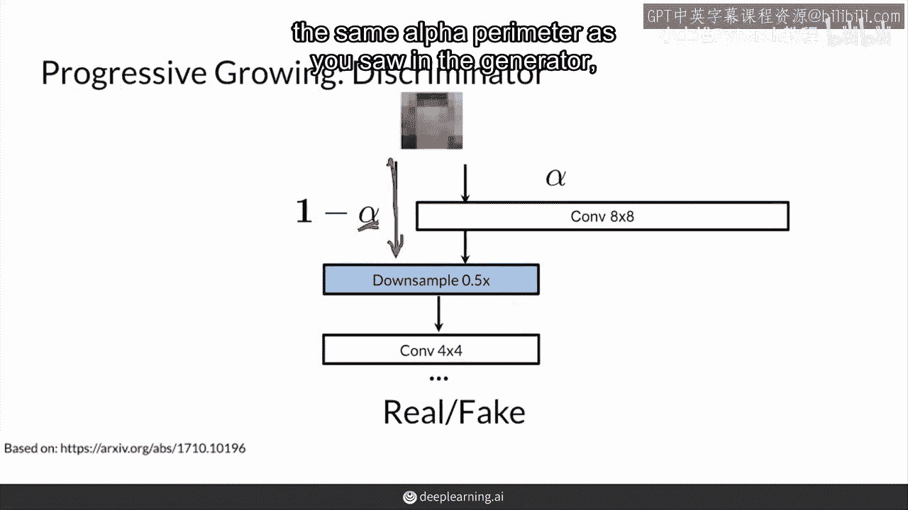

在StyleGAN中，渐进增长是通过一系列结构相似的**增长块**来实现的。

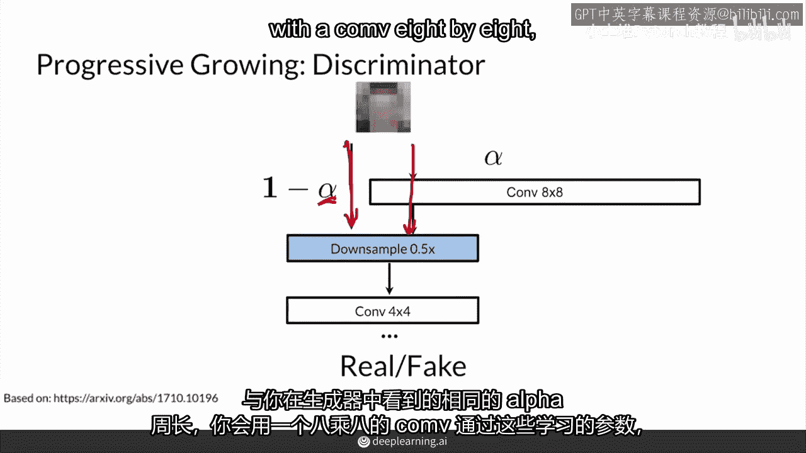

每个增长块通常包含：
*   **对于生成器**：上采样层 + 一个或多个卷积层。
*   **对于判别器**：一个或多个卷积层 + 下采样层。

这些块像搭积木一样堆叠，每个块负责将图像分辨率提高一倍，并通过`alpha`混合机制平滑地激活。

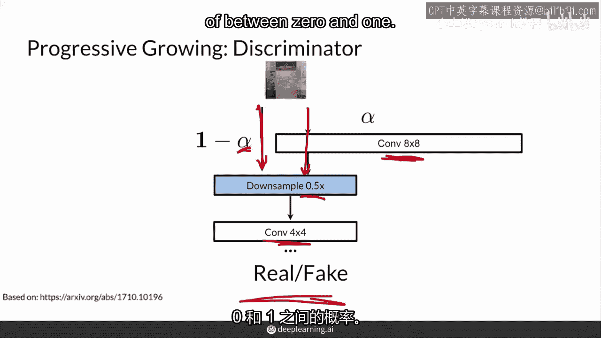


---

## 总结

本节课中我们一起学习了StyleGAN中的**渐进增长**技术。

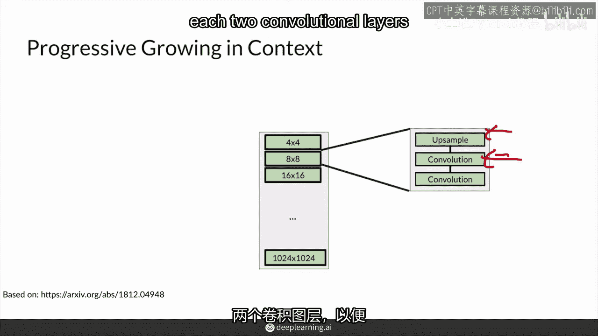

我们了解到：
1.  其**核心目的**是稳定高分辨率图像生成的训练过程。
2.  其**实现方式**是让模型从低分辨率开始，在预定的时间间隔将分辨率翻倍。
3.  其**关键技巧**是使用`alpha`参数进行平滑过渡，混合“旧方法放大”和“新网络生成”的结果，避免训练突变。
4.  该技术同时应用于**生成器**和**判别器**，确保两者能力同步增长。

总之，渐进增长通过分阶段、平滑过渡的策略，显著提升了GAN模型学习生成复杂高分辨率图像的能力和稳定性。

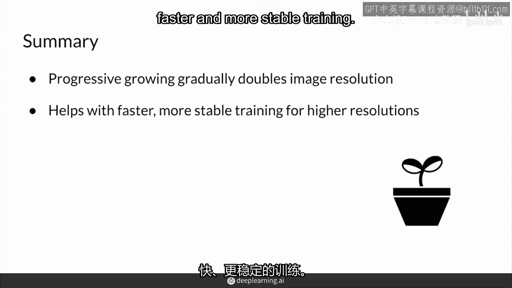

