# 59：课程2总结与展望 🎯

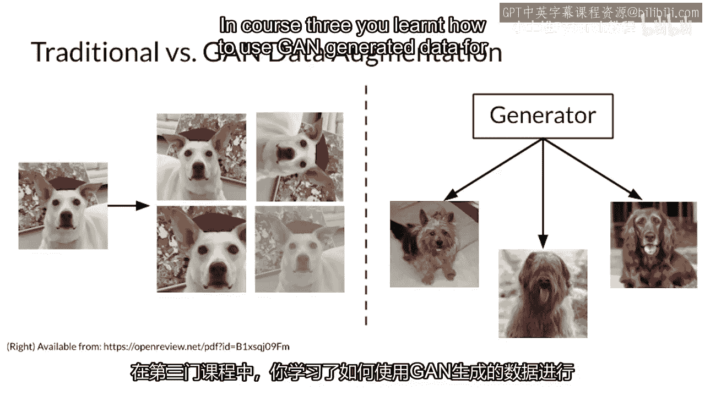

在本节课中，我们将对已完成的课程二进行总结，并展望课程三即将学习的内容。课程二的核心是构建一个最先进的生成对抗网络及其组成部分。接下来，我们将深入了解生成对抗网络的实际应用场景。

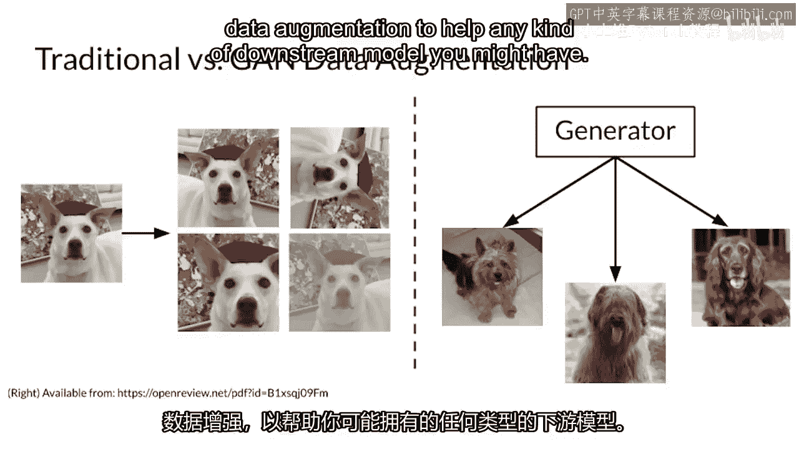

---

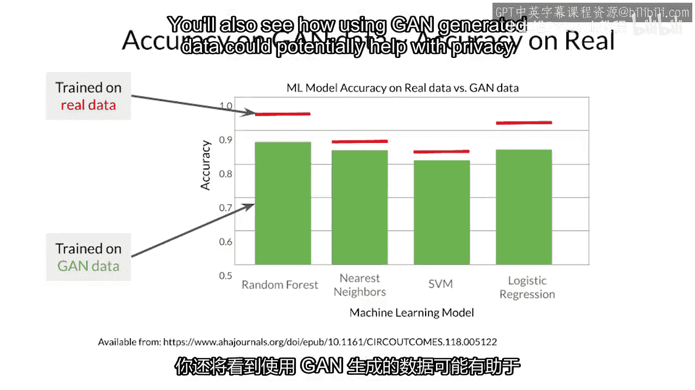

## 课程三内容预览 🚀

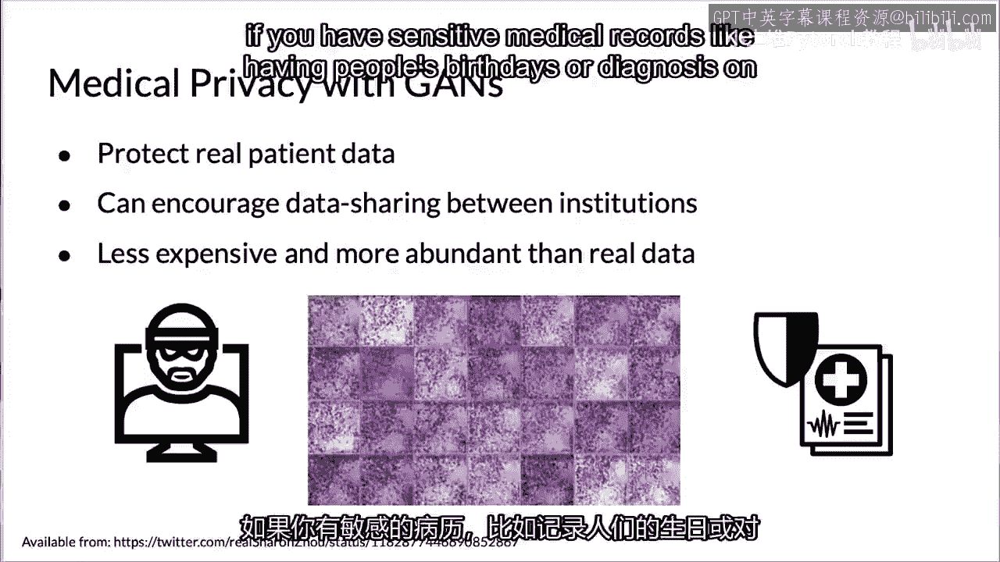

上一节我们总结了课程二关于构建生成对抗网络的知识。本节中，我们来看看在课程三中，你将如何应用这些知识。

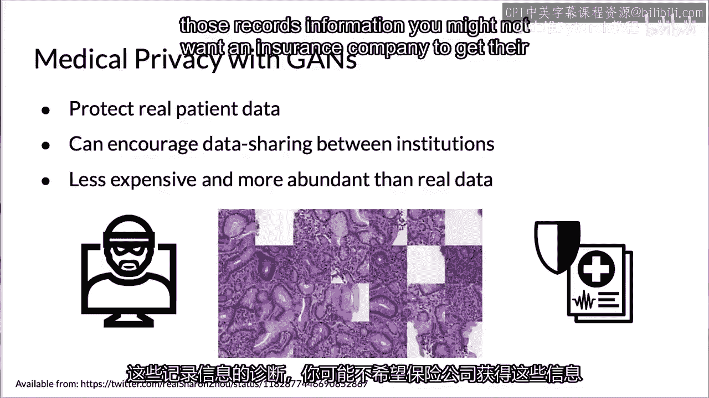

课程三将涵盖生成对抗网络的三个主要应用方向。

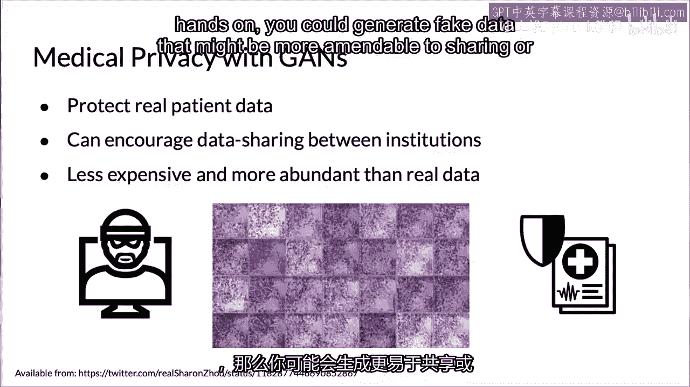

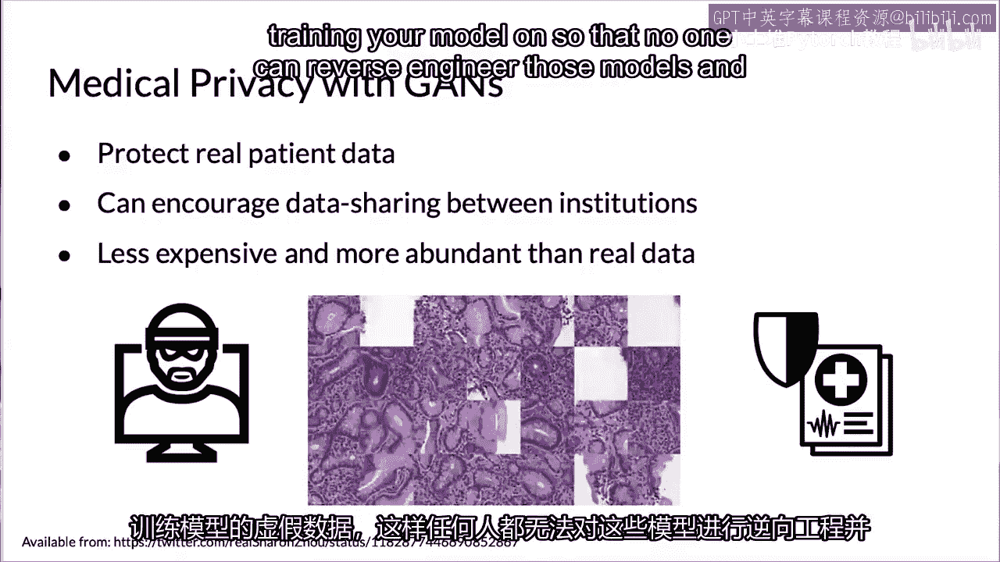

以下是具体的应用方向介绍：

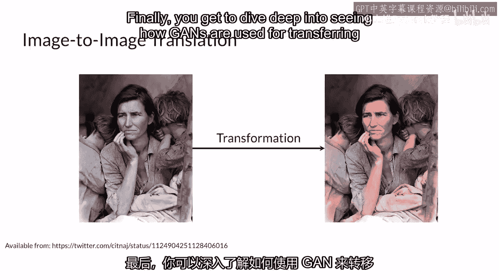

*   **数据增强**：你将学习如何使用生成对抗网络生成的数据来增强数据集，以辅助下游模型的训练。例如，下游模型可以是用于分类不同人脸的分类器，而你的生成对抗网络可以生成大量的人脸数据供其使用。
*   **隐私保护**：你将了解如何利用生成对抗网络生成的数据来帮助保护隐私，同时保持任务所需的准确性。例如，如果你拥有敏感的医疗记录（如人们的生日或诊断信息），你可能不希望保险公司直接获取这些信息。你可以生成合成数据，这些数据更便于分享或用于模型训练，从而避免他人通过逆向工程模型来利用原始敏感记录。
*   **风格迁移**：你将有机会深入学习生成对抗网络如何用于图像风格迁移。这建立在你有条件生成的知识基础上，但条件不再是一个简单的类别向量，而是一整张图像的内容。例如，根据一张马的图像生成斑马，根据橙子生成苹果，或者根据卫星图像生成地图。

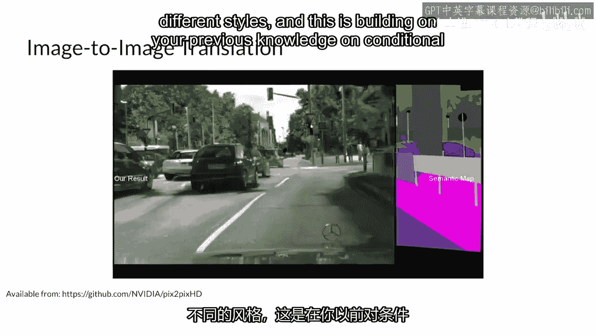

---

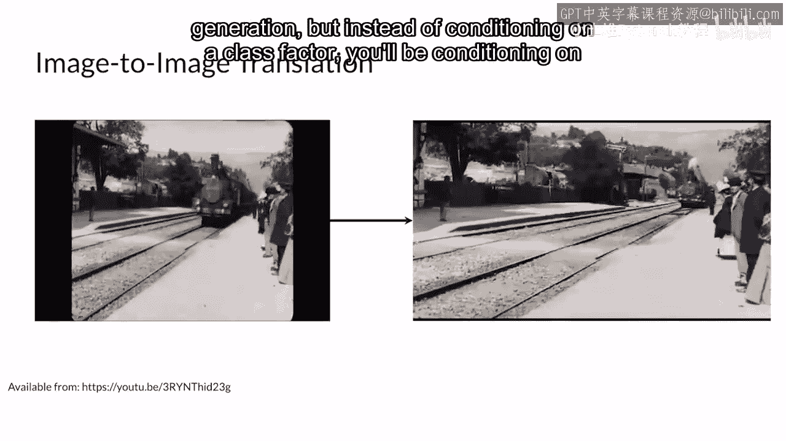

## 总结 📝

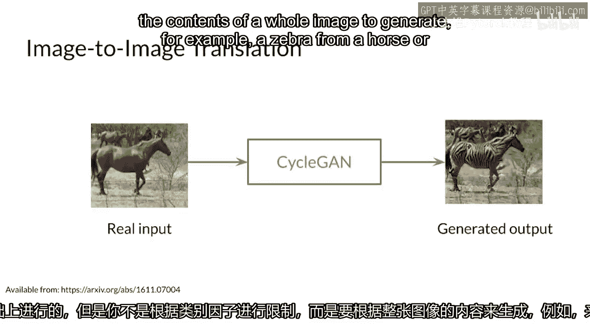

本节课中，我们一起回顾了课程二关于构建生成对抗网络的成果，并预览了课程三将深入探索的三大应用领域：数据增强、隐私保护和风格迁移。所有这些应用都令人兴奋，让我们直接开始课程三的学习吧。