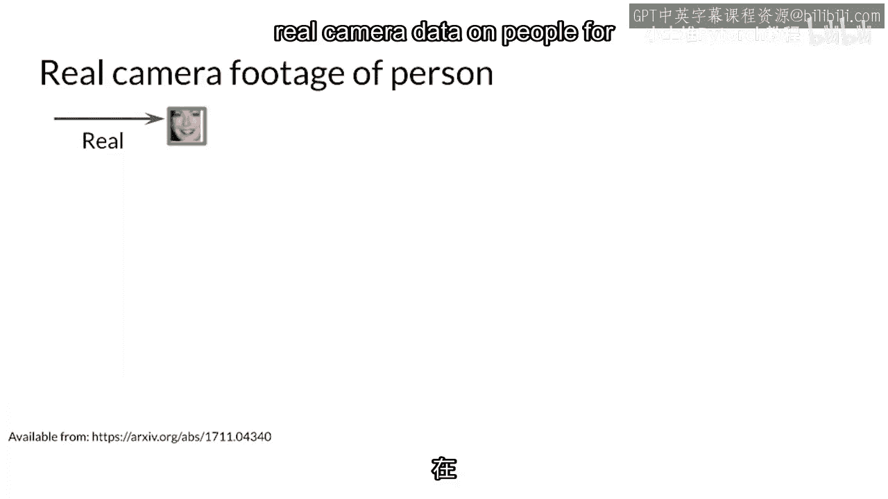
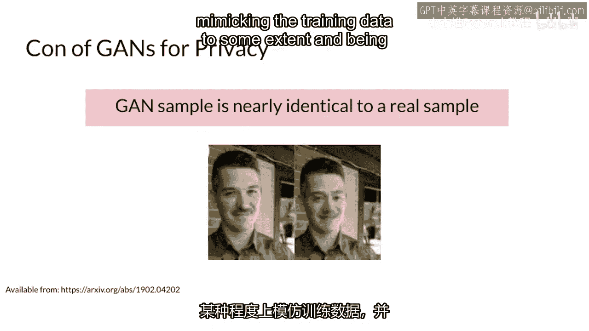
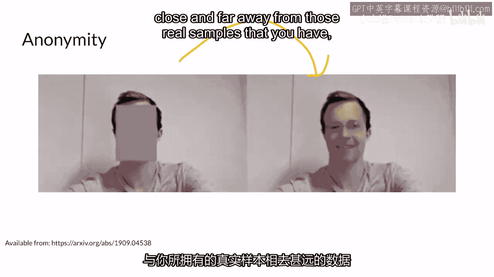

# 61：61. 欢迎来到第1周 🎬

在本节课中，我们将要学习生成对抗网络（GAN）的一个重要应用：**数据增强**。我们将探讨如何利用GAN生成的数据来提升下游机器学习模型（如分类器或检测器）的性能，特别是在数据稀缺或涉及隐私的场景下。

---

## 概述

你已经看到GAN本身可以生成有趣的数据。然而，这些生成的数据远不止有趣，它们还能为其他模型提供帮助。这个过程被称为**数据增强**。简单来说，数据增强就是通过人工方式增加训练数据的数量和多样性，以提高模型的泛化能力。

---

## GAN数据增强的核心应用

上一节我们介绍了数据增强的基本概念，本节中我们来看看GAN生成的数据如何具体应用于实际场景。

### 场景一：解决数据稀缺问题

假设你正在构建一辆自动驾驶汽车。如果它在检测“高尔夫球车”时遇到困难，很可能是因为你的原始数据集中缺少这类样本。

以下是解决此问题的步骤：

1.  使用你的GAN模型，生成大量包含“高尔夫球车”在道路上的合成图像。
2.  将这些生成的图像与你的真实数据集混合。
3.  使用这个混合后的、更丰富的数据集重新训练你的检测器模型。

通过这种方式，你的自动驾驶汽车模型就能学会识别之前未曾见过的“高尔夫球车”，从而提升其整体性能。

### 场景二：保护数据隐私

在某些情况下，法律或伦理要求可能限制你使用真实的人像数据（例如来自监控摄像头）来训练模型。

以下是应对隐私挑战的方法：

1.  使用GAN生成不包含任何真实个人身份的“假人”图像。
2.  用这些生成的隐私安全数据来训练你的模型（如人脸识别或行为分析模型）。

虽然生成的假人数据 `G(z)` 并非完美（`z` 为随机噪声向量），但一个好的GAN模型能够生成既接近真实数据分布 `P_data(x)`，又具有一定新颖性的样本。这使得模型在保护隐私的同时，仍能获得一定的识别准确性。

---

## 本周任务预告

在理解了GAN数据增强的原理和应用后，本周的实践任务将帮助你巩固这一知识。

以下是你在本周分配中将要完成的内容：

*   你将在一个流行的公开数据集上进行实践。
*   你将亲身体验如何使用GAN生成的数据来辅助一个下游分类任务。
*   通过对比实验，观察添加生成数据后模型性能的变化。

---

## 总结

本节课中我们一起学习了GAN在数据增强方面的强大用途。我们探讨了如何利用生成数据解决**数据稀缺**和**隐私保护**两大挑战。核心在于，GAN能够学习真实数据的分布 `P_data(x)` 并生成新的样本 `G(z)`，从而扩充训练集，提升下游模型的鲁棒性和适用性。在接下来的实践中，你将有机会亲自验证这一技术的效果。