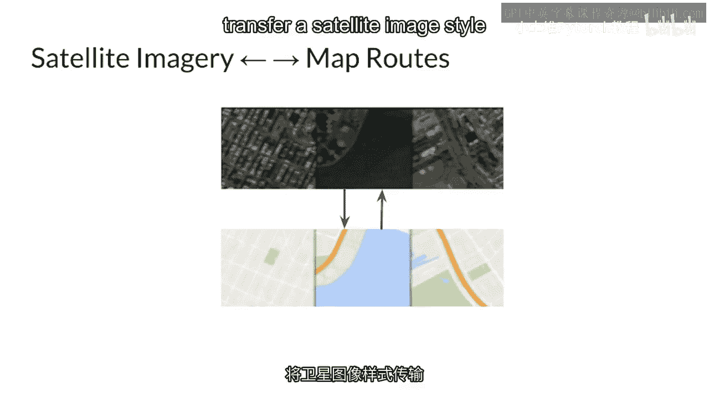
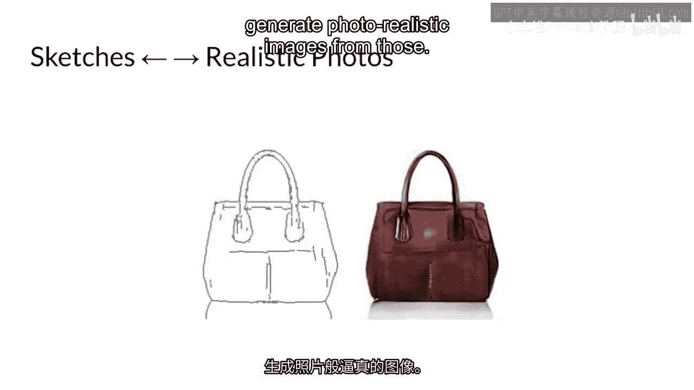
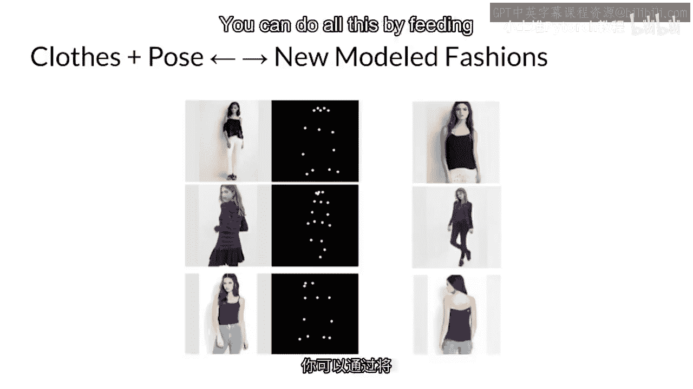
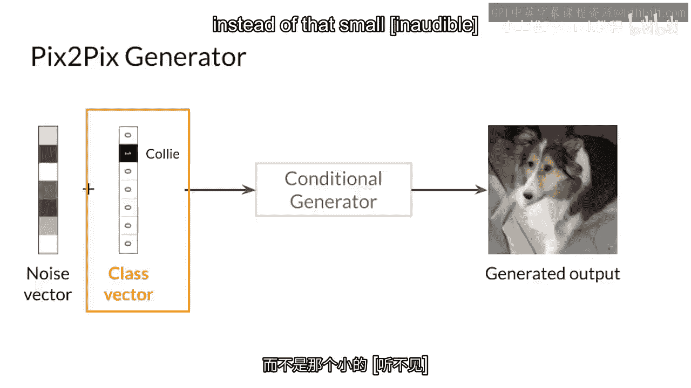
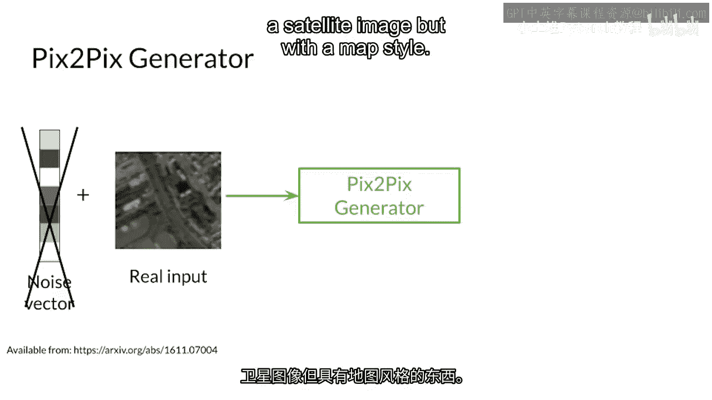

# 67：图像风格转换与条件GAN入门 🎨

在本节课中，我们将学习生成对抗网络（GANs）在图像风格转换领域的应用。我们将了解如何利用条件GAN将一种图像的风格转移到另一种图像上，并探索其在实际场景中的多种用途。

## 概述

上一节我们介绍了GAN的基本概念。本节中，我们将具体探讨一种特殊的GAN应用——图像风格转换。这是一种将源图像的风格（如艺术风格、类型特征）迁移到目标图像内容上的技术。

## GAN在图像转换中的应用

应用生成对抗网络（GANs）不仅仅是使用GAN生成数据。你上周学习的数据增强技术，也可以与神经网络结合用于图像转换任务。

图像转换任务是指将一种风格从一个图像转移到另一个图像。这项技术基于其广泛的应用场景。

例如，以下是图像风格转换的几个典型应用方向：

*   **地图与卫星图像互转**：你可以构建一个模型，将卫星图像的风格转换为地图路线。
    
*   **草图生成真实图像**：你可以绘制草图，然后让程序基于这些草图生成逼真的图像。
    
*   **时尚风格转换**：对于AI驱动的零售应用，这可能涉及转换不同的时尚风格。你可以通过将整个图像输入到你的条件生成器中来完成这一切。
    

## 条件GAN的核心机制

为了实现上述转换，我们需要使用**条件生成对抗网络**。其核心思想是为生成器和判别器提供额外的条件信息。

传统的GAN输入可能只是一个随机噪声向量 `z`。而在条件GAN中，生成器的输入除了 `z`，还有一个条件变量 `c`。判别器不仅需要判断图像是否真实，还需要判断图像是否符合给定的条件 `c`。

以下是条件GAN与普通GAN在输入上的关键区别：

*   **条件GAN的输入**：是一个完整的图像，而不是一个简单的噪声向量。
    
*   **条件信息的作用**：例如，一个**独热编码**的类别向量可以告诉你的GAN：“生成看起来像卫星图像的东西，但要具备地图的风格”。
    

这种能够处理图像到图像转换的GAN架构，例如 **Pix2Pix**，拥有强大的生成器和判别器来学习输入与输出图像之间的复杂映射关系。

## 总结

本节课中，我们一起学习了生成对抗网络在图像风格转换中的应用。我们了解了条件GAN的基本原理，它通过引入额外的条件信息（如类别标签或另一张图像），指导生成器产生特定风格的输出。我们还看到了这项技术在卫星图转地图、草图生实景、时尚转换等多个领域的实用案例。理解条件GAN是掌握高级图像合成与编辑技术的重要一步。