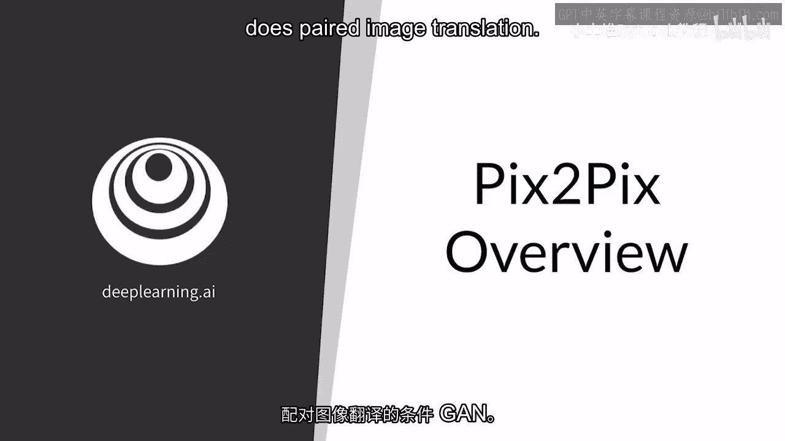
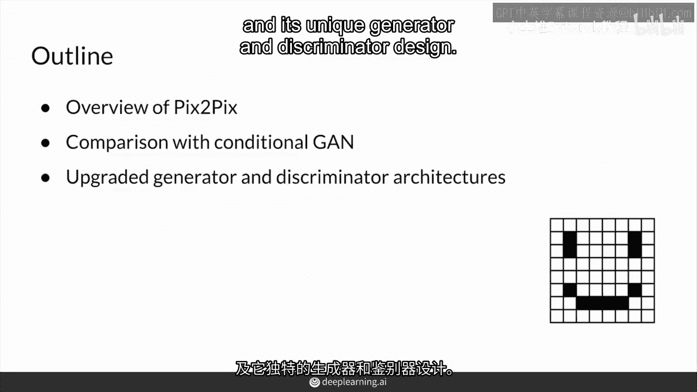
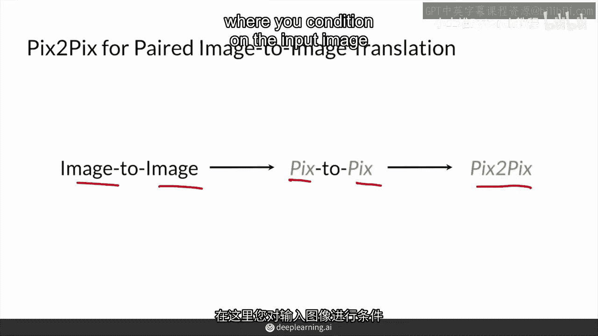
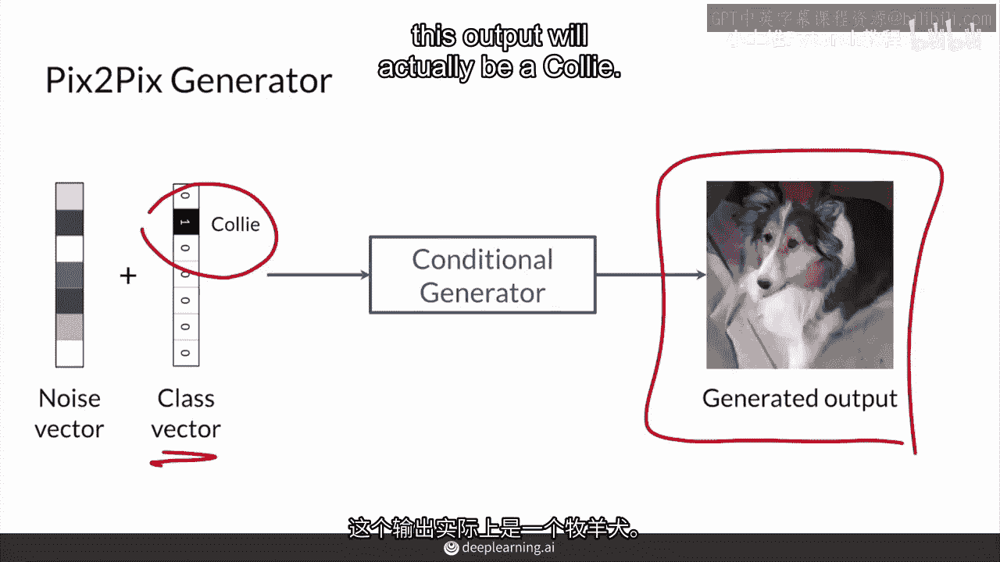
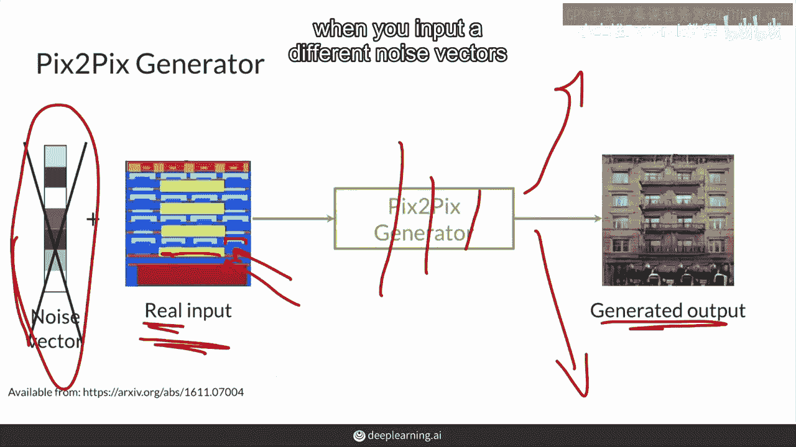
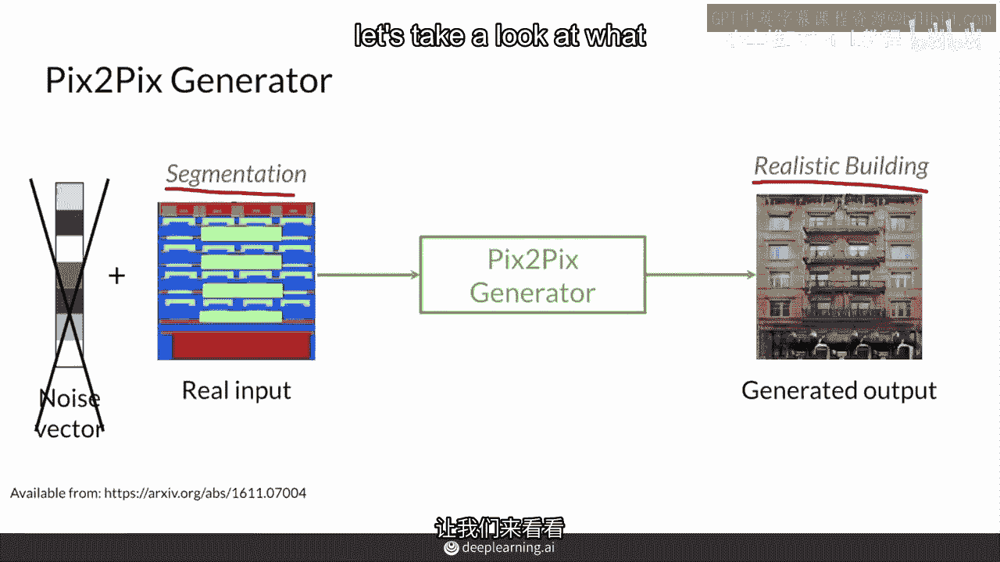
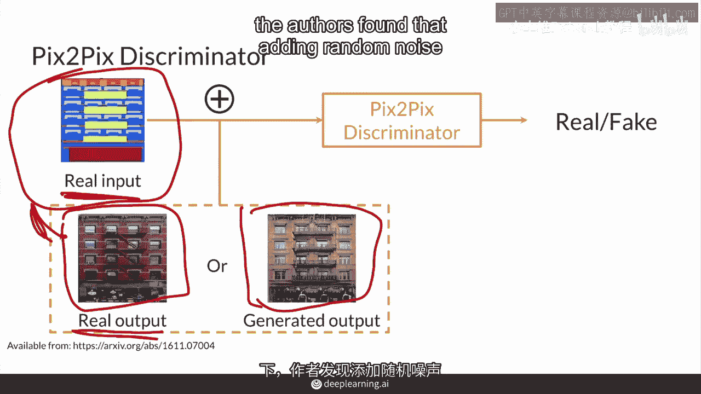
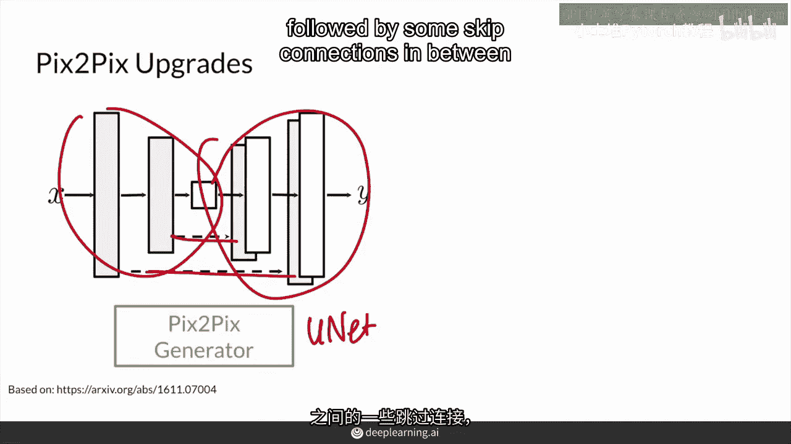
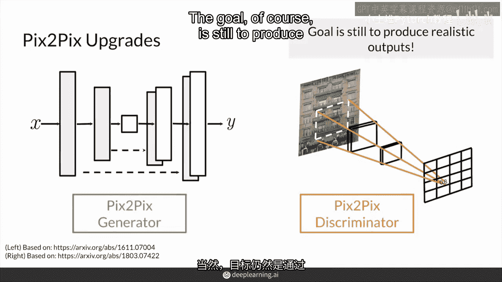
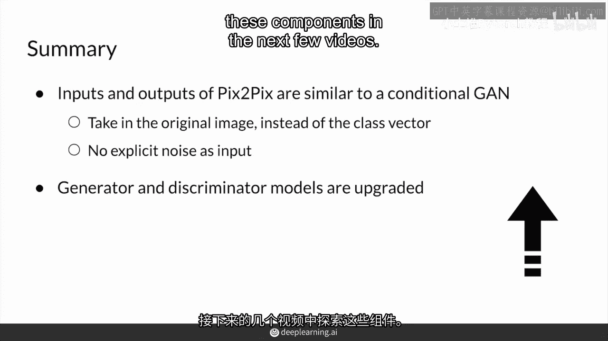

# 69：pix2pix概述 🖼️

在本节课中，我们将要学习pix2pix，这是一种用于配对图像转换的条件生成对抗网络。

首先，我们将从pix2pix的概述开始，了解其独特的生成器和判别器设计。

## 1. 什么是pix2pix？

pix2pix的名称来源于“图像到图像”的转换。它是由加州大学伯克利分校发表的论文中提出的一种条件生成对抗网络的非常成功的应用。该网络在输入图像上进行条件设置，并直接生成一个配对的输出图像。

## 2. 从条件GAN到pix2pix

上一节我们介绍了pix2pix的基本概念，本节中我们来看看它与条件生成对抗网络的关系。

首先，回顾一下条件生成对抗网络。在第一课中，生成器接收一个关于某个类别的向量（例如，柯利犬的独热编码向量）并生成一张该类别的图像。这个类别向量也会传递给判别器，以鼓励输出图像确实属于该类别。

pix2pix与此类似，但输入不是一个类别向量，而是**一整张图像**。例如，输入可能是一张建筑的分割图，其中不同的颜色代表不同的类别（如窗户、阳台、外墙）。

## 3. 生成器的输入：为何没有噪声？

以下是pix2pix生成器设计的一个关键点。

在传统的GAN中，生成器通常接收一个随机噪声向量，以产生多样化的输出。然而，pix2pix的作者发现，在配对图像转换任务中，**噪声向量对生成器的输出影响不大**。这可能是因为存在一个明确的、配对的真实输出图像作为目标，生成器只需学习从输入到该输出的确定性映射。

为了引入一定的随机性，作者选择在训练过程中使用**Dropout**。Dropout会在神经网络的某些层中随机屏蔽节点，这为输出带来了一些变化，但不像输入不同噪声向量时变化那么剧烈。

## 4. 判别器的设计

了解了生成器后，我们来看看判别器的设计。

判别器同样接收生成器的输入（即条件图像，如分割掩码）。然后，它会将这个条件图像与另一张图像连接起来。这张图像可能是**真实的目标输出**（如真实的建筑照片），也可能是**生成器产生的输出**。

判别器的任务是判断这张连接后的图像是“真”还是“假”。换句话说，它需要判断生成器输出的图像，是否看起来像是条件图像的真实映射。这与条件GAN的原理非常相似，只是条件从类别向量变成了整张图像。

## 5. 网络架构的改进

无论是生成器还是判别器，在pix2pix中都得到了升级。

*   **生成器**采用了一种**U-Net**架构。U-Net通常用于图像分割任务，它包含一个编码器和一个解码器，中间还有跳跃连接。这有助于保留输入图像的细节信息，我们将在下个视频详细介绍。
*   **判别器**采用了一种**PatchGAN**架构。这意味着判别器不再对整个图像给出一个单一的“真/假”判断，而是对图像的**不同局部区域（补丁）** 分别进行判断，输出一个由多个真/假决策组成的矩阵。这能为生成器提供更细致、更丰富的梯度反馈。

## 6. 核心要点总结

本节课中我们一起学习了pix2pix的核心概念。

总结一下，pix2pix与条件GAN相似，但有三个关键区别：
1.  输入是**整张图像**，而不是类别向量。
2.  训练数据是**严格配对**的（输入图像与目标输出图像一一对应）。
3.  生成器**没有明确的噪声向量作为输入**，随机性主要通过Dropout引入。
4.  生成器和判别器的模型架构得到了极大改进，分别采用了**U-Net**和**PatchGAN**。

最终目标仍然是通过对抗训练，生成逼真的、符合输入条件的输出图像。