# 70：pix2pix PatchGAN 详解 🧩

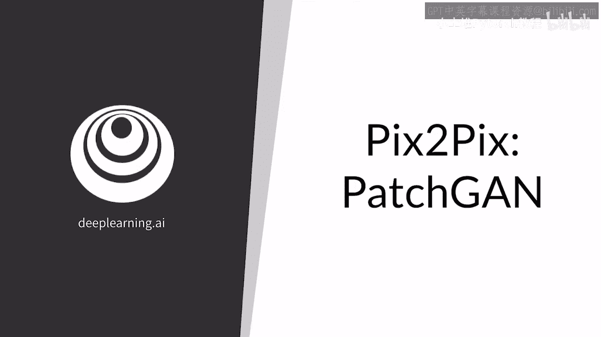

在本节课中，我们将学习 pix2pix 模型中一个关键的判别器组件——PatchGAN。我们将了解它如何通过输出一个概率值矩阵，而非单一的真假值，来对图像的局部区域进行精细的判别。

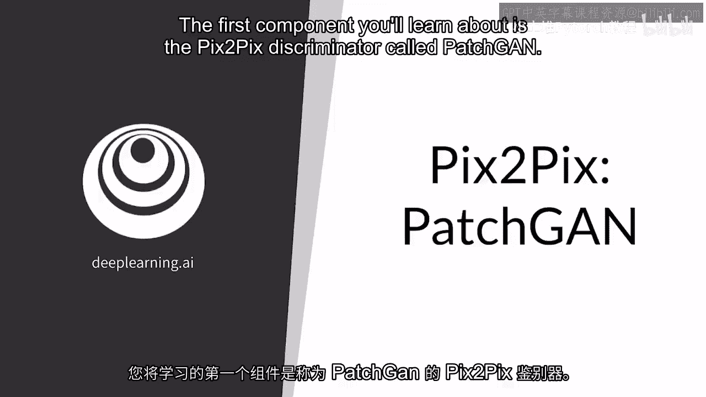

上一节我们介绍了生成对抗网络的基本概念，本节中我们来看看 pix2pix 模型中一个特殊的判别器设计。

## atchGAN 架构概述

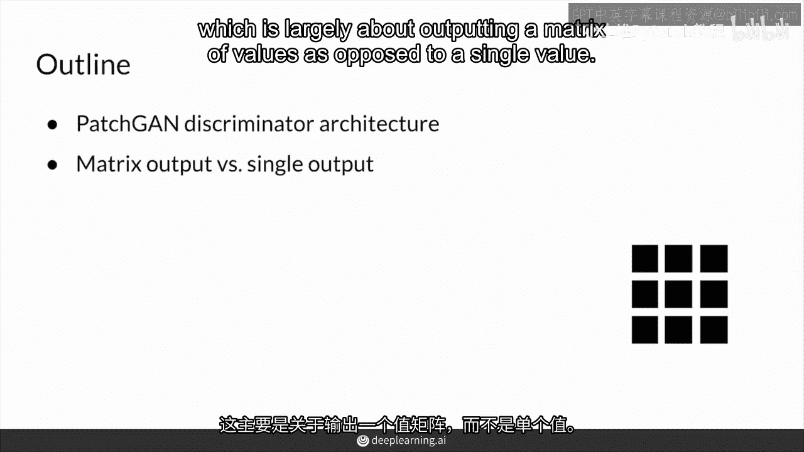

PatchGAN 判别器的核心特点是输出一个值矩阵，而不是单个标量值。这意味着判别器不再对整个图像给出一个“真”或“假”的总体判断，而是对图像的各个局部区域（即“补丁”）进行独立评估。

因此，PatchGAN 可以输出一个分类矩阵。如下图所示，判别器查看图像的一小块区域，并从整个矩阵中为该区域输出一个概率值。

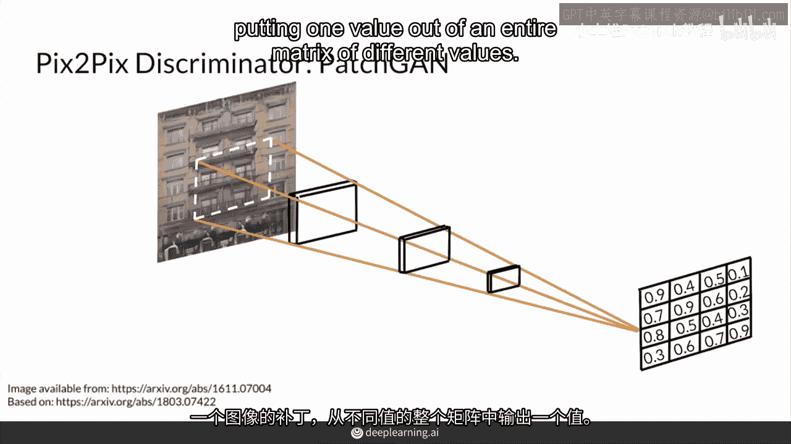

## 输出矩阵的含义

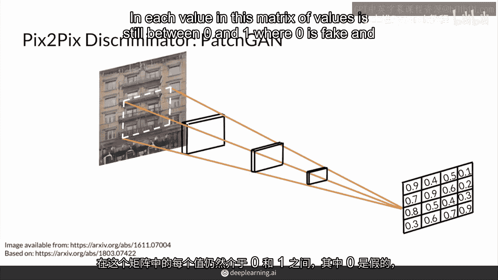

在这个输出矩阵中，每个值仍然在 0 到 1 之间。其中，**0 代表该区域是“假的”**，**1 代表该区域是“真的”**。

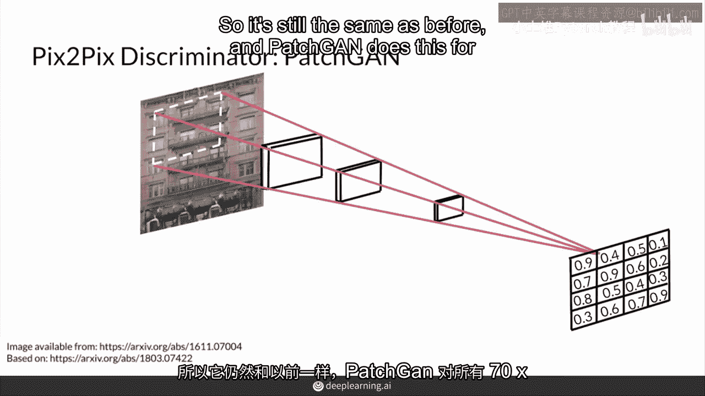

和传统的判别器一样，PatchGAN 会对图像中所有 70x70 像素的补丁进行处理。矩阵中的每个输出值都对应图像中的一个特定补丁。

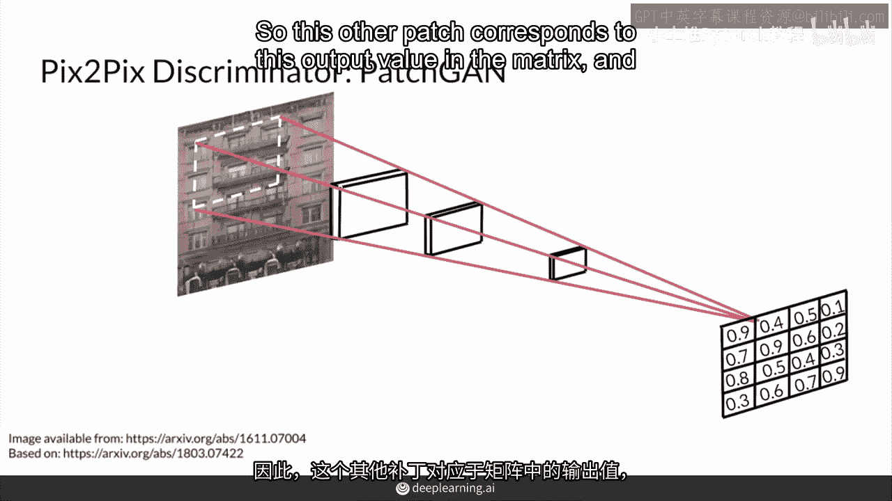

通过将判别器的“视野”滑动覆盖输入图像的所有补丁，PatchGAN 能够对图像的每个区域或补丁给出独立的反馈。因为它输出了每个补丁被认为是真实图像的概率。

## 训练过程

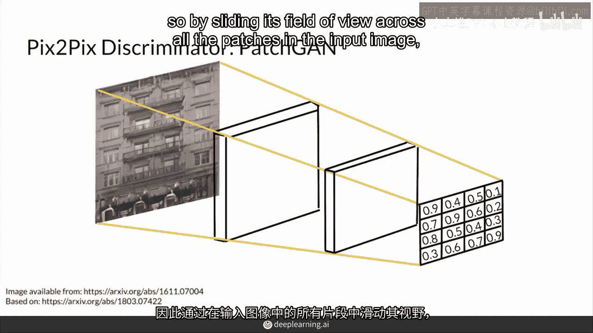

PatchGAN 仍然可以使用二元交叉熵损失进行训练。

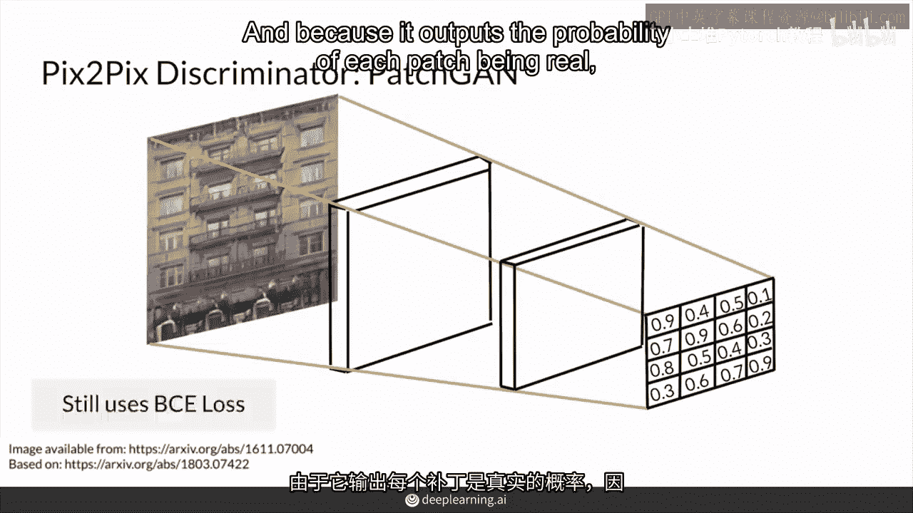

对于一个来自生成器的假图像，判别器的目标是尝试输出一个全零的矩阵。因此，对应的标签也是一个全零的矩阵。

**公式表示：**
`目标标签 = 全零矩阵`

这意味着判别器认为该图像的每一小块区域都是假的。

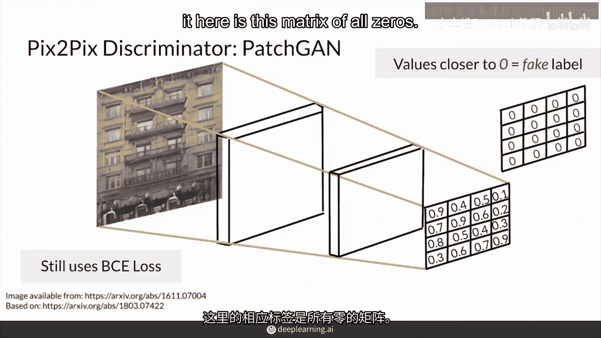

同样的逻辑也适用于你数据集中的真实图像。对于真实图像，PatchGAN 模型会尝试输出一个所有元素都为 1 的矩阵。

**公式表示：**
`目标标签 = 全一矩阵`

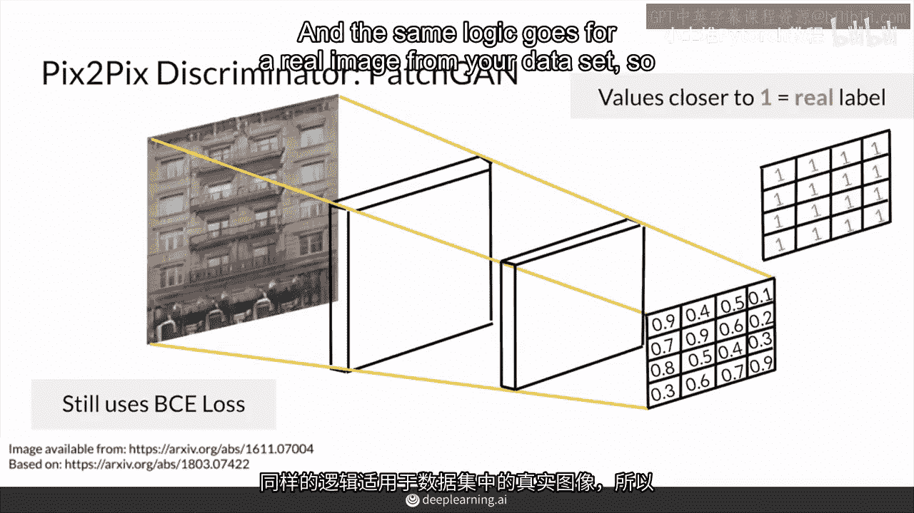

这表示判别器认为图像的每一小块区域都是真实的。

以下是训练过程中的核心步骤：
1.  对于生成图像，判别器输出应接近 0，损失函数推动其输出全零矩阵。
2.  对于真实图像，判别器输出应接近 1，损失函数推动其输出全一矩阵。

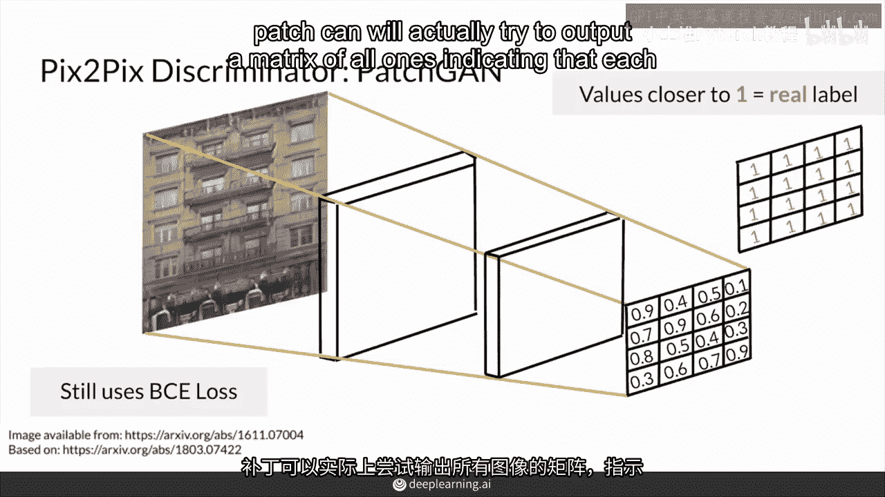

## 总结

本节课中我们一起学习了 pix2pix 模型中的 PatchGAN 判别器。

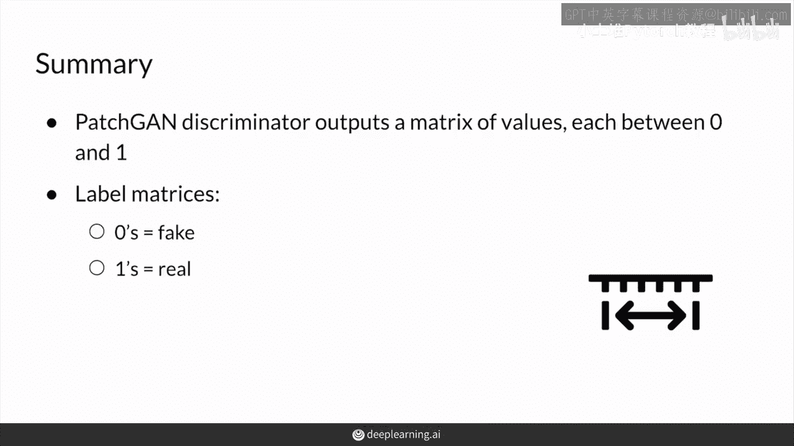

总结来说，对于 pix2pix，其判别器输出一个概率值的矩阵，而不是一个单一的真或假值。矩阵中的 0 仍然对应于该图像区域被分类为“虚假”，而 1 对应于“真实”。这种设计使得模型能够进行更细粒度的图像质量评估，尤其有利于图像到图像的翻译任务。