# 73：pix2pix图像翻译教程 🎨

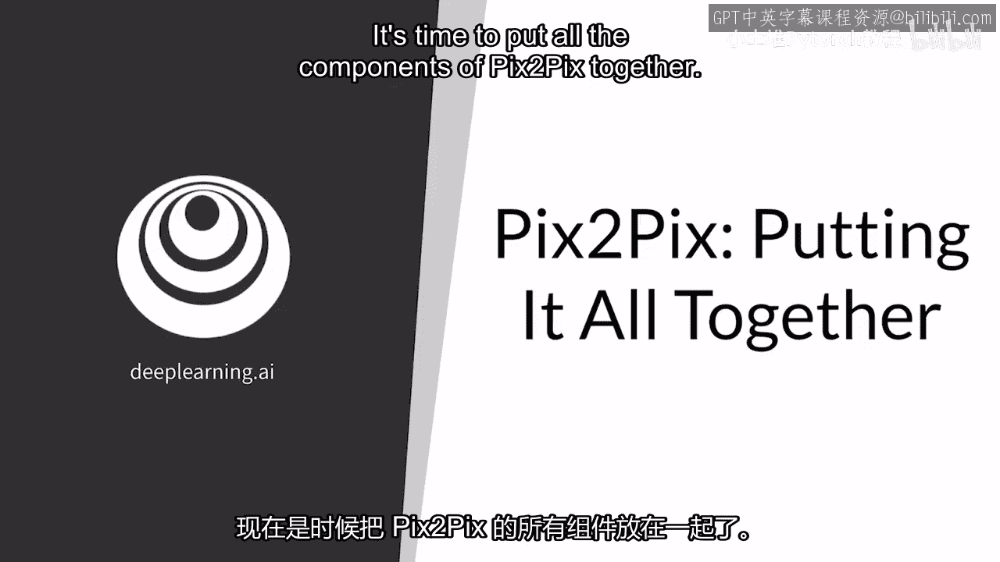

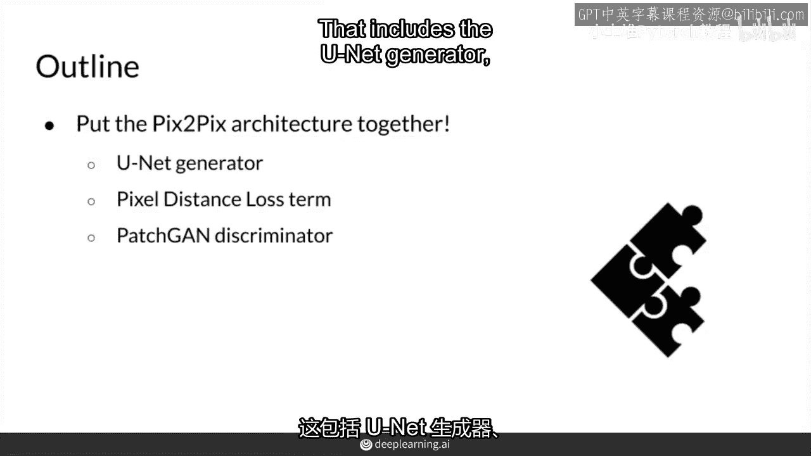

在本节课中，我们将学习如何将pix2pix模型的各个核心组件结合起来，包括生成器、鉴别器以及损失函数，以完成从输入图像到目标图像的翻译任务。

---

上一节我们介绍了pix2pix的基本概念，本节中我们来看看如何将这些组件整合成一个完整的训练流程。

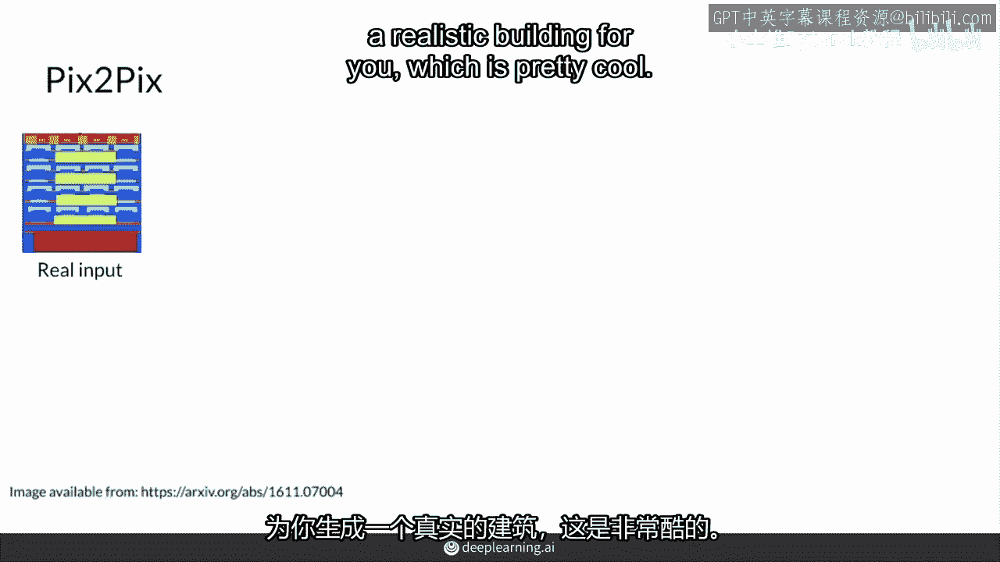

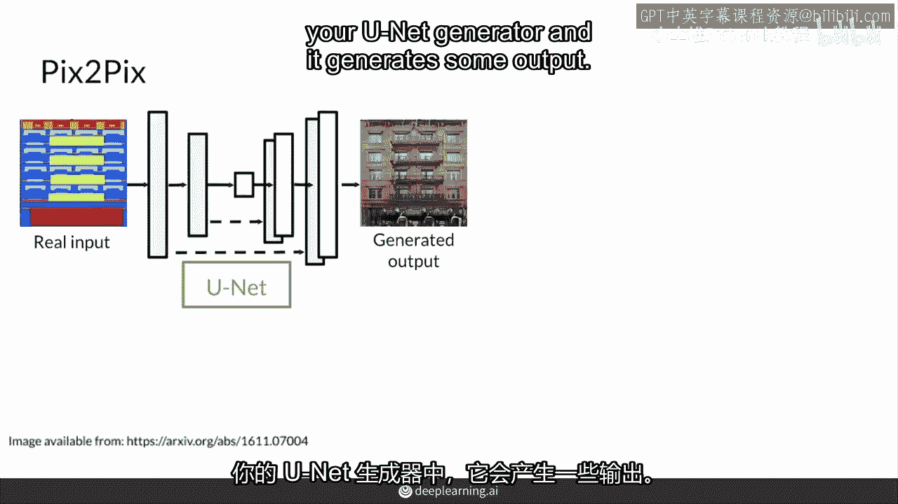

首先，你需要一个配对的数据集。例如，一个包含真实建筑图像及其对应分割掩码的数据集。分割掩码指明了图像中建筑的位置和轮廓。训练的目标是让模型学会从分割掩码生成逼真的建筑图像。

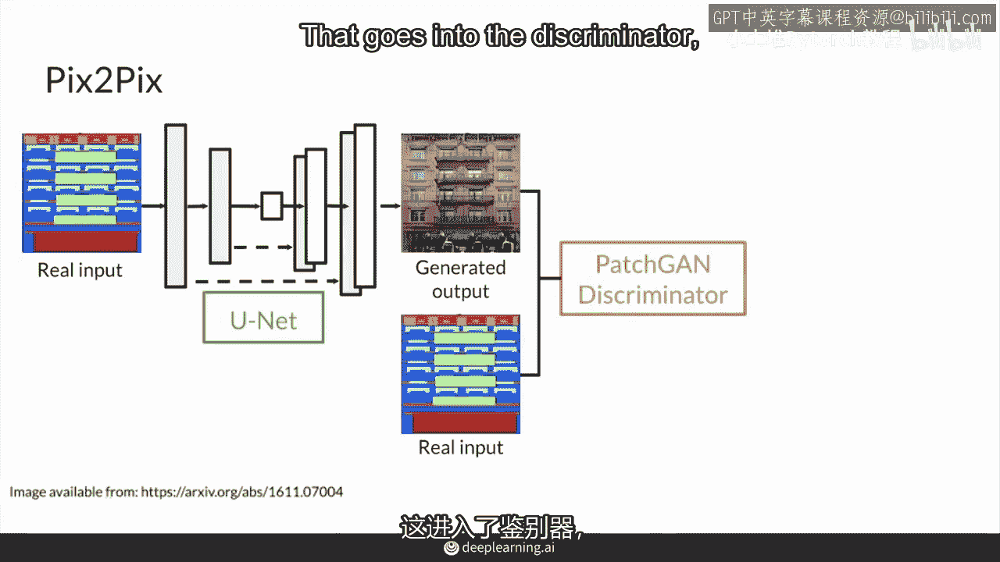

---

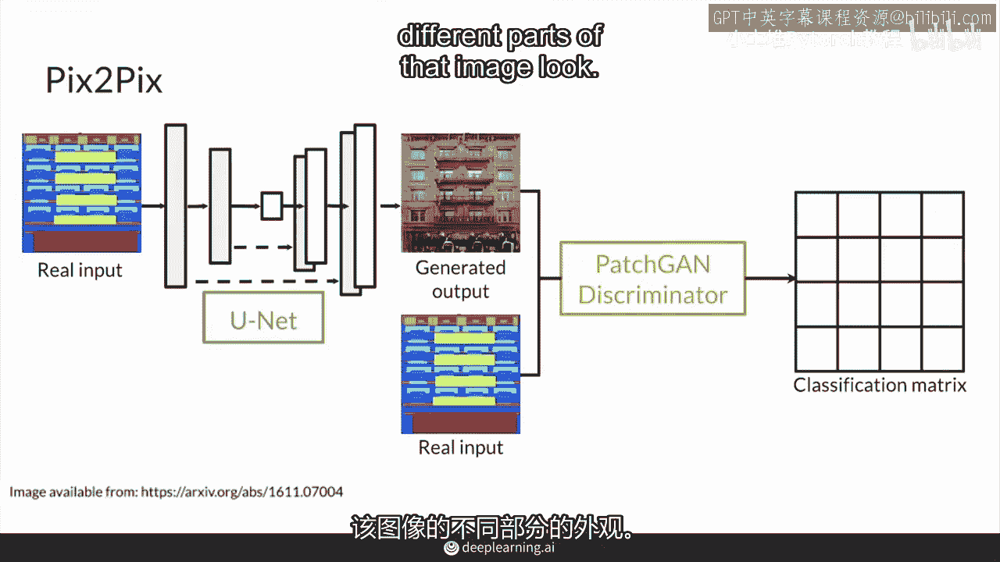

## 模型工作流程 🔄

以下是pix2pix模型训练的核心步骤：

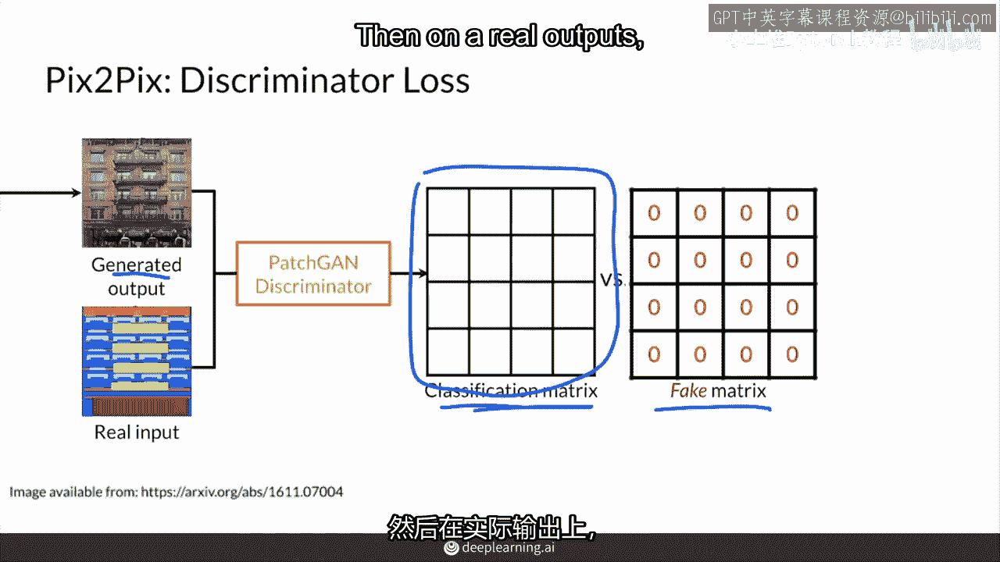

1.  **输入与生成**
    将分割掩码（输入图像）输入到**U-Net生成器**中。生成器会输出一张生成图像。

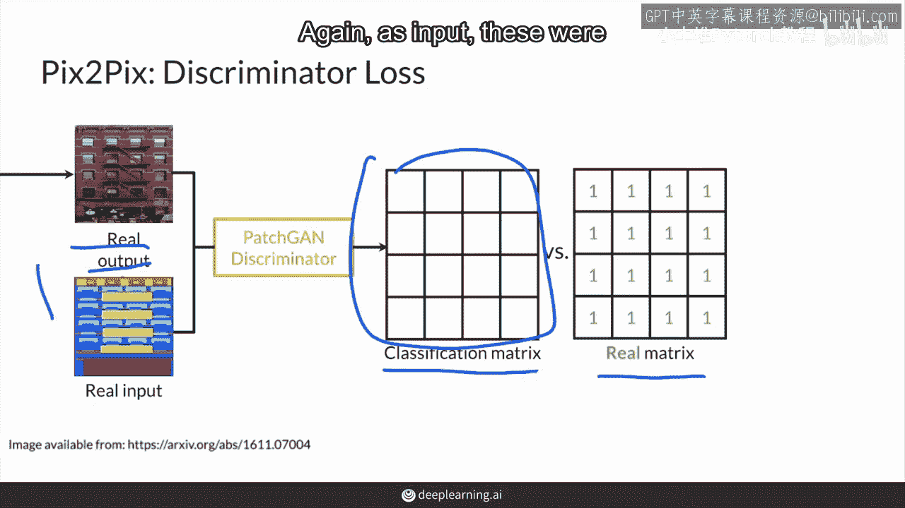

2.  **鉴别器判别**
    将生成图像与原始的真实输入图像（即分割掩码）沿通道维度拼接，形成条件输入，然后送入**PatchGAN鉴别器**。
    鉴别器会输出一个分类矩阵（例如 `N x N`），矩阵中的每个值（0到1之间）代表对应图像块是“真实”的概率。

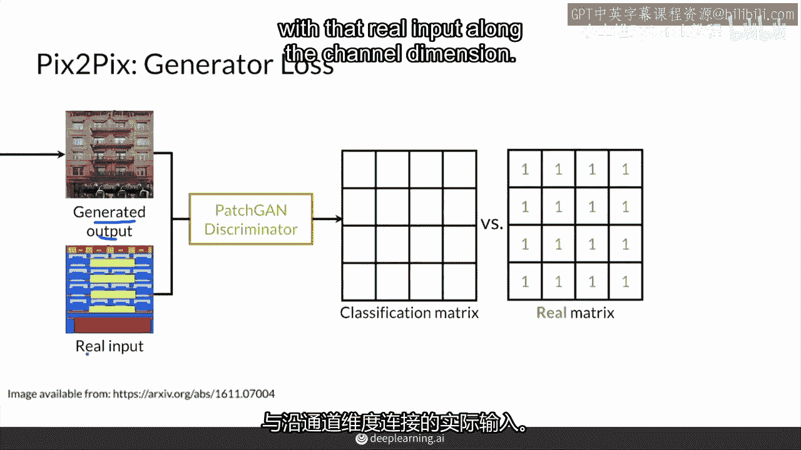

3.  **计算鉴别器损失**
    对于生成图像，我们希望鉴别器将其判别为“假”，因此标签是一个全零矩阵。计算鉴别器预测值与全零矩阵之间的损失（如二元交叉熵损失）。
    对于真实图像，我们希望鉴别器将其判别为“真”，因此标签是一个全一矩阵。计算鉴别器预测值与全一矩阵之间的损失。

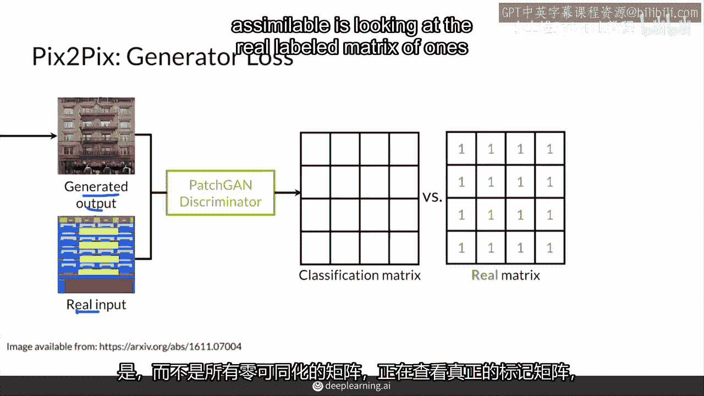

4.  **计算生成器损失**
    生成器的损失由两部分组成：
    *   **对抗损失**：生成器希望“欺骗”鉴别器，因此当生成图像输入鉴别器时，其目标是让鉴别器的输出接近全一矩阵。计算此输出与全一矩阵之间的损失。
    *   **像素距离损失（L1损失）**：计算生成器输出图像与真实目标图像之间逐像素的差异。这有助于生成图像在结构上与目标保持一致。
    生成器的总损失是这两项损失的加权和，公式为：
    `总损失 = 对抗损失 + λ * L1损失`
    其中 `λ` 是一个控制两项损失权重的超参数。

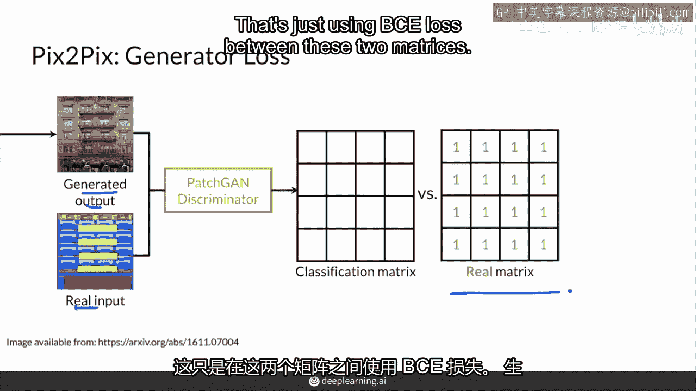

---

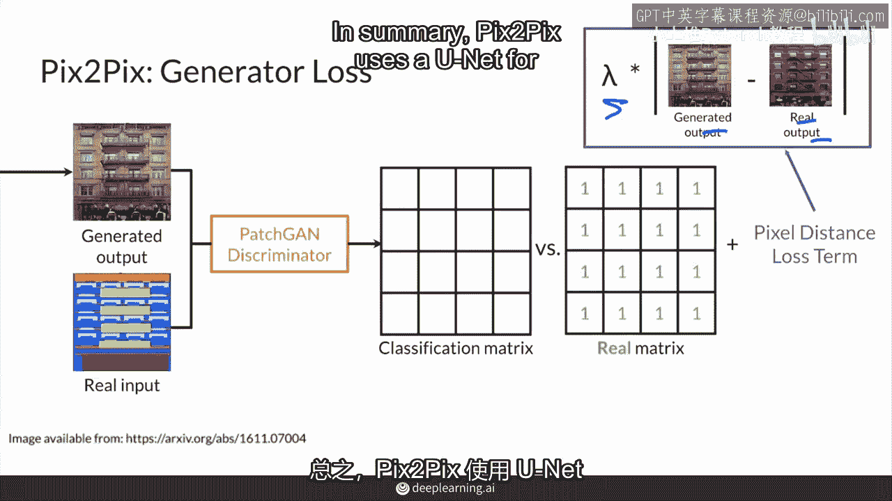

## 核心要点总结 ✨

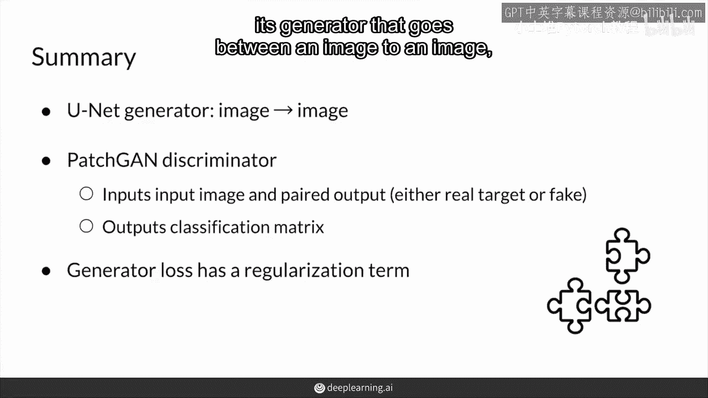

本节课中我们一起学习了pix2pix模型的完整训练流程。

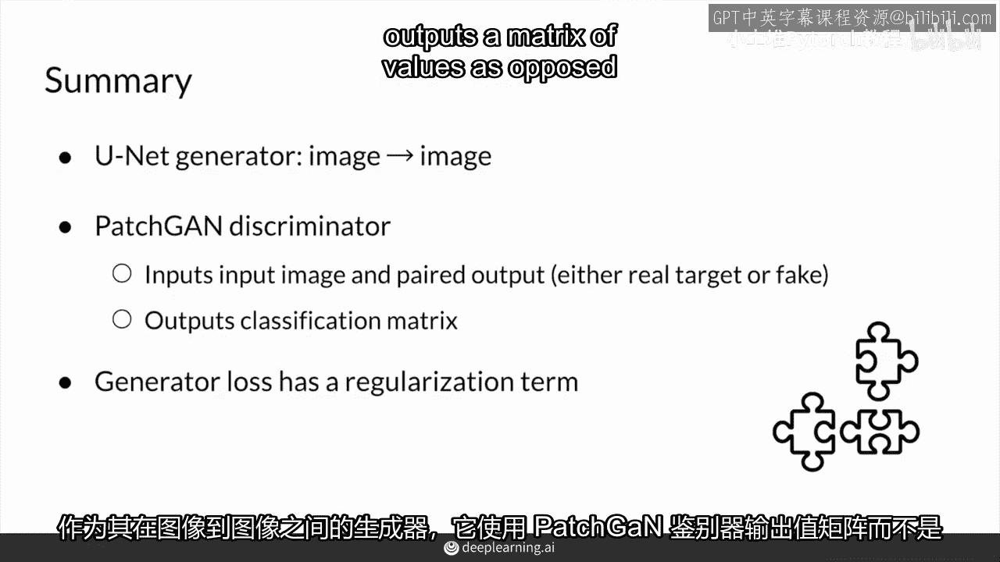

*   pix2pix使用**U-Net**作为生成器，实现图像到图像的转换。
*   它使用**PatchGAN**作为鉴别器，该鉴别器输出一个矩阵，用于评估图像局部区域的真实性，而非整张图像。
*   生成器的损失函数结合了**对抗损失**和**像素级L1损失**，这确保了生成结果既逼真（对抗损失驱动），又在结构上与输入条件对齐（L1损失驱动）。

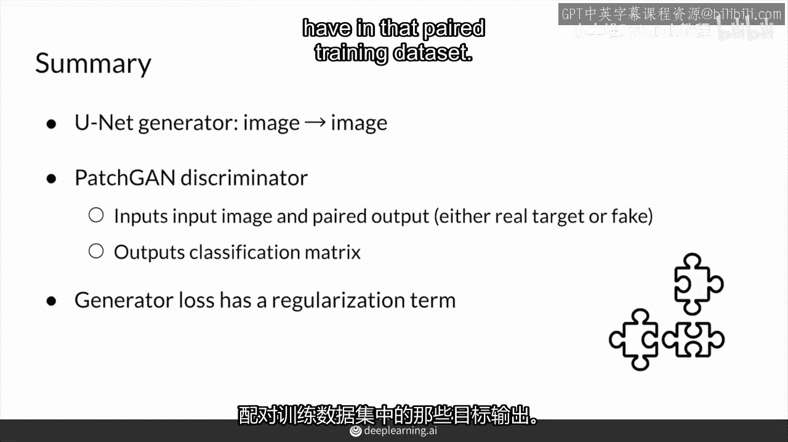

通过这种设计，pix2pix能够有效地学习配对图像数据集之间的映射关系，完成诸如根据分割图生成照片、为草图着色等多种图像翻译任务。