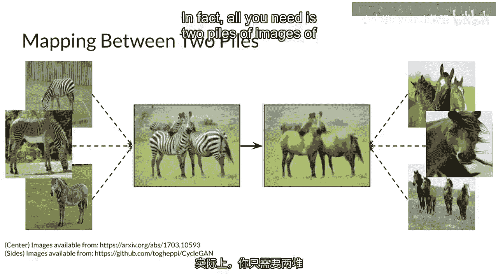
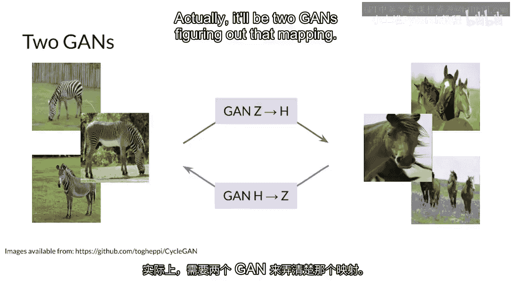
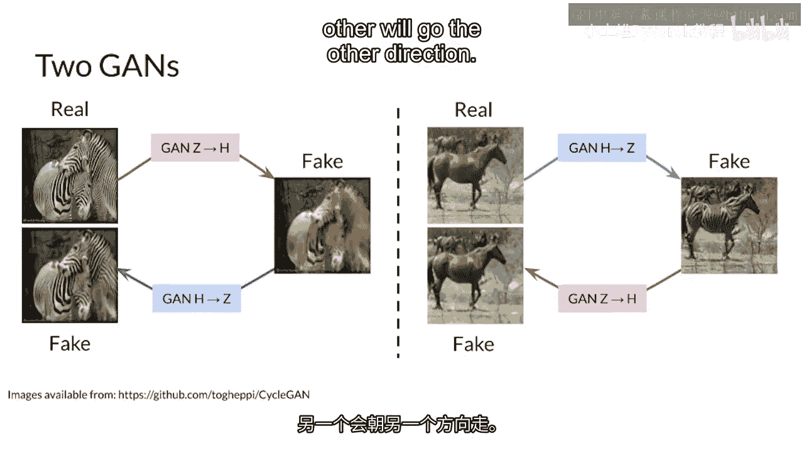
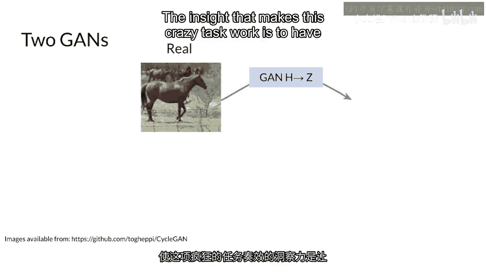
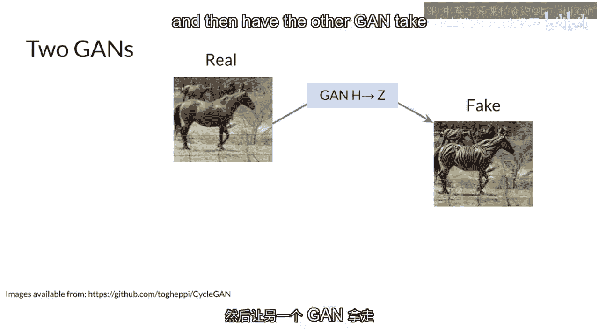
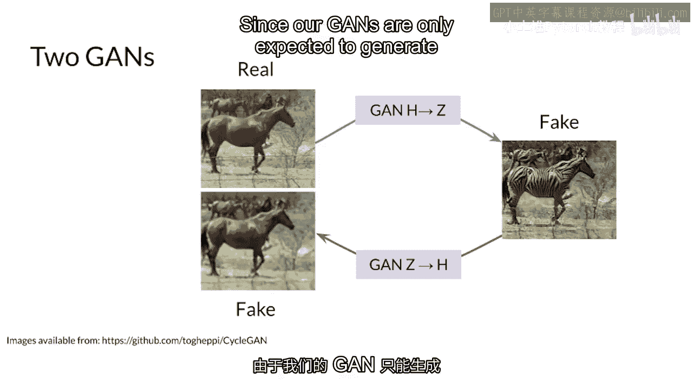
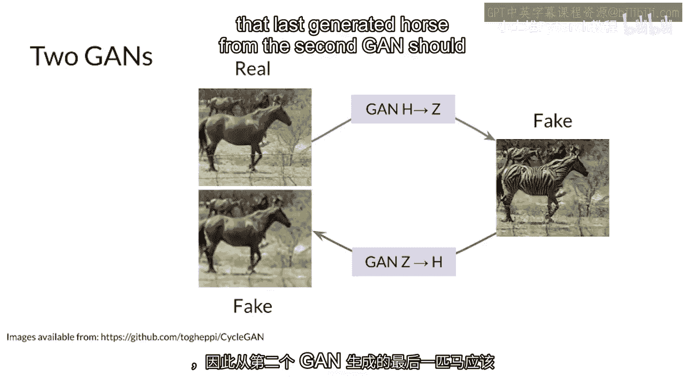

# 75：75. 欢迎来到第3周 🎯

在本节课中，我们将学习一种无需配对图像即可实现风格转换的先进方法——CycleGAN。我们将了解其核心思想，并探索两个生成对抗网络（GAN）如何协同工作，完成从“马”到“斑马”的图像转换任务。

---

## 概述

恭喜你进入本专题的最后一周。本周内容将在上周图像转换知识的基础上进行构建。关键区别在于，你不再需要知道两张配对图像之间的精确对应关系。你只需要准备两堆不同风格的图像集合。

你的GAN模型会从这些数据中自动学习映射关系。更准确地说，这将是两个GAN共同协作来找出这个映射。

---

## 核心思想：双向循环映射

上一节我们介绍了无需配对数据的基本前提，本节中我们来看看CycleGAN是如何实现这一点的。

其核心洞察力在于建立一个**循环**。这个想法让一个GAN将马图像转换成斑马，然后让另一个GAN将这个生成的“假斑马”图像再转换回马。

由于GAN被设计为只改变图像的风格而不改变其内容，因此第二个GAN生成的“马”应该与最初输入的真实马图像非常相似。

---

## 网络结构与工作流程

理解了循环的思想后，我们来看看两个GAN是如何具体交互的。

以下是CycleGAN中两个生成器的基本工作流程：

1.  **生成器G**：负责将**域A**（例如马）的图像转换到**域B**（例如斑马）。
    *   `假斑马 = G(真马)`
2.  **生成器F**：负责将**域B**（例如斑马）的图像转换回**域A**（例如马）。
    *   `重建马 = F(假斑马)`

这两个生成器之间的相互作用形成了一个闭合循环，因此得名CycleGAN。你首先将真实马图像输入到第一个GAN（G）中，得到假斑马图像，然后再将这个假斑马图像输入到第二个GAN（F）中，目标是重建出原始的马图像。

这个循环一致性是模型能够在不使用配对数据的情况下学习正确映射的关键。

---

## 总结

本节课中，我们一起学习了CycleGAN的基本原理。我们了解到，通过使用两个生成器并构建一个循环重建的约束，模型可以仅凭两堆未配对的图像集（如一堆马图和一堆斑马图），自动学习到两种风格之间的双向映射关系。这解决了收集精确配对训练数据的难题，是图像风格转换领域的一个重要进展。