# 76：非配对图像到图像翻译 🖼️

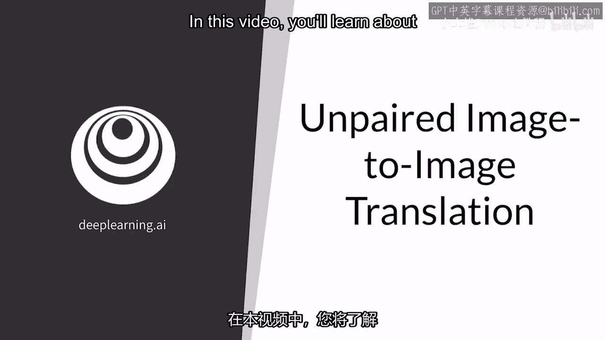

在本节课中，我们将要学习**非配对图像到图像翻译**的核心概念。我们将从比较它与配对翻译的区别开始，理解其工作原理，并探讨模型如何从两个不同风格的图像集合中学习，以完成风格转换任务。

---

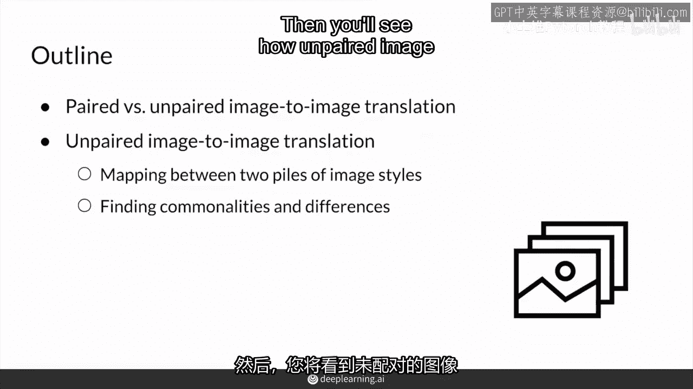

## 🔄 配对与非配对翻译的比较

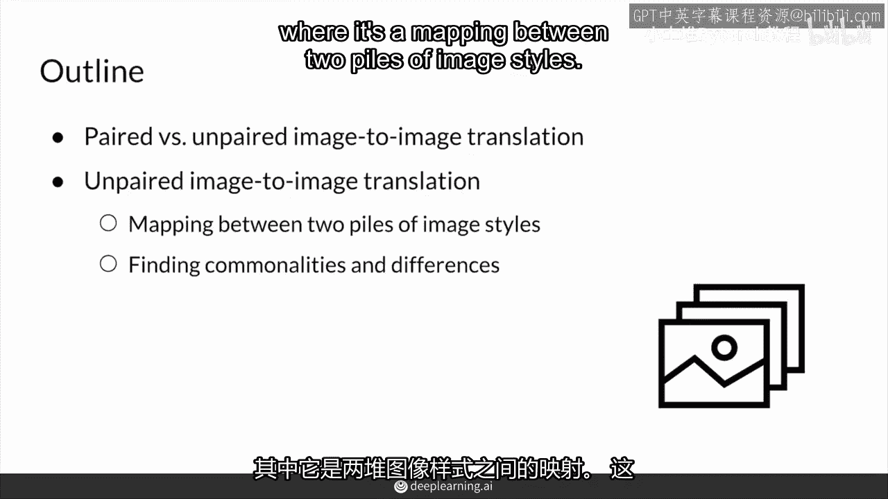

上一节我们介绍了图像翻译的基本概念，本节中我们来看看两种主要的范式：配对翻译与非配对翻译。

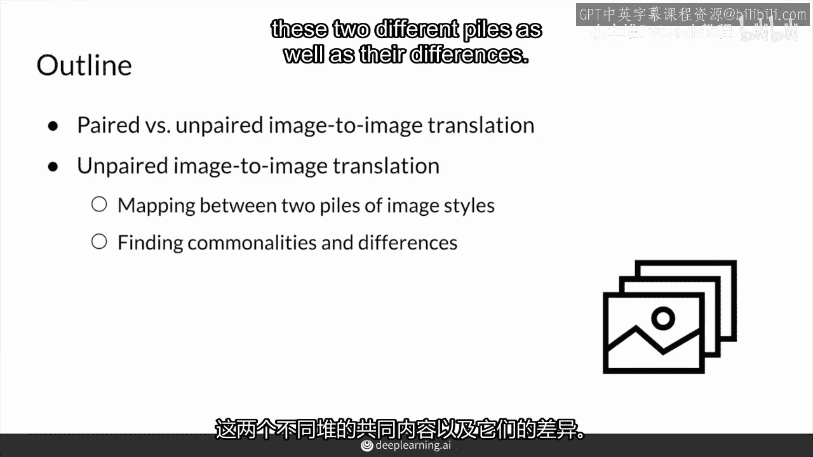

你之前已经看到了**配对图像翻译**。这是有明确输入输出配对的情况。例如，边缘检测任务中，输入是真实图像，输出是其对应的边缘图。因为你可以使用边缘检测器将真实图像转换为边缘，所以很容易获得这种配对数据集。

其数据关系可以表示为：
**公式：** `{(x_i, y_i)}`，其中 `i = 0, 1, 2, ...`，`x_i` 与 `y_i` 是严格对应的。

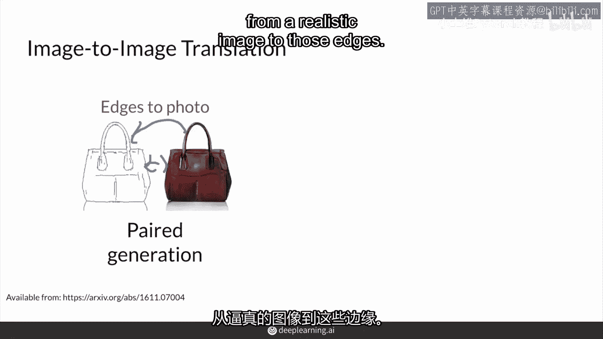

然而，**非配对图像翻译**则不同。例如，你想将一匹马变成斑马，或者将一张照片变成莫奈风格的画作。这类任务要困难得多，因为你通常没有现成的配对训练数据。你不可能为每张照片都有一幅对应的莫奈风格画作，反之亦然。

---

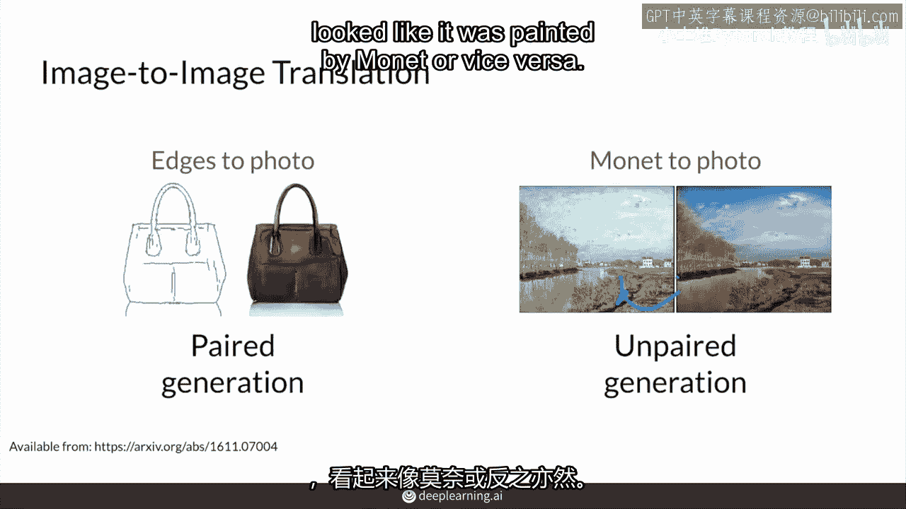

## 🗂️ 非配对翻译的核心：两个图像堆

在非配对图像翻译中，你实际上只有两个不同风格的图像集合（或称“堆”）。

以下是两个图像堆的典型例子：
*   一堆 `X`：可能是真实的照片。
*   一堆 `Y`：可能是莫奈的画作、夏季场景的图像，或者斑马的图片。

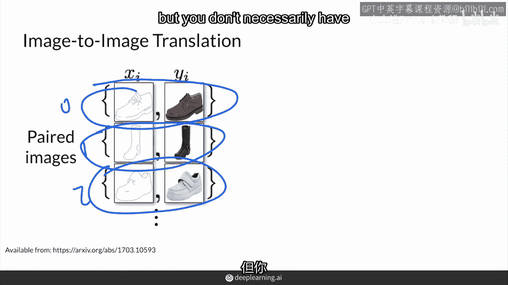

模型的目标是使用这两个堆 `X` 和 `Y`，学习从一个堆到另一个堆的一般风格元素映射，并将图像从一个域转换到另一个域。这种转换通常是双向的，例如既可以从照片到莫奈风格，也可以从莫奈风格“还原”到照片。

---

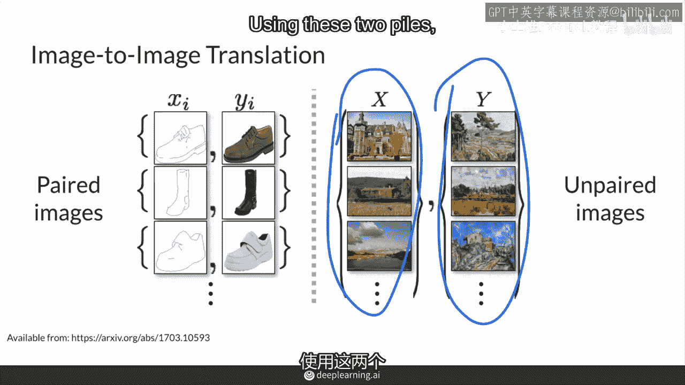

## 🎯 任务关键：分离内容与风格

理解非配对翻译任务的关键在于认识到图像中存在**共享的内容**和**独特的风格**。

具体来说，从斑马图像生成马图像时，生成的马应该保持与原始斑马相同的姿态、背景和基本形状。你只想让那些**条纹消失**。

*   **内容**：指两个图像堆之间共享的元素，例如物体的一般形状、构图和背景。
    **代码/概念描述：** `内容 = 跨域共享的语义信息`
*   **风格**：指每个图像堆独特的外观元素，例如斑马的条纹、莫奈的笔触和色彩。
    **代码/概念描述：** `风格 = 域特定的外观特征`

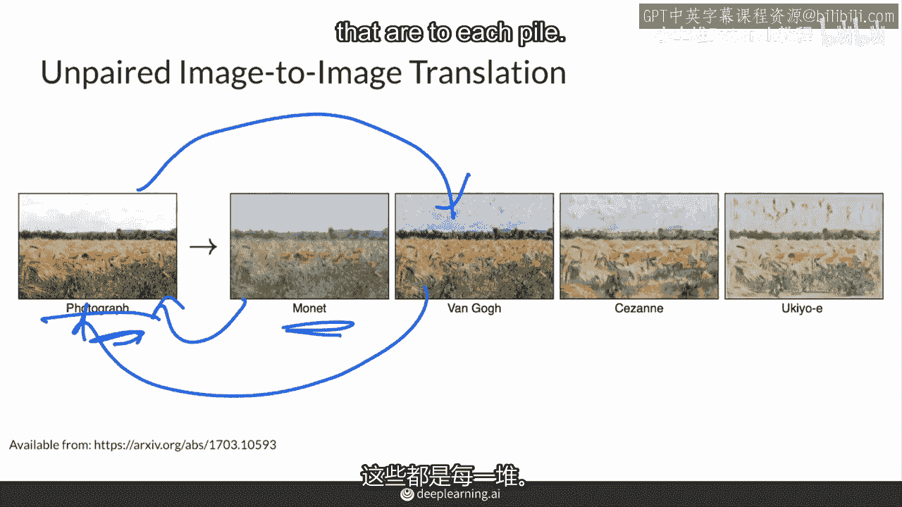

因此，模型的核心目标是学会区分并分离这两部分：保留跨域通用的**内容**，同时转换域特定的**风格**。

---

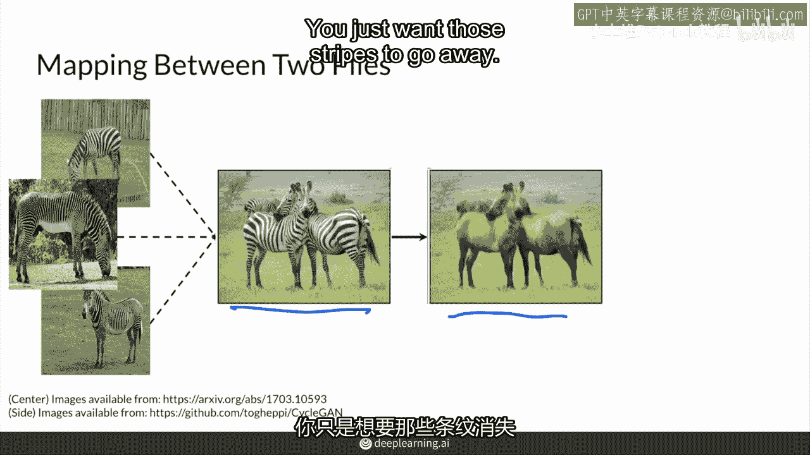

## 📝 总结

本节课中我们一起学习了非配对图像到图像翻译。

我们首先比较了它与配对翻译的区别：配对翻译依赖于严格对应的输入输出对 `(x_i, y_i)`，而非配对翻译则只有两个未配对的不同风格图像集合 `X` 和 `Y`。

接着，我们探讨了其工作原理。模型需要从这两个“堆”中学习，找出它们之间的共同内容（如物体形状）和差异风格（如纹理、颜色）。最终目标是实现图像风格的转换，同时保留其核心内容。

简单来说，**非配对图像到图像转换利用不同风格的图像集合进行训练。模型通过保留两个集合中共有的内容，并改变各自独特的风格，来学习它们之间的映射关系。**

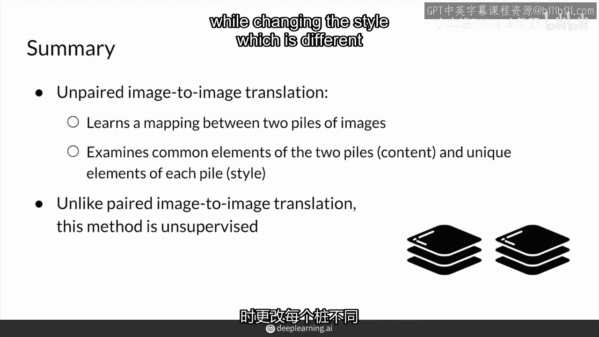

在接下来的课程中，我们将深入探讨实现这一目标的经典算法。