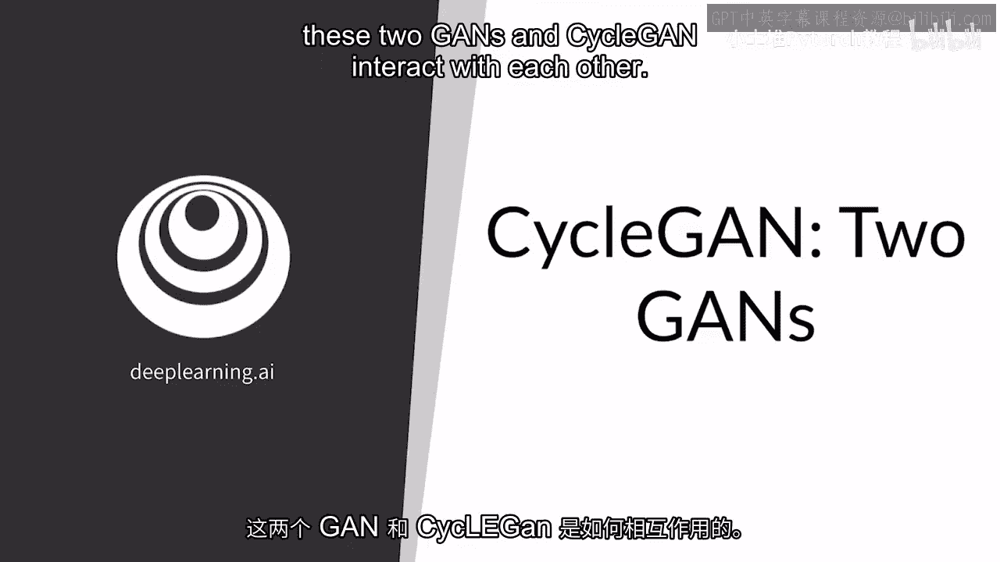
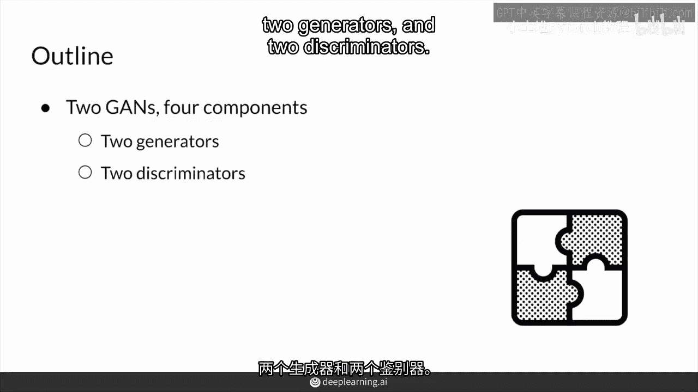
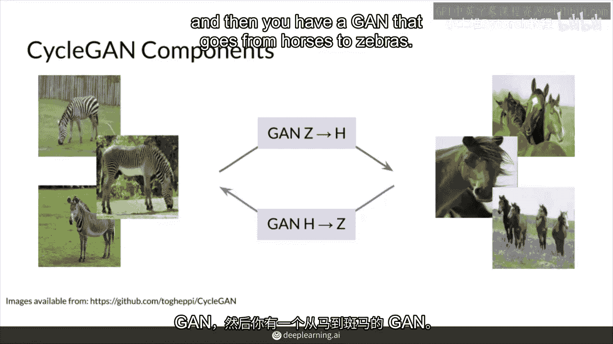
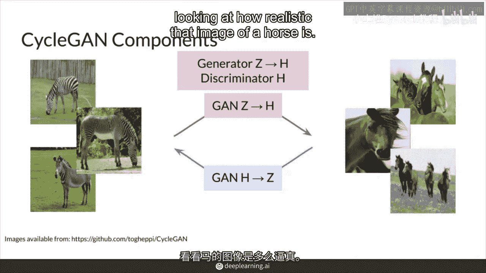
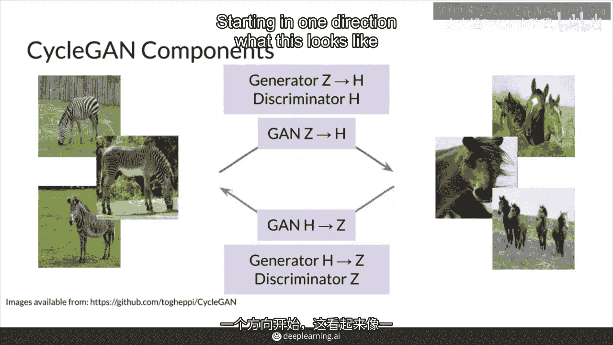
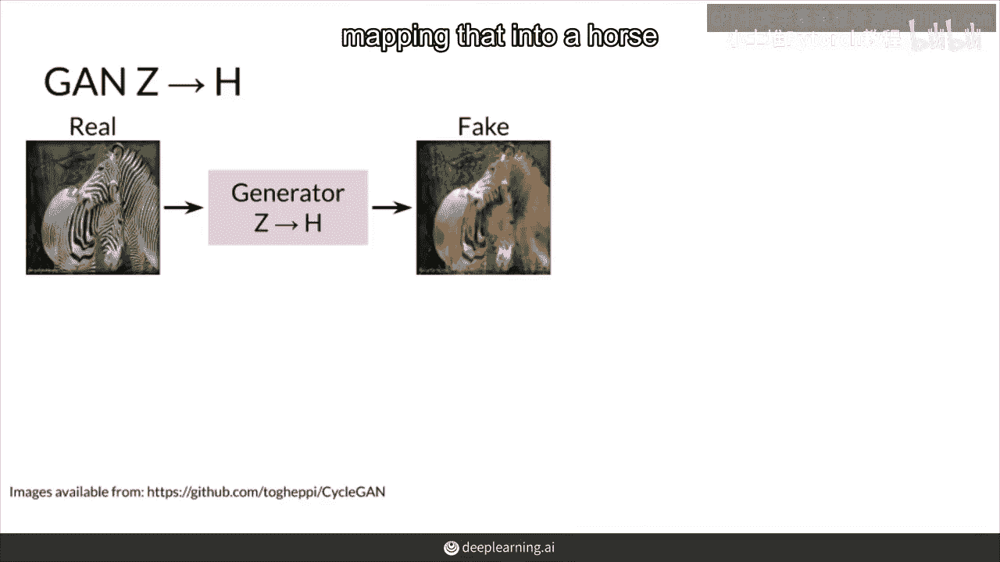
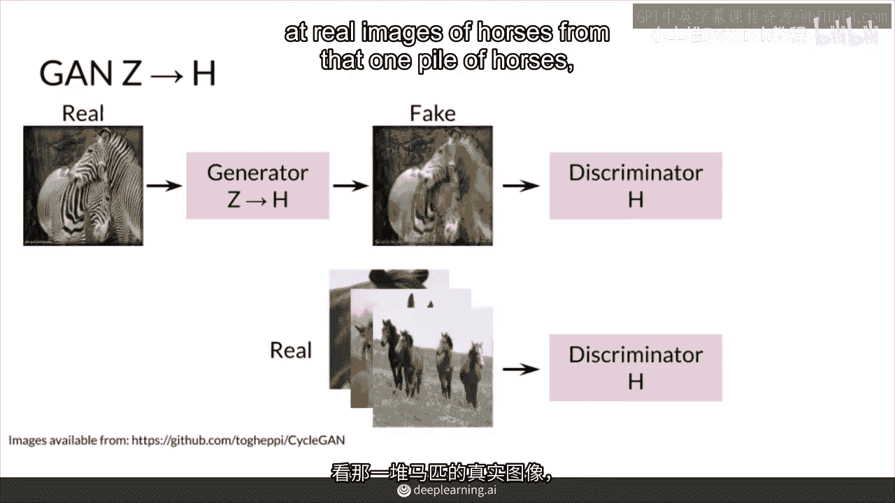
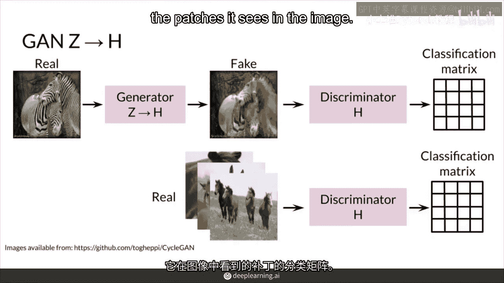
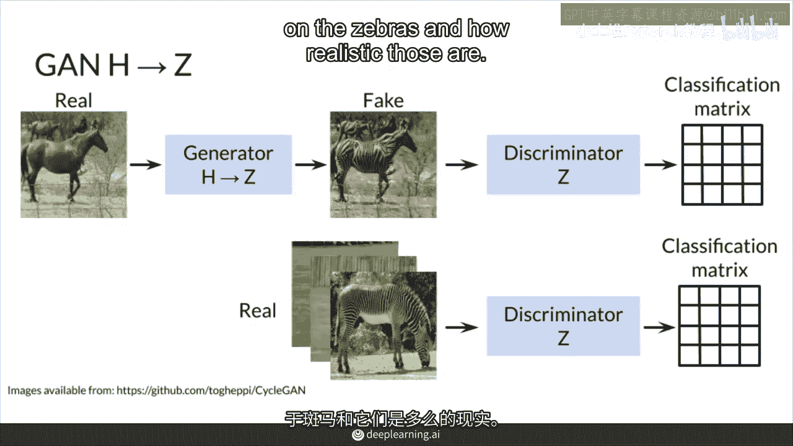
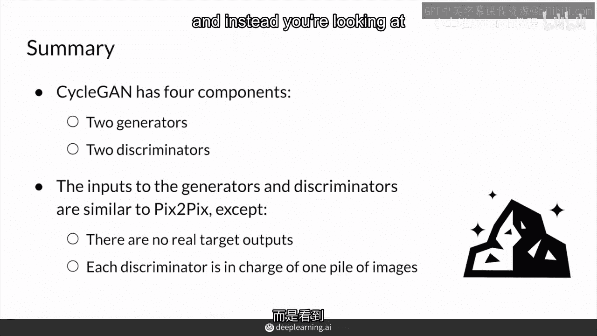

# 78：CycleGAN 双生成对抗网络 🌀

在本节课中，我们将学习 CycleGAN 的核心架构。CycleGAN 是一种用于图像风格转换的模型，它能够在没有成对训练数据的情况下，学习两个不同域（例如马和斑马）之间的映射关系。

---

## 模型架构概览

正如预期的那样，CycleGAN 包含两个独立的生成对抗网络（GAN），每个 GAN 又由一个生成器和一个判别器组成。因此，整个模型共有四个核心组件。

---

## 两个方向的GAN

首先，我们有一个从斑马图像转换到马图像的 GAN。其次，我们还有一个从马图像转换到斑马图像的 GAN。这两个 GAN 共同构成了一个循环。

以下是四个组成部分的具体描述：

*   **斑马到马 GAN**：包含一个学习从斑马映射到马的生成器，以及一个负责判别马图像真伪的判别器。
*   **马到斑马 GAN**：包含一个学习从马映射到斑马的生成器，以及一个负责判别斑马图像真伪的判别器。

---

## 前向转换过程

现在，让我们具体看看一个方向的转换是如何工作的。

当输入一张斑马图像时，它会被送入 **斑马到马的生成器**，该生成器会将其映射（转换）成一张马的图像。

接着，这张生成的马图像会被送到 **马的判别器**。判别器的任务是检查图像的真实性，它需要从一堆真实的马图像和生成的“假”马图像中，判断出哪些是真实的。

需要特别注意的是，这里的判别器是一个 **PatchGAN**。这意味着它不会对整个图像输出一个单一的真/假判断，而是会输出一个分类矩阵，矩阵中的每个元素对应图像中的一个“补丁”（局部区域）的真实性判断。

---

## 反向转换过程

相反方向的转换过程是完全对称的。从马到斑马的生成器将马图像转换为斑马图像，而 **斑马的判别器** 则专注于判断斑马图像的真伪。

---

## 与Pix2Pix的对比

总结来说，CycleGAN 由四个部分组成：两个生成器和两个判别器。

生成器和判别器的输入形式与另一个图像转换模型 Pix2Pix 类似。但是，两者有一个关键区别：**CycleGAN 不需要成对的训练数据**。

因为没有配对的真实图像作为目标输出，所以 CycleGAN 无法使用 Pix2Pix 中的 **像素距离损失**（如 L1 Loss）。在 Pix2Pix 中，生成器的输出会与一个真实的目标图像进行比较来计算损失。

而在 CycleGAN 中，由于没有这个“目标输出”，模型的学习完全依赖于两个判别器对各自域内图像真实性的判断，以及我们将在后续课程中介绍的“循环一致性”约束。

---

## 本节总结

本节课中，我们一起学习了 CycleGAN 的基本架构。我们了解到 CycleGAN 包含两个方向的 GAN，共计两个生成器和两个判别器。最重要的是，我们明白了 CycleGAN 与 Pix2Pix 的核心区别在于它不需要成对的训练数据，因此其损失函数的设计也截然不同。在下一节中，我们将深入探讨 CycleGAN 是如何在没有配对数据的情况下进行有效训练的。