# 80：80. CycleGAN最小二乘损失 🎯

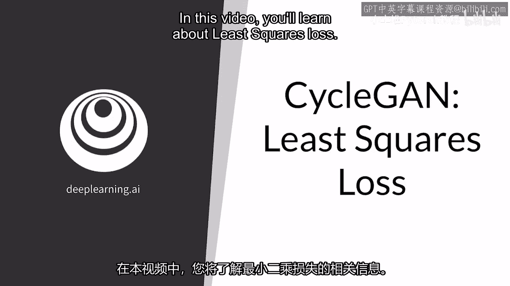

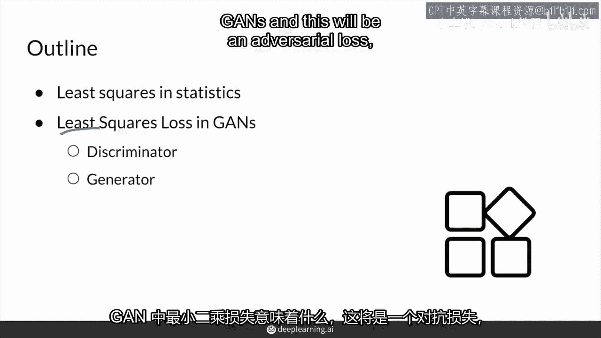

在本节课中，我们将学习CycleGAN中使用的最小二乘损失。我们将从统计学中的最小二乘法概念讲起，然后探讨它在生成对抗网络（GAN）中作为对抗性损失的含义与作用，并了解它如何替代传统的BCE损失或Wasserstein损失。

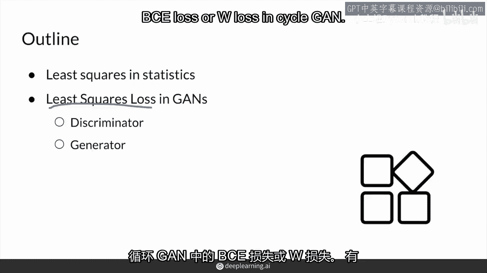

## 概述 📋

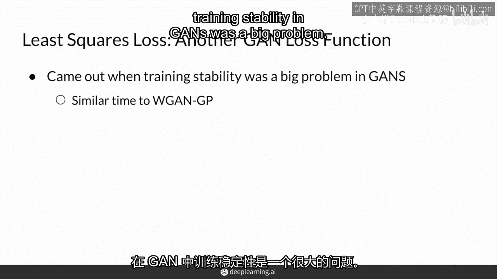

最小二乘损失出现在与WGAN-GP相似的时期，当时训练生成对抗网络的稳定性是一个重大问题。该损失函数被用来帮助解决训练稳定性问题，例如梯度消失和模式崩溃，这些问题在BCE损失中常见，并可能导致学习过程提前终止。

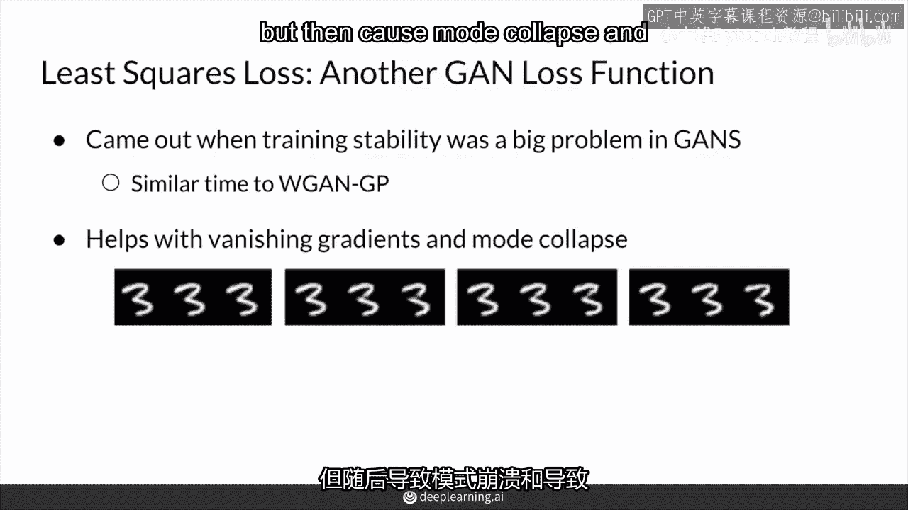

在深入之前，请注意，存在许多GAN损失函数，人们通常会根据经验为特定数据集选择效果更好的损失函数。训练时间也是选择损失函数时的一个重要考量因素。

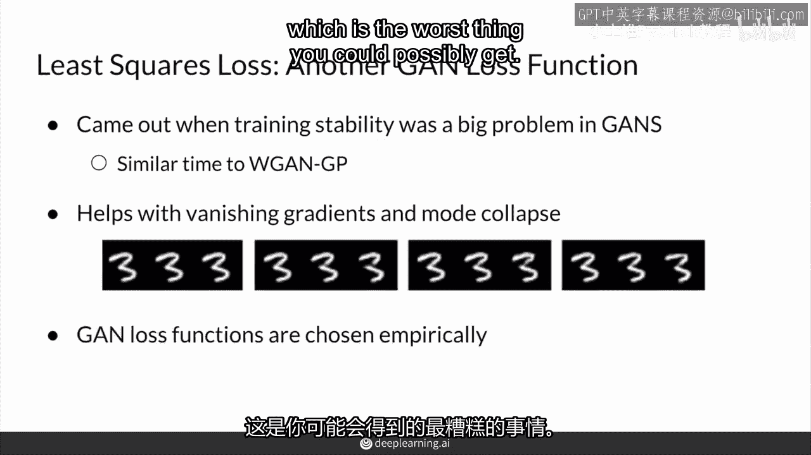

## 最小二乘法基础 📈

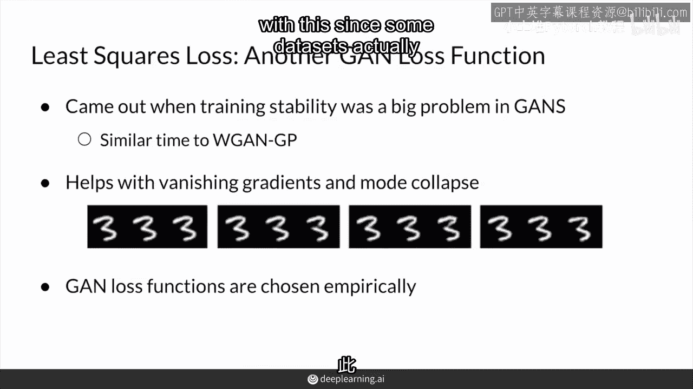

最小二乘法是统计学中一个简单的概念，它是一种通过最小化平方残差来找到最佳拟合线的方法。这意味着它试图找到一条直线，使得所有数据点到这条直线的**平方距离之和**最小。

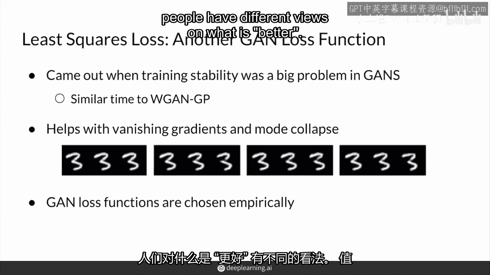

以下是其核心思想：
1.  假设有一些数据点，你想画一条直线来拟合它们。
2.  计算每个点到这条直线的垂直距离。
3.  将这些距离进行平方（以避免正负抵消），然后求和。
4.  通过调整直线的参数，**最小化这个平方和**，此时得到的直线就是最佳拟合线。

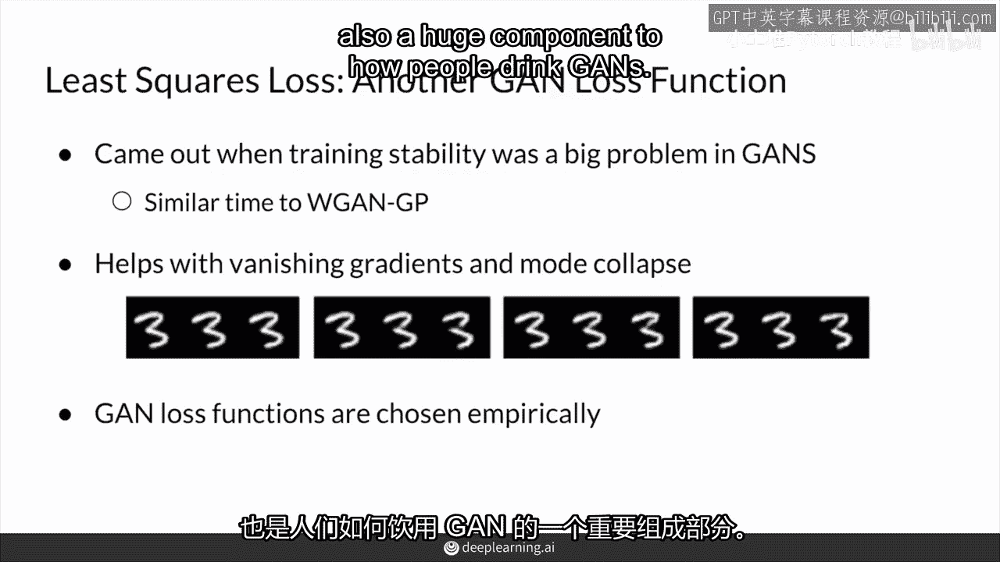

用公式表示，对于一组点 `(x_i, y_i)` 和直线 `y = ax + b`，最小二乘法的目标是找到参数 `a` 和 `b`，使得以下值最小：
`S = Σ (y_i - (a*x_i + b))^2`

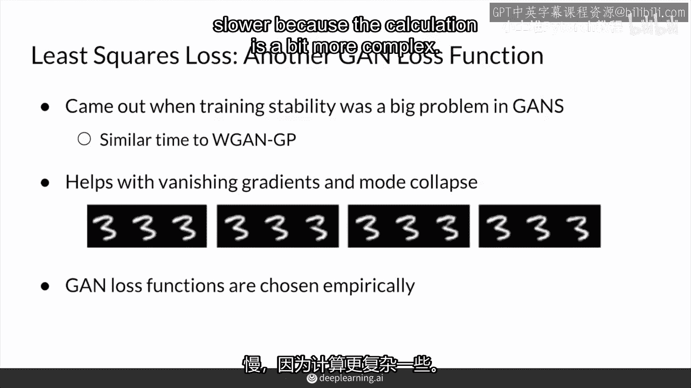

## 最小二乘损失在GAN中的应用 🤖

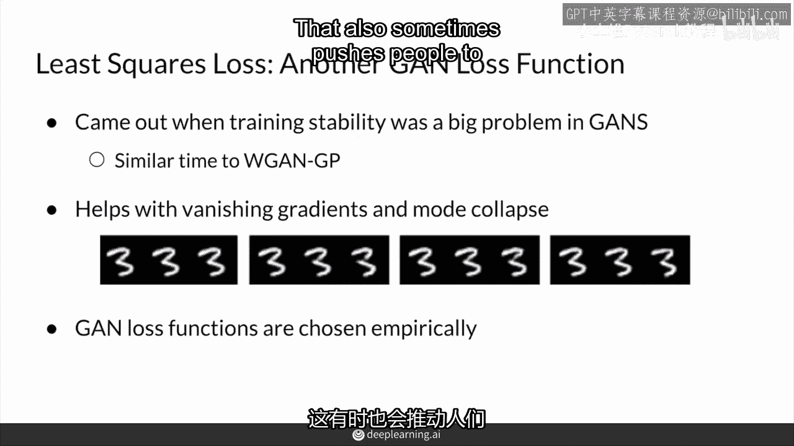

在GAN的语境中，“直线”变成了判别器（Discriminator）的目标标签。具体来说：
*   **对于真实图像**，目标标签是 `1`。点则是判别器对真实图像的预测值 `D(x)`。
*   **对于生成图像**，目标标签是 `0`。点则是判别器对生成图像的预测值 `D(G(z))`。

最小二乘损失的目标，就是最小化判别器预测值与其对应目标标签之间的**平方距离**。

以下是判别器和生成器的损失函数公式：

**判别器损失 (D Loss)**：
`L_D = E_{x~p_data}[(D(x) - 1)^2] + E_{z~p_z}[(D(G(z)) - 0)^2]`
*   第一项鼓励判别器将真实图像判别为 `1`。
*   第二项鼓励判别器将生成图像判别为 `0`。

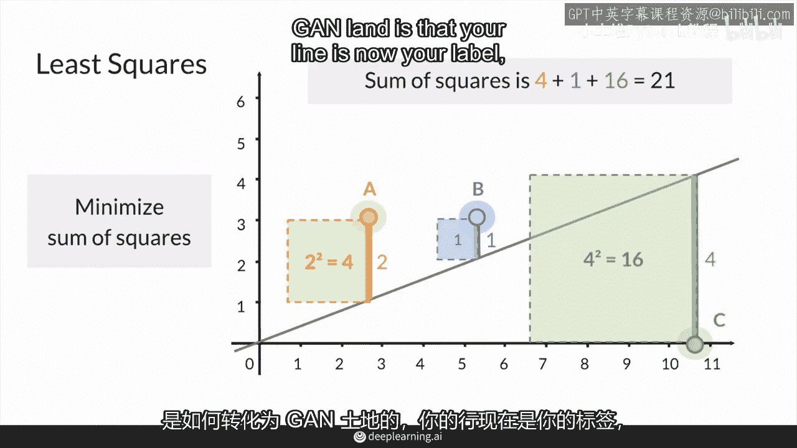

**生成器损失 (G Loss)**：
`L_G = E_{z~p_z}[(D(G(z)) - 1)^2]`
*   生成器的目标是“欺骗”判别器，因此它希望判别器将生成图像判别为 `1`。

## 与BCE损失的对比 ⚖️

上一节我们介绍了最小二乘损失的公式，本节中我们来看看它与二元交叉熵（BCE）损失的关键区别。

最小二乘损失的一个主要优势在于它缓解了**梯度消失**问题。在BCE损失中，当判别器的预测非常自信（接近0或1）时，损失函数的梯度会变得非常平缓（饱和），导致生成器难以获得有效的更新信号。

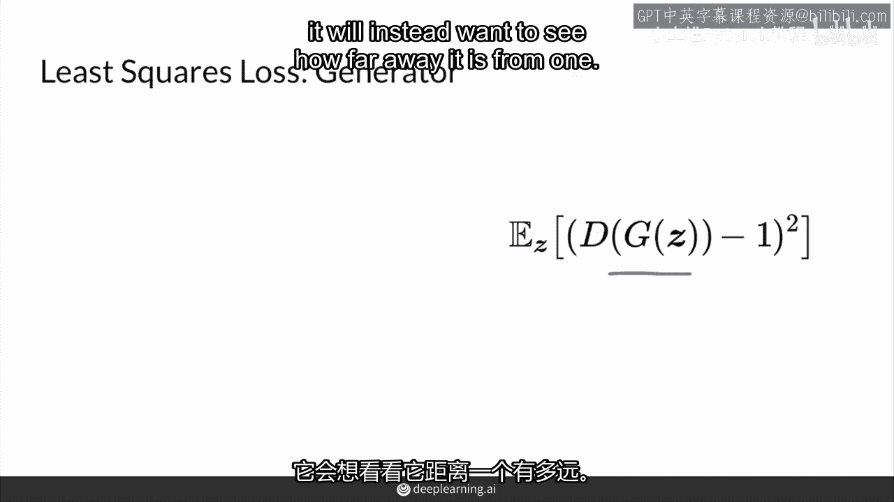

而最小二乘损失函数只在预测完全正确（即预测值等于目标标签1或0）时才会变得平坦。在其他情况下，损失值是一个平滑的二次函数，能提供持续的梯度，从而改善了GAN训练的稳定性。

对于熟悉其他概念的读者，最小二乘损失也被称为**均方误差（MSE）**。

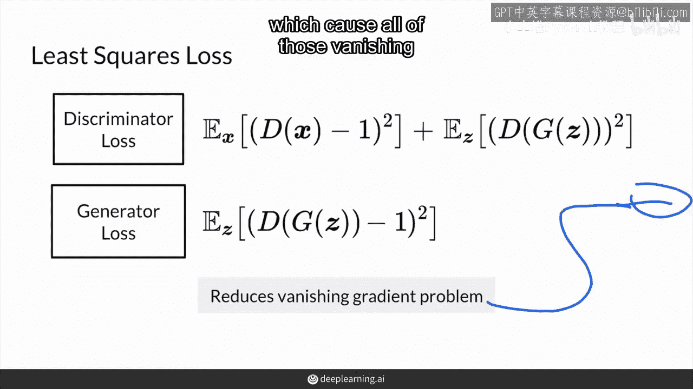

## 在CycleGAN中的整体损失 🚴

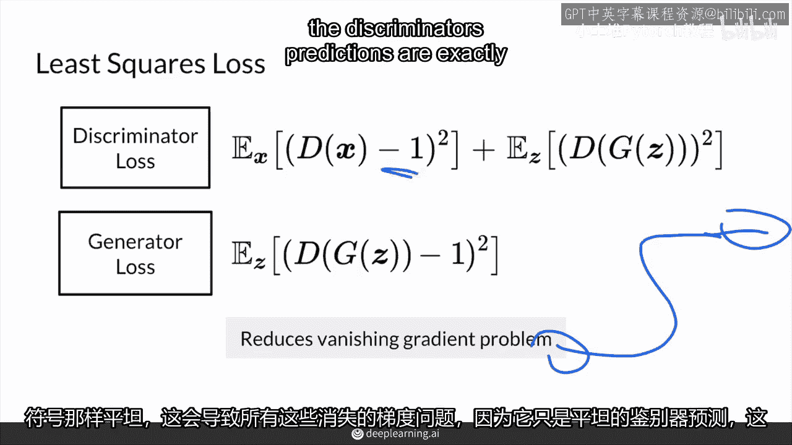

在CycleGAN的背景下，最小二乘损失被用作其对抗性损失部分。完整的CycleGAN损失函数由两部分组成：

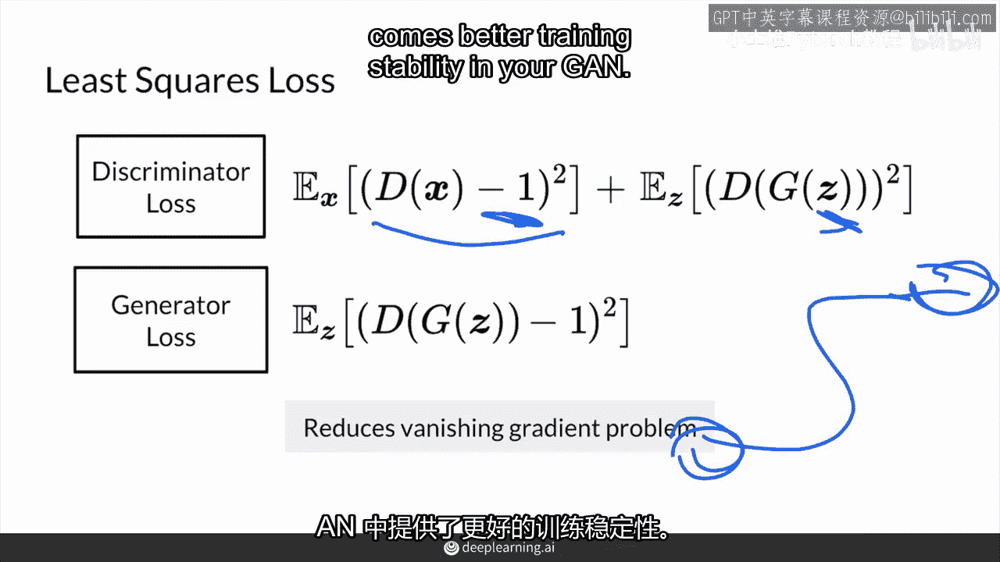

1.  **对抗损失（Adversarial Loss）**：即我们刚刚学习的最小二乘损失，用于确保生成图像在目标域中的真实性。
2.  **循环一致性损失（Cycle Consistency Loss）**：这是我们之前学过的内容，用于保持图像转换前后的内容一致性，用超参数 `λ` 来控制其权重。

因此，CycleGAN的总生成器损失是这两部分的和。

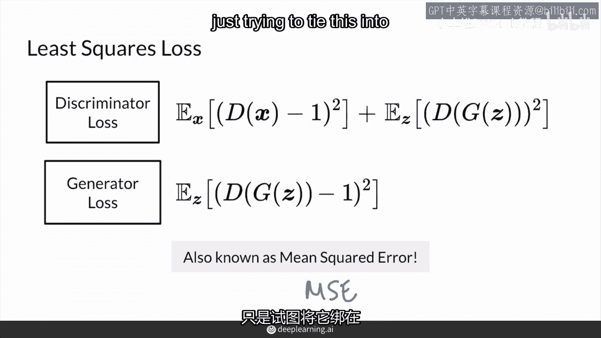

## 总结 🎓

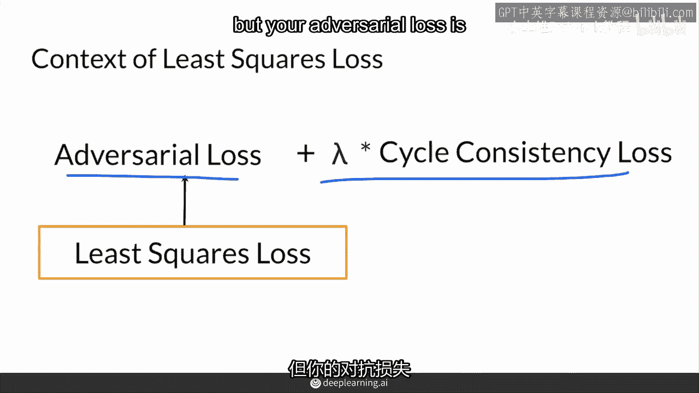

本节课中我们一起学习了最小二乘损失。

*   我们首先回顾了统计学中**最小二乘法**的基本概念，即通过最小化平方距离之和来寻找最佳拟合。
*   接着，我们探讨了如何将这一概念应用于GAN中，定义了**判别器**和**生成器**对应的最小二乘对抗损失公式。
*   然后，我们对比了最小二乘损失与BCE损失，指出前者由于**梯度非饱和**的特性，有助于缓解训练中的梯度消失问题，从而提升训练稳定性。
*   最后，我们明确了在CycleGAN中，最小二乘损失作为**对抗损失**，与**循环一致性损失**共同构成了模型的完整目标函数。

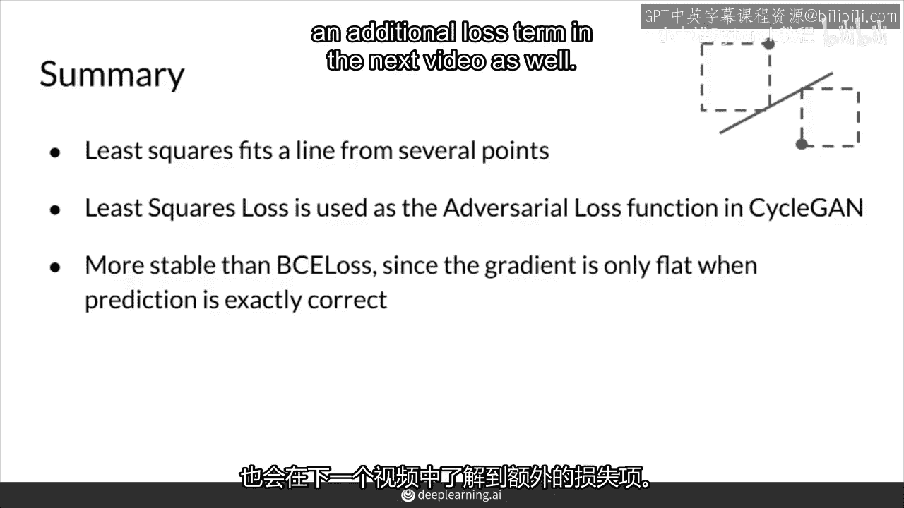

记住，最小二乘损失是众多改进GAN训练稳定性的技巧之一，在实践中需要根据具体任务进行选择和实验。