# 81：CycleGAN 身份损失详解 🎨

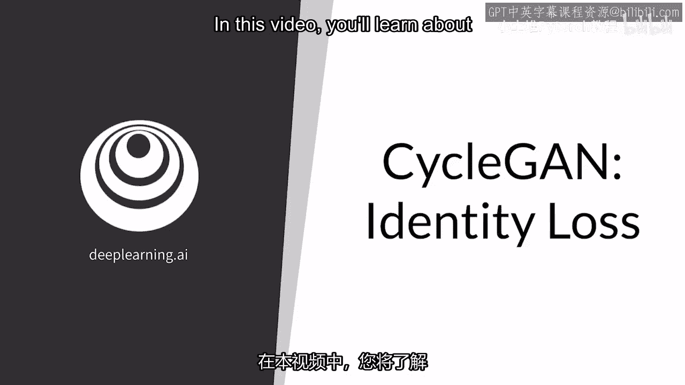

在本节课中，我们将要学习 CycleGAN 中的一个重要概念——身份损失。我们将了解它的工作原理、作用以及如何通过它来改善图像转换任务中的颜色保真度。

---

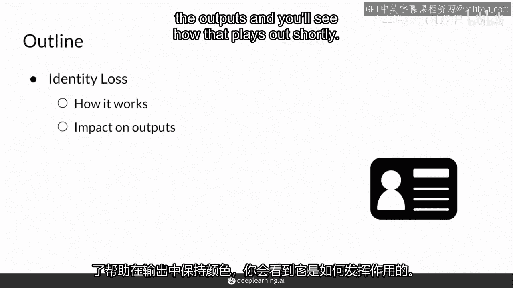

上一节我们介绍了 CycleGAN 的基本框架和核心损失函数。本节中我们来看看一个可选的、但非常有用的额外损失项——身份损失。

身份损失是一个额外的损失项，主要用于帮助生成器在输出中更好地保存输入图像的颜色信息。

除了对抗性损失和循环一致性损失，CycleGAN 还可以使用一个基于像素差异的损失项，称为身份损失。这个损失项是可选的，但它有助于保留图像的颜色，使风格映射更具意义。

它的核心思想是：当一个已经属于目标风格的图像被输入到对应的生成器时，生成器应该输出一个与输入完全相同的图像，即执行**身份映射**。

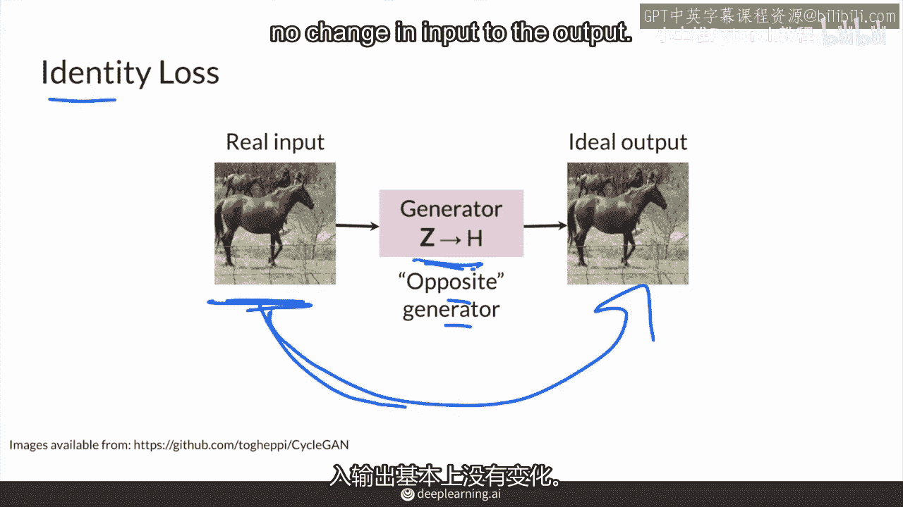

例如，将一个真实的马图像输入到“斑马到马”的生成器中。由于输入图像已经是马的风格，生成器理想情况下应该不做任何改变，直接输出原图。

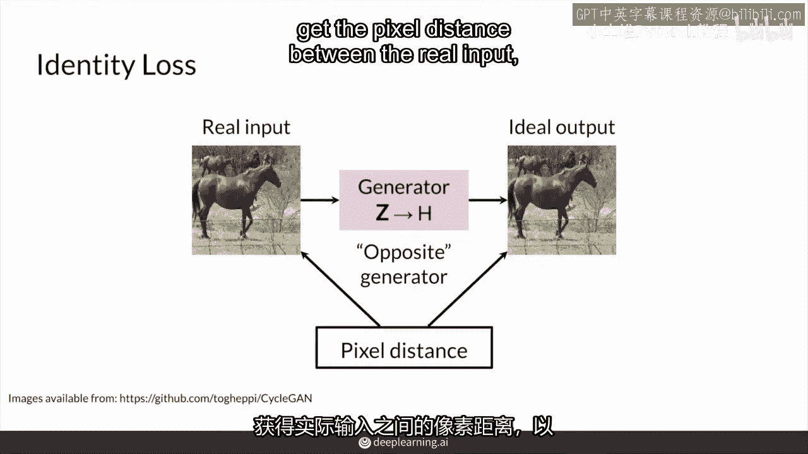

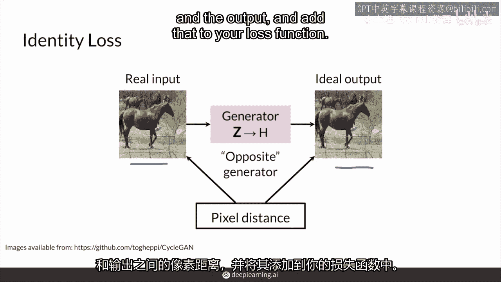

以下是身份损失的计算方式：

你可以计算真实输入图像与生成器输出图像之间的像素距离。

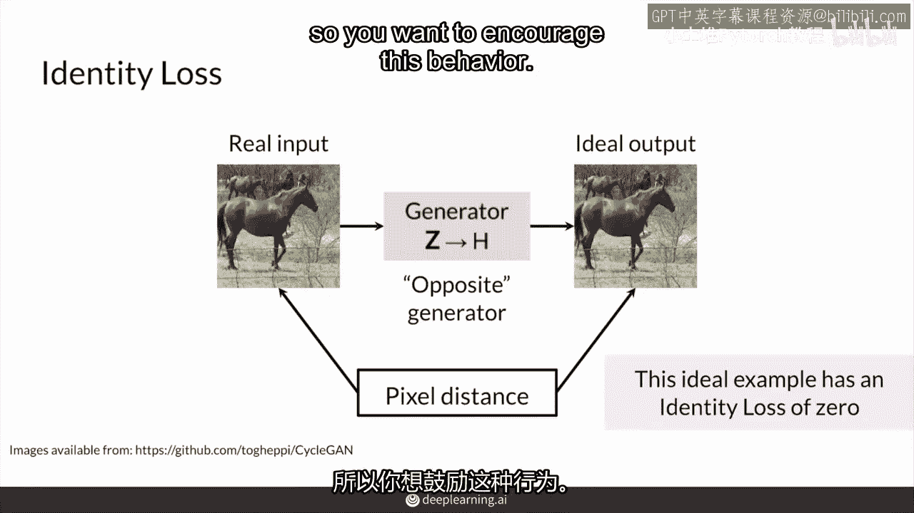

并将这个距离值添加到总的损失函数中。在理想的身份映射情况下，这个像素距离应为零。

这意味着身份损失为零，这正是我们希望生成器做到的行为：当输入已经是目标风格时，不做任何改变。

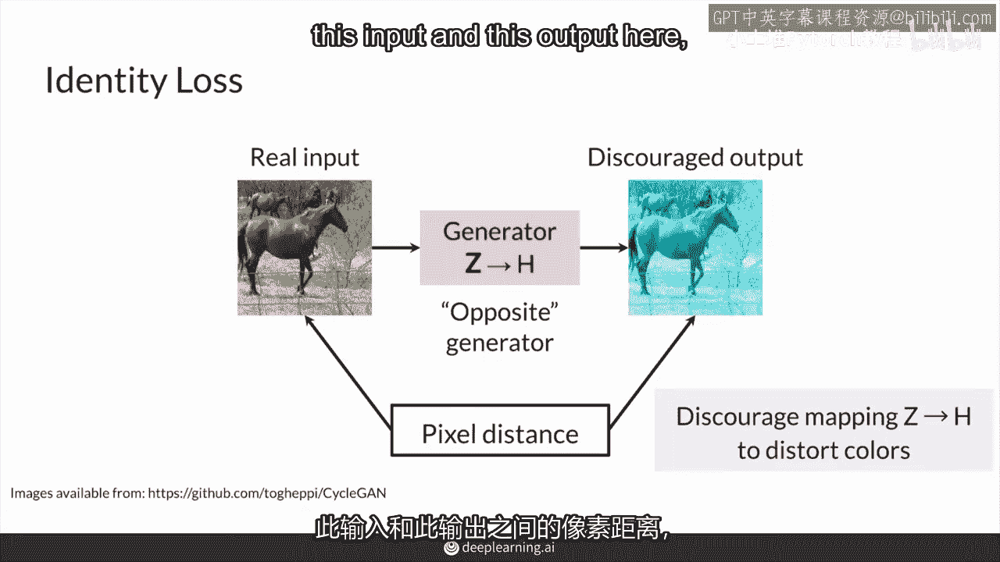

所以，身份损失的目的就是鼓励生成器的这种身份映射行为。

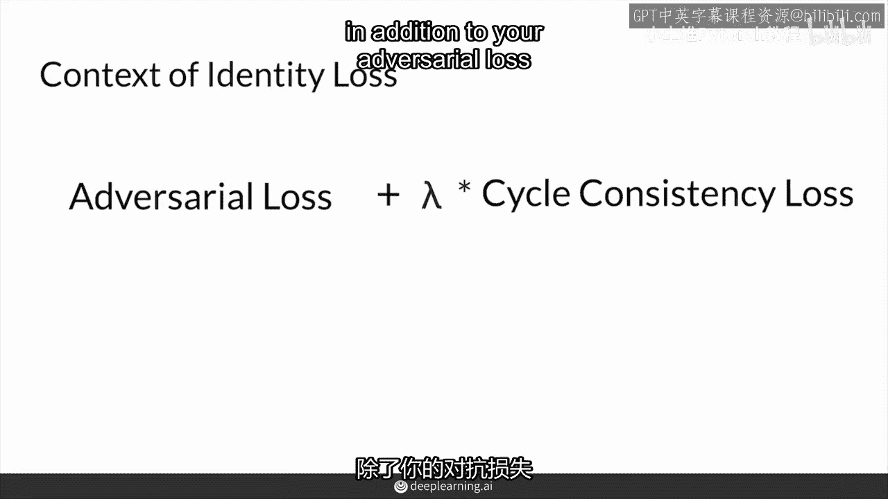

相反，如果生成器将一个马的图像错误地映射成其他奇怪的东西（例如改变了颜色），我们就需要计算输入与输出之间的像素距离，并通过损失函数来惩罚这种非身份映射。

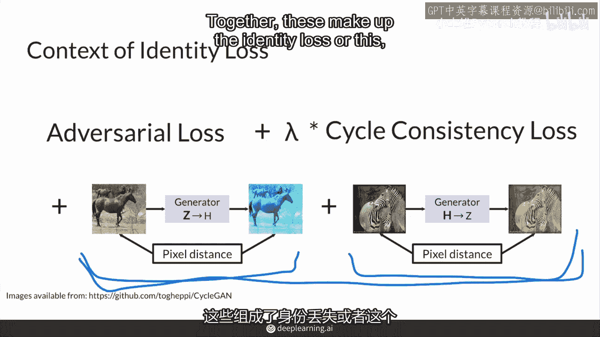

在 CycleGAN 完整的损失函数中，除了对抗性损失和循环一致性损失，你现在可以为两个生成器都添加身份损失。

*   为“斑马到马”生成器添加身份损失：输入真实的马图像。
*   为“马到斑马”生成器添加身份损失：输入真实的斑马图像。

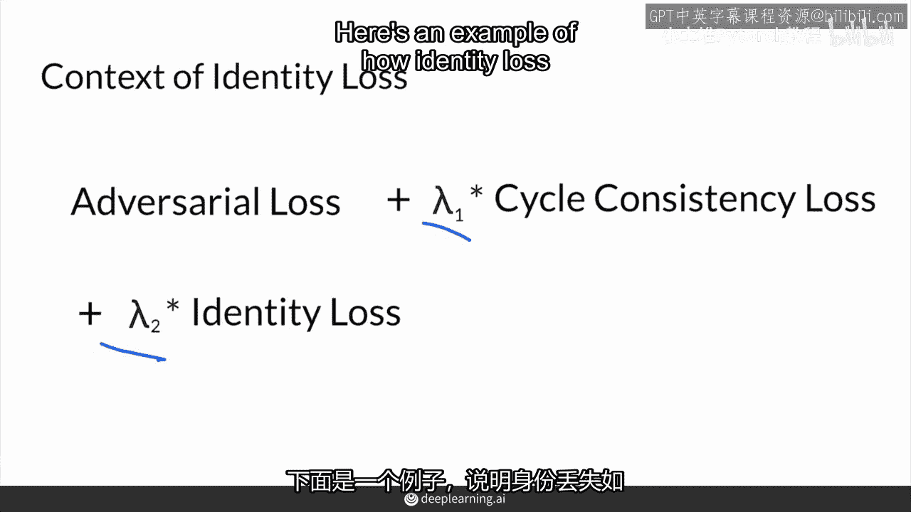

与循环一致性损失类似，身份损失在总损失中也需要一个权重系数（通常表示为 λ_id）。这允许你平衡不同损失项的重要性。

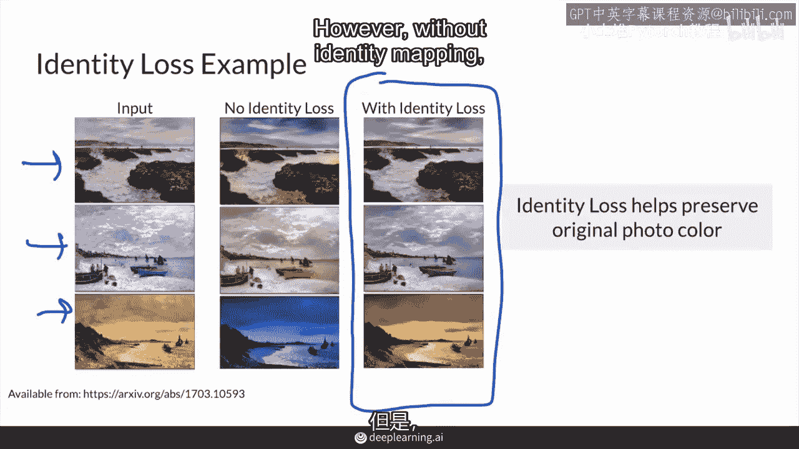

为了更直观地理解，假设一个任务是将夏季场景转换为冬季场景。在没有身份损失的情况下，生成器可能会过度调整，导致所有输入（包括已经是冬季的场景）都带上一种偏蓝的色调，造成颜色失真。

而有了身份损失，当输入一个冬季场景时，生成器会被鼓励直接输出原图，从而更好地保持颜色保真度。

---

本节课中我们一起学习了 CycleGAN 的身份损失。总结如下：

1.  **目的**：身份损失通过鼓励**身份映射**，帮助生成器在图像转换任务中更好地保持输入图像的颜色和内容。
2.  **计算**：它通过计算真实输入图像与生成器输出图像之间的**像素距离**来实现。
3.  **作用**：当输入图像已经具备目标风格时，理想的生成器应输出原图，此时身份损失为零。
4.  **性质**：它是一个**可选**的损失项，通过一个权重系数 λ_id 加入到总损失函数中。它在需要高颜色保真度的任务中特别有用，但并非在所有场景下都是必需的。

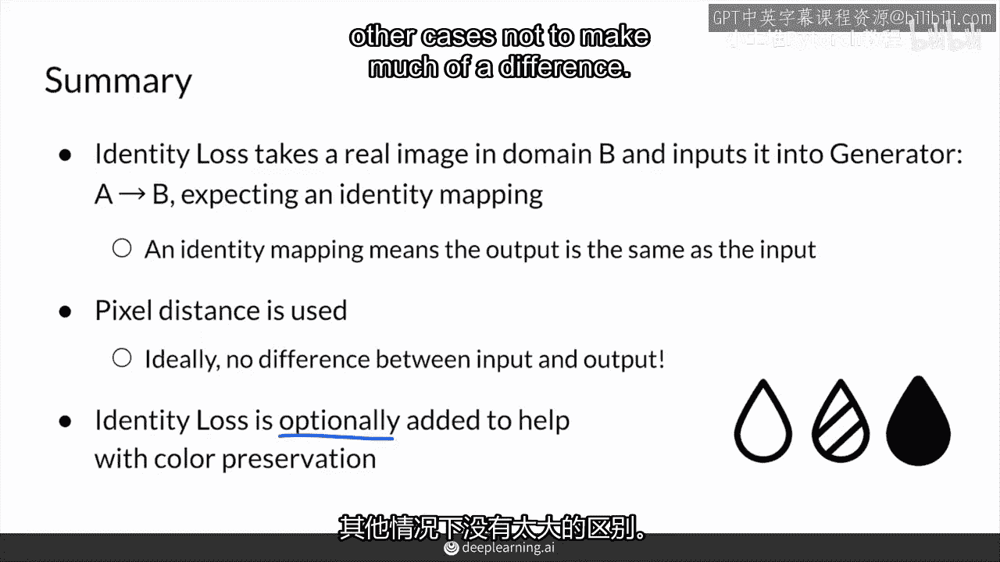

