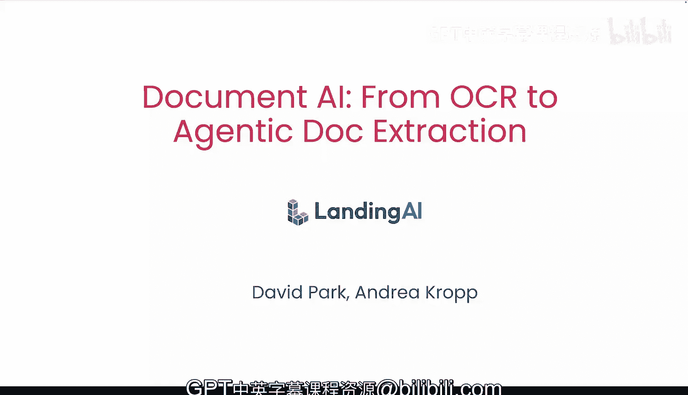
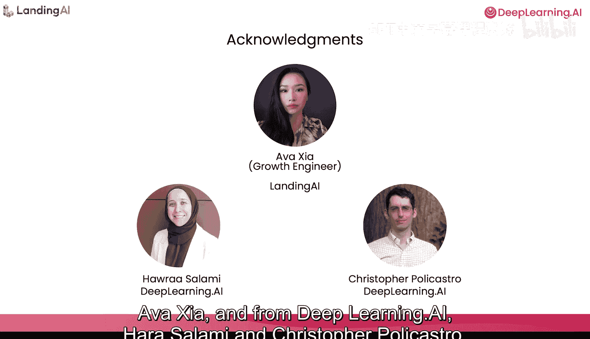

# 001：1.课程介绍

## 概述

在本课程中，我们将学习如何构建文档处理流程，将复杂的文档转换为可供大语言模型（LLM）处理的Markdown文本，并从中提取信息用于分析。课程由吴恩达与Landing AI合作推出，旨在引导你从传统OCR技术开始，逐步深入到智能体化文档抽取（ADE）的现代方法。

## 课程内容简介

数据通常被锁定在PDF、网页文档、笔记本电脑或公司云存储中的各种文件里。本课程将指导你构建文档处理流程，以应对这一挑战。

首先，我们将探索传统的光学字符识别（OCR）技术。传统OCR仅能提取文本，我们将在此基础上学习检测文档结构、识别视觉组件（如具有复杂格式的表格、带标题的图表或带复选框的表单）的技术。

接着，我们将实现一个结合了布局检测与大语言模型推理能力的智能体工作流。

然后，你将学习使用由Landing AI设计的工具——智能体化文档抽取（ADE）。这个工具能为你自动化整个工作流程。

本课程的讲师是Landing AI的应用AI高级总监David Park和应用AI工程师Onreroprop。他们拥有丰富的经验，曾帮助许多开发者构建复杂的文档AI系统。

## 传统OCR与ADE的对比

上一节我们介绍了课程的整体目标，本节中我们来看看两种核心方法的不同。

传统OCR系统的工作原理是将文档分割成单个字符，然后使用监督学习对每个字符进行分类。这些系统可以准确地提取字符，但它们缺乏对文档各部分如何关联的理解，例如文档结构、表格、表单，甚至不同元素的阅读顺序。

Landing AI的ADE采用了不同的方法。它将文档的每一页视为一张图像，并将该图像分解为多个区块，然后使用智能体工作流分别从每个区块中提取信息。

ADE将文档视为视觉对象，其中意义编码在布局、结构和空间关系中。它使用定制的视觉模型直接解释复杂的表格、图形、图像、图表等元素，并将提取的每一段文本精确定位到页面上的具体位置。

此外，ADE使用一个智能体编排层，将复杂文档分解为更小的部分，以便在多个步骤中进行仔细检查。人类处理文档时并非一眼扫过，而是通过多次迭代，逐步检查文档的不同部分以提取信息。ADE的工作方式与此相同。

例如，给定一个复杂文档，ADE可能会先提取一个表格，然后进一步提取表格结构，识别出行、列、合并单元格等。

## 你将学到什么

以下是本课程的核心学习路径：

1.  **探索基于传统OCR的处理流程**：了解它们能做什么，以及它们的局限性。
2.  **从零开始构建你自己的智能体文档工作流**。
3.  **学习使用ADE处理复杂文档**：构建一个流程来解析混合文档并提取所需的关键值对。
4.  **学习将ADE提取的信息集成到检索增强生成（RAG）应用中**。
5.  **在AWS上实现基于云的版本**：使用事件驱动架构，在新文档出现时自动触发ADE进行处理。

## 总结

本节课中，我们一起学习了文档AI课程的整体介绍。我们了解了数据提取的挑战、课程的目标，并对比了传统OCR与新一代智能体化文档抽取（ADE）方法的根本区别。ADE通过将文档视为视觉对象并采用多步骤的智能体工作流，能够更好地理解文档的结构和复杂元素。

在接下来的第一课中，我们将从审视传统的OCR模型开始我们的实践之旅。