# 002：文档处理基础 📄

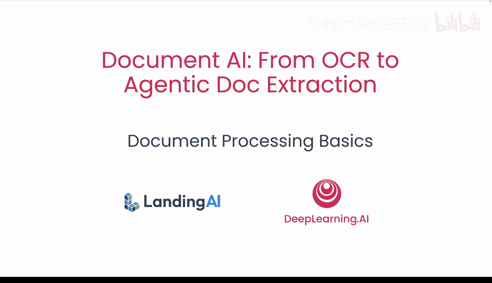

在本节课中，我们将学习如何使用光学字符识别（OCR）来解析文档，以及如何将其结果集成到智能体工作流中。你将构建一个智能体，使用OCR从文档中解析文本，然后利用大语言模型从文本中提取信息。在此过程中，你将识别出手写、表格和扫描图像等使这些步骤极具挑战性的情况。

今天，我们将从基础开始。我们所涵盖的一切都是当今企业和开发者使用的生产级系统的基础，这些系统将在后续课程中介绍。

以下是今天的议程：
*   处理：它是什么以及为何重要
*   解析、提取和输出格式：JSON、Markdown及其用途
*   OCR：其工作原理、工作流程和局限性
*   智能体AI与ReAct框架：在OCR之上添加“大脑”
*   我们将回顾一些实际演示、失败模式以及仍然挑战真实系统的难题
*   最后，我们将动手编写代码，构建你的第一个简单文档智能体

你会注意到，这是一个自底向上的旅程：从像素、文本到结构，再到推理。

## 现实世界的问题 🌍

这些系统旨在解决现代组织面临的问题：数字文档泛滥。发票、收据、合同和报告等文档存在于庞大的数字文件柜中，通常以PDF、PowerPoint、Word文档甚至图像的形式存在。它们是为人类眼睛设计的，而不是为机器设计的，这意味着信息难以搜索、分析，当然也难以自动化。

如果你的数据被困在非结构化文档中，就必须有人手动打开、阅读并将其重新输入到另一个系统中，这无法扩展。

因此，如果我们想在分析、自动化或AI中使用这些信息，就需要将非结构化文档转换为结构化的、机器可读的数据。

## 解决方案概览 🛠️

文档处理是将非结构化文档转换为结构化的、机器可读的数据，通常是JSON或Markdown。它不仅仅是抓取文本，解析必须理解文本片段实际的含义、它们之间的关系，以及如何将它们组织成可预测的结构。例如，解析发票时，你想要的不是一堆文本，而是提取供应商名称、发票日期、总金额和行项目。

提取信息的前提是文本已经是机器可读的。但如果你的文档是扫描件或照片，计算机看到的只是图像像素。因此，在提取之前，我们需要OCR将像素转换为文本。

## 输出格式 📝

解析和提取通常产生两种有用的格式。

第一种是Markdown或HTML，它们是为人类和我们的大语言模型设计的。这种格式保留了标题、表格和列表等结构，非常适合输入给大语言模型或展示给最终用户。

第二种是JSON，它是为机器和应用程序设计的。它是分层的，易于编程遍历，非常适合下游管道和应用程序。

记住一个经验法则：如果你考虑的是分析或数据库，JSON是一个很好的选择。如果你考虑的是构建RAG解决方案或聊天用户界面，Markdown或HTML可能是一个很好的选择。

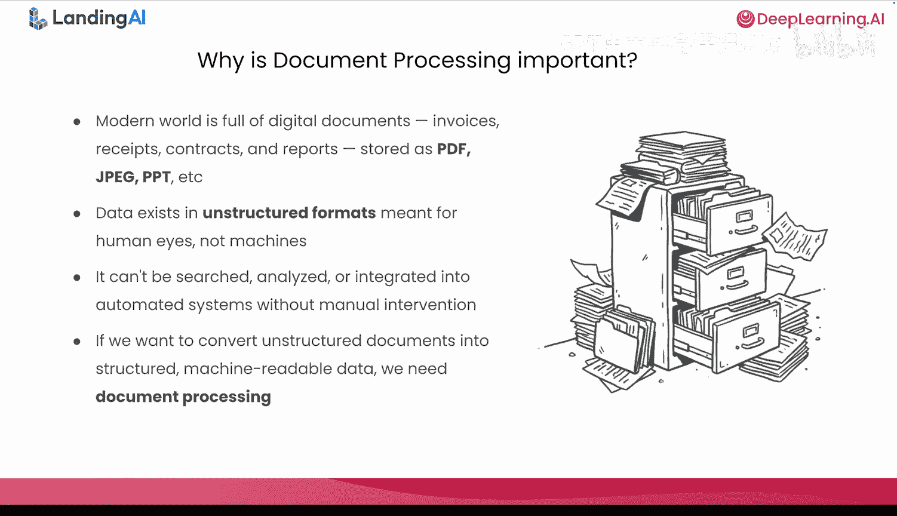

但所有这些都假设我们已经有了文本。如果我们只有像素呢？

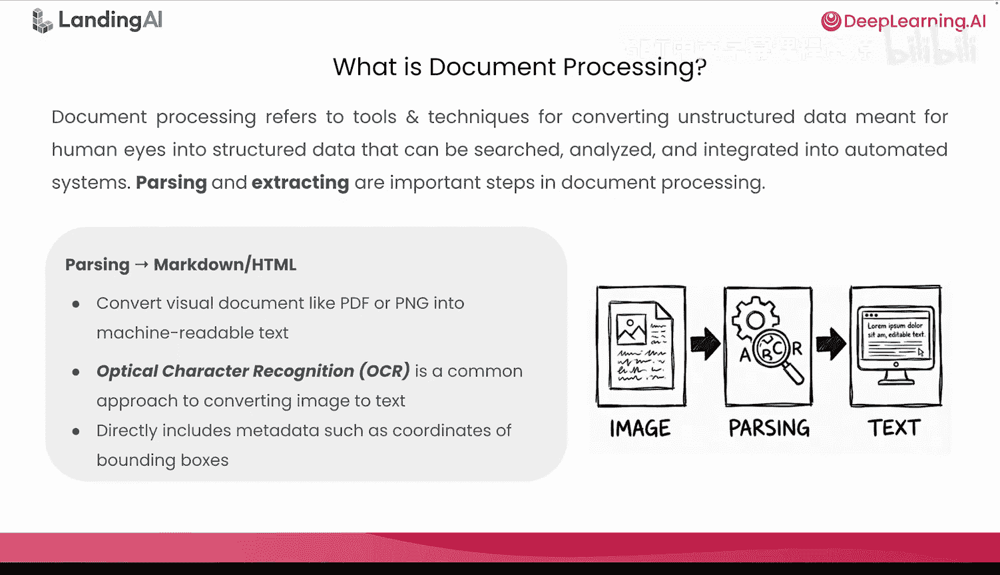

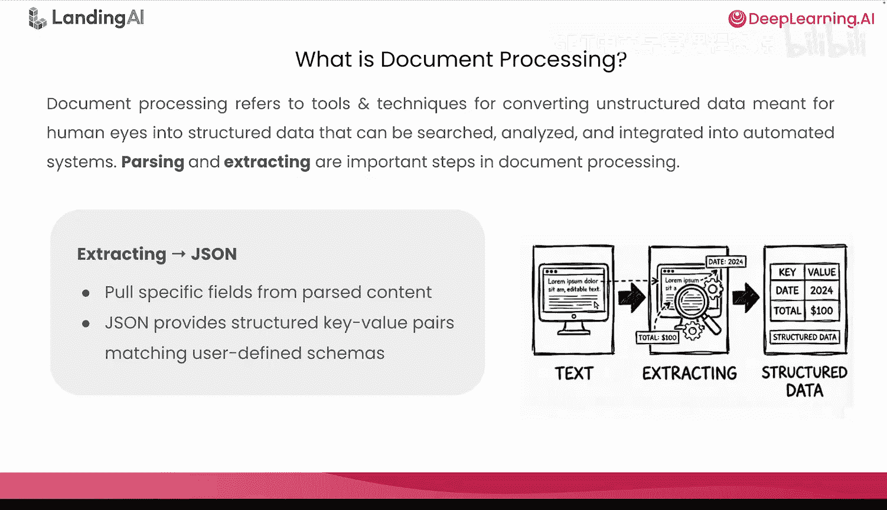

## OCR：光学字符识别 👁️

OCR是一种将文本图像转换为机器可读文本的技术。它通常分两步工作。

第一步是图像清理，例如去歪斜、去噪或对比度调整。

第二步是文本识别，即模式匹配。例如，判断这个形状看起来像“8”还是“B”。

一旦识别出文本，它就会产生可编辑的文本作为数字输出，或生成可搜索的PDF。

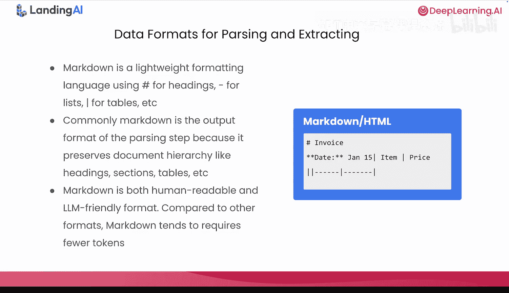

## OCR的局限性 ⚠️

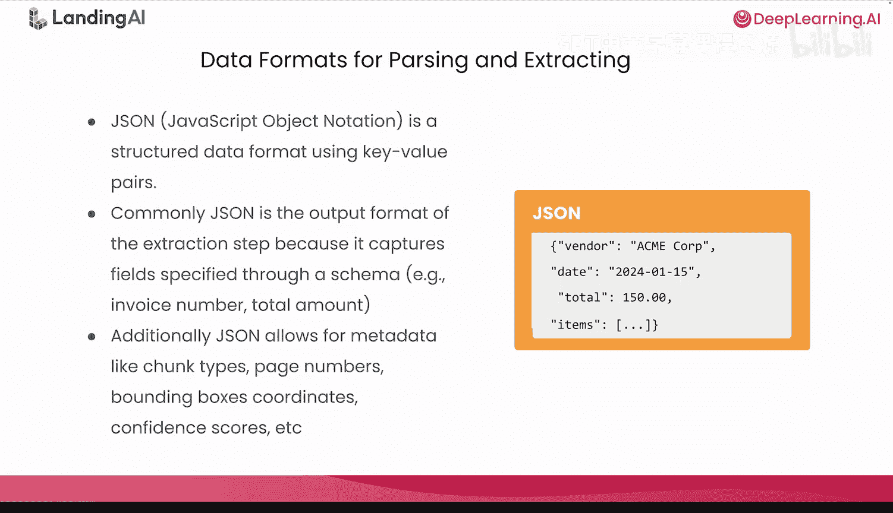

我们也需要诚实地面对OCR不能做什么。OCR非常擅长阅读干净的文档，但它不理解结构、含义或关系。OCR之后，你通常得到的是一堵“文本墙”。如果你想找到总计、提取表格、识别标题和分类文档，你需要在OCR之上添加智能。

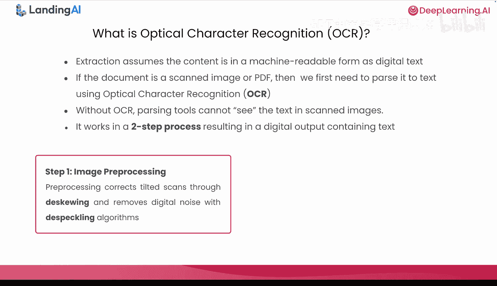

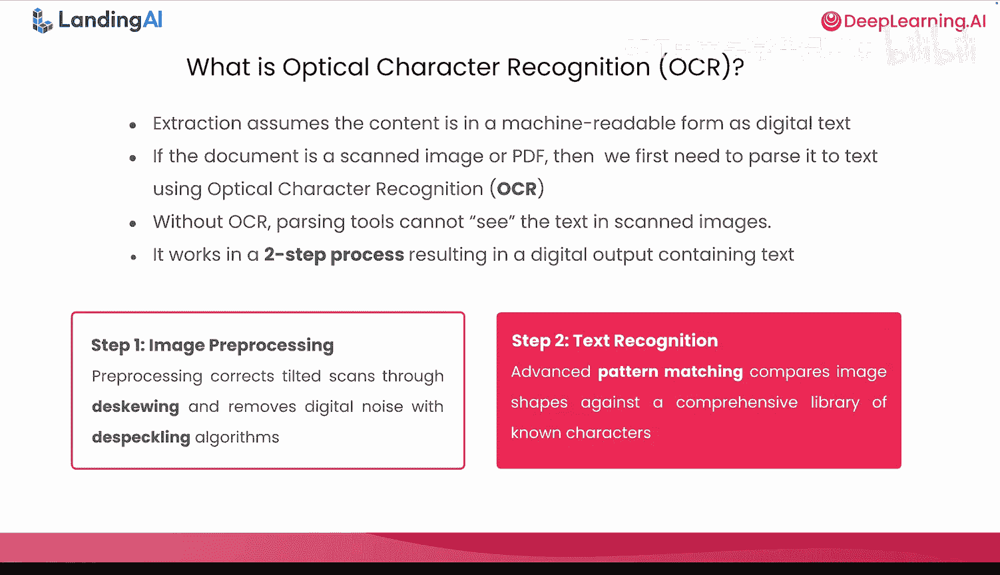

你可以把OCR看作是“眼睛”，但不是“大脑”。除了缺乏理解能力，它也可能直接失败。OCR会在可预测的情况下失效，例如：
*   图像质量差：模糊的照片、阴影和噪点
*   复杂的布局和倾斜：多列文本、嵌套表格
*   非标准文本：手写、印章、风格化字体

这些失败会级联到解析和提取错误中。因此，OCR是必要的，但对于完整的文档理解来说还远远不够。

如果你曾尝试在昏暗的餐厅里对收据照片进行OCR，你可能同时经历了所有三种失败模式。

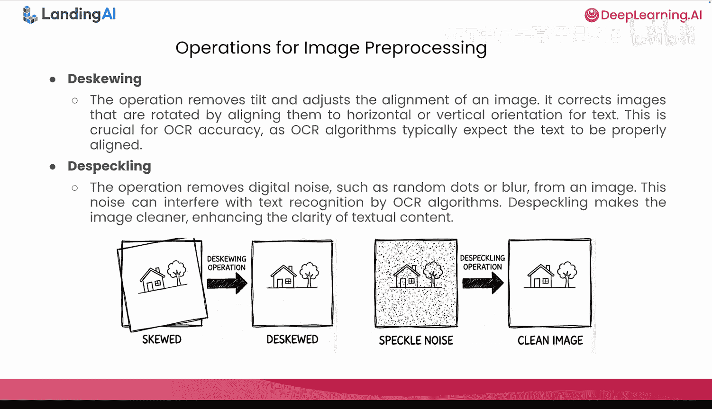

## 关键理念：解析不等于理解 🧠

所有这些引出了一个关键理念：解析不等于理解。OCR可以读取字符，但它不理解它们。它不知道什么是标题，什么是数值；哪个数字是总计；或者文本是属于表格还是脚注。

OCR为你提供了感知能力（从像素到字符），但没有认知层。为了将那堵“文本墙”转化为有意义的结构化数据，我们需要一个“大脑”，这就是智能体AI的用武之地。

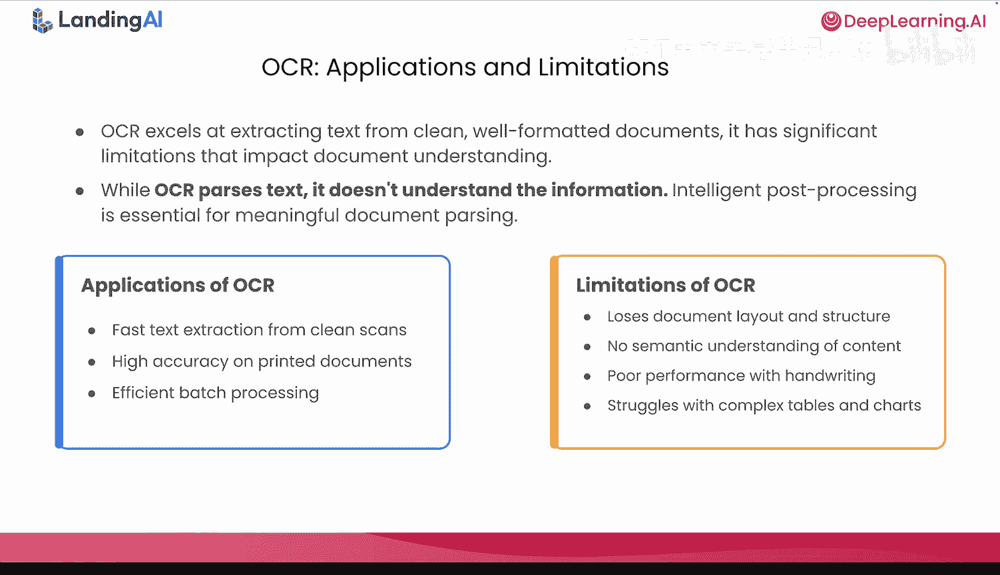

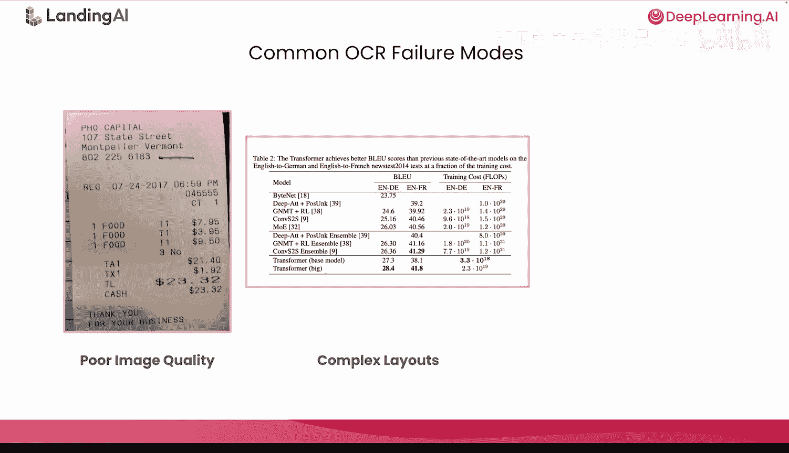

## 智能体AI：添加缺失的认知层 🤖

智能体AI添加了缺失的认知层。智能体是一个可以感知其环境、推理目标并采取某些行动的自主系统。

具体到文档处理，智能体通过OCR（如果需要）读取文档，思考用户的要求，选择调用哪些工具，并迭代直到达到目标。如果说OCR是“眼睛”，那么智能体就是“大脑”。基于规则的管道在遇到边缘情况时可能会崩溃，而智能体可以通过推理来处理它们。

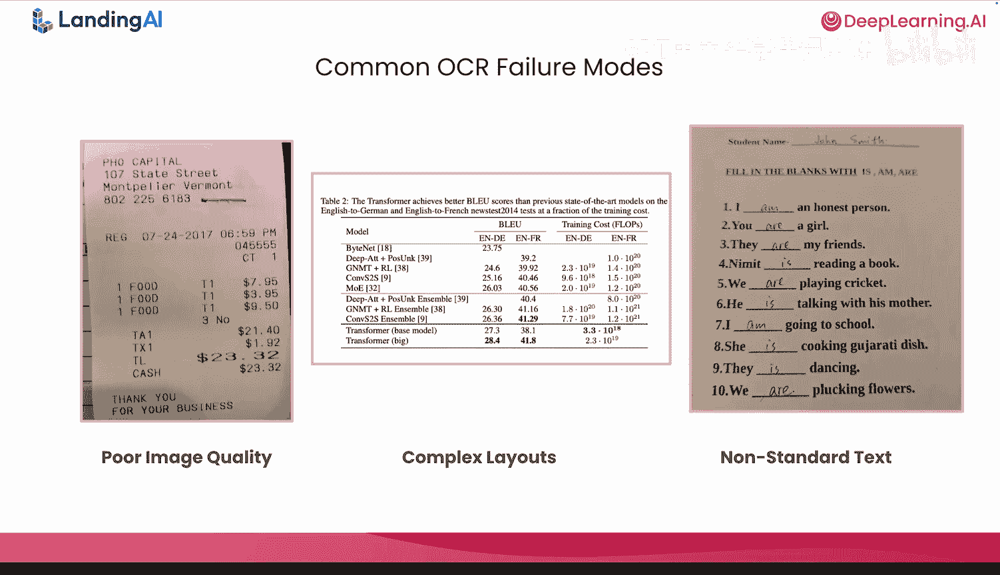

## 智能体系统的构成 🧩

那么，一个智能体系统在内部是什么样子的呢？智能体文档系统通常有三个部分：
*   **大脑**：使用大语言模型，负责推理、规划和决策。
*   **眼睛**：OCR，将视觉内容转换为文本。
*   **手**：智能体可以使用的工具，如API、数据库查询、文件操作和函数调用。

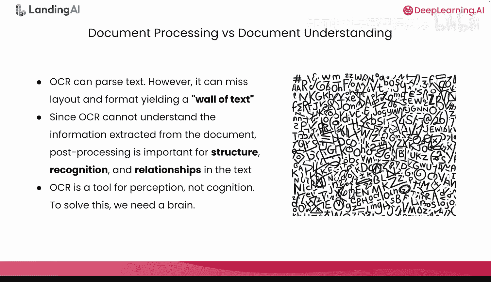

当这三者连接在一起时，你可以说：“在这张发票上找到总金额。”然后智能体会决定运行OCR，检查文本，定位总计，并返回答案。你不需要对每个步骤或每个边缘情况进行硬编码。

这个“大脑、眼睛和手”的心智模型将在后续的实验和课程中反复出现。

## ReAct框架：智能体如何思考 🔄

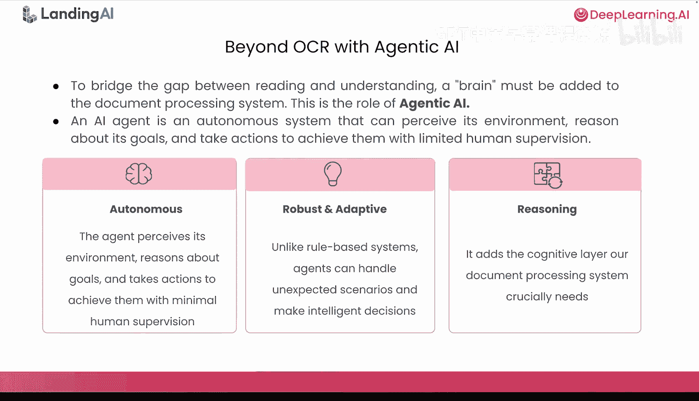

但是，智能体是如何一步一步思考的呢？ReAct（推理与行动）框架描述了智能体的思考过程。

首先是**思考**：我下一步需要做什么？

然后它会采取**行动**：选择并调用它需要的一组工具。

完成后，它会进行**观察**：检查结果。

然后重复：思考、行动、观察，再思考。

这个循环赋予了智能体自主性、适应性和纠正错误的能力。大多数现代智能体框架都建立在ReAct的某种变体之上。

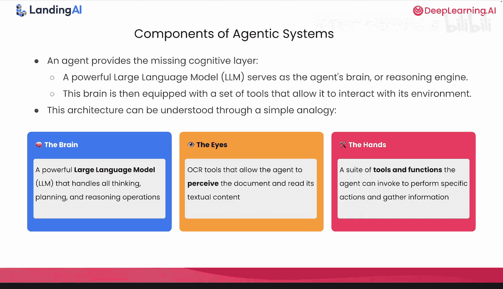

当然，一个主要好处是它是可调试的——你实际上可以阅读智能体的想法和工具调用记录。

## 实验时间：动手构建 🧪

好了，理论讲得够多了。让我们来构建点东西。

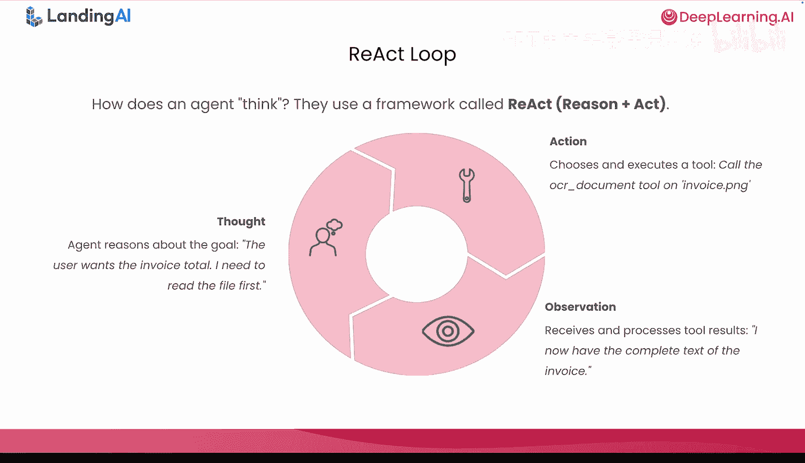

现在是实验时间。我们将把幻灯片上涵盖的所有内容——解析、OCR和智能体推理——结合起来，共同构建一个简单的文档智能体。到实验结束时，你将拥有一个可以读取文档、使用OCR作为工具、提取结构化信息的智能体。

如果你是第一次尝试，不用担心，我们会一步一步来。让我们切换到笔记本环境。

---

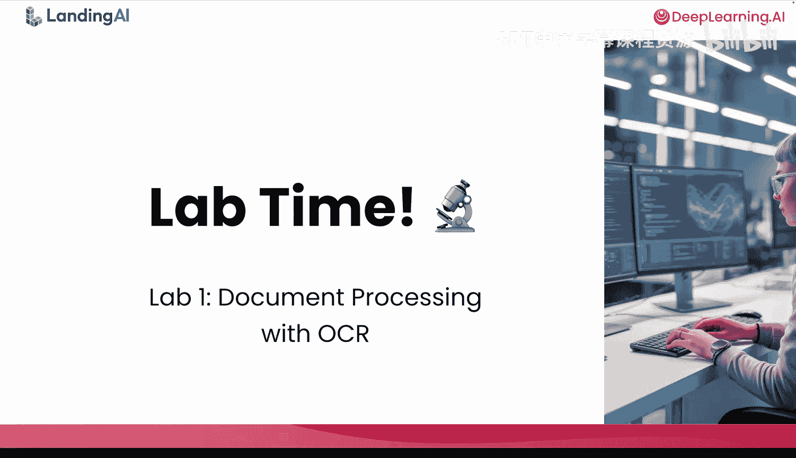

在本节课中，我们一起学习了文档处理的基础知识。我们了解了将非结构化文档转换为结构化数据的需求，探讨了OCR作为“眼睛”将图像像素转换为文本的工作原理及其局限性。我们引入了智能体AI作为“大脑”，通过ReAct框架进行推理和行动，从而理解文档内容并提取信息。最后，我们为动手构建第一个简单的文档智能体做好了准备。