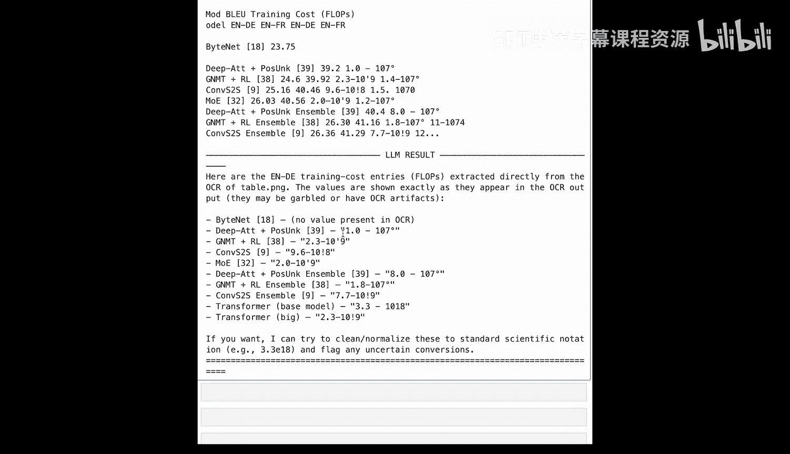
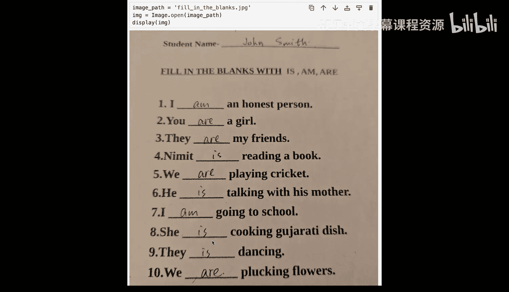
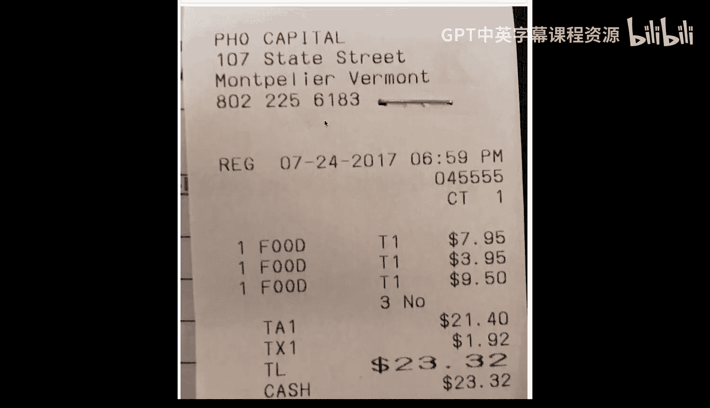
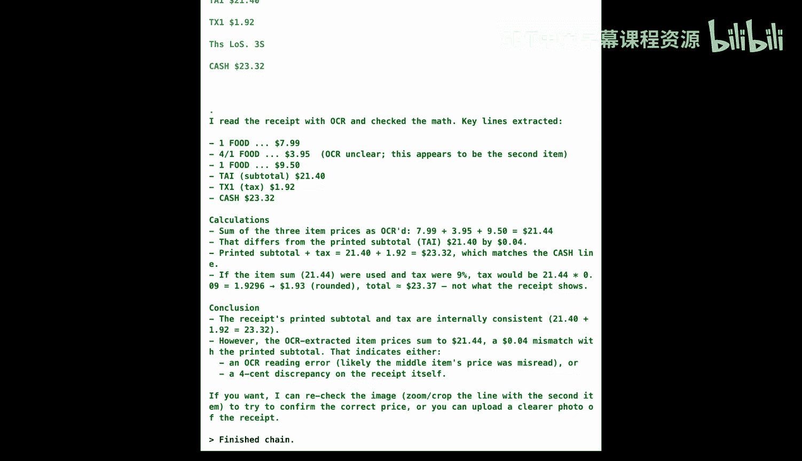

# 003：使用OCR进行文档处理 📄

在本节课中，我们将动手构建一个简单但功能强大的文档处理智能体。我们将看到OCR、规则集和基于大语言模型的推理如何协同工作，并理解传统方法的局限性以及智能体如何带来改进。

---

## 概述

我们将构建一个文档处理智能体。其目标不是构建一个完美的生产系统，而是理解OCR、规则和大语言模型如何结合。我们将导入必要的包，将OCR封装为智能体可调用的工具，并测试其在不同类型文档上的表现。

---

## 导入必要包

以下是构建系统所需的包。我们使用 `PIL` 加载图像，`pytesseract` 进行OCR，`langchain` 提供智能体框架，以及 `OpenAI` 模型。

```python
from PIL import Image
import pytesseract
from langchain.agents import Tool, AgentExecutor, create_react_agent
from langchain.prompts import PromptTemplate
from langchain_openai import ChatOpenAI
```

---

## 将OCR封装为工具

上一节我们介绍了所需的工具，本节中我们来看看如何将OCR功能转化为智能体可以调用的工具。

以下函数接收图像路径，使用Tesseract提取文本，并返回结果。`@tool` 装饰器使其成为智能体可以识别和按名称调用的工具。

```python
from langchain.tools import tool

@tool
def ocr_tool(image_path: str) -> str:
    """使用Tesseract OCR从图像中提取文本。"""
    image = Image.open(image_path)
    text = pytesseract.image_to_string(image)
    return text
```

在智能体循环中，大语言模型会决定“我需要先读取文档”，然后调用OCR工具，获取结果，并继续推理。

---

## 测试案例一：清晰的数字发票

现在，让我们在一个理想的OCR案例上进行测试：一张清晰、干净的数字发票。这是传统OCR表现最佳的场景。

以下是第一张测试图像。它具有完美的光照、清晰的字体、没有手写和阴影。

```python
# 假设图像文件为 'clean_invoice.jpg'
ocr_result = ocr_tool('clean_invoice.jpg')
print(ocr_result)
```

OCR输出是原始文本，没有结构、没有含义、没有理解。这正是将图像通过Tesseract管道处理得到的结果。

---

### 传统规则方法的尝试

仅仅有原始文本还不够，我们需要从中提取特定信息，例如“税费”和“总计”。传统方法会使用正则表达式。

以下是用于匹配“税费”和“总计”的简单正则表达式设置。

```python
import re

text = ocr_result
tax_pattern = r"tax\s*\$?(\d+\.?\d*)"
total_pattern = r"total\s*\$?(\d+\.?\d*)"

tax_match = re.search(tax_pattern, text, re.IGNORECASE)
total_match = re.search(total_pattern, text, re.IGNORECASE)
```

让我们看看会发生什么。它完全错过了税费行，并且抓取了错误的“总计”值（它首先抓取的是“小计”）。

这并非我们正则表达式代码的bug，而是规则与嘈杂OCR数据交互时的根本缺陷。正则表达式不等于理解。

---

## 引入大语言模型智能体

正则表达式在OCR文本上非常脆弱，它严重依赖确切的措辞和布局，且没有语义理解能力。这就是大语言模型和智能体的用武之地。

本节我们将构建我们的智能体，它包含三个关键组件：作为“大脑”的大语言模型（我们使用GPT-4）、我们之前定义的OCR工具，以及告诉智能体它拥有什么工具以及如何使用它们的提示词。

```python
# 1. 定义大语言模型
llm = ChatOpenAI(model="gpt-4", temperature=0)

# 2. 定义工具列表
tools = [ocr_tool]

# 3. 定义提示词模板
prompt = PromptTemplate.from_template(
    """你是一个文档处理助手。你可以使用OCR工具来读取图像中的文本。
    用户的任务是：{task}
    请逐步思考，并使用可用的工具。
    """
)

# 4. 创建智能体
agent = create_react_agent(llm, tools, prompt)
agent_executor = AgentExecutor(agent=agent, tools=tools, verbose=True)
```

这是ReAct框架的本质：思考、行动、观察、再次思考。

---

### 智能体处理清晰发票

当我们要求智能体提取税费和总计值时，神奇的事情发生了。它识别出需要先进行OCR，于是调用OCR工具，读取文本，并返回结构化的JSON。没有正则表达式，没有固定规则，也没有模板。

```python
result = agent_executor.invoke({"input": "处理图像 'clean_invoice.jpg' 并提取税费和总计值。"})
print(result['output'])
```

正如你所见，智能体返回了结构化的JSON，并且正确提取了税费和总计值，而不是小计。借助大语言模型的理解能力，你无需创建任何规则或模板就能实现这一点。

---

## 测试案例二：复杂的学术表格

我们之前的例子运行良好，因为发票布局清晰、文本质量高。但现实世界的文档并非总是如此友好。让我们探索当输入变得更混乱时会发生什么。

这里有一张来自《Attention Is All You Need》论文的表格。表格对于OCR来说是出了名的困难，它们需要空间对齐和列重建，而Tesseract最初并非为此设计。



我们给智能体一个新任务：使用OCR工具从表格中提取“英语到德语翻译”所有方法的“训练成本”和“FLOPS”，并以模型名称及其训练成本的列表形式返回结果。

首先，让我们获取原始的OCR输出。

```python
ocr_result_table = ocr_tool('research_table.jpg')
print("原始OCR输出（表格）:\n", ocr_result_table)
```



OCR输出是混乱的：指数变成了撇号，小数点变成了感叹号，列发生了错位。

但智能体仍然尝试进行最佳解释。这正是大语言模型真正擅长的：即使输入质量下降，它们也试图理解意图。

```python
result_table = agent_executor.invoke({
    "input": "处理图像'research_table.jpg'，提取‘英语到德语翻译’所有方法的‘训练成本’和‘FLOPS’，以列表形式返回，包含模型名称和成本。"
})
print("智能体输出（表格）:\n", result_table['output'])
```

即使OCR输出不完美，大语言模型在某些情况下仍能得出正确结论。例如，它理解到“Bytenet”的训练成本是空的。然而，它也可能从错误的列中抓取值，或者错误解释科学计数法。

---

## 测试案例三：手写文档

让我们看另一个例子，尝试将OCR推向其崩溃点：手写文档。

这是一个学生的“填空练习”文档，学生名为John Smith。我们可以看到学生提交的答案，例如“I am an honest person”，以及语法不正确的“day is dancing”。


我们要求智能体处理该文档，提取学生姓名以及所有10个问题的学生答案。



```python
ocr_result_handwriting = ocr_tool('handwriting_exercise.jpg')
print("原始OCR输出（手写）:\n", ocr_result_handwriting)

result_handwriting = agent_executor.invoke({
    "input": "处理图像'handwriting_exercise.jpg'，提取学生姓名以及所有10个填空问题的学生答案，以JSON格式返回。"
})
print("智能体输出（手写）:\n", result_handwriting['output'])
```

原始OCR输出未能捕获学生姓名，填空答案也完全不正确。例如，“am”被识别为“a u m”，数字被识别为字母。对于第九个问题，学生答案是“is”，但OCR可能误读，而大语言模型可能会过度纠正为“R”。

---

## 测试案例四：杂乱的收据

最后，让我们看一个收据的图片。收据通常非常杂乱：可能是低分辨率的热敏打印，文本可能错位，可能有阴影。

我们给智能体一个新任务：处理收据文档，并评估总计金额是否正确。

```python
ocr_result_receipt = ocr_tool('messy_receipt.jpg')
print("原始OCR输出（收据）:\n", ocr_result_receipt)

result_receipt = agent_executor.invoke({
    "input": "处理图像'messy_receipt.jpg'，评估收据上的总计金额计算是否正确。"
})
print("智能体输出（收据）:\n", result_receipt['output'])
```

比较OCR输出和实际收据，你会发现它产生了小的数值错误。例如，第一个食品项目的实际价值是$7.95，但OCR可能误解为$7.99。

智能体的推理过程是扎实的：它读取OCR工具提供的所有行项目，进行计算，并与实际总计进行比较。然而，由于OCR工具没有准确捕获数字，最终得出的结论可能是错误的。

---

## 总结

本节课中我们一起学习了以下核心要点：

1.  **OCR擅长阅读，但不擅长理解**：它在清晰的打印文本上表现非常好，能提供准确的文档解析。然而，它在处理复杂表格和手写体时会遇到困难。OCR可以读取字符，但并不真正理解结构或含义。
2.  **正则表达式非常脆弱**：当OCR输出即使发生微小变化时，基于正则表达式的规则也很容易失效。
3.  **大语言模型智能体引入了理解能力**：通过添加大语言模型层和智能体框架，信息提取和解释变得更加有效。智能体结合了工具和推理，为我们提供了现代文档系统的基础。
4.  **现实世界的文档理解是一个系统工程**：它需要OCR、版面检测、视觉语言模型、智能体化工作流程以及 grounding 和验证循环。

好了，第一课到此结束。你现在已经看到了基本的文档处理系统是如何工作的，OCR如何融入其中，以及我们如何在其之上叠加智能体推理来使这些系统变得更加智能。



在下一节课中，我们将更深入地探讨所有这些概念的基础：OCR本身在过去四十年的演变。我们将探索OCR如何从Tesseract等经典引擎转变为PaddleOCR等现代深度学习方法，以及这种演变对于现实世界文档工作流程为何重要。