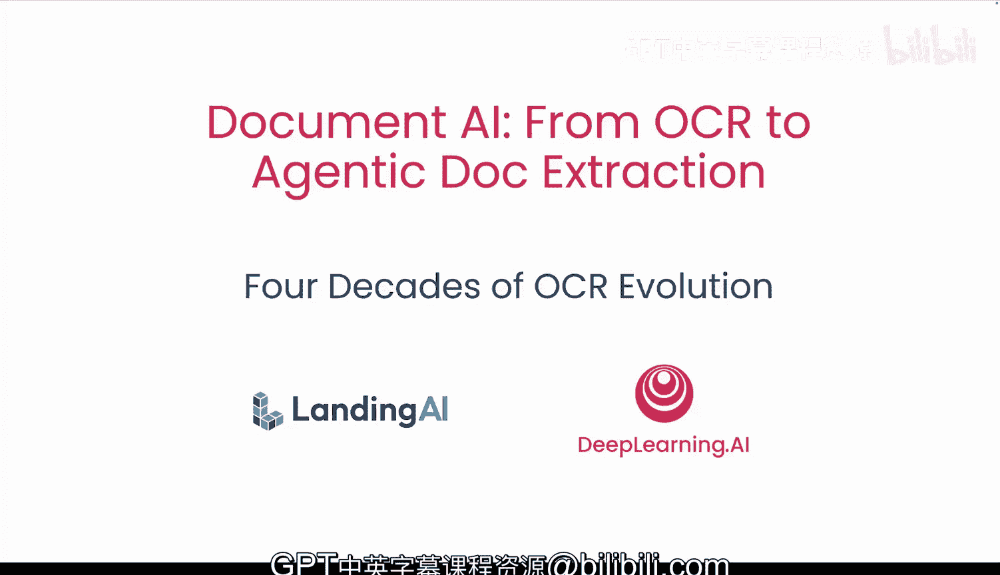
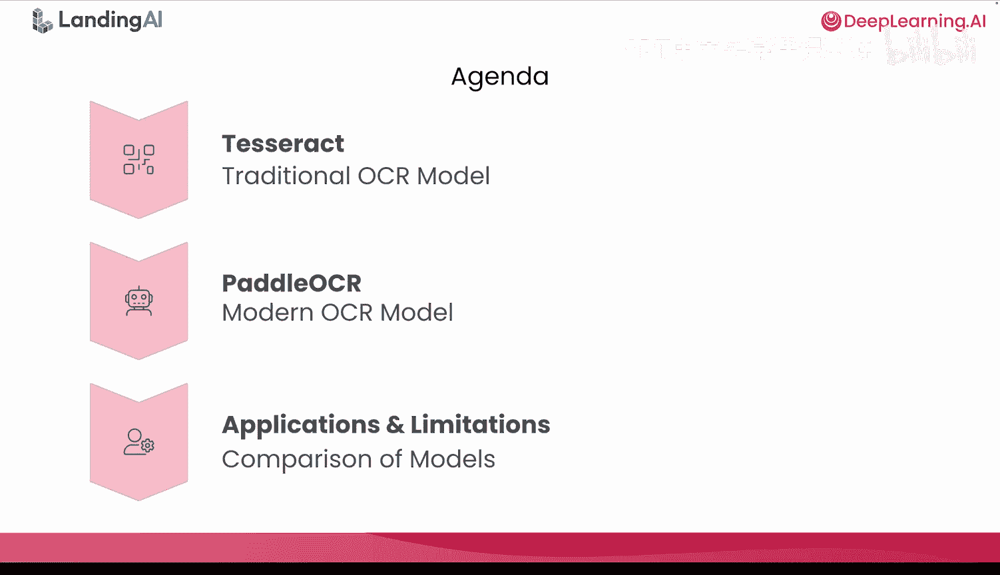
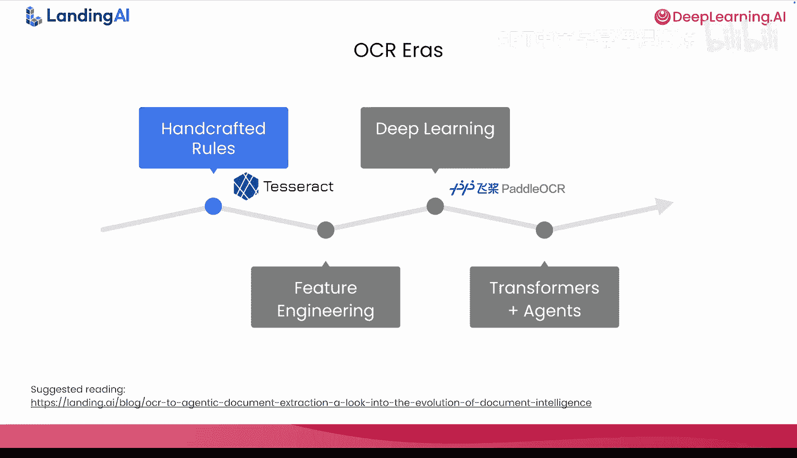
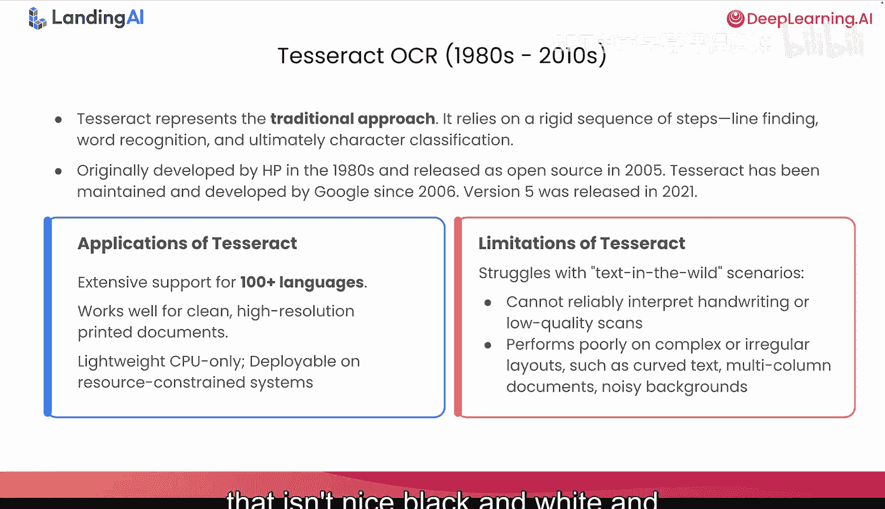
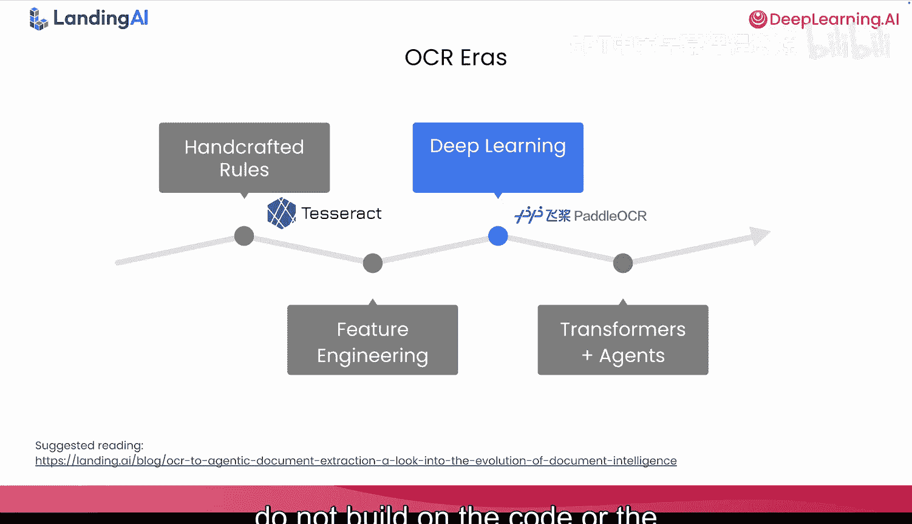
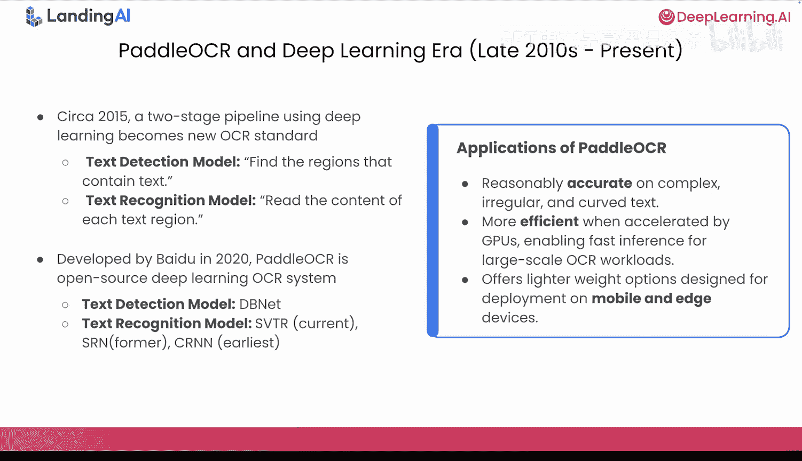
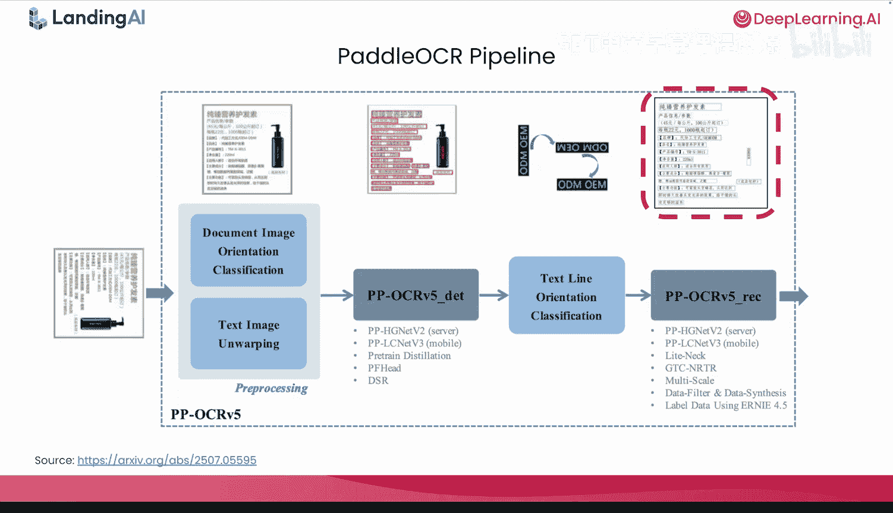
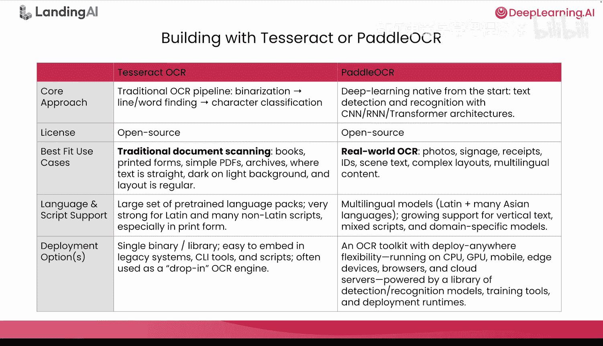
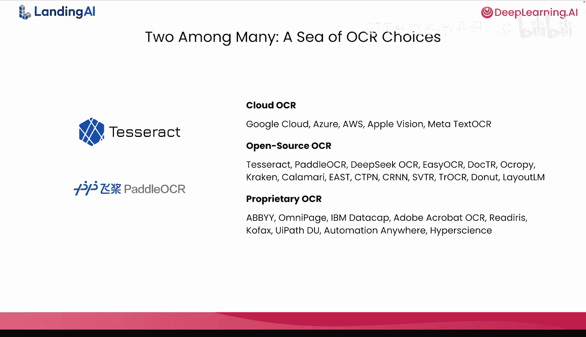
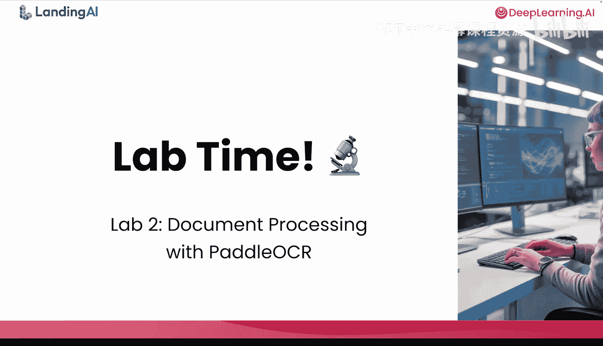

# 004：OCR四十年的演进历程 📜

在本节课中，我们将学习OCR技术如何从早期依赖字母形状的方法，演进到现代的深度学习系统。我们将聚焦于两个代表不同时代的OCR技术：Tesseract和PaddleOCR，并通过实验了解深度学习OCR带来的改进与挑战。

## 课程概述

上一节我们介绍了简单的文档处理系统。本节我们将深入探讨OCR本身，回顾其四十年的发展历程。我们将重点关注两个代表性技术：Tesseract（代表传统计算机视觉方法）和PaddleOCR（代表深度学习时代）。通过对比，您将理解AI从手工设计流程到数据驱动模型的根本性转变。

## 两个时代的代表技术

首先，我们将Tesseract和PaddleOCR置于各自对应的技术时代。

Tesseract代表了**传统程序化计算机视觉方法**，其特点是大量手工工程、多步骤处理和众多规则。PaddleOCR则是**深度学习时代**的代表，它使用端到端的神经网络进行文本检测和识别。

从Tesseract风格系统到PaddleOCR风格系统的转变，真实反映了AI领域的整体演进：从精心设计、依赖手工特征的流程，转向直接从数据中学习的、可训练的模型。

## Tesseract：传统OCR的典范

现在，您已经在实验1中使用过Tesseract。这里我们补充一些背景信息。这段历史很重要，因为直到大约20年前，这仍是业界最先进的技术。

以下是关于Tesseract的几个要点：
*   Tesseract在80年代和90年代是惠普的专有技术，于2005年开源，此后由谷歌维护。
*   在实验1中，您使用的是Tesseract的第5版。
*   Tesseract在干净的印刷文档（如纯文字小说）上表现良好，但不擅长处理带有大量图表（如物理教科书）或布局复杂的文档。
*   它支持多种语言，并且只需CPU即可运行，适合资源受限的系统。

您已在实验1中看到它的一些局限性。任何非标准、非黑白、非直线的“野外文本”都会成为问题。

对于历史爱好者和视觉学习者，可以查看2017年Tesseract论文中嵌入的这些示例。请注意，这些图表充分展示了通过手工工程来理解单个字母形状和间距的方法。

现在我们将告别Tesseract。需要指出的是，尽管这是最早的OCR方法，但您不应将其视为基础技术。下一个时代的技术实际上是全新的方法。换句话说，我们即将探讨的深度学习方法并非建立在Tesseract的代码或架构概念之上。

## 进入深度学习OCR时代

大约从2015年开始，深度学习方法真正成为OCR的新标准。

深度学习将OCR问题分解为两个可以独立优化的阶段，这使得整个过程更加模块化：
1.  **文本检测**：找到所有包含文本的区域。
2.  **文本识别**：读取每个文本区域的内容。

在今天的第2课实验中，您将使用由百度开发的PaddleOCR。它是一个开源的深度学习OCR系统，截至2025年已获得相当广泛的采用。

PaddleOCR目前是第3版。在第3版中：
*   文本检测基于**DBNet**（可微分二值化网络）。
*   文本识别基于**SVTR**（短视觉Transformer）。

PaddleOCR的几个显著优势包括：
*   处理复杂、不规则和弯曲文本的能力。
*   在GPU加速下效率很高。
*   提供多种轻量级部署选项。

## PaddleOCR架构解析

这是2025年《PaddleOCR 3.0技术报告》中的架构图。在此图中：
*   请注意以`_DET`结尾的灰色框（文本检测模块）和以`_REC`结尾的文本识别模块。
*   围绕这两个模块的是左侧的预处理和中心的文本行方向校正。

让我们跟随流程：左侧的输入图像（看起来像一个乳液瓶）首先整体逆时针旋转。然后检测所有文本区域，您会看到叠加的红色矩形。其中一个矩形位于乳液瓶上，且相对于其他文本行是旋转的，因此需要校正。最后，识别框内的文本并返回给用户。

与旧流程相比，您可以清楚地看到，现在大部分复杂性由学习到的模型处理，而非固定规则。

## 工具选择指南

由于这是一门关于构建文档智能流程的课程，我们来谈谈何时应选择这些工具。

以下是逐行对比分析：
*   **核心方法与技术**：我们已经分别介绍了两者的核心方法和技术基础。
*   **许可**：好消息是，两者都是开源的。
*   **最佳适用场景**：Tesseract非常适合文档扫描场景，特别是黑白文本、布局规则的书籍。PaddleOCR在现实世界用例中表现更好，能够处理标识牌、收据和内容布局复杂的文档。
*   **语言与工具支持**：两者都支持广泛的语言（包括拉丁和非拉丁字符），并且都能轻松与Python集成。
*   **部署选项**：Tesseract相对轻量，而作为PaddleOCR框架的一部分，它更像一个完整的工具包。

## 总结与展望

总结本课的幻灯片部分，需要认识到Tesseract和PaddleOCR各自代表了一个OCR发展时代。市场上还有许多其他OCR解决方案可供选择，它们只是众多选项中的两个。

在第4课中，我们将介绍另一个未列于此处的OCR工具，它属于**智能体时代**。

## 实验环节

又到了实验时间。在本实验中，您将亲手使用PaddleOCR。通过实验，您应该能够：
*   熟练地在自己的图像上运行PaddleOCR。
*   解读其输出结果。
*   思考如何将其集成到更大的文档处理或智能体系统中。

## 课程总结

本节课我们一起回顾了OCR技术四十年的演进历程，从基于规则和手工特征的Tesseract时代，发展到基于端到端深度学习的PaddleOCR时代。我们了解了深度学习如何将OCR分解为检测和识别两个可优化模块，并显著提升了处理复杂、不规则文本的能力。在接下来的实验中，您将亲身体验深度学习OCR的强大之处，并思考其在实际应用中的集成方式。