# 005：使用PaddleOCR进行文档处理 🧪

在本节课中，我们将学习如何使用PaddleOCR构建一个现代OCR处理流程，并将其与大型语言模型（LLM）智能体结合，以从复杂文档中提取结构化信息。

## 概述

我们将首先设置PaddleOCR环境，处理不同类型的文档图像（如收据、表格和手写练习），并分析其输出。接着，我们会将OCR功能封装为智能体可用的工具，并利用LLM的推理能力来纠正OCR错误并提取信息。最后，我们将探索PaddleOCR的布局检测功能，以处理更复杂的多栏文档和图表，并讨论其优势与局限。

## 实验设置

首先，我们需要为现代OCR流程进行一些基础设置。

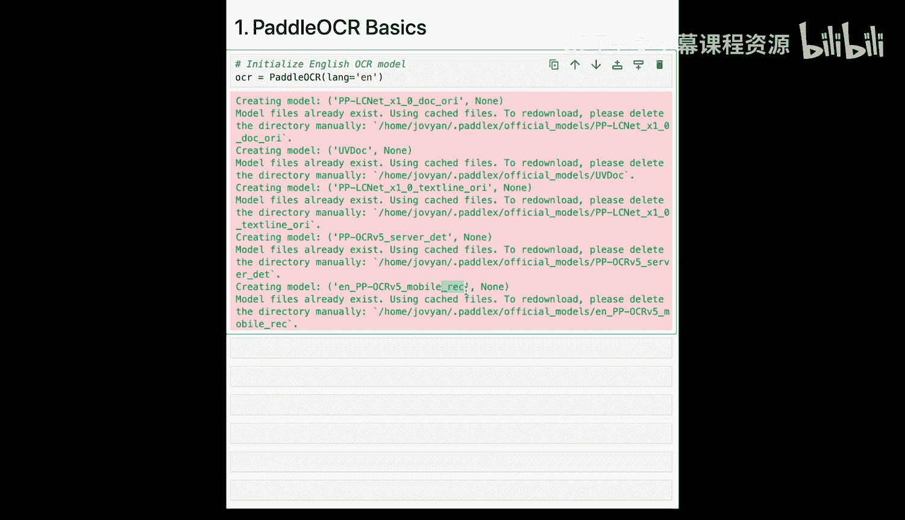

我们将导入必要的库：
*   `PIL`（Pillow）用于处理图像。
*   `csv` 和 `numpy` 用于数据处理。
*   `matplotlib` 用于绘图。
*   当然，还有 `paddleocr` 库中的 `PaddleOCR`。

```python
# 导入所需库
from PIL import Image
import csv
import numpy as np
import matplotlib.pyplot as plt
from paddleocr import PaddleOCR
```

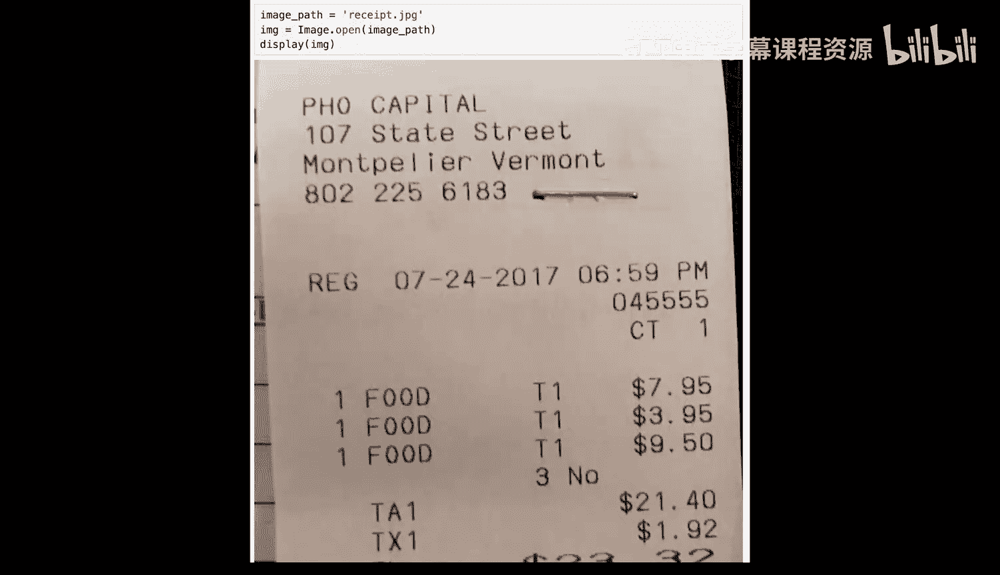

此外，与上一个实验类似，我们需要导入用于智能体的API密钥。

完成设置后，让我们正式开始。

## 初始化PaddleOCR

在这里，我们创建一个PaddleOCR对象，并指定语言为英语。请注意，幻灯片架构图中的两个模型在这里有所体现：
*   `det` 代表文本检测模型。
*   `rec` 代表文本识别模型。

你无需手动依次调用这些模型。PaddleOCR会将所有预处理和模型调用作为一个完整的流水线来处理。

```python
# 初始化PaddleOCR
ocr = PaddleOCR(lang='en', use_angle_cls=True, det=True, rec=True)
```

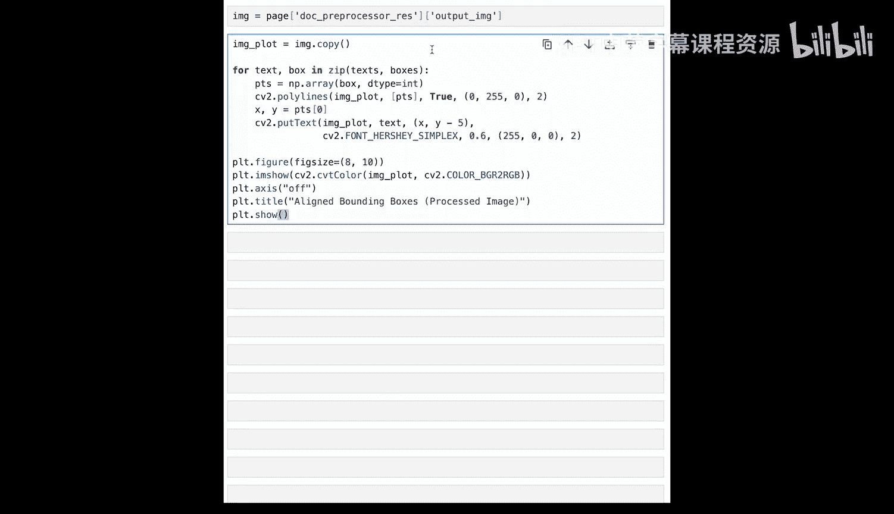

## 处理收据图像

这张收据图像与实验1中的相同。运行此单元格将执行OCR。


结果将是一个列表，其中每个元素对应一个被处理的页面。对于单页图像，它只包含一个字典。

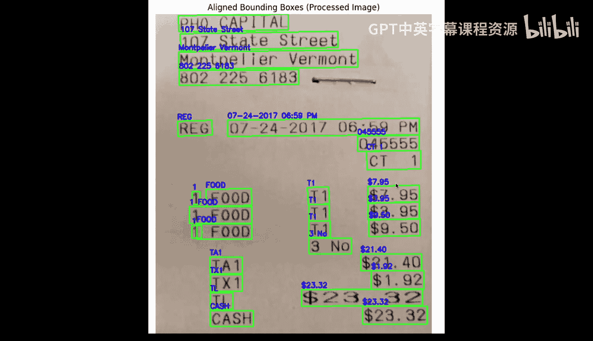

```python
# 对图像进行OCR
result = ocr.ocr('receipt.png', cls=True)
```

这个单元格将打印 `result[0]` 的部分内容，特别是识别出的文本、相关的置信度分数以及边界框坐标。

向下滚动，我们可以看到在整个收据上识别出的所有文本。

```python
# 打印OCR结果示例
for line in result[0]:
    print(f"文本: {line[1][0]}, 置信度: {line[1][1]:.2f}, 坐标: {line[0]}")
```

在执行下一个单元格之前，先解释一下预期结果。

回顾架构图，流水线还会在必要时对图像进行预处理，例如校正旋转、去歪斜或扭曲问题。

接下来我们将看到的实际上是经过预处理的图像，上面叠加了边界框和识别出的文本。

让我们继续请求图像，然后在另一个单元格中执行以查看叠加了所有信息的图像。


现在，如果你仔细比较这张图像和原始图像，会发现部分背景被移除，并且图像被顺时针轻微旋转以使其更水平。

代码在处理后的图像上绘制边界框，并将识别出的文本置于顶部。

为什么要重复这样的例子？请注意边界框的添加。我们现在获得了关于收据中特定文本字段位置的位置信息。同时注意到我们获取的值是正确的。之前，这个“795”是错误的。


## 将PaddleOCR封装为智能体工具

现在，我们将把PaddleOCR变成一个可以与智能体一起使用的工具，这与实验1非常相似。

这个较长的函数被设置为一个工具。这里的结果将来自PaddleOCR，其余大部分内容与之前相同。我们将打印出文本、边界框和置信度分数，正如在前面的例子中看到的那样。

定义好函数后，我们现在指定该函数是智能体可用的工具。其余部分将与第1课相同，注意我们使用 `gpt-3.5-turbo` 作为我们的LLM。

```python
# 定义OCR工具函数
def ocr_tool(image_path):
    result = ocr.ocr(image_path, cls=True)
    # ... 处理并返回结果 ...
    return processed_data

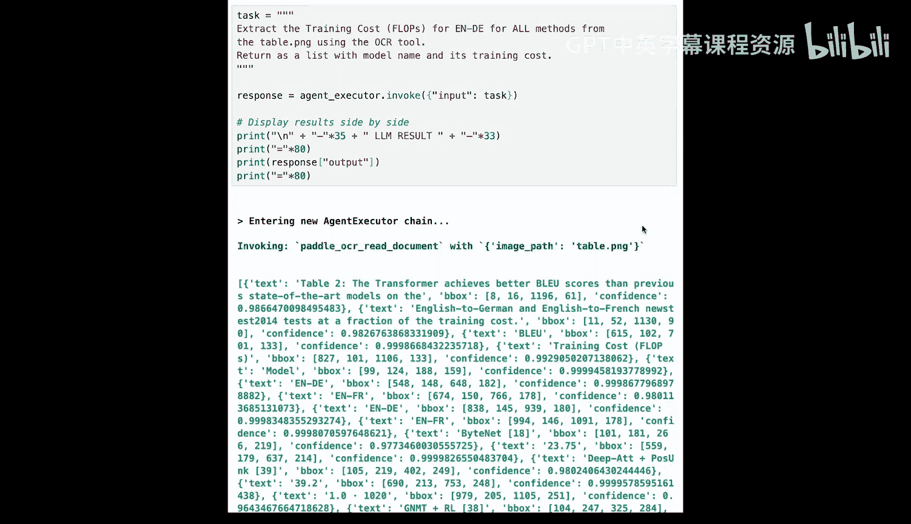

# 设置智能体，将ocr_tool作为可用工具
# ... 智能体设置代码 ...
```

## 使用智能体验证收据总额

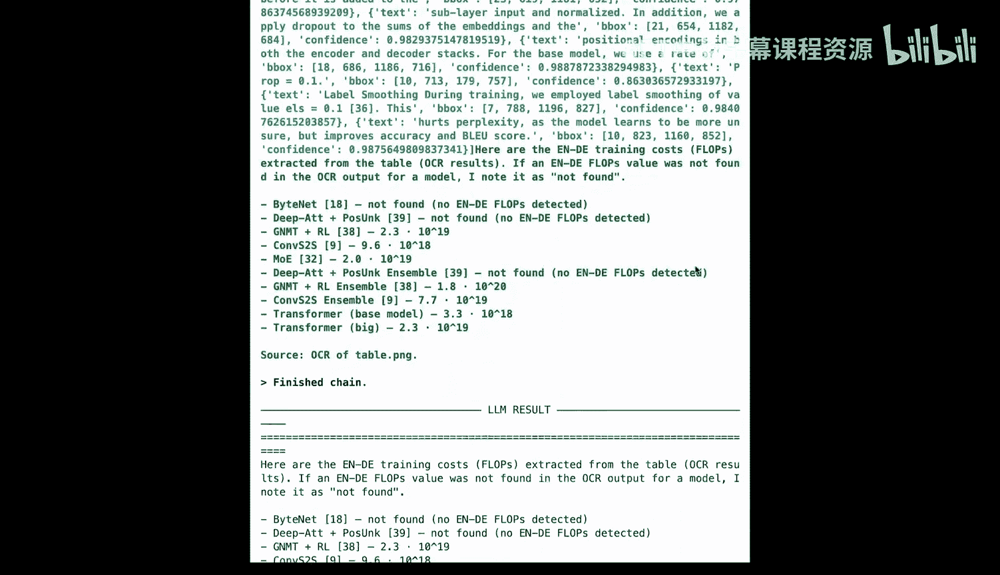

这个任务看起来很熟悉，我们将使用收据并验证总额是否正确。

向下滚动，当然我们看到青绿色的PaddleOCR输出，绿色的输出来自LLM。任务同样是进行一些基本的加法运算，因为输入是正确的，所以加法运算正确的几率大大增加，我们确实得到了正确的总额。

这个例子真正展示了PaddleOCR和LLM的结合如何能处理现实世界的收据。

记住表格练习和学生手写作业，我们接下来将处理这两个。

我们将定义另一个辅助函数。这里实际上没有什么新内容，OCR结果仍然来自PaddleOCR，我们仍然有一些打印输出。我们仍然在处理后处理图像，然后使用边界框坐标在其上进行一些标注，但现在它被包装进一个名为 `run_ocr` 的函数中，在本课剩余部分你会反复看到这个函数。

## 处理表格图像

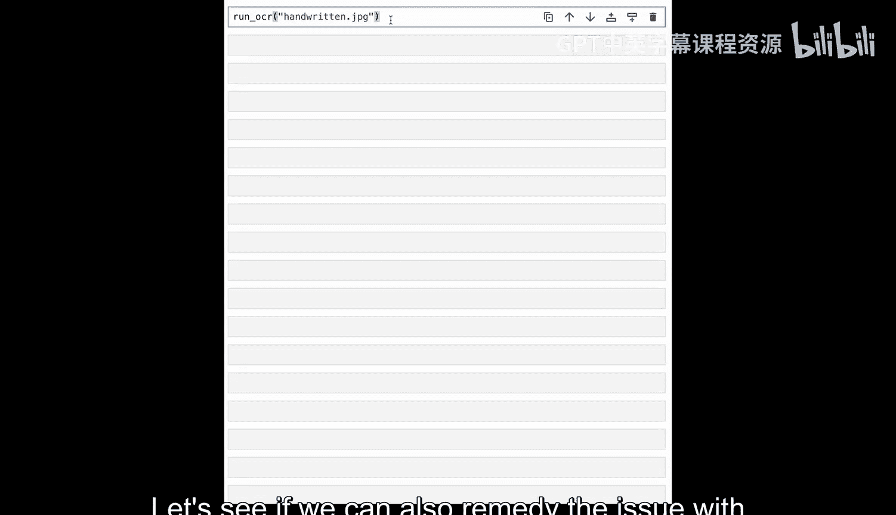

让我们将所有这些应用到表格上。这是表格的预览。


我们的第二块输出是PaddleOCR打印的信息。同样，我们有识别出的文本、置信度分数和边界框。滚动过去，我们有实际叠加的边界框，识别出的文本显示为蓝色。

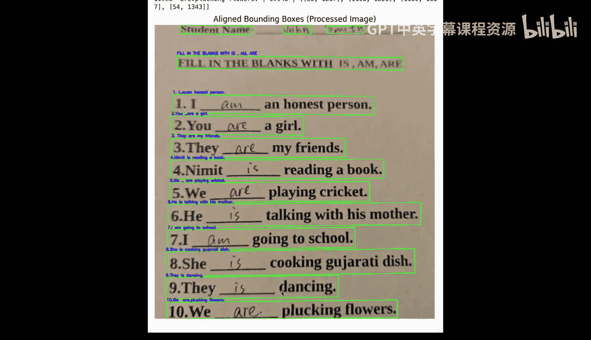

当你目视检查时，可能会发现一个或多个OCR错误。我看到的第一个错误实际上延续了之前指数表示法的问题。这里的“10的20次方”被识别为“1,0,2,0”。这与真实答案相差了数十亿倍。似乎大多数指数都是以这种方式识别的。

但让我们继续前进。我们将给智能体分配任务，再次从标记为“EN to DE”的列中提取FLOPS（每秒浮点运算次数）。


让我们再次滚动查看输出，青绿色来自PaddleOCR，绿色来自LLM。然后，在我们的函数中，我们还要求在底部打印这个结果。

你可以自己进行目视检查，或者相信我，这实际上是完全正确的。让我提请注意在上次运行中不正确的两个方面。

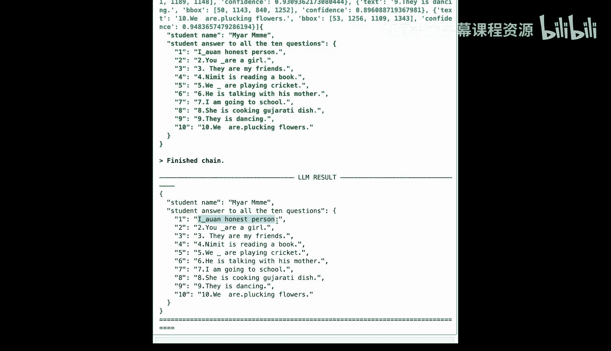

这个“Btenet”和“deep ATT”被正确地标记为未找到，因为它们在原始表格中是空白区域。

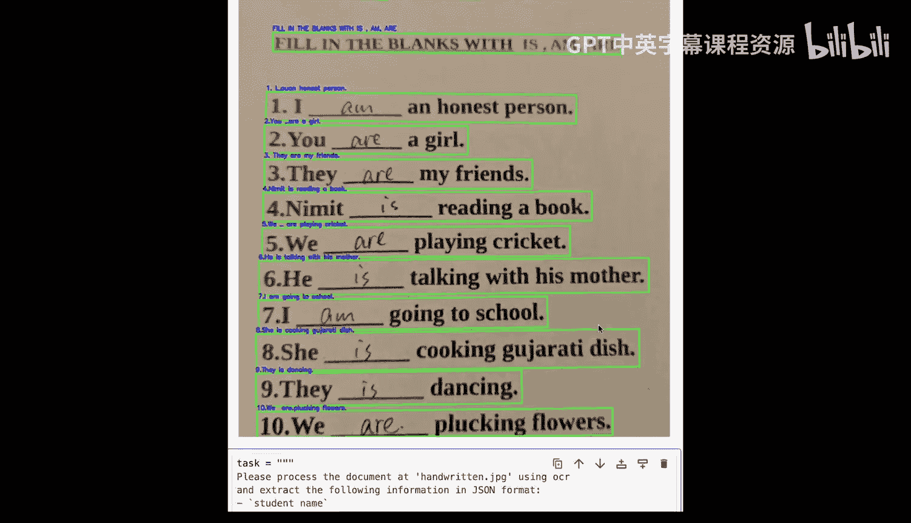

幸运的是，我们的科学记数法已被纠正。不再是“1020”，现在报告为“10^20 ops”，代表浮点运算次数。结果不可能是1020，这没有意义。它需要是一个大得多的数字。因此，智能体能够对OCR输出应用推理并纠正这种情况。

## 处理学生手写练习

让我们看看是否也能解决学生手写语法练习的问题。这是它的预览。


让我们看一下输出，并注意顶部的几个问题。

问题一非常清楚是“I am”，但在文本识别中，我们得到的是“I _”，然后这看起来像“A UAN”给我，所以这不好。问题二，我们在这里有一个额外的下划线，我们可能可以在后处理中清理它，这比Tesseract的表现有所改进。


现在，让我们给智能体分配提取学生回答为JSON的任务。

我们将直接跳到这里的LLM响应。

所以问题一的回答有些无意义。回顾Tesseract架构图，有一个检测阶段和一个识别阶段。检测阶段为我们提供边界框，这显然有助于理解整个文档。这里的识别也更好。在转录或识别文本方面，实际的字符级错误更少。因此，在这些相同的例子上表现肯定更好。

现在我们将继续看一些更困难的例子，以暴露一些弱点。

## 探索PaddleOCR的局限性

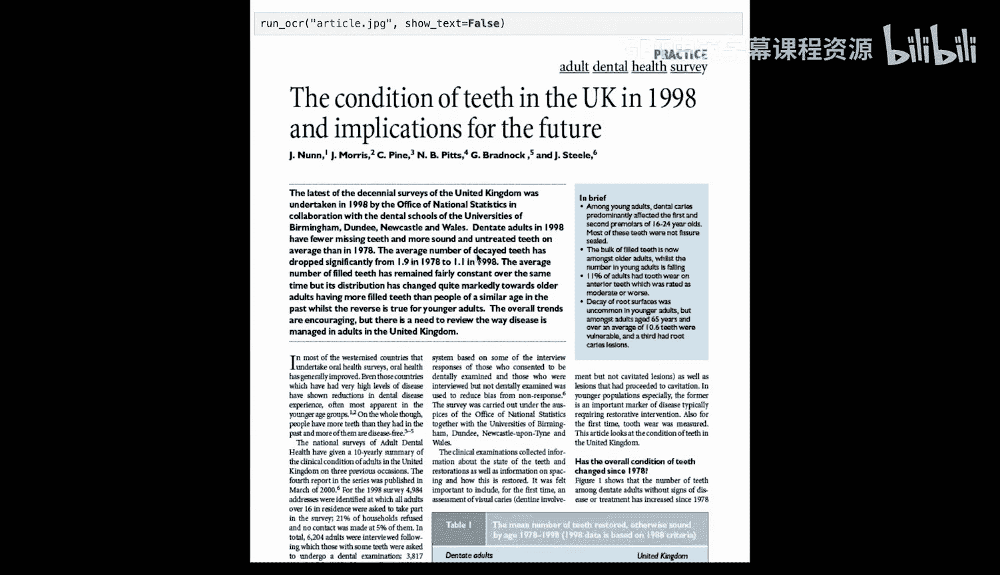

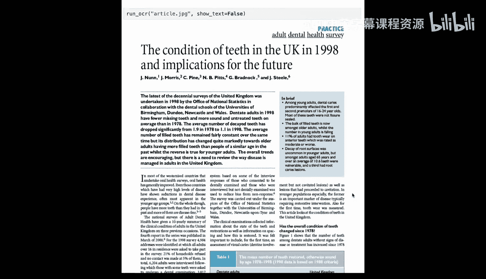

在本节中，我们将查看三个新例子，我们特意选择它们来暴露一些弱点。但如果你正在使用PaddleOCR进行构建，这些都是你需要意识到的事情。

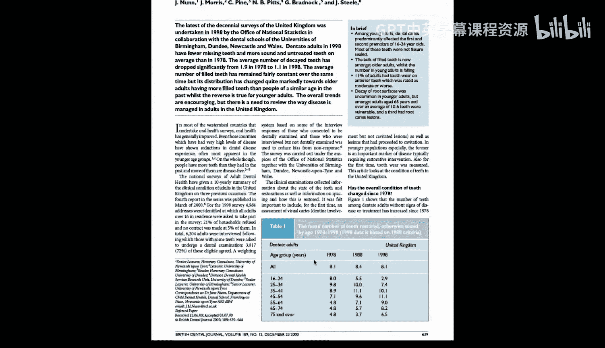

这是一个名为 `report.png` 的新例子，它似乎是一份关于美国经济报告的内页。

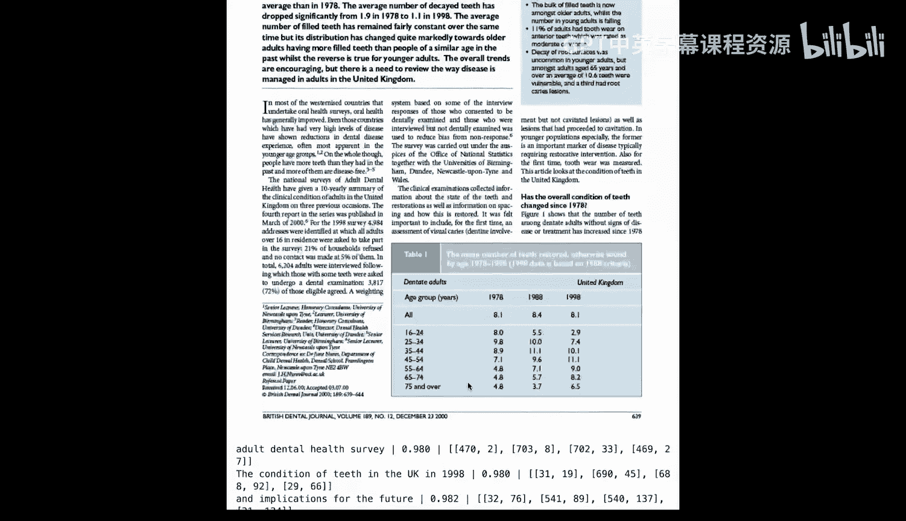


顶部有一个表格，中间有一些基本文本，底部有一个带左侧标题的折线图。

让我们看看PaddleOCR如何提取这个文档。乍一看，表格输出实际上看起来相当不错，文本也相当直接。但让我们看看这个折线图。整个图表周围没有边界框，这是我第一个线索，表明它没有被识别为一个单一单元。但是有一些X轴和Y轴标签周围有边界框，比如这个“0”、“-2”、“-4”、“-6”。现在这些完全脱离了上下文，如果我们向上滚动就能看到。

确实，这里是那个“0”，与这个“-2”完全断开，中间被其他内容隔开，然后是“-4”。因此，真的无法理解这些是Y轴标签，或者它们实际上属于一个被完全忽略的图表。我们暴露了一个弱点。

让我们看看 `article.jpeg`。它包含什么？


这看起来像是一篇关于牙齿的学术文章的前页。

那么，我们注意到这篇文章有什么特点？这里有多栏文本。在文章顶部，有两栏，摘要旁边是这段说明文字，当然正文呈现为三栏文本，中间被这个表格打断。


让我们向下滚动查看边界框输出，看看它在处理这种多栏文档时表现如何。


这里有很多边界框，但我只想提请你注意第一栏和第二栏。当然，这里的阅读顺序，在大多数进行口腔健康调查的西方国家，你会先读完左手栏。

但在OCR中，如果你跟着我的鼠标，我们会看到直接横向阅读，所以会是“in most of the Westernized countries, that system based on some of the interview”，这当然完全没有意义，并且如果你继续这样再读10到15页，就会把整篇文章弄得一团糟。

我们了解到PaddleOCR无法处理这些多栏布局，如果这是你文档的一部分，它就有弄乱文本的风险。

## 引入布局检测

我们已经揭示了这些关于布局的弱点，并开始意识到，布局感知的文本检测将成为准确现实世界OCR的基石，因为当然，像这样的布局非常常见。但PaddleOCR模型没有视觉能力，对于更复杂的文档，我们实际上需要某种视觉模型。

好消息是，PaddleOCR实际上有自己的布局检测版本，正如我们之前提到的，它一直在积极开发中，我们之前没有使用布局检测功能，所以现在是我们导入并开始将其与文本检测和识别结合使用的机会。

在这里，我们将初始化该布局检测模型。

```python
# 初始化布局检测模型（假设PaddleOCR有此功能）
# 注意：实际API可能有所不同，此处为示意
layout_ocr = PaddleOCR(use_angle_cls=True, det=True, rec=True, layout=True)
```

我们将定义一个新函数 `process_document`，并将图像发送到这个布局引擎。作为响应的一部分，我们将获得标签、分数和边界框。分数和边界框我们以前见过，但现在我们将获得该区域的标签。一旦你看到它，就会更清楚。

让我们将 `process_document` 应用到那份关于美国经济报告的内页上。

现在，标签的含义应该更清楚了。我们得到诸如“文本”、“图表”、“段落标题”或“数字”，甚至“页脚”等内容。这是在识别文档上的不同区域，并标记它们是什么。

这个长函数的目的是帮助可视化。

让我们再次查看那份经济报告，但现在叠加了布局检测。

看看这里。我看到了几个文本块。我看到了一个段落标题。我看到了这里的一个表格。非常重要的一点是，我看到了一个图表以及围绕该图表的整个边界框，然后还有一些小细节，如数字和页脚。但布局模型现在确实正确地识别了本文档的主要区域。

现在，对那篇关于牙齿的文章做同样的事情。

当我目视观察时，我看到了之前见过的标签，如“文本”和“段落标题”。我看到了一些新的，如“文档标题”和“摘要”。我看到与这些相关的高置信度分数，然后当我向下滚动时，看到了一些脚注、页脚和表格。但我要指出的是，这个表格对我来说是一个表格，但在这里被识别为两个置信度稍低的表格。但总的来说，布局模型现在确实有助于将这些文本保持在一起，所以我们不再有从单词“that”继续到单词“system”的问题，因为整个文本块将表明“that”之后的单词是“undertake”。

## 处理银行对账单

让我们看看用一个例子能推进到什么程度。这是一个银行对账单。

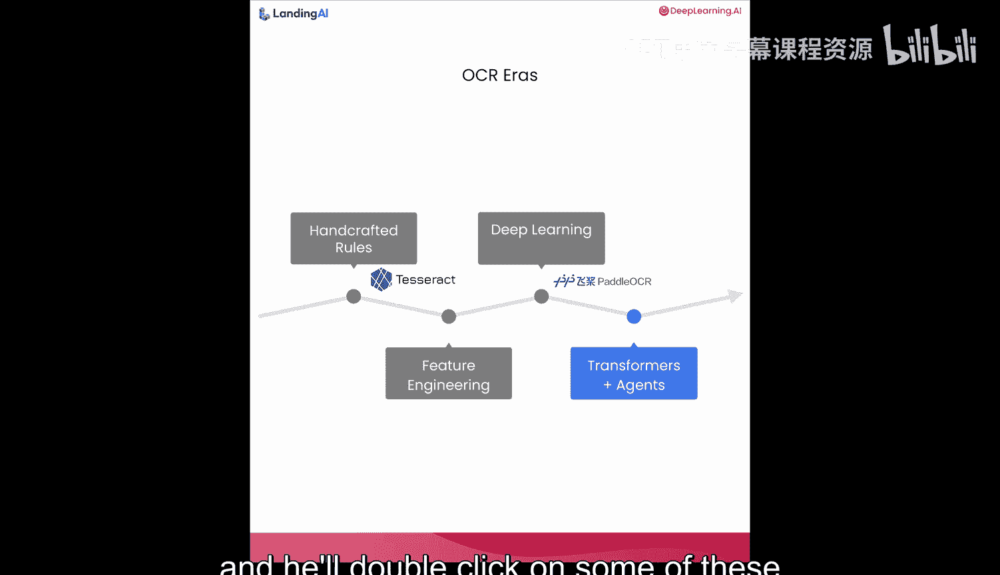

通常，在处理银行对账单时，最终的下游用例是从中提取一定数量的键值对。

我实际上看到了与表格相同的挑战。在这种情况下，这全部被检测为一个大表格。但对我来说，凭借我的人类视觉和查看银行对账单的经验，实际上可以判断表头应该在这里：“Date”、“Description”、“Category”、“Amount”和“Balance”。这实际上是表格的分隔和表头。上面的一切都可以被解释为一个表格，但它肯定应该与下面的表格分开。

所以这里肯定还存在一些弱点。奇怪的是，在这个例子中，底部的小文本被完全忽略了，而有时法律脚注或其他重要信息可能出现在那里。

## 总结

好的，实验2到此结束。让我回顾一下几个主要要点。

PaddleOCR属于深度学习OCR时代，显然是一个强大的引擎，在许多现实世界图像上击败了传统OCR，但它仍然主要从单行文本的角度思考。

然后我们添加了布局检测，这为你提供了一些区域级别的结构。比如段落、表格和图形在哪里，但它仍然不是完整的语义理解。它并没有真正代表人类查看文档的方式，而人类在很大程度上是基于视觉系统运作的。


因此，随着课程的深入，我们将继续引入更多来自视觉的概念。在下一课中，我们将交还给David。他将在名为“布局检测与阅读顺序”的课程中，深入探讨一些关于布局和阅读顺序的概念。