# 006：布局检测与阅读顺序 📄➡️🔍

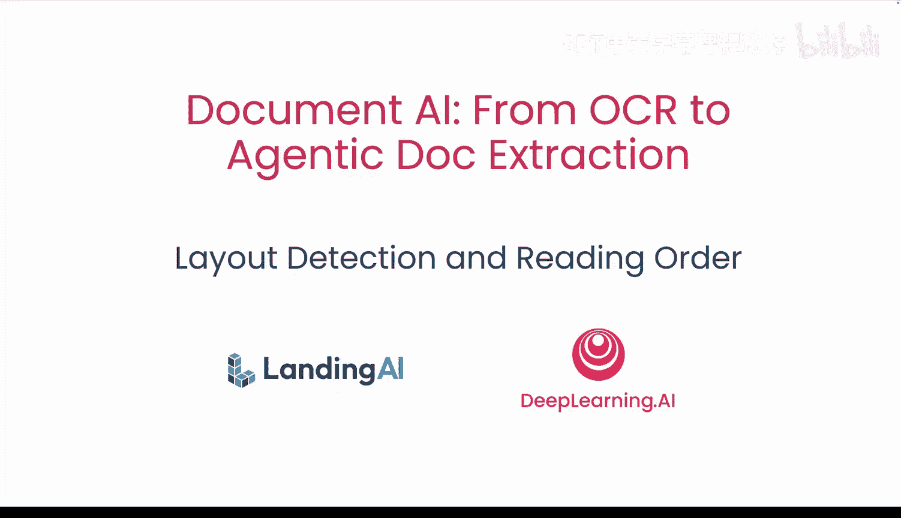

在本节课中，我们将学习如何处理具有复杂布局的文档。你将了解布局检测和阅读顺序识别的概念、重要性，以及现代系统如何利用基于学习的方法来解决这些问题。我们还将探讨处理表单、表格、手写体等现实挑战，并介绍视觉语言模型（VLM）如何与布局分析结合，构建更强大的文档理解系统。

---

## 文档布局的复杂性

文档并不总是以严格的自上而下、从左到右的顺序呈现信息。在本节中，我们将了解为何简单的文本提取流程在处理复杂文档时会失效。

许多团队和组织至今仍依赖以下流程：首先从文档中提取文本，然后将文本输入语言模型并提问。这种方法看似合理、简单甚至优雅，但问题在于，大多数文本提取过程会破坏文档的结构。当我们“压平”一个文档时，其结构就丢失了：列和行混在一起，表格变成无意义的浮动文本框，图注与图表分离，对于复杂的文档（如财务报告、研究论文和法律合同），阅读顺序变得不可预测。仅凭OCR加一个大语言模型（LLM），没有足够的上下文来进行正确推理。

---

## 布局检测：理解文档结构

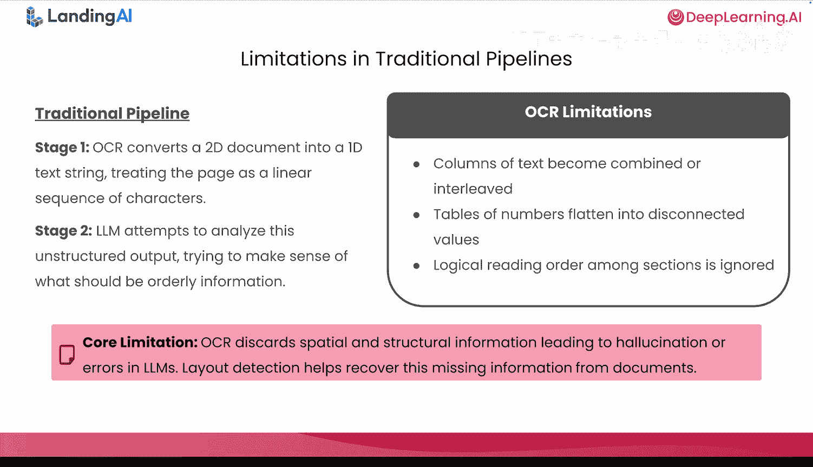

上一节我们介绍了简单OCR流程的局限性，本节中我们来看看如何通过布局检测来修复这个问题。

布局检测，或称文档布局分析，是解决上述问题的第一步。它不再将文档视为原始文本的集合，而是识别页面上的有意义的区域，并确定它们的位置和代表的内容。它能区分段落、表格、图表、页眉、页脚和图注。换句话说，我们不再仅仅是提取内容，而是在理解文档的结构。

这被证明是极其重要的。保留布局可以防止不同部分的文本混在一起变得混乱，在多栏文档中保持叙述的流畅性，并允许你定位页面的特定部分，如表格中的总计或表单中的关键字段。核心思想简单而有力：**布局很重要**。一旦你丢弃了它，理解就会变得脆弱且容易出错。

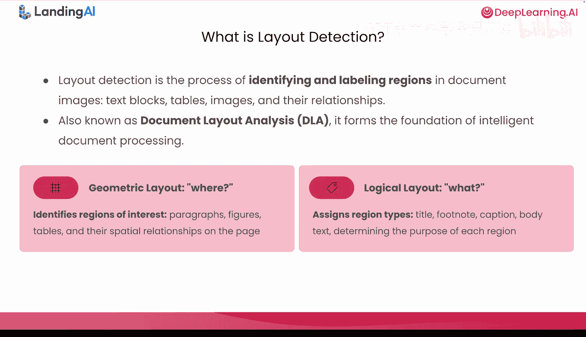

以下是布局检测能识别的典型文档组件：
*   段落
*   表格
*   图表
*   图像
*   图注
*   页眉
*   页脚
*   印章和批注

通过明确检测和标记这些组件，下游模型在尝试推理之前就知道它们正在处理的是何种信息。

---

## 阅读顺序：确定信息流

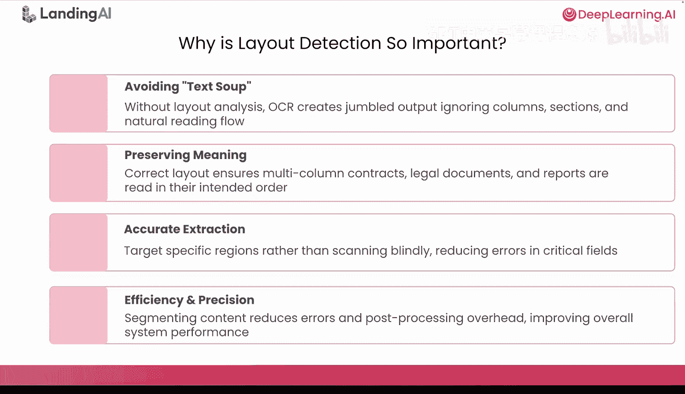

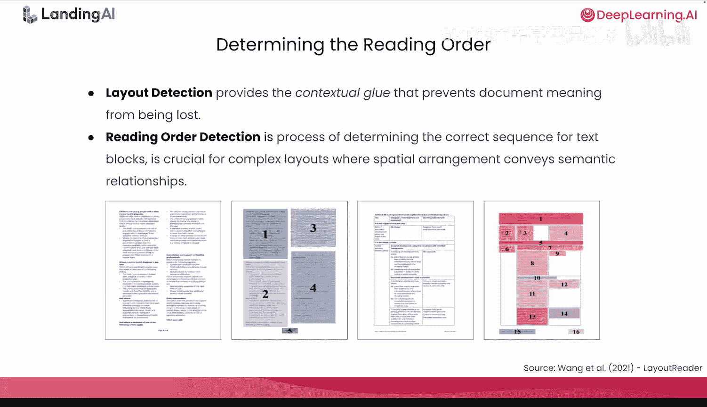

一旦我们知道了页面上有什么以及它们在哪里，下一个问题就是：应该如何阅读它们？布局告诉我们东西在哪里，而**阅读顺序**告诉我们人类实际阅读它们的序列。这对于多栏布局或带有浮动图表和图注的文档至关重要。没有可靠的阅读顺序，即使有清晰的布局，仍然存在歧义。

历史上，阅读顺序是通过规则来处理的：你假设区域是自上而下、从左到右的，可能应用一个XY切割算法，然后希望得到最好的结果。这对于非常整洁的文档有效，但对于任何真实且复杂的文档会立即失效。任何分栏、侧边栏或浮动元素都会使这些启发式方法产生无意义的结果。

这种情况随着Layout Reader的出现而改变。它不是一个基于规则的系统，而是一个在Reading Bank数据集上训练的**学习模型**。该数据集包含超过50万页带有正确阅读序列的标注页面。每个单词被表示为一个元组，包含单词本身、其页面索引以及布局特征（如边界框坐标、宽度和高度）。模型从这些视觉和空间特征中学习预测正确的阅读顺序。这可以处理复杂的布局、多栏结构以及基于规则的系统无法管理的不规则阅读流。

---

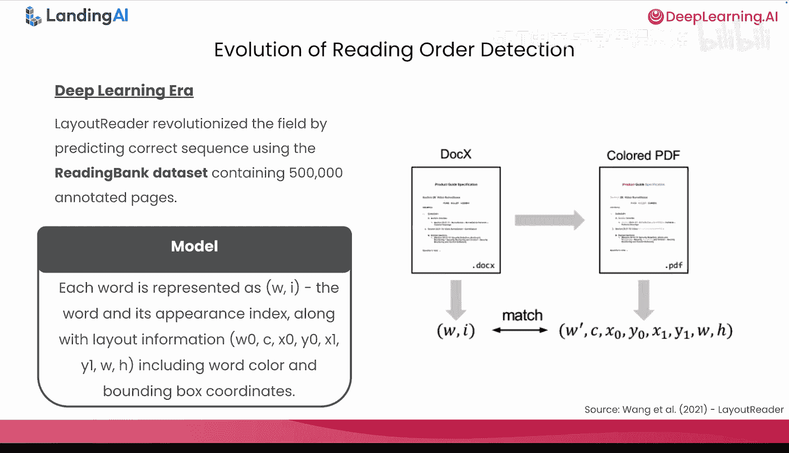

## Layout Reader的工作原理

现在，让我们深入了解Layout Reader的实际工作原理。

其架构是一个使用LayoutLM作为编码器的序列到序列模型。LayoutLM由微软在2020年开发，它结合了文本、布局和视觉信息。其目的是预测文档中单词或文本行的正确阅读顺序。

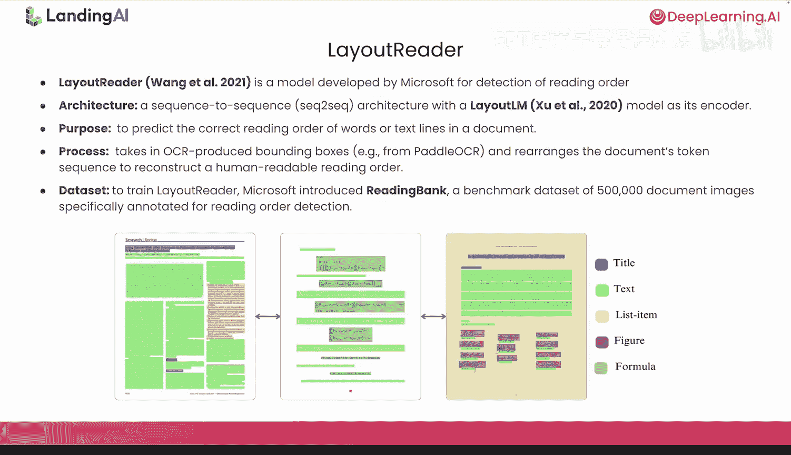

该过程接收OCR产生的边界框（例如，来自PaddleOCR），并重新排列文档的标记序列，以重建人类可读的阅读顺序。该模型在Reading Bank上进行了训练，这是微软为此任务专门创建的基准数据集。它包含50万张标注了阅读顺序的文档图像。你可以看到它处理的多样性：具有多栏布局的研究论文、具有混合结构的科学文档，以及带有表格和列表的财务文档。尽管布局各异，但每个文档都获得了正确的阅读序列。

---

## 超越OCR与阅读顺序的挑战

然而，阅读顺序检测完全依赖于OCR的输入质量。这里存在一个根本性的限制：**OCR只捕获文本**。它错过了视觉信息：图像、图表、图示、空间关系和视觉上下文。因此，即使有完美的阅读顺序，你也在处理不完整的信息。

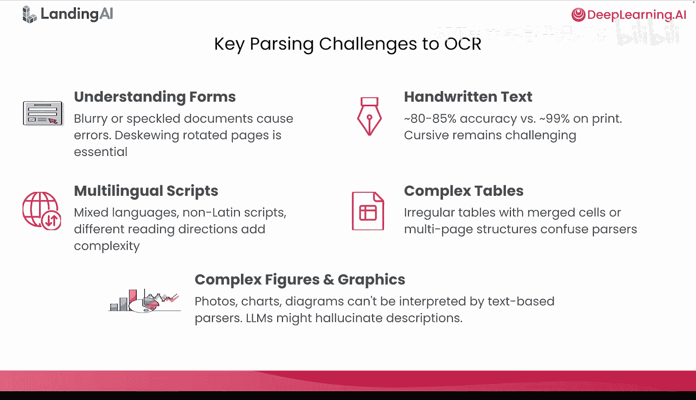

在实践中，你会反复遇到这些挑战：错位的表单、复杂的表格、手写体、多语言文档以及需要解释而非转录的图表。这些正是基于OCR的流程崩溃的地方。

以下是几个具体的挑战领域及其解决方案：

**表单**
核心挑战是将标签与值关联起来，尤其是当它们不相邻时。有几种可能的方法：
*   **基于模板的提取**：使用固定坐标，速度快，但布局变化时不灵活。
*   **灵活的键值对检测**：使用基于邻近度和内容的规则或机器学习。
*   **微调Transformer模型**：如LayoutLM，在FUNSD等数据集上训练，自动学习这些关系。
*   **计算机视觉**：用于处理非文本元素，如复选框状态。

**表格**
表格是另一个臭名昭著的失败点。传统OCR通过压平行列关系破坏了表格的完整性。一旦结构丢失，数字就失去了意义。现代模型以不同方式解决这个问题：
*   **Table Transformer**：使用目标检测将表格、行和列作为独立对象来查找。
*   **TAPAS**：采用图像到序列的方法，直接将表格图像翻译成HTML。
*   **Split & Merge**：用于处理大型密集表格。
输出可以是CSV、JSON、HTML或Pandas DataFrame，以便我们可以对数据进行推理，而不仅仅是文本框。

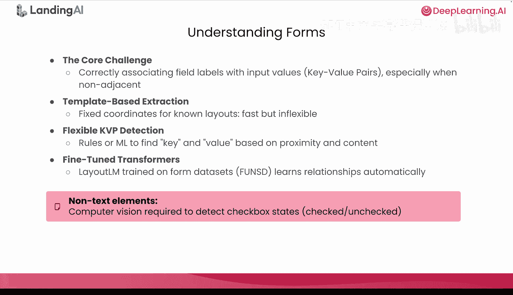

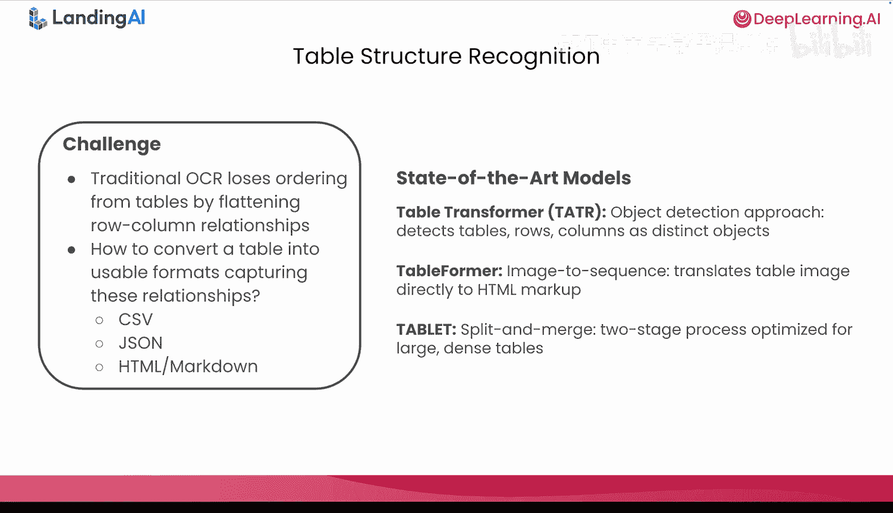

**手写体与多语言文档**
*   **手写体**：标准OCR在印刷文本上训练，由于各种风格、草书和不一致的字符形态，在手写体上会失败。智能字符识别（ICR）是专门在手写数据集上训练的模型，使用CNN-RNN架构进行序列建模和字符级预测。
*   **多语言文档**：带来不同的挑战，如非标准字符、Unicode字体和替代的阅读方向（阿拉伯语从右到左，东亚语言的垂直文本）。这需要具有自动语言检测、特定语言OCR引擎、脚本检测和路由以及按语言调整阅读顺序的强大多语言模型。

---

## 视觉语言模型：范式转变

这些专门的模型多年来一直是文档AI的主力，每个都经过优化以擅长特定任务。但最近，一个新的范式出现了：**视觉语言模型**。这代表了从专门工具到通用智能的根本性转变，可以处理所有这些任务甚至更多。

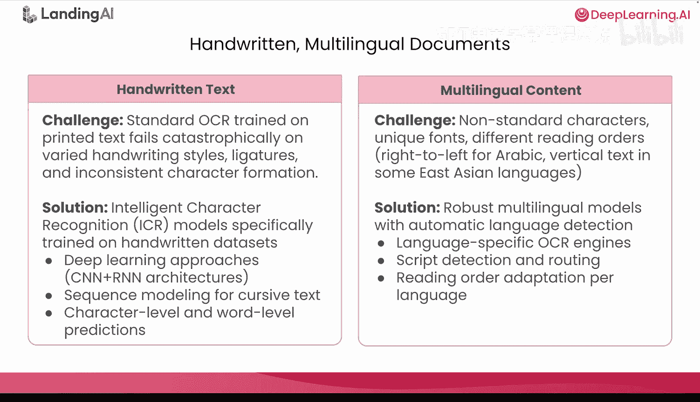

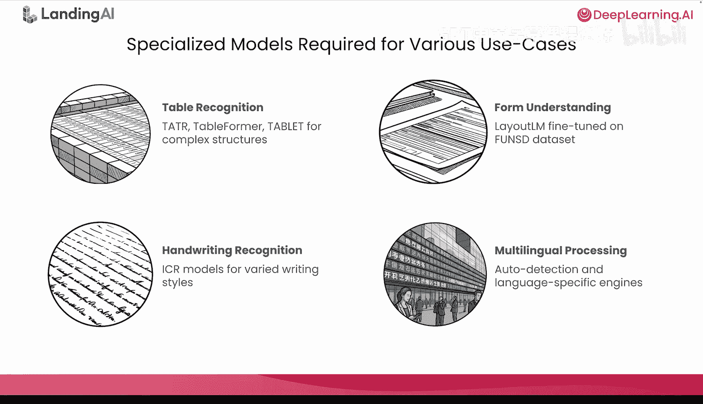

那么，什么是视觉语言模型？传统的LLM纯粹在文本标记上操作。**VLM统一了视觉和语言**，同时处理图像和文本，以形成共享的语义表示。这使得模型能够推理视觉场景中发生的事情，而不仅仅是出现了哪些单词。

让我们讨论一下从LLM转向视觉语言模型时发生了什么变化。左侧是一个常规的LLM：它接收文本标记作为输入，经过Transformer处理，然后得到文本输出。模型理解的一切都仅来自文本。右侧是一个视觉语言模型：输入是图像加文本。在任何信息到达语言模型之前，视觉输入必须通过一个视觉编码器转换成LLM能理解的东西，然后它才产生文本输出。

以下是其三个核心组件：
1.  **视觉编码器**：如CLIP或SigLIP等模型，将像素转换为视觉向量。
2.  **投影器**：这个翻译层将视觉向量转换为LLM可以处理的标记嵌入。
3.  **LLM主干**：此时，一个标准的LLM对这些视觉标记进行推理并产生文本输出。

关键要点很简单：**一个VLM仍然是一个LLM，但在它前面加了一个视觉栈**。它能“看到”图像，但它对文档的理解程度仍然取决于如何处理结构、布局和阅读顺序。

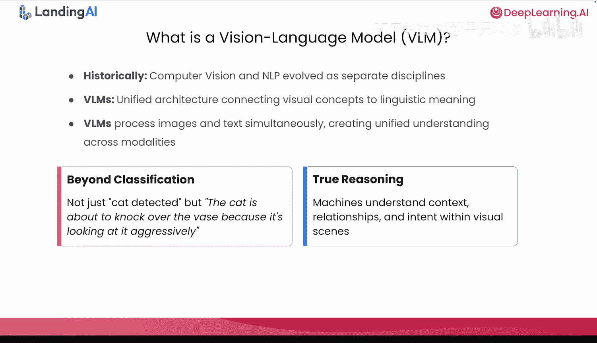

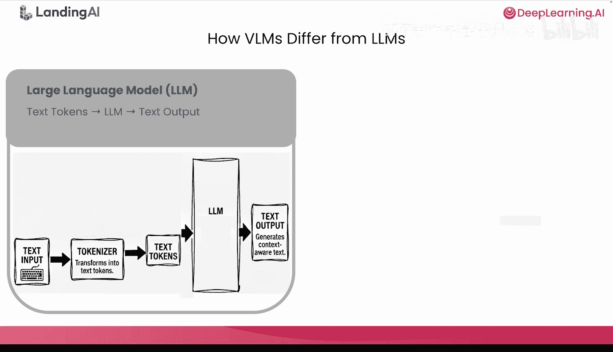

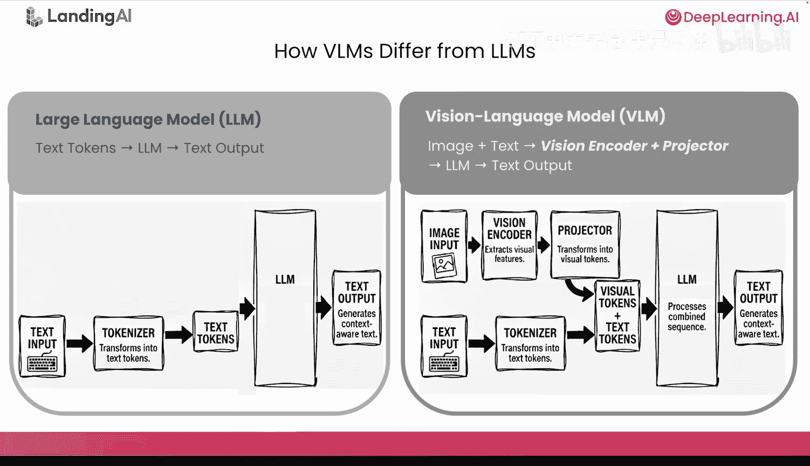

---

## 结合布局检测与VLM推理

视觉语言模型很强大，但它们本身并不是一个完整的解决方案。如果你一次性给VLM一个视觉丰富的文档，VLM可能会遇到困难：当视觉线索缺失或模糊时会产生幻觉；缺乏确定性定位，意味着它们无法可靠地将答案与页面的特定区域联系起来；它们难以处理嵌套布局、多页结构和小文本。VLM在与结构配对时表现出色，但它们无法取代现实世界文档任务所需的结构推理。

一个可能的解决方案是将布局检测与VLM推理结合起来。我们之前讨论的布局分析提供了结构基础：识别阅读顺序、文档区域及其类型。然后，这些结构信息可以指导你如何处理每个区域：
*   图表和可视化可能被发送给带有针对性提示的VLM。
*   表格可能使用VLM或专门的Transformer，取决于复杂性。
*   文本区域可能使用传统OCR或基于VLM的提取。

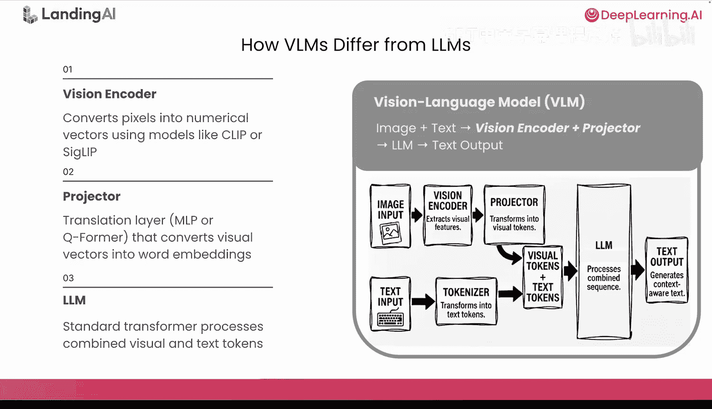

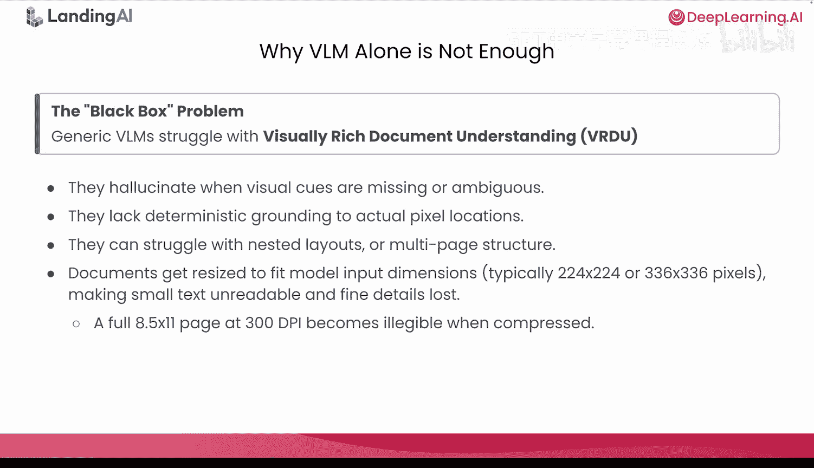

总之，**布局检测提供了确定性定位，而VLM则处理那些受益于视觉推理的元素**。在实验环节中，你将实现一个展示这种工作流程的管道。

---

## 实验环节概述：构建混合架构

在实验环节，你将通过一个智能体框架来编排这个工作流程。以下是实现步骤：
1.  **输入文档**：从输入文档开始。
2.  **文本提取与排序**：使用PaddleOCR提取和排序文本。这将为你提供所有OCR文本以及边界框和置信度分数。
3.  **阅读顺序重排**：使用Layout Reader对提取的文本进行重新排序。
4.  **区域检测**：运行PaddleOCR的布局检测，以识别表格、图表和文本块。
5.  **构建上下文**：将以上所有信息（按正确顺序排列的OCR文本、区域ID和块类型）作为上下文提供给一个LangChain智能体。
6.  **智能体工具调用**：该智能体将可以访问两个专用工具：
    *   `analyze_chart`：将裁剪后的图表图像发送给VLM，以提取图表类型、坐标轴、数据点和趋势。
    *   `analyze_table`：对表格执行相同操作，根据用户问题提取表头、值和注释。
7.  **智能决策**：根据用户的问题，智能体可以决定哪个区域需要VLM分析，以及调用哪个工具。

通过实验，你将清楚地看到这些部分如何协同工作，以及这如何为下一节课中Andrea将要介绍的ADE（智能体化文档抽取）奠定基础。

---

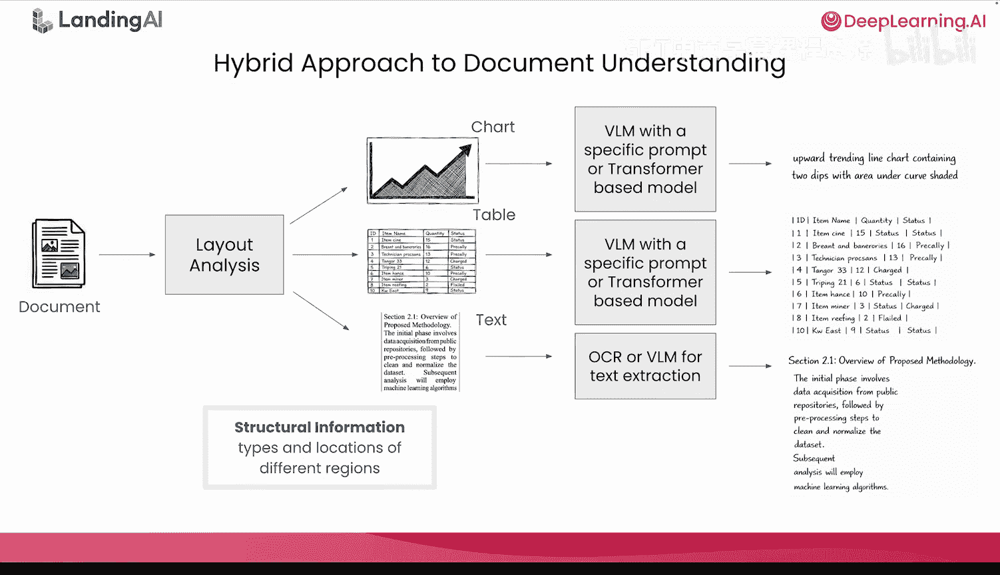

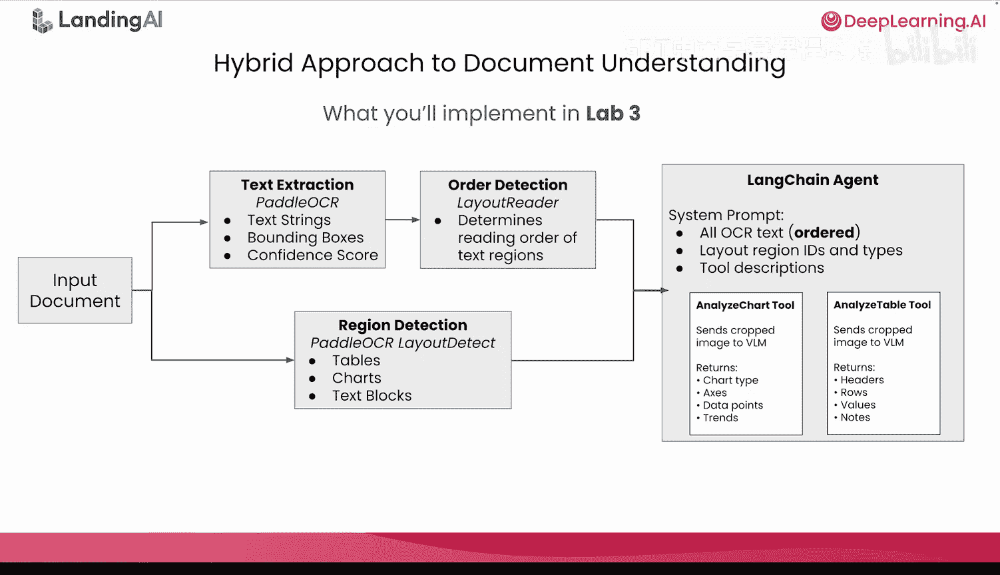

## 总结

本节课中，我们一起学习了文档AI中布局检测与阅读顺序的核心概念。我们了解到，简单的OCR加LLM流程在处理复杂布局时会失效，因为结构信息丢失了。布局检测通过识别文档中的不同区域（如段落、表格、图表）来恢复结构，而阅读顺序模型（如Layout Reader）则能预测人类阅读这些信息的正确序列。我们还探讨了处理表单、表格、手写体等现实挑战的专门模型，并介绍了视觉语言模型（VLM）这一新范式。最后，我们认识到最强大的解决方案是**将确定性的布局分析与灵活的VLM视觉推理相结合**，构建一个混合架构，这将在实验环节中具体实现。