# 008：用于智能体化文档理解的单一API 🚀

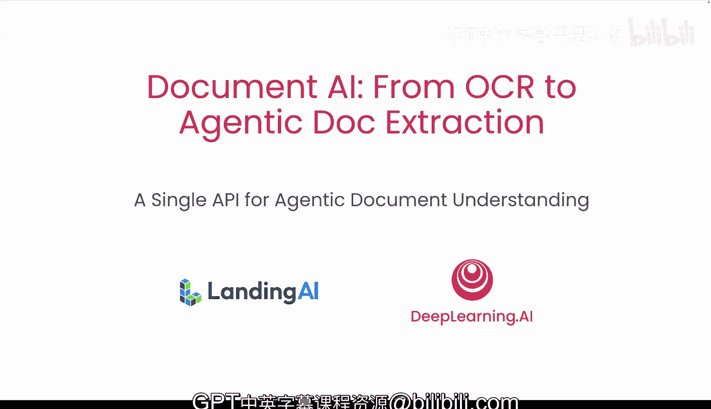

在本节课中，我们将学习如何使用Landing AI的智能体文档提取框架来解析文档并提取关键信息对，整个过程无需使用字符识别、版面分析或视觉语言模型。在实验环节，你将使用ADE来解析复杂文档，并构建一个处理混合文档的流程。

## 概述

上一节我们介绍了文档AI的基础概念，本节中我们来看看Landing AI的智能体文档提取技术。ADE是一个将输入文档、演示文稿、图像甚至电子表格转换为结构化的Markdown和JSON的API。它旨在简化文档处理流程，用一个统一的接口替代传统方案中的多个复杂步骤。

## 关键用例

ADE主要服务于两大核心应用场景。

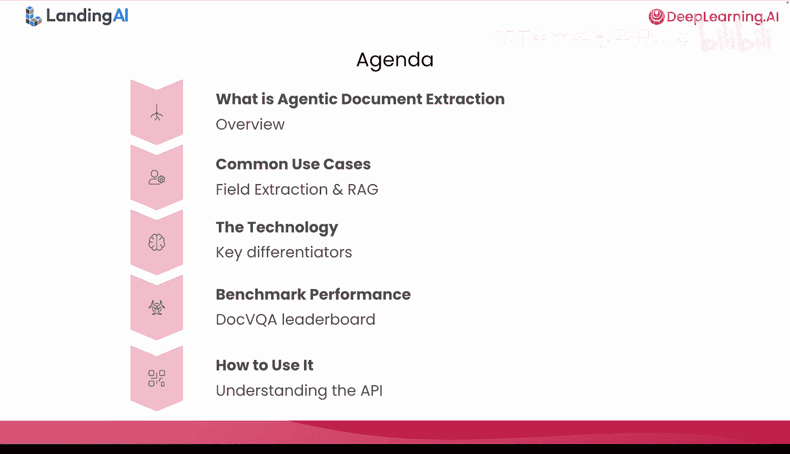

以下是两种主要的应用场景：

1.  **字段提取**：也称为键值对提取。用户需要从大量外部提供的文档中提取特定信息，并能够追溯到原始文档。
2.  **RAG**：构建能够理解底层内容的知识助手。用户需要处理包含表格、图表、流程图等复杂内容的文档，并同样具备追溯能力。

## 技术核心：ADE的工作原理

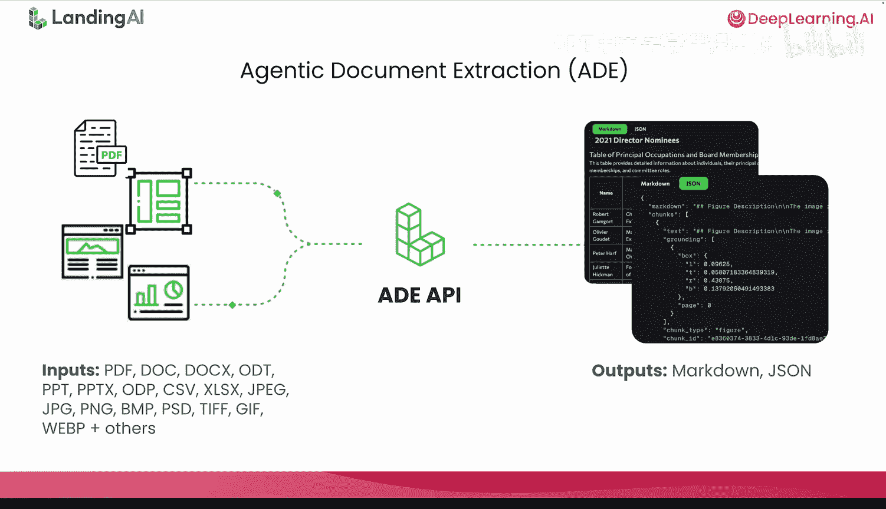

ADE并非对现有技术的渐进式改进，而是一种由Landing AI工程师开创的文档AI新方法。它属于智能体时代的一部分，采用**视觉优先、数据为中心**的方法。

ADE建立在三大支柱之上：

*   **视觉优先**：将文档视为视觉对象，其含义编码在布局、结构和空间关系中。
*   **数据为中心**：在最高质量的精选数据上进行训练。我们相信正确的数据与正确的模型架构同等重要。
*   **智能体化**：ADE系统能够规划、决策、行动和验证，直到响应满足质量阈值。

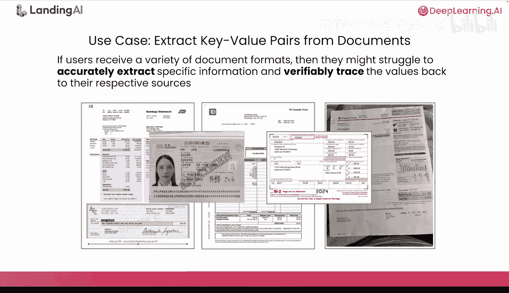

## 技术架构

下图清晰地说明了视觉是ADE的基础。Landing AI将多年的视觉专业知识应用于文档AI问题。

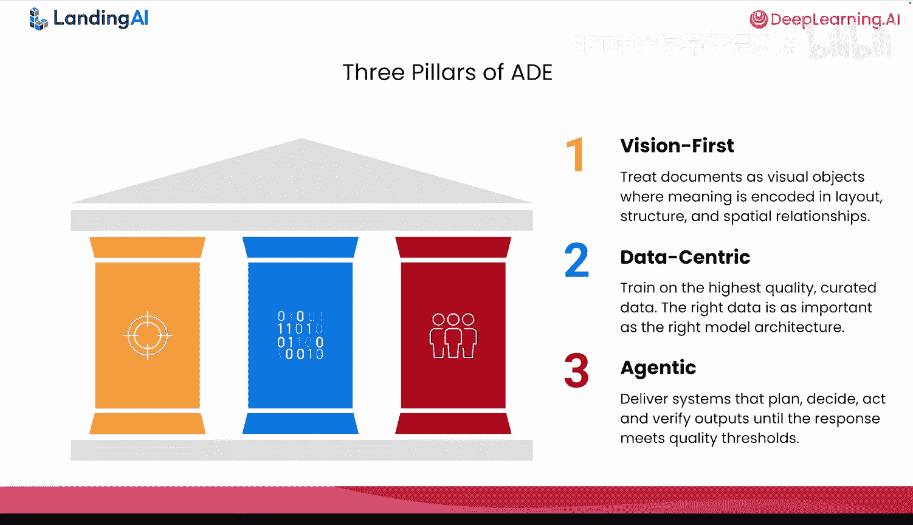

架构的最底层是**最先进的文档原生视觉模型**，它们经过训练，能够像人类一样“看”文档。在此基础上，**智能体**负责解析和路由不同的文档块（如文本、表格、图形），它们各自遵循独立的处理路径。最顶层的**智能体与应用层**则专注于交付用户真正需要的功能，如字段提取和文档拆分。

上一张幻灯片中提到的基础视觉模型，属于不断增长的**文档预训练Transformer家族**。在录制本课程时，你可以选择DPT1、DPT2和DPT2 mini。所有这些模型都能返回高质量的文档解析结果。

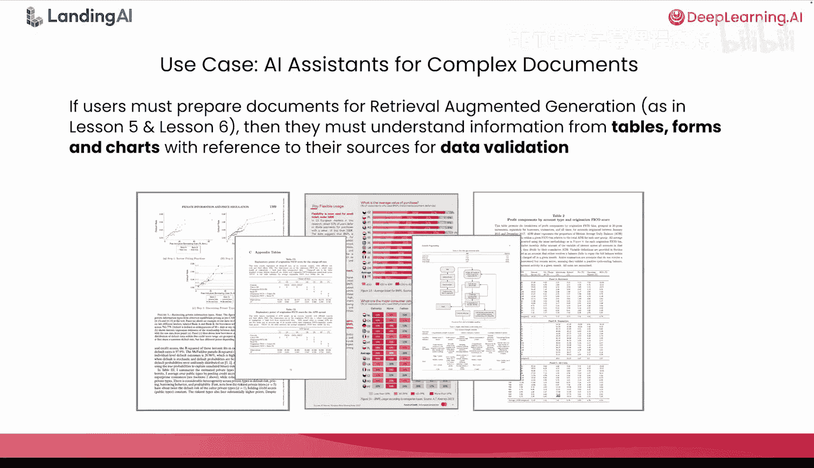

以下是DPT模型的核心能力：

*   阅读顺序检测
*   版面检测
*   文本识别
*   图注生成

## 性能表现

那么，作为ADE核心的这些DPT模型表现如何呢？

ADE在DocVQA基准测试集上的表现实际上**超过了人类水平**，准确率达到**99.15%**，同时也超过了所有其他已发布的模型。我建议大家关注宣布这些结果的博客文章，其中有一个精彩的交互式文档库可供探索。

如果你不熟悉DocVQA，它是一个基于真实扫描文档的问答基准，文档来自UCSF行业文档库。本页幻灯片右下角展示了一个例子：需要回答的问题是“个人的家庭电话号码是什么？”，答案可以在绿色边界框内的手写部分找到。

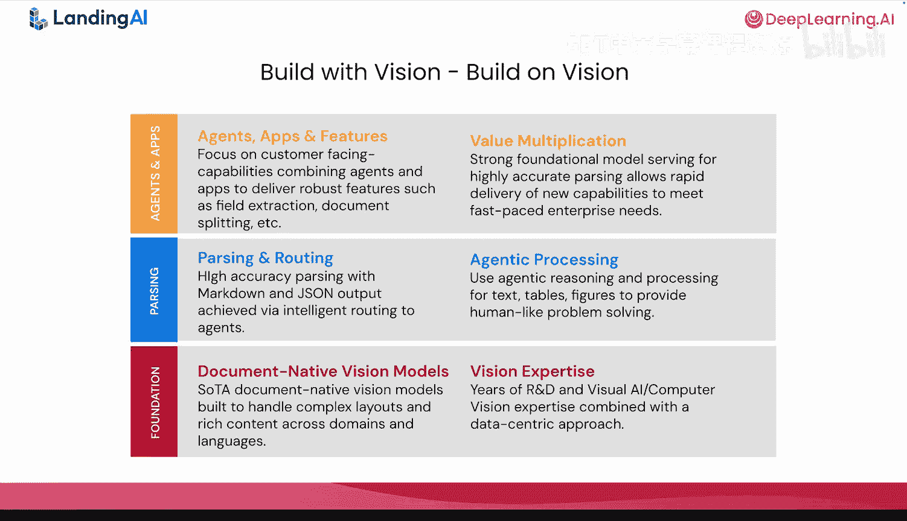

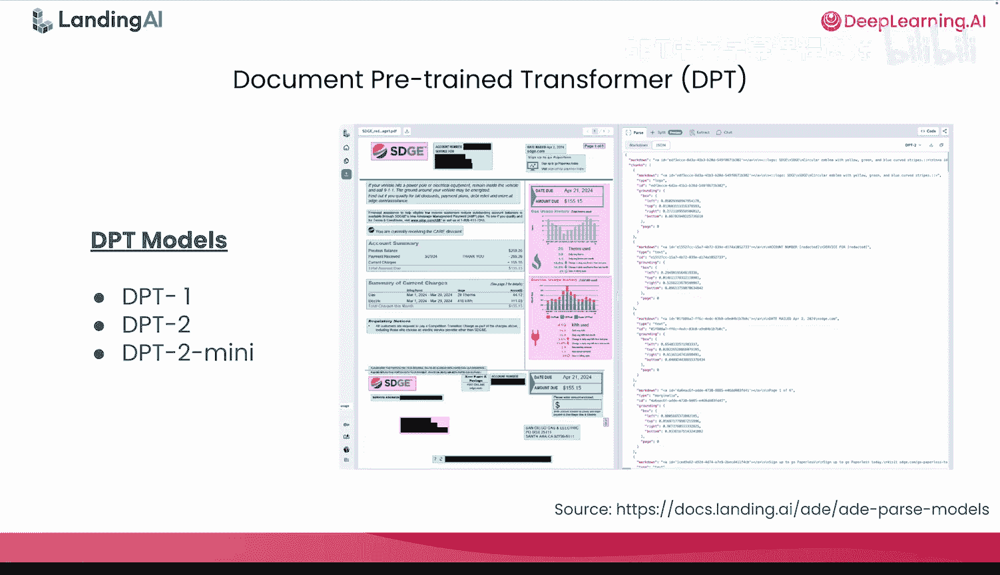

## 如何使用ADE

这自然引出了下一个问题：我该如何使用它？

下图是ADE可视化操作平台的截图。ADE提供**解析**、**拆分**和**提取**三个独立功能，你可以在开发文档处理流程时灵活组合它们。

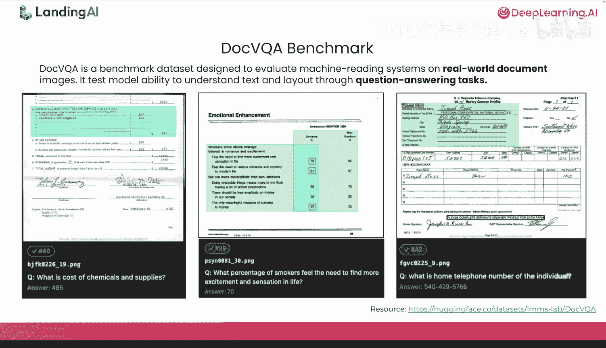

开发选项包括：
*   用于拖放操作的可视化操作平台。
*   REST API。
*   Python和Typescript库。

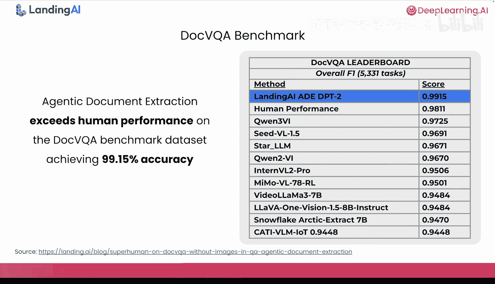

在接下来的实验中，你将只使用Python库以及`parse`和`extract`这两个API。请注意，`split` API也可用于拆分大型PDF，`parse_jobs` API则适用于处理超大型文档（例如数百到数千页）。

若要在课程之外使用ADE，你需要自己的API密钥。你可以访问 `vdo.landing.ai` 生成一个免费密钥并获得一些初始免费额度。

现在，又到了实验时间。请和我一起完成三个动手练习。

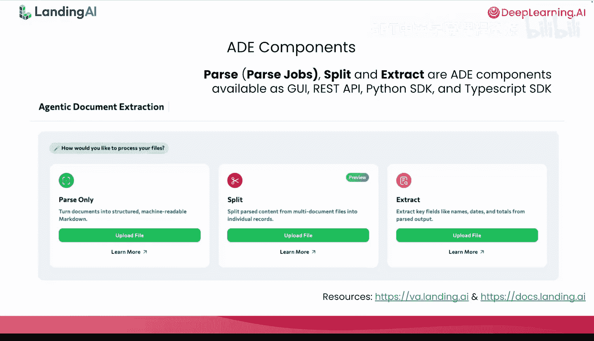

## 总结

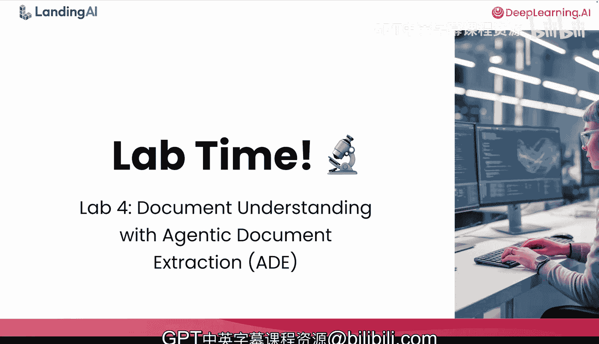

本节课中我们一起学习了Landing AI的智能体文档提取框架。我们了解了ADE如何通过一个单一的API简化复杂的文档处理任务，其核心是视觉优先、数据驱动和智能体化的架构。我们还看到了它在DocVQA基准测试上的卓越表现，并介绍了开始使用它的基本方法。接下来，请在实验环节亲自体验ADE的强大功能。