# 010：基于智能体化文档抽取的文档理解（第二部分）

## 概述

在本节课程中，我们将继续完成Lab-4的练习。我们将构建一个模拟银行审核贷款申请的完整文档处理流程。该流程将处理用户上传的多种未知类型的财务文件，自动识别文件类别，提取关键信息，并进行数据验证。我们将主要使用Landing AI的ADE（Agentic Document Extraction）API来实现这些功能。

---

## 准备工作

上一节我们介绍了实验的基本设置，本节中我们来看看具体的实现步骤。首先，我们需要确保环境已正确配置。

以下代码导入了必要的库并设置了API密钥：

```python
import pandas as pd
import os
from landingai.vision import DocumentExtraction
from landingai.common import APIKey, ClientInfo
import landingai

# 从环境变量加载API密钥
api_key = os.environ.get("LANDINGAI_API_KEY")
landingai.configure(api_key=api_key)
```

我们还需要导入一些辅助函数，这些函数可以在单独的帮助文件中查看。

---

## 实验三：构建贷款申请文档处理流程

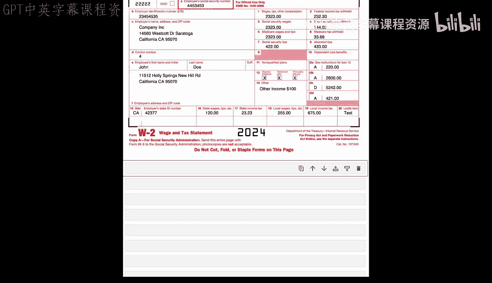

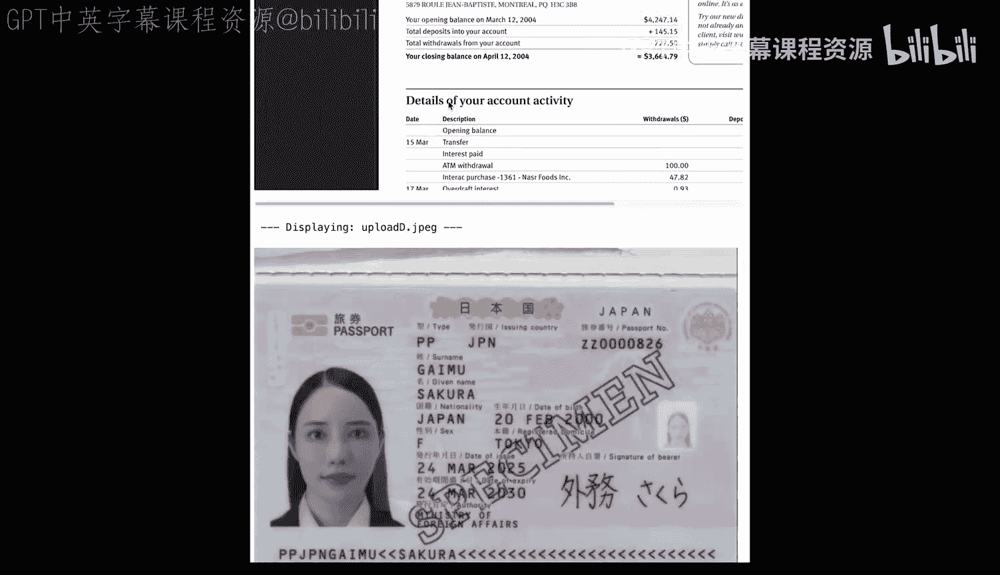

在实验三中，你将扮演一名银行职员，负责审核贷款申请。你需要开发一个相当真实的完整文档处理流程。

申请贷款时，申请人通常需要上传各种财务文件，例如：
*   收入证明（如工资单）
*   显示上一年总收入的税表
*   显示资产价值的银行对账单或投资对账单
*   政府签发的身份证明文件

银行面临的挑战是，收到的文件可能有各种奇怪的名称（例如 `upload_a.pdf`, `image_4.jpg`）。银行需要理解上传的文件是什么，然后从中提取出他们真正感兴趣的关键信息（例如总资产价值）。

这就是我们要构建的处理流程：用户上传多个未知类型的混合文档，我们将解析所有文档，识别它们是什么，从中提取关键信息对，然后运行一些验证。我们将使用ADE作为主要的API来完成所有这些工作。

---

## 预览上传的文档

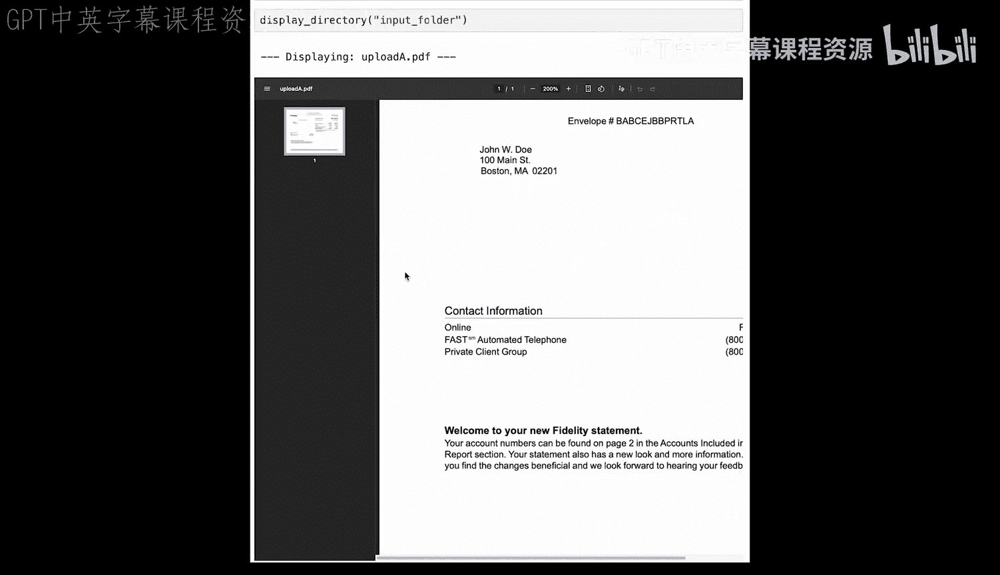

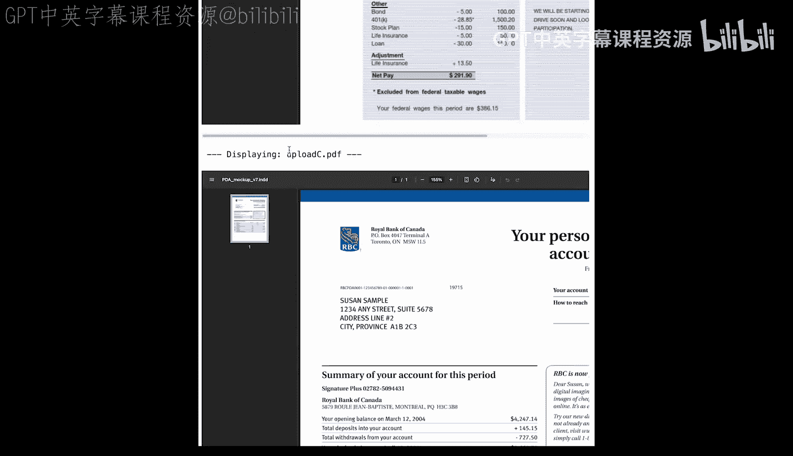

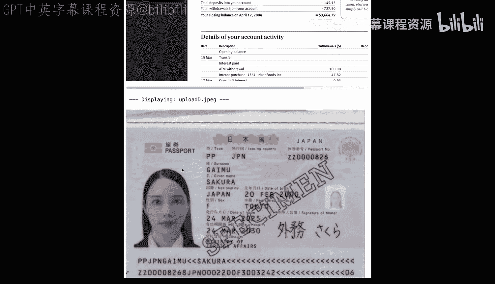

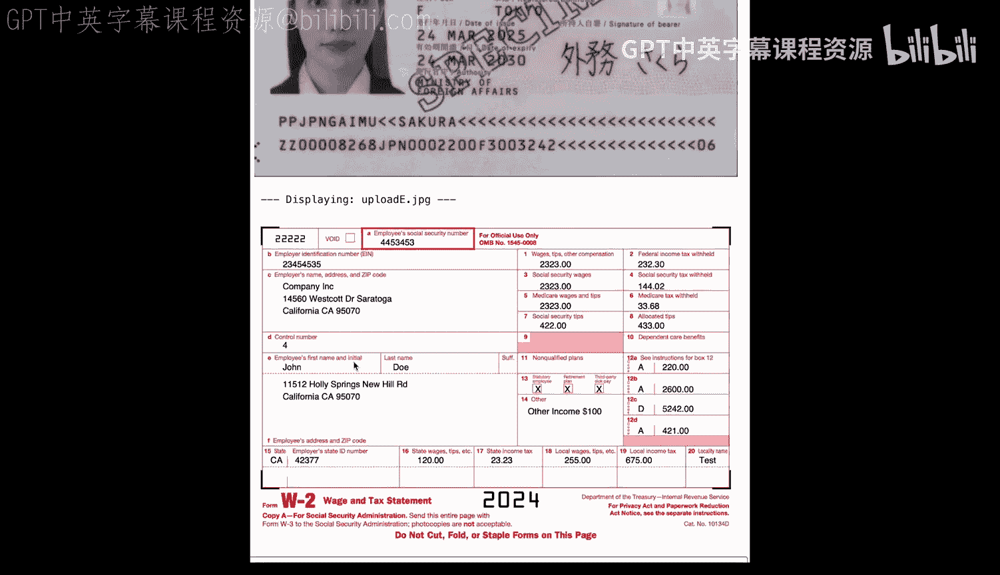

首先，我们预览一下提供的文档。需要提醒的是，这些文档来自不同的人，并非一个完整的贷款申请套件，因为我们使用的是来自互联网的匿名样本文档。

我们创建一个函数来显示特定目录中的所有文件：

```python
def display_documents_in_directory(directory_path):
    # 函数实现：列出并显示目录中的所有文档
    ...
```

执行后，我们可以看到以下文档：
*   `upload_a.pdf`：看起来是一份富达投资对账单。
*   `upload_b.pdf`：看起来是一份工资单。
*   `upload_c.pdf`：乍一看像是一份银行对账单。
*   `upload_d.pdf`：看起来是一本护照。
*   `upload_e.pdf`：看起来是一份美国W-2税表。

当然，人类可以瞬间识别所有这些文档，但文档处理流程如何以同样的方式理解它们呢？回想一下，所有文档都是以`upload_a`这样的名称传入的，因此我们需要对它们进行分类。

---

## 使用Pydantic模式进行文档分类

为了对文档进行分类，我们将使用ADE的`extract` API，并配以一个Pydantic JSON模式。

这个模式与练习一中的模式略有不同，因为我们使用的是Pydantic而不是纯JSON。ADE接受这两种格式作为输入。

以下代码定义了一个`DocumentType`类，枚举了我们期望的文档类型，并为每种类型提供了丰富的描述：

```python
from pydantic import BaseModel, Field
from typing import Literal

class DocumentType(BaseModel):
    """定义可能的文档类型"""
    doc_type: Literal["paystub", "investment_statement", "bank_statement", "id", "w2"] = Field(
        ...,
        description=(
            "The type of financial document. "
            "`paystub`: A payroll statement showing income. "
            "`investment_statement`: A statement from a brokerage like Fidelity or Vanguard. "
            "`bank_statement`: A statement from a bank. "
            "`id`: A government-issued ID like a passport or driver's license. "
            "`w2`: A US tax form W-2."
        )
    )
```

接下来，我们继续使用Pydantic来定义文档提取模式。我们想知道从工资单、投资对账单、银行对账单等文件中提取什么信息。

在这个单元格中，我们有五个不同的文档提取Pydantic模式。让我们看其中一两个：

*   **身份证明文件模式 (`IdSchema`)**：我们期望某种政府签发的身份证明，如驾照或护照。它应包含个人的全名、签发州或国家、签发日期和某种唯一标识符。
*   **W-2税表模式 (`W2Schema`)**：W-2是美国每年年底签发的税表。我们期望雇员姓名、签发年份以及`box1_wages`（指该人在该年的总收入）。这里我们有一个整数和一个浮点数。

你可以在自己的时间查看其他模式。

在单元格底部，请注意我们将模式映射到一个简写名称，以便后续使用。此单元格使用Landing AI提供的函数将Pydantic模式转换为JSON。请记住，ADE接受JSON和Pydantic来定义你的模式，但在底层，我们会先将Pydantic转换为JSON，然后再传递给`extract` API。

---

## 执行文档解析与分类

现在我们已经准备好所有组件来进行解析和分类。在执行之前，我们先看一下代码。

我们将处理输入文件夹中的所有文档，将它们发送到`parse` API，使用最新的`gpt-4`模型。这里有一个新参数：我们实际上要求为每个单独的页面返回Markdown响应，而不是整个文档。例如，如果投资对账单有11页，我们将得到11个不同的Markdown。这样做的原因是，为了识别文档，我们通常只需要第一页。因此，在识别步骤中，我们将只使用第一页的Markdown。

在第二步中，我们调用`extract` API，使用之前定义的`doc_type` JSON，并发送第一页的Markdown。

我编写的代码实际上是按顺序发送每个文档，但有很多选项可以并行化此工作负载，从而使整个过程更快。

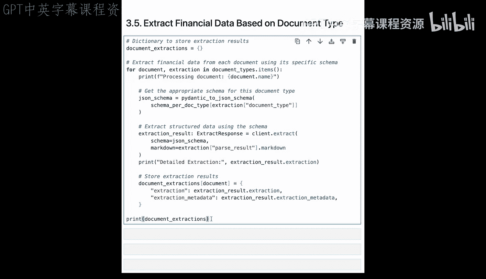

让我们现在开始执行。结果显示：
*   `upload_c` 被识别为银行对账单。
*   `upload_a` 是投资对账单。
*   `upload_e` 是W-2税表。
*   `upload_d` 是身份证明文件。
*   `upload_b` 是工资单。

非常好！至此，我们有了所有五个文档对应的Markdown，并且知道它们的类型。接下来，我们准备将正确的模式应用于正确类型的文档，并提取那些关键信息对。

---

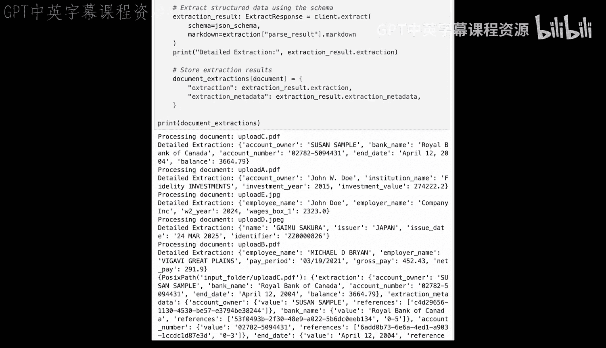

## 提取关键信息对

在执行此单元格之前，我们先看一下代码。首先，我们创建一个字典来存储提取结果。然后，对于每个文档，我们希望根据其文档类型查找适当的模式。接着，我们将正确的模式与Markdown一起发送到`extract` API。最后，我们将存储返回的所有结果，重点关注提取内容本身和提取元数据（我们将在其中找到视觉定位信息）。

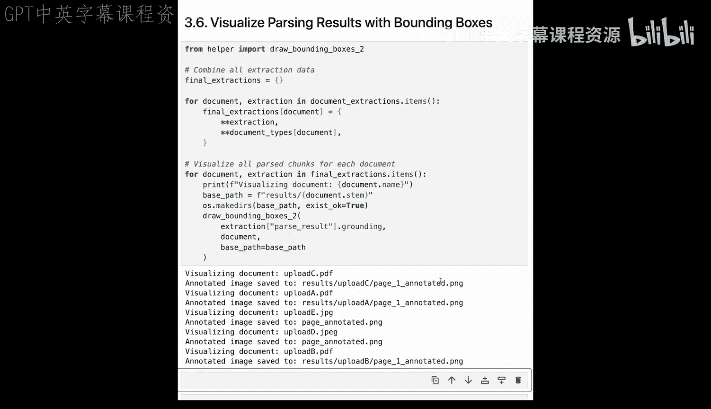

现在开始执行。在所有输出中，回想一下：
*   `upload_d` 是身份证明文件，是一本由日本签发的护照，签发日期为2025年3月24日。
*   `upload_e` 是W-2税表，属于John Doe，他在2024年赚了2323美元。

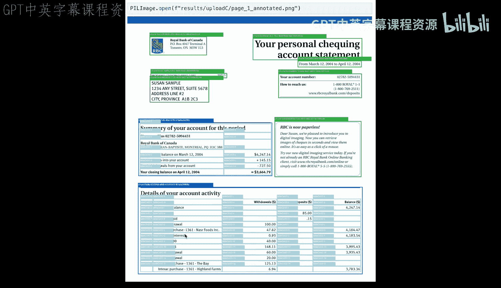

这一切看起来都不错。输出的顶部是提取内容本身，下面开始显示提取元数据，其中有这些长的`chunk_id`。我们在第一课中介绍过如何将`chunk_id`连接回原始文档。

---

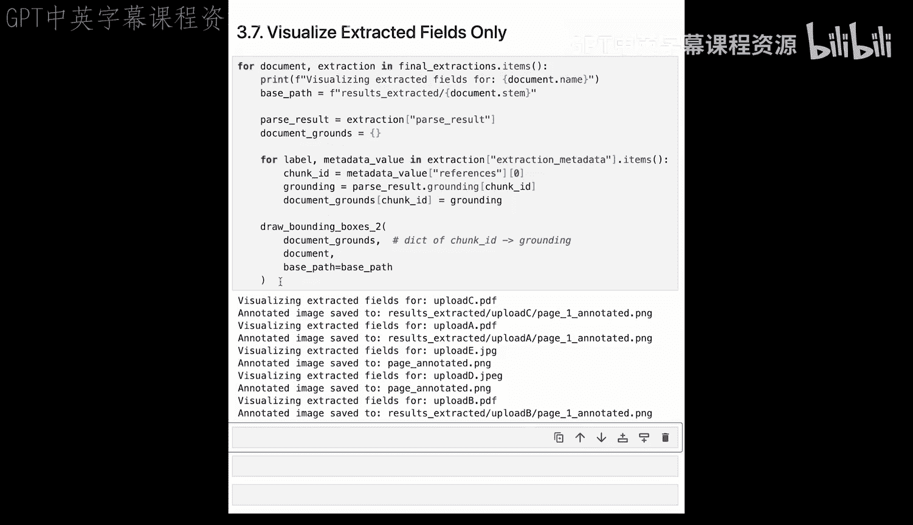

## 可视化解析结果

让我们用叠加的边界框来可视化这些解析结果。这与我们在第一课中所做的非常相似。这里我们将把五个文档中的每一个都保存为带注释的图像，然后查看这些图像。

例如，这是带注释的银行对账单（`upload_c`）。你可以看到几个文本块、两个主要的表格块以及所有单元格级别的定位。

再看一个，这是W-2税表。你可以看到年份非常醒目，工资（2323美元）在`box1`这里。

如果你正在构建一个文档处理系统（例如带有人类在环的系统），将人类的视线吸引到发现提取值的特定字段会非常有帮助。在这里，我们再次遍历所有文档，但只注释模式中出现的特定字段。

让我们看看`upload_c`（应该是银行对账单）。确实，现在我的注意力被吸引到了姓名出现的位置、总余额出现的位置以及对账单日期出现的位置。

---

## 创建申请摘要

回到我们作为接收所有这些贷款文件的人的场景，我们将希望创建某种最终摘要，代表该人提供的所有信息。

在这段代码中，我们将遍历之前所有的文档提取结果，并创建一个包含五列的表格作为Pandas DataFrame。

这是一个对申请人所提供信息的相当不错的摘要。我们有对应申请人的文件夹、文档名称、分类类型、请求的字段以及（屏幕外的）字段值。这绝对比单独打开所有这些文档、用眼睛寻找信息然后将其输入某种用户界面节省大量时间。

---

## 执行数据验证

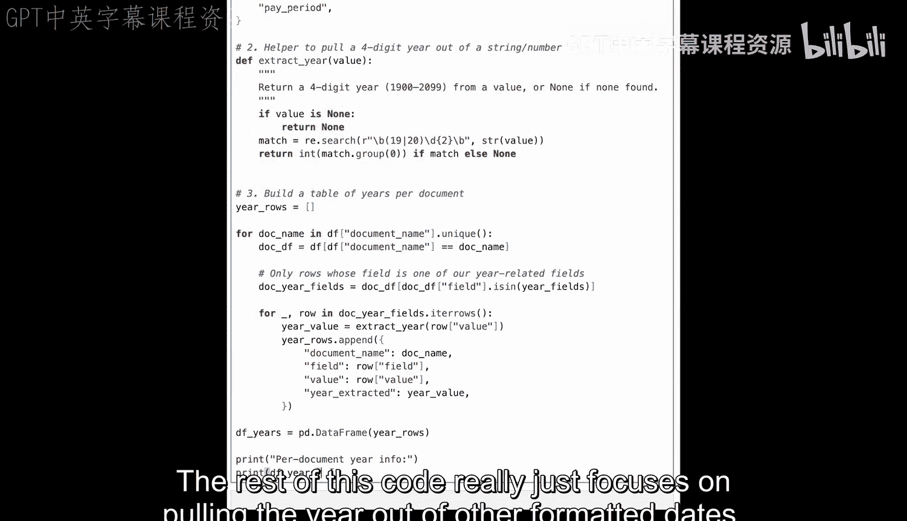

正如我们之前提到的，这些文件上的姓名并不匹配，但这实际上是接收所有这些文件的人的关键职责。他们需要检查这些资产是否确实属于申请贷款的人，或者身份证明是否确实属于申请贷款的人，而不是上传了你邻居的文件。

以下是一个很好的验证示例，用于检查所有这些文档中的姓名字段是否匹配，并在不匹配时快速发现。你可以想象现在向申请人发送一个触发器或提醒电子邮件，说“这些文件不匹配，请检查你的工作”。

这是另一个验证示例。申请贷款时，你需要提供近期文件，因此检查所有这些文件是否来自同一年可能是合适的。其余代码主要专注于从其他格式的日期中提取年份。同样，由于它们是演示文档，这里混入了一些旧文件。它们肯定不是都来自当前年份。

---

## 计算总资产

你可能已经掌握了要领，但为了完整起见，让我们将所有银行余额和投资余额相加，以了解此人的总资产。在我们的示例中，只有一份银行对账单和一份投资对账单。但想象一下，如果该人的资产分散在各处，并且上传了10份不同的银行对账单，这至少可以将所有资产汇总成一个最终数字。

---

## 总结

本节课中我们一起学习了实验三的完整流程。在这个练习中，你完成了以下任务：
1.  使用ADE API进行身份验证。
2.  对混合的财务文档进行分类。
3.  解析这些文档并提取其布局和内容。
4.  定义对应于不同文档类型的自定义Pydantic模式。
5.  提取带有视觉定位的结构化数据。
6.  可视化这些结果。
7.  最后，定义自定义验证逻辑以发现文档间的差异和错误。

这也标志着第四课和实验四的结束。现在，你已经有了使用单一智能体API的实践经验，该API无需用户的进一步指令即可理解你的文档。Landing AI的ADE真正让你能够专注于你的用例，而不是低级别的文档解析任务。其固有的智能体设计，基于视觉优先的模型架构，使其能够理解任何布局、任何语言的任何输入。

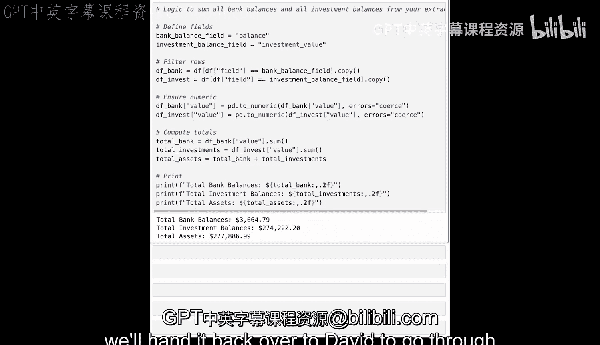

如果你想自己尝试更多，请获取你自己的API密钥。接下来在第五课中，我们将把它交还给David，讲解用于RAG的智能体化文档提取。