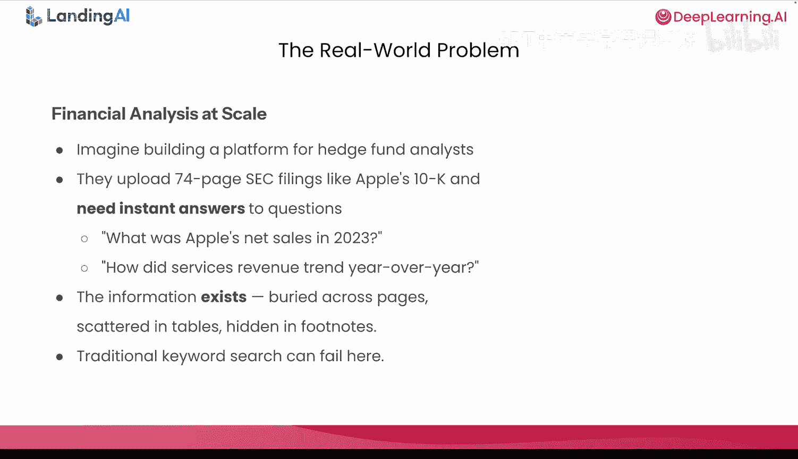
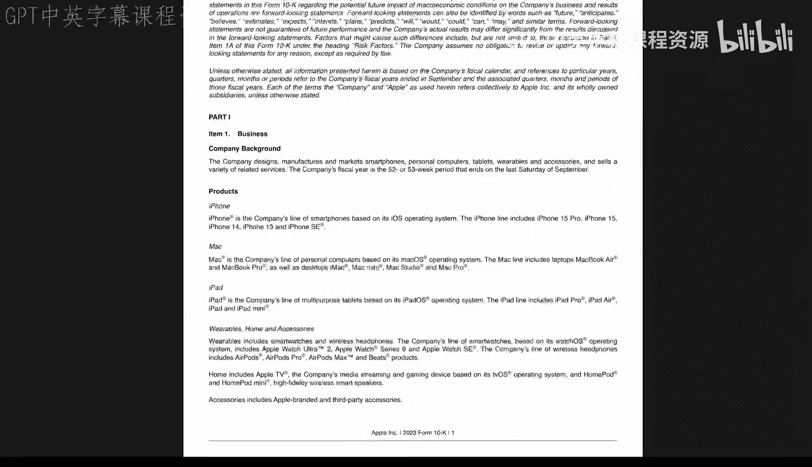
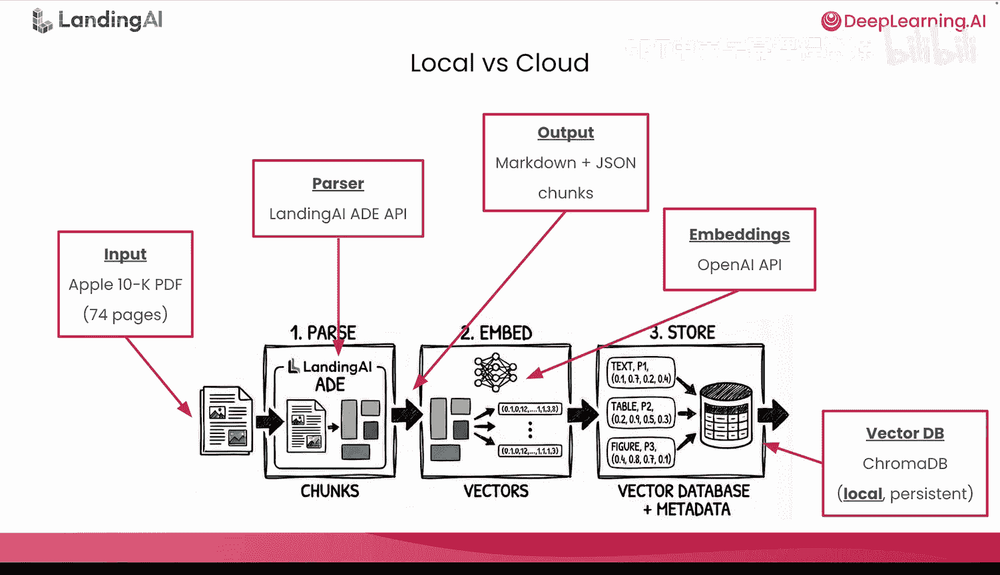
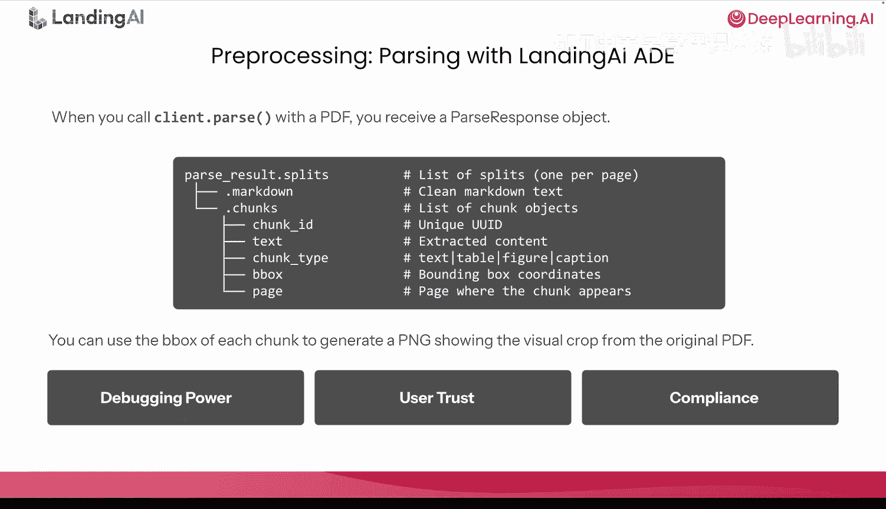
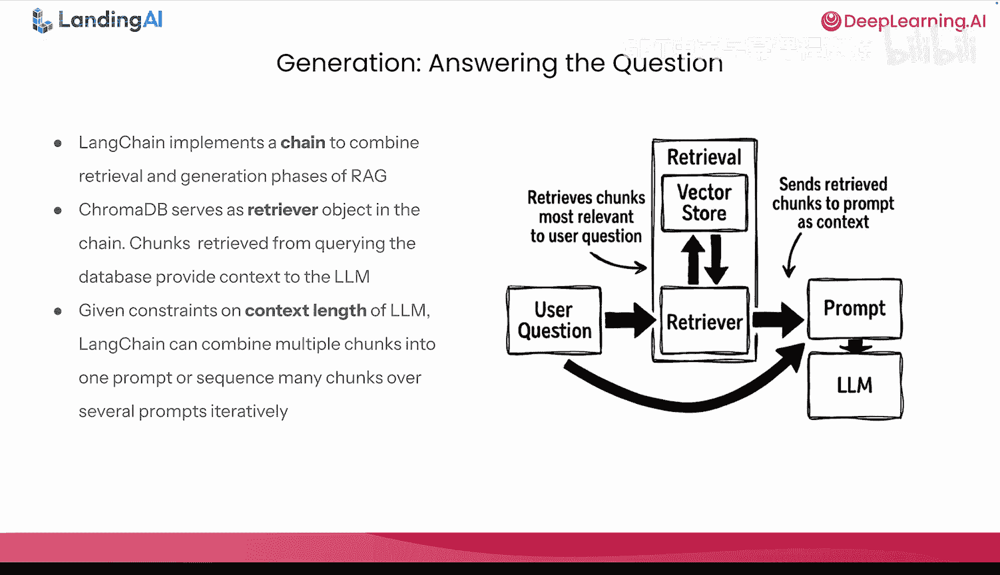
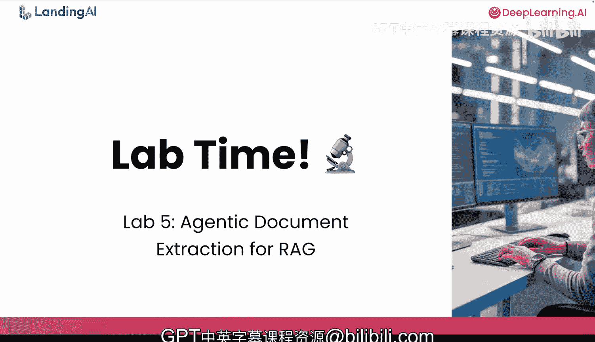

# 011：基于智能体化文档抽取构建RAG应用

在本节课中，我们将学习如何利用解析后的文档数据，构建一个检索增强生成（RAG）应用来查询PDF文件。我们将首先使用智能体化文档抽取（ADE）解析文档，然后将解析后的文本块存储到向量数据库中，最后通过检索这些信息来回答关于文档的问题。

## 概述

在之前的课程中，我们学习了文档AI的相关知识，包括OCR的局限性、如何有效利用文档布局、阅读顺序的重要性，以及Landing AI的智能体化文档抽取（ADE）如何通过统一的工作流处理文档的复杂性，输出干净、可追溯的结果。

现在，一个显而易见的问题是：我们如何处理所有这些结构化数据？一个可能的答案是构建真实的系统。具体来说，我们将构建一个检索增强生成（RAG）管道，将一个74页的财务申报文件转化为一个可查询的知识库。这是当今所有行业和领域中，驱动现代文档问答系统的通用架构模式。

## 真实场景：为对冲基金构建内部平台

想象你正在为一个对冲基金构建一个内部平台。分析师们需要处理像这份苹果公司10-K报表这样的SEC文件。这些文件包含了上市公司必须向证券交易委员会披露的详细财务和业务信息。

分析师希望将文件上传到平台，并提出诸如“苹果公司2023年的净销售额是多少？”、“最大的业务风险是什么？”、“服务收入同比趋势如何？”等问题。他们需要的信息就在文档中，可能在28页的表格里，可能在45页的脚注中，也可能分散在12、15、18页的三个不同风险披露部分。

## 传统关键词搜索为何失效

首先，存在语义不匹配问题。如果分析师搜索“revenue”，但文档中使用了“net sales”这个短语，传统搜索将一无所获。概念相同，但词语不完全匹配。

其次，存在上下文盲区。单词“revenue”可能在文档中出现75次。传统关键词搜索无法在没有额外指导的情况下，判断哪个提及与分析师的提问相关，这无法扩展。

第三，信息是碎片化的。要完整回答“风险是什么？”这个问题，需要综合多个页面的内容。传统搜索无法做到这一点。你需要语义理解，也需要上下文感知检索。这意味着你需要一个能理解用户意图，而不仅仅是匹配字符串的系统。

这就是RAG的用武之地，也是你将在本课实验中构建的内容。

## 什么是RAG及其重要性

检索增强生成（RAG）是当今几乎所有现代文档问答系统背后的架构。其管道包含三个核心阶段的六个步骤。

**第一阶段是预处理阶段**，包括解析、嵌入和存储。
*   **解析**：将原始文档解析并提取为干净的结构化文本。这正是ADE发挥作用的地方。干净的输入至关重要，垃圾进，垃圾出。如果解析结果充满OCR错误和混乱的表格，下游所有环节都会受到影响。
*   **嵌入**：将解析后的内容转换为嵌入向量，这些向量能捕捉语义信息。
*   **存储**：将这些向量存储在针对相似性搜索优化的向量数据库中。我们将使用ChromaDB，这是一个非常适合开发和学习的本地开源选项。

**第二阶段是检索阶段**，包括查询和检索。
*   **查询**：将用户的问题转换为嵌入向量。
*   **检索**：在数据库中搜索，通过相似性度量找到排名最高的向量，即与查询最相似的向量。

**第三阶段是生成阶段**。
将检索到的内容作为上下文提供给语言模型，以生成自然语言答案，并提供相应的检索内容用于追溯和验证。这对于金融服务、医疗保健和生命科学等受严格监管的组织至关重要。

这里有一个关键的见解，它联系了你所学的所有内容：**ADE在第一阶段提供的干净、可追溯的输出，是整个管道得以实现的基础**。如果你的解析不可靠，向系统输入的是扭曲的OCR输出或缺失了包含视觉叙事的表格、图表，那么任何巧妙的嵌入、提示工程或复杂的检索都无法挽救你。

在本课实验结束时，你将理解ADE的输出如何直接流入RAG系统，使用ChromaDB和OpenAI模型生成的嵌入构建一个本地RAG管道，在真实文档上运行语义搜索（而非关键词搜索），使用追溯图像可视化验证每个结果，并为在第6课中将此系统扩展和部署到AWS做好充分准备。

## 为何先在本地构建

你可能会想，为什么我们要在本地构建，而不是直接跳到AWS构建真正的生产系统？这是一个很好的问题，原因有三点。

**第一，迭代更快**。你可以更改代码，在两秒内重新运行一个单元格并查看结果，无需部署开销。在学习时，速度很重要。
**第二，成本更低**。本地实验在初始API调用后基本上是免费的。你不会在学习和调试时消耗云计算积分。
**第三，学习更清晰**。你可以剥离云计算的复杂性，专注于RAG机制和数据流本身。

在第6课中，我们将采用完全相同的逻辑，并在AWS上将其产品化。数据流在云规模上相同，但你将在本实验中打下基础。

具体来说，以下是实验中你将使用的内容：
*   **输入**：上一财年的苹果公司10-K报表，一份74页的密集财务报告PDF，具有真实世界的复杂性。
*   **解析器**：来自Landing AI的ADE API。输出已提供给你，因此你无需执行解析步骤。这个过程在之前与Andrea的课程中已详细介绍。
*   **输出**：Markdown文本加上带有元数据的JSON块，是干净的结构化数据，已准备好进行嵌入。
*   **嵌入**：将使用OpenAI的`text-embedding-3-small`模型生成。为了方便，我们使用其API，但你可以将其替换为任何开源替代方案。
*   **向量数据库**：在实验环境中本地运行并具有持久存储的ChromaDB。

## 预处理第一步：使用ADE解析

当你使用ADE解析文档时，将得到一个解析响应对象。让我们分解其结构。

在顶层，你有`parse_results.splits`，这是一个列表，当你传递`split=page`参数时，每个页面对应一个分割项。

每个分割项有两个关键属性：
1.  **`.markdown`**：这是从该页面提取的干净Markdown文本。表格变成了带有竖线和短横线的Markdown表格，标题变成了带有井号的Markdown标题。这是人类可读的结构化文本，而不是一堵未经格式化的OCR文字墙。它也适合下游LLM用例。
2.  **`.chunks`**：这是一个`chunk`对象的列表。每个块是页面上的一个内容片段，可以是一个段落、一个表格、一个图形或一个标题。

对于每个块，你还有元数据：
*   `chunk_id`：唯一标识此内容片段的UUID。
*   `text`：提取的内容本身。
*   `chunk_type`：告诉你这是什么类型的内容（文本、表格、图形、证明、徽标等）。
*   `bbox`：边界框坐标，精确显示此块在页面上的位置。
*   `page`：块出现的页码。

重要的是，对于每个块，你都可以生成一个**追溯图像**，即原始PDF的视觉裁剪。这使你在构建管道时能够进行调试，并可以直观地验证提取是否正确。无需猜测。

当你的系统告诉用户“净销售额为3830亿美元”时，你可以向他们展示该信息来自的确切表格。他们可以亲眼看到，这为你的系统建立了巨大的信任。

在金融、医疗和法律等受监管的行业，你需要证明信息的来源。追溯图像为你提供了审计追踪，避免了幻觉。

由于你已经看过如何与Andrea一起调用解析API，我们将在实验中跳过这一步。你将直接获得这些ADE输出。

## 预处理第二步：嵌入ADE块的文本

你将把每个块的文本转换为一个大小为1536的嵌入向量。每个嵌入向量将从数学上编码解析文本的含义，使得语义相似的文本获得相似的向量。

因此，当你询问关于文档的问题时，你可以检索那些嵌入与问题嵌入相似的块。这称为**块级嵌入**。

另一种选择是进行**页面级嵌入**，即嵌入整个页面的文本。让我们理解实践中的权衡：
*   **页面级**：实现简单，嵌入和数据库构建更快，对于宽泛的问题和较短的文档可能有效。
*   **块级**：提供更精确的检索（精确的表格/段落匹配），上下文更细粒度，对于复杂文档的聚焦问题更佳。借助ADE，我们甚至可以为复杂表格提供单元格级的追溯。

在实验中，你将使用块级方法，但在生产中，你可以根据用例进行调整。

## 预处理第三步：将向量存储到向量数据库

我们使用ChromaDB，因为它非常适合学习和原型设计。
*   **一行安装和持久存储**：ChromaDB自动将向量保存到你的磁盘。如果你关闭笔记本明天再回来，你的数据仍然存在，无需重新嵌入所有内容。这对于高效迭代至关重要。
*   **快速相似性搜索**：ChromaDB底层使用HNSW索引（分层可导航小世界图），这是一种用于近似最近邻搜索的先进算法，即使有数千个向量，核心检索也能在毫秒内完成。
*   **本地和生产环境API相同**：ChromaDB有客户端-服务器模式。你在本地使用的相同API在生产中与远程ChromaDB服务器一起工作。这在扩展时无需改变思维模式，非常强大。
*   **丰富的元数据支持**：对于每个块，你可以存储有助于过滤的元数据，允许你根据其元数据中的特定条件检索项目。

在实验中，你将把块类型、页码和边界框坐标作为每个块的元数据进行存储。当你向ChromaDB添加一个块时，需要指定一个ID，你将使用从ADE提供的确切`chunk_id`。

请注意，在第6课中，我们将用AWS Bedrock知识库替换它，但概念保持相同。

## 构建检索函数

设置好向量数据库后，你将编写一个在检索步骤中使用的函数。让我们逐步了解当你针对“苹果公司2023年的净销售额是多少？”这个问题运行它时会发生什么。

1.  **嵌入问题**：问题将被转换为嵌入向量，使用与预处理阶段相同的嵌入模型和向量大小。
2.  **搜索**：你将把查询向量传递给ChromaDB，并说“找到与这个查询向量最接近的顶部块”。默认情况下，`k=3`，所以我们想要三个最相似的块。你可以根据用例调整此参数。
3.  **评分**：ChromaDB还会返回距离度量。距离度量可以转换为相似度：`相似度 = 1 - 距离`。相似度越高意味着匹配越好。这是一个你可以调整的参数，以进一步微调你的RAG引擎。
4.  **过滤**：然后，你将根据相似度阈值移除结果。之后，你可以进行可视化。
5.  **显示**：最后，你将显示返回结果的块文本、ID、分数、页码和类型。你还将使用边界框的坐标来显示追溯图像。

## 追溯图像：建立信任的关键

这是ADE我最喜欢的功能之一，也是Landing AI区别于普通文档AI系统的地方。对于ADE提取的每个块，你都可以生成一个追溯图像。这是一个PNG文件，显示了原始PDF中该特定块的视觉裁剪。

让我告诉你为什么这在实践中如此关键。
*   **建立巨大信任**：用户不只是盲目接受答案或被LLM幻觉愚弄。他们正在验证答案。当他们验证了几个答案并看到它们正确时，他们就会信任系统处理未来的查询。这确保了系统的采用。
*   **提供审计追踪**：追溯图像为你提供了纸质记录，并有机会引入人工干预以降低风险。想象一下，一位财务分析师使用你的系统提取季度报告的数据。六个月后，如果审计员问“这个数字是从哪里来的？”，他们可以说“它来自Q3 10-K文件的第28页，表3，第5行，第6列。这是视觉证明。”这非常强大。

## 整合到完整的RAG管道

最后，你将把所学内容整合到一个完整的RAG管道中。为此，你将使用LangChain进行编排，利用一个预构建的链来结合我们RAG管道的检索和生成阶段。

你将从ChromaDB数据库创建一个检索器对象。检索器是LangChain的组件，用于获取信息并将其作为附加上下文插入提示中。有时，检索器可能会提供太多块，考虑到LLM有限的上下文窗口，LangChain可以将多个块组合到单个提示中，或者迭代地在多个提示中序列化许多块。

## 总结

在本节课中，我们一起学习了如何构建一个基于智能体化文档抽取（ADE）的检索增强生成（RAG）应用。我们从理解传统关键词搜索的局限性开始，介绍了RAG管道的三个核心阶段：预处理、检索和生成。我们详细探讨了使用ADE进行解析、将文本块嵌入为向量、使用ChromaDB进行存储和检索的步骤，并重点强调了ADE的追溯图像功能在建立信任和提供审计追踪方面的重要性。最后，我们概述了如何利用LangChain将所有这些组件整合成一个完整的、可查询文档的RAG系统。通过本课的学习，你已经为构建和扩展实用的文档智能应用打下了坚实的基础。