# 013：在AWS上构建基于智能体化文档抽取的RAG管道 🚀

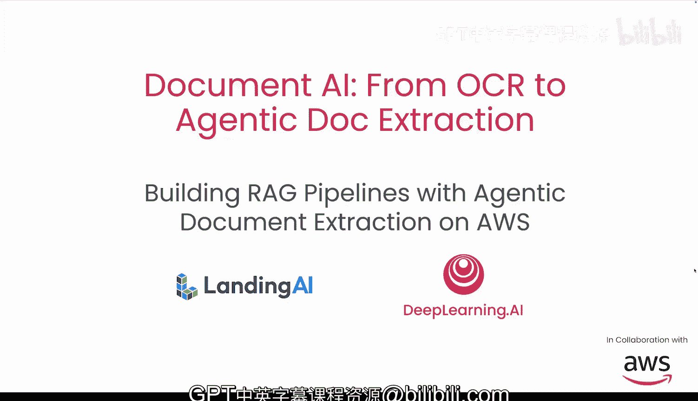

在本节课中，我们将学习如何将之前学到的文档处理工具和技术，在AWS云平台上付诸实践。我们将实现一个事件驱动的管道，自动触发文档解析，并将处理后的文档加载到知识库中，最终构建一个能够回答问题的智能体化RAG应用。

## 概述

上一节我们介绍了文档处理的核心工具。本节中，我们来看看如何将这些工具部署到AWS云上，构建一个生产就绪、可扩展的自动化系统。我们将使用无服务器架构和事件驱动设计，实现从文档上传到智能问答的完整流程。

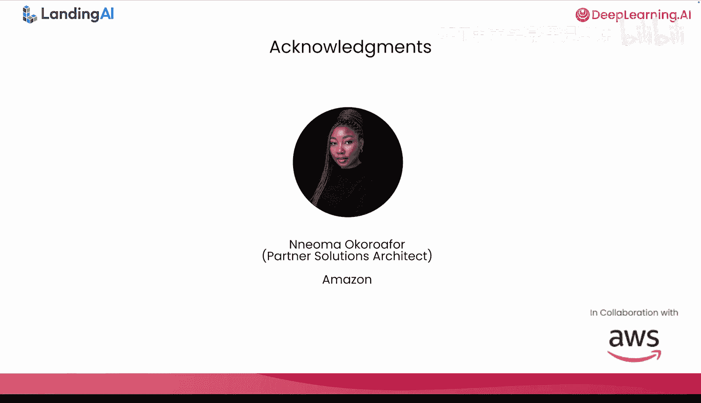

## 从本地到云端：架构演进

在之前的课程中，RAG管道的前期阶段是在本地环境中完成的。以下是本地流程：
*   原始文档存储在本地。
*   文档被传递给本地运行的ADdeE解析器，使用本地计算和内存资源。
*   解析后的输出被传递给嵌入器，我们使用了OpenAI的嵌入模型。
*   嵌入向量最终被存入本地的ChromaDB数据库。

现在，我们将把所有本地组件替换为AWS服务。这将使管道具备云端的生产就绪能力，并能轻松应对海量文档的扩展需求。

以下是云端架构的对应变化：
*   **存储**：将文档上传至S3桶（云对象存储），替代本地存储。
*   **计算**：使用Lambda函数运行解析逻辑，替代本地机器资源。Lambda提供了云端无服务器的隔离计算环境，并会在新文档上传到S3时自动触发。
*   **嵌入与向量数据库**：使用Amazon Bedrock服务，它提供了无服务器的嵌入模型和知识库功能。

对于用户查询部分，之前我们使用LangChain定义了一个从向量数据库提取信息的检索对象。在AWS上，我们将使用Strands Agent（一个原生支持AWS的开源生产级智能体框架）来构建智能体，并为其配备连接到知识库的检索工具。我们还将使用Amazon Bedrock为智能体提供LLM访问权限，以及Amazon Bedrock Agent Core Memory，以便创建能够记住用户交互上下文的智能体。

## 核心架构与概念解析

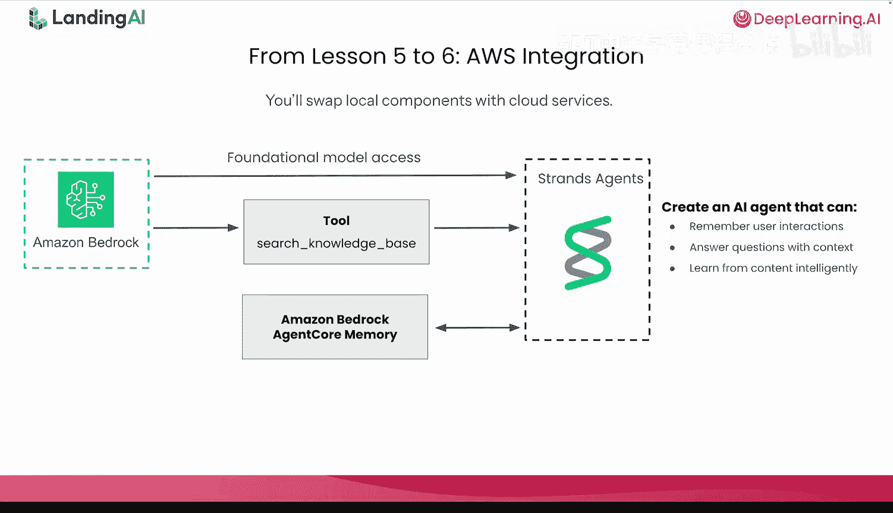

### 架构总览 🏗️

我们的架构包含基于AI的组件（如Landing AI的ADdeE解析器和Strands Agent框架）以及以下主要的AWS组件：Amazon S3、AWS Lambda和Amazon Bedrock。

之前提到AWS Lambda和Amazon Bedrock提供无服务器服务。无服务器意味着两件事：
1.  你无需配置或管理任何服务器。AWS负责基础设施和安全更新。
2.  你只需为代码实际运行的时间付费，空闲时间不计费。

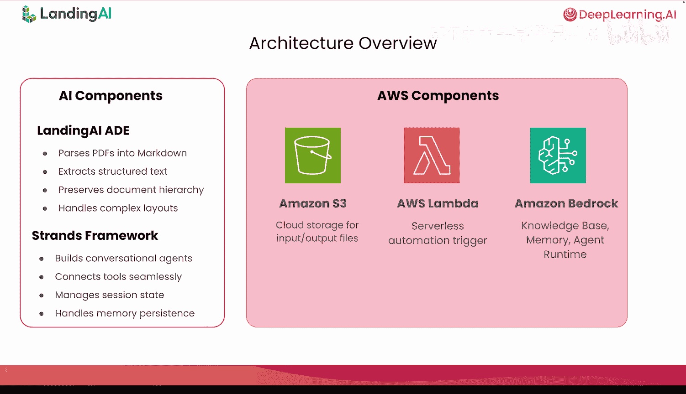

这也意味着AWS会根据需求自动扩展你的应用，无论是有10个并发用户还是10000个。由于无需配置基础设施，你可以快速原型化和部署新功能。

### 事件驱动架构 ⚡

我们架构的第二个特点是包含事件触发组件。当新文档上传到S3时，ADdeE解析器会自动运行。这是如何实现的呢？

这被称为**事件驱动架构**，一种现代设计模式，其中系统是解耦的，并通过发送和接收事件（本质上是通知某事已发生）进行通信。

让我将其分解为三个步骤：
1.  **事件生产者**：这些是像S3桶这样的组件，当相关操作发生时发出事件。在你的案例中，当你上传文件到S3时，它会发出一个“文件已上传”事件。
2.  **事件通道或代理**：像Amazon EventBridge这样的服务，将这些事件路由给感兴趣的各方。可以把它看作一个通知系统，知道谁需要被告知什么。AWS上还有其他消息服务，如用于发布/订阅模式的Amazon SNS和用于队列的Amazon SQS，它们支持更简单的模式。EventBridge更适合具有更复杂路由的事件驱动架构。
3.  **事件消费者**：像AWS Lambda这样的服务，订阅并对特定事件做出反应。你的包含ADdeE解析器的Lambda函数正在监听那个“文件已上传”事件，并在事件到达时自动开始处理。

一个有用的类比是：与其不断“拉取”（例如，每隔几秒检查S3是否有新文件），事件驱动的方法更像是“推送”通知。S3在有趣事件发生的瞬间通知Lambda，Lambda立即做出反应。

因此，当你将文档上传到S3时，S3创建一个事件，EventBridge路由它，你的Lambda函数自动运行ADdeE解析器。无需手动触发。

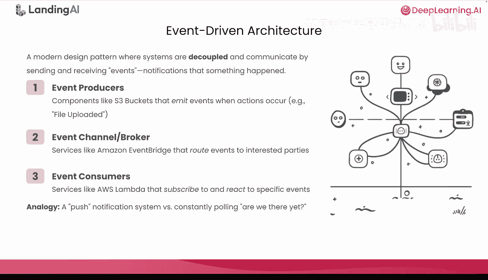

## 深入AWS核心组件 🔧

现在，让我们分解系统的每个组件，了解其具体角色。我们有三个主要的AWS组件：Amazon S3、AWS Lambda和Amazon Bedrock。让我们深入了解每一个。

### 1. Amazon S3 (简单存储服务)

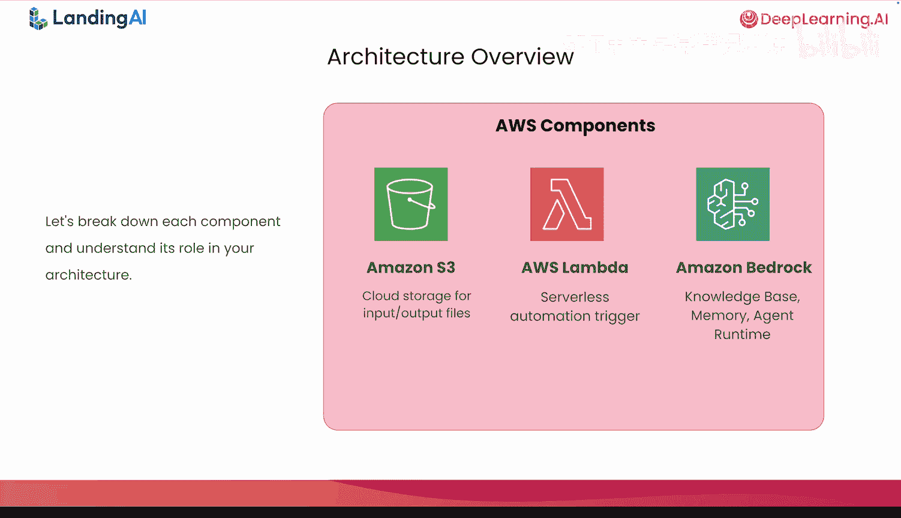

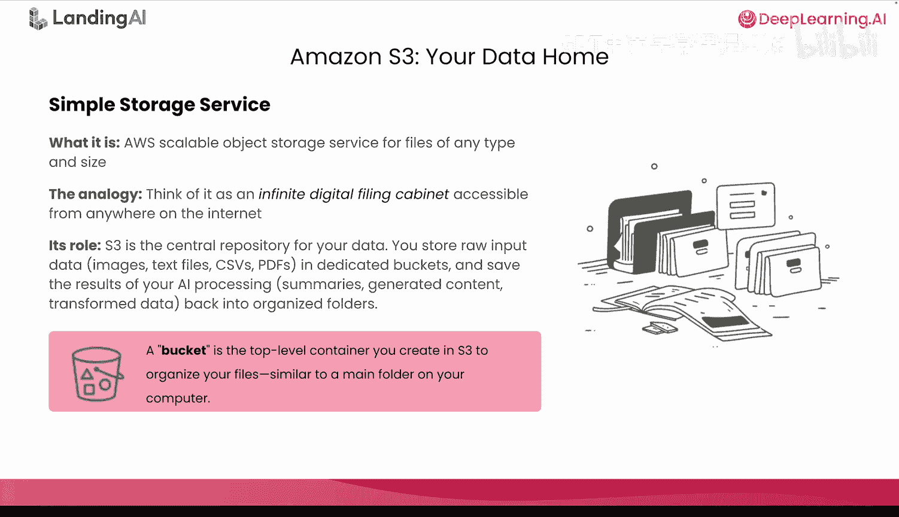

Amazon S3是AWS提供的可扩展对象存储服务，适用于任何类型和大小的文件。可以把它想象成一个无限的数字文件柜，可以从互联网任何地方访问。无论你添加多少文件，它永远不会耗尽空间。这将作为你数据的中央存储库。

以下是S3的使用方式：
*   你将原始输入数据（如PDF、图像或文本文件）存储在专用的S3桶中。
*   然后，你将AI处理的结果（摘要、解析后的文档、转换后的数据）保存回这些桶内有组织的文件夹中。

快速说明：**桶**是你在S3中创建用于组织文件的顶级容器，类似于你电脑上的主文件夹。

### 2. AWS Lambda

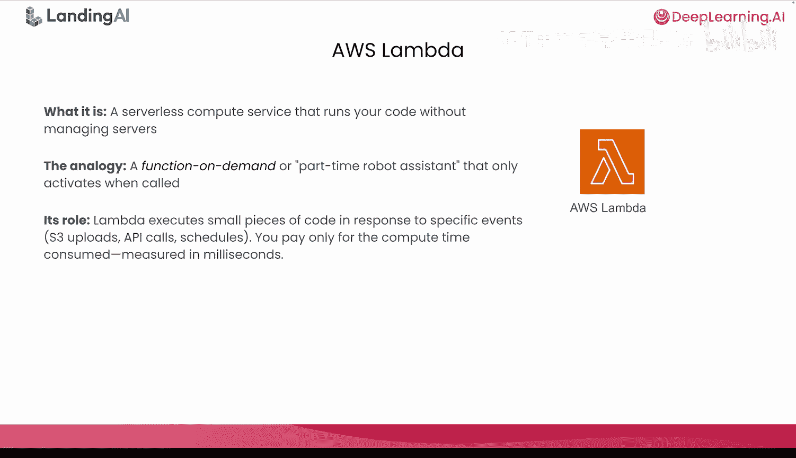

AWS Lambda是一项无服务器计算服务，无需你管理任何服务器即可运行代码。可以把它想象成一个兼职的机器人助手，或一个按需函数，它并非一直运行，只在需要时才启动行动。

Lambda执行小段代码以响应特定事件，如S3上传、API调用或计划触发器。在你的案例中，当文档上传到S3时，Lambda将自动运行你的ADdeE解析逻辑。你只需为消耗的计算时间付费（以毫秒计）。因此，如果你的Lambda函数只运行了2毫秒，你只需支付那2毫秒的计算费用。

为了让Lambda访问其他AWS服务（如从S3读取），它需要适当的权限。这就是IAM（身份和访问管理）的用武之地。IAM是控制谁或什么可以访问你AWS资源的安全框架。

当你创建Lambda函数时，需要设置两样东西：一个IAM角色和一个IAM策略。让我解释一下区别：
*   **角色**代表“谁”可以访问。可以把角色想象成一个工牌或职位头衔。它是你的Lambda函数在运行时承担的身份。角色向其他AWS服务证明：“我是S3到Bedrock处理器函数”或“我是文档解析器”。像Lambda这样的服务没有用户名或密码，相反，它们承担角色来向其他AWS服务证明其身份。
*   **IAM策略**则规定“它能做什么”。角色本身并不保证任何权限，这就是策略的作用。可以把策略看作写在该工牌上的规则列表。它精确指定了该角色被允许执行的操作。策略是一个JSON文档，定义了诸如`s3:GetObject`（意味着你可以从S3读取文件）或`s3:PutObject`（意味着你可以写入文件到S3）等操作。

总结一下：当你创建Lambda函数时，你必须创建一个IAM角色（身份/工牌），将一个IAM策略（规则）附加到该角色，并将该角色分配给你的Lambda函数。关键要点是：**角色定义它是谁，策略规定它能做什么**。

### 3. Amazon Bedrock

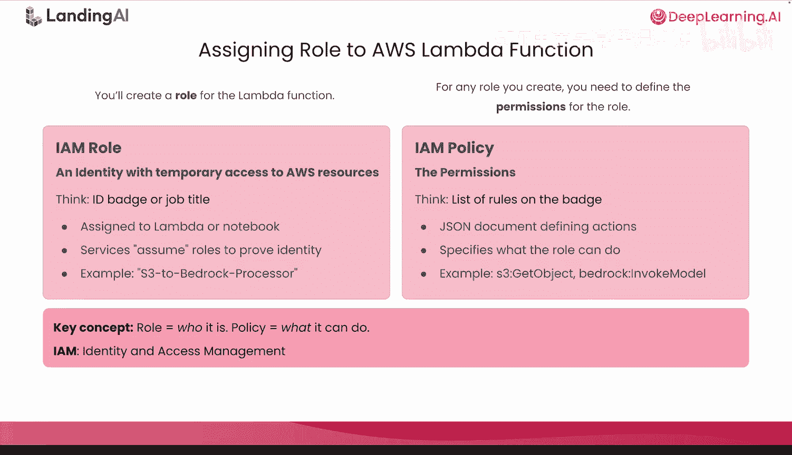

Amazon Bedrock是一项完全托管的服务，通过单一API提供对基础模型（如AWS的Claude或Nova等大语言模型）以及嵌入模型的访问。可以把它看作一个预训练AI模型的菜单，你无需从头开始训练和托管自己的模型，只需选择需要的模型并使用它。

Amazon Bedrock为你架构的三个关键部分提供支持：
1.  **知识库**：这是你的解析文档被自动嵌入并存储为向量的地方。Bedrock处理嵌入（将文本转换为数值表示）并提供语义搜索能力，以便你的智能体可以检索相关信息。
2.  **智能体运行时**：Bedrock为你的智能体的推理和响应提供支持的基础模型。当你的智能体收到查询时，它使用Bedrock的LLM生成智能、有根据的答案。
3.  **Agent Core Memory (智能体核心内存)**：这是存储你智能体内存的地方，包括对话历史、用户偏好和语义事实。它允许你的智能体记住跨交互的上下文，使其感觉更像一个真正的助手。

请记住，Bedrock本质上是无服务器的，因此它会自动扩展，并且你只需为实际使用量付费。

## 智能体组件：Strands Agent 🤖

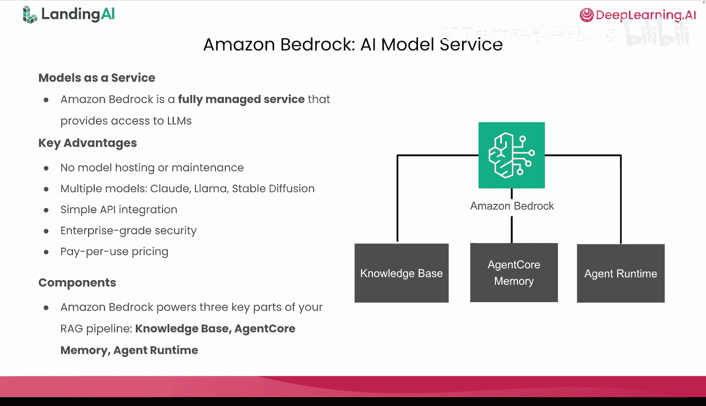

现在，让我们来看看你架构中的智能体组件：Strands Agent。它是一个开源SDK。

Strands Agent是一个AWS开源框架，专门设计用于在笔记本和生产环境中构建智能体。它有助于简化编排：
*   **无缝集成**：Strands Agent与AWS资源（如S3、Bedrock和其他工具）无缝集成，无需复杂的手动编码。
*   **简化配置**：它有助于创建智能体定义。使用Strands Agent，你可以指定使用哪些Bedrock模型、你的智能体可以访问哪些工具以及内存如何工作。这使得你的智能体配置清晰、可维护且易于修改。
*   **企业就绪**：最后但同样重要的是，它是企业就绪的。Strands Agent是生产级的，它内置了用于跟踪和日志记录、性能监控和错误处理的工具，并且支持灵活的部署模式。

## 端到端流程演练 🔄

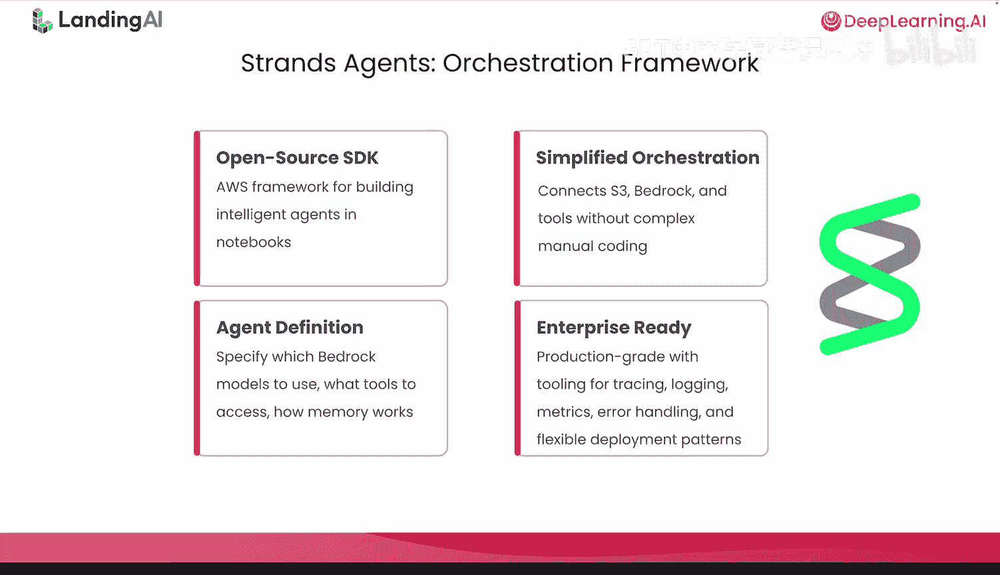

现在让我们看看所有这些组件如何协同工作。让我们一步步走过这个过程。

**步骤1：上传文档**
在实验中，你将处理医学研究论文。你将一个PDF上传到S3的`input/medical`文件夹。S3上传事件触发你的Lambda函数。Lambda运行ADdeE解析器来解析和结构化内容。解析后的输出以两种格式上传回S3的`output/medical`文件夹：一个用于解析内容的Markdown文件，以及一个包含用于视觉定位的块信息（如块类型和边界框坐标）的JSON文件。这一切都是自动发生的。你只需上传文件，事件驱动架构会处理其余部分。

**步骤2：将解析后的文档摄取到知识库**
你开始将Markdown文件从S3的`output/medical`文件夹摄取到知识库中。Amazon Bedrock读取文件，为每个文本块生成嵌入，并将它们存储在向量数据库中。一旦摄取完成，你的知识库就变得可搜索了。智能体可以查询这个知识库来检索相关信息。请注意，你也可以为实现从S3到知识库的自动摄取任务实现一个单独的Lambda函数，但在实验中，为简化起见，我们只实现一个用于解析的Lambda函数。

**步骤3：创建基于知识的搜索工具**
这个工具将你的智能体连接到知识库。当智能体需要从你的文档中获取信息时，它会调用这个工具，该工具查询向量数据库并返回最相关的内容。这使你的智能体能够基于你上传的文档回答问题。

**步骤4：设置智能体内存**
Amazon Bedrock Agent Core Memory提供三种类型的长期内存：
1.  **用户偏好**：存储喜好、厌恶和个人背景。
2.  **语义内存**：存储事实、实体和关系。
3.  **摘要内存**：存储对话摘要和关键点。

重要的是，内存会在会话间持久化，因此你的智能体可以记住过去的交互并提供个性化的响应。

**步骤5：构建智能体本身**
你将配置系统提示（关于智能体应如何行为的指令）、你创建的基于知识的搜索工具、由Agent Core Memory启用的内存，以及托管在Bedrock上的LLM模型。一旦一切配置完成，你的智能体就可以与用户交互了。

**步骤6：与你的智能体聊天**
这是一个例子。用户可能会说：“我喜欢金枪鱼寿司。”智能体可能回应：“明白了。我记住了这个偏好。”在以后的会话中，你可能会问：“我今天午餐应该吃什么？”智能体可能回应：“寿司怎么样？你提到过你喜欢金枪鱼。”关键特性是智能体记住了你。它不仅仅是在一个会话中回答孤立的问题，而是在构建上下文并随时间了解你的偏好。

## 总结

本节课中，我们一起学习了如何在AWS上构建一个完整的、基于智能体化文档抽取的RAG管道。我们了解了如何利用Amazon S3进行文档存储，使用AWS Lambda实现事件驱动的无服务器计算来自动解析文档，并借助Amazon Bedrock的知识库、LLM和智能体内存功能，通过Strands Agent框架构建一个能够记忆上下文、进行个性化交互的智能体。这套架构结合了无服务器的弹性伸缩、事件驱动的自动化以及智能体的上下文感知能力，为构建生产级的文档智能应用提供了强大而灵活的解决方案。

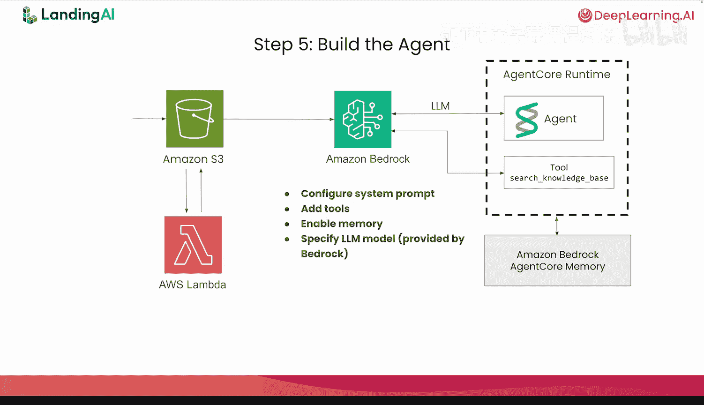

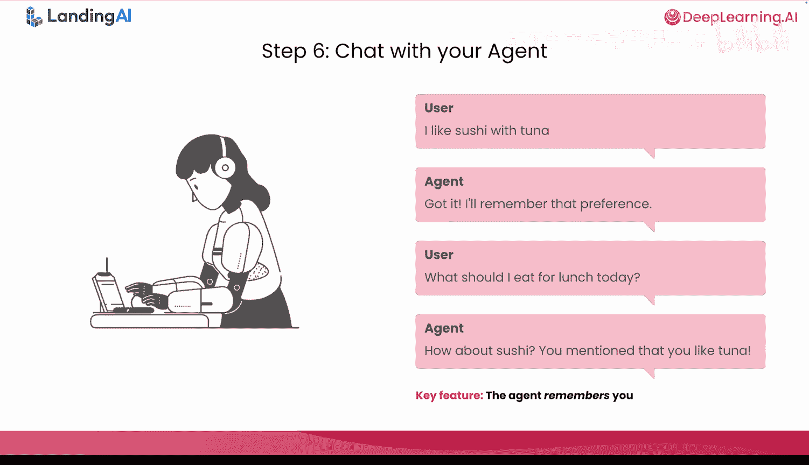

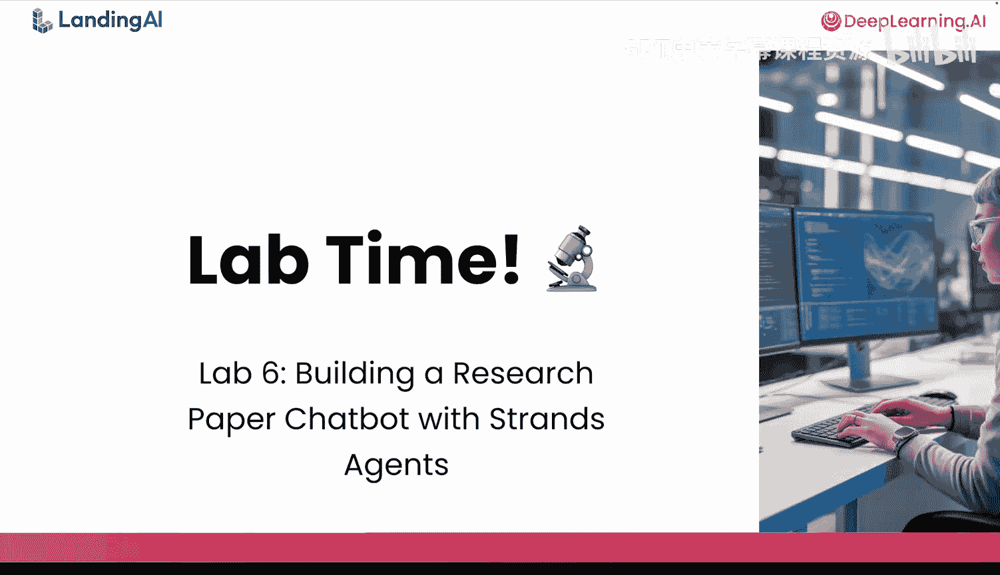

现在，是时候切换到实验笔记本，开始动手构建了！